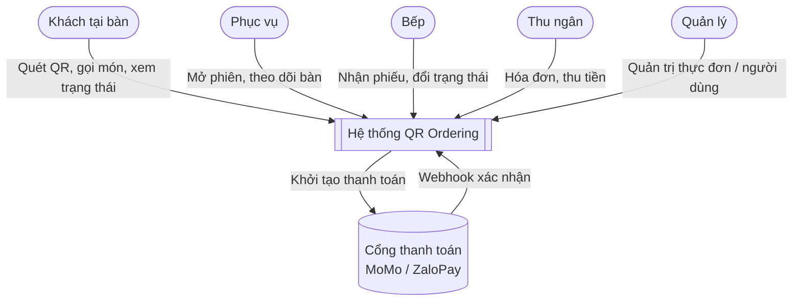
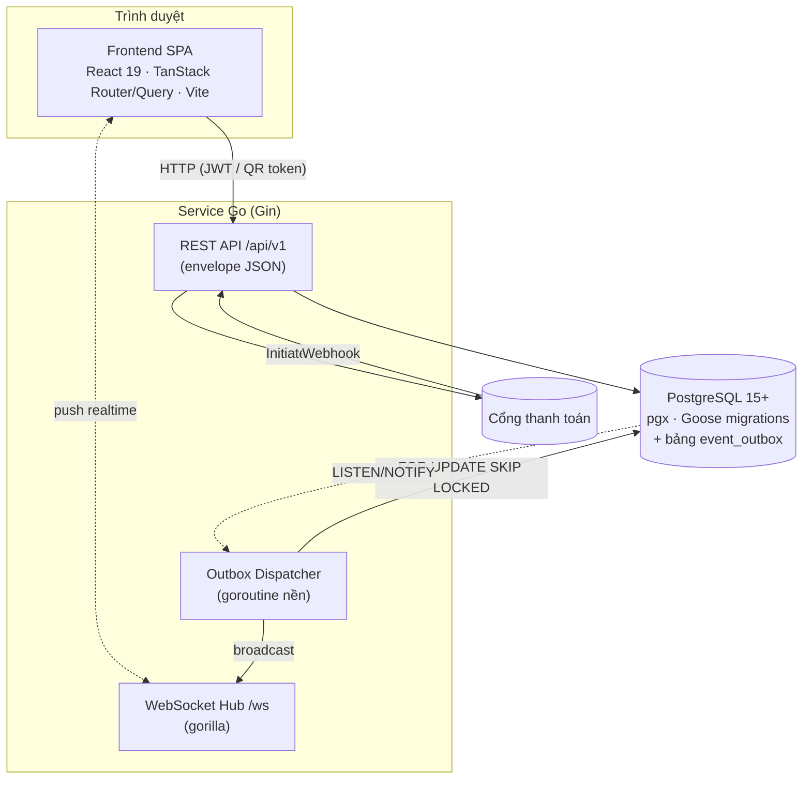
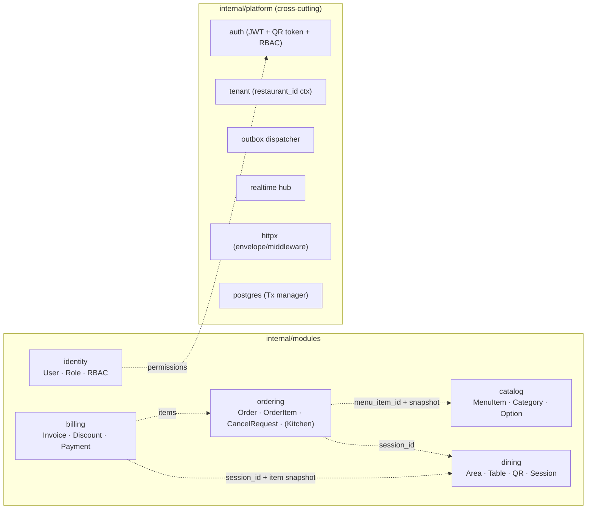
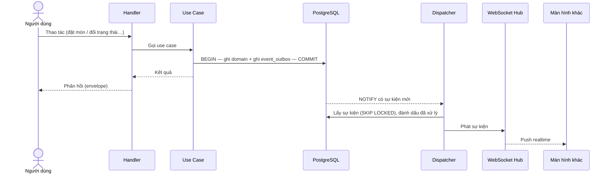
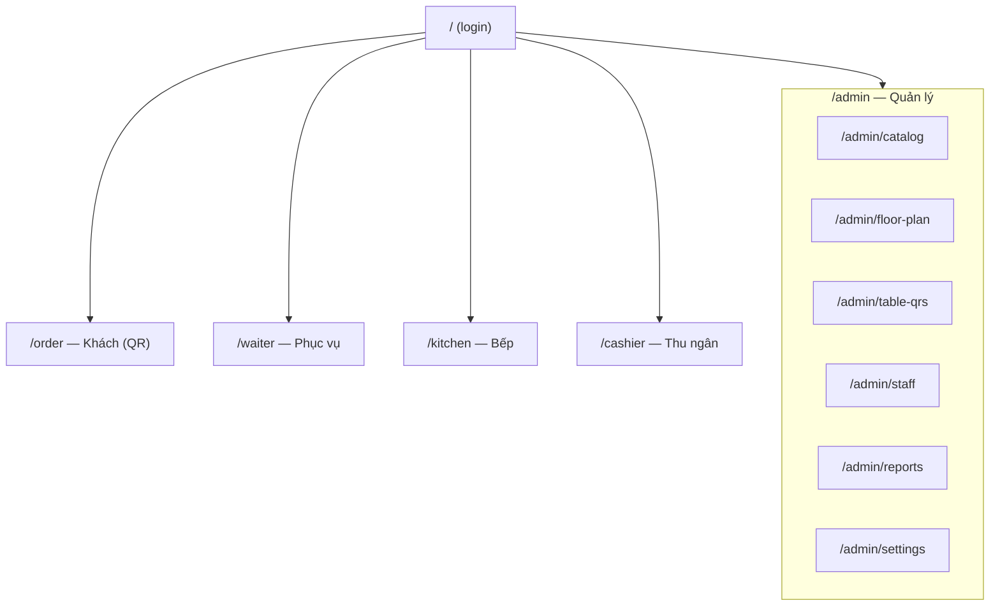

# Kiến trúc hệ thống — Nhà hàng gọi món qua QR (lẩu & nướng)

> Tài liệu này mô tả kiến trúc **thực tế đã dựng** (backend Go + frontend React), bổ sung cho
> [`ARCHITECTURE.md`](./ARCHITECTURE.md) (đặc tả tầng DDD chi tiết). Use case và sơ đồ trình tự /
> hoạt động nằm ở [`USE_CASES_AND_DIAGRAMS.md`](./USE_CASES_AND_DIAGRAMS.md).
>
> Sơ đồ viết bằng **Mermaid** — dán trực tiếp vào Notion / Confluence / GitHub.

---

## 1. Bối cảnh & tác nhân

Hệ thống phục vụ một nhà hàng **lẩu & nướng à la carte**: khách quét QR tại bàn để gọi món theo từng
vòng, bếp nhận phiếu realtime, phục vụ theo dõi tín hiệu bàn, thu ngân chốt hóa đơn và đóng phiên.

| Tác nhân | Xác thực | Vai trò chính |
|---|---|---|
| Khách (Guest) | **Không đăng nhập** — QR cấp session token ngắn hạn | Xem món, đặt/gọi thêm, theo dõi trạng thái, gọi nhân viên, yêu cầu thanh toán |
| Phục vụ (Server) | JWT + RBAC | Mở phiên cho khách vãng lai, theo dõi bàn, đánh dấu đã phục vụ, yêu cầu bill hộ |
| Bếp (Kitchen) | JWT + RBAC | Xem hàng đợi, cập nhật trạng thái món, duyệt yêu cầu hủy |
| Thu ngân (Cashier) | JWT + RBAC | Dựng hóa đơn snapshot, điều chỉnh/giảm giá, thu tiền, đóng phiên |
| Quản lý (Manager) | JWT + RBAC | Quản lý thực đơn, còn/hết, QR, bàn, người dùng, báo cáo |
| Cổng thanh toán | Secondary actor | Khởi tạo + webhook xác nhận giao dịch ví điện tử (MoMo / ZaloPay) |

### Sơ đồ ngữ cảnh (C4 — Level 1)

---

## 2. Lựa chọn kiến trúc

**Modular monolith — Hexagonal / Clean Architecture + DDD.** Một service Go duy nhất chia theo
**bounded context**. Lý do không dùng microservices: quy mô vừa, một nhóm phát triển, cần realtime nội
bộ đơn giản (outbox + WebSocket trong cùng tiến trình), dễ triển khai.

Quy tắc phụ thuộc: `interfaces → application → domain ← infrastructure`. Domain thuần Go, không import
Gin / pgx / websocket / jwt.

### Sơ đồ khối triển khai (C4 — Level 2)

---

## 3. Bounded context & module

Backend chia 5 module, mỗi module đủ 4 tầng (`domain / application / infrastructure / interfaces`).

| Module | Aggregate root | Quy tắc đặc trưng |
|---|---|---|
| `identity` | User | RBAC theo permission code (`billing.process`, `kitchen.operate`, …) |
| `catalog` | MenuItem | còn/hết đẩy realtime; route guest đã lọc field nhạy cảm |
| `dining` | DiningSession, Table | `ACTIVE → AWAITING_PAYMENT → CLOSED`; **1 phiên active/bàn** (partial unique index) |
| `ordering` | Order | item: `PENDING → ACKNOWLEDGED → PREPARING → READY → SERVED`; snapshot tên/giá; optimistic lock |
| `billing` | Invoice | invoice_item snapshot; thanh toán tiền mặt/thẻ (đồng bộ) & ví (2 pha, webhook idempotent) |

> Tham chiếu giữa context dùng **UUID + snapshot**, không nhúng struct context khác. "Bếp" không là
> bounded context riêng — chỉ là interface adapter (handler + read model hàng đợi) trong `ordering`.

---

## 4. Real-time: transactional outbox + WebSocket

Đây là xương sống realtime. Tách bạch: **ghi nghiệp vụ** và **phát sự kiện** không bao giờ lệch nhau vì
cùng nằm trong một transaction.

1. Use case mở **một** DB transaction (Tx manager). Trong đó: ghi thay đổi domain **và** chèn một dòng
   `event_outbox` (cùng commit).
2. **Dispatcher** chạy nền: `SELECT … FOR UPDATE SKIP LOCKED` lấy sự kiện chưa xử lý; dùng
   `LISTEN/NOTIFY` để phản ứng tức thì thay vì chỉ polling.
3. Handler **idempotent**, có **retry** giới hạn, hết hạn đẩy **dead-letter**; có `DedupeKey` chặn trùng
   trong cửa sổ thời gian (vd QR scan).
4. Dispatcher đẩy sự kiện sang **WebSocket Hub** → push tới đúng nhóm (bếp / phục vụ / khách).

> Lưu ý hiện trạng: một số sự kiện nhạy cảm theo tenant đang được đánh dấu `SuppressRealtime` (lưu để
> audit nhưng chưa broadcast) cho tới khi subscription WebSocket được xác thực + lọc theo topic.

---

## 5. Cross-cutting (platform)

- **Multi-tenant**: `restaurant_id` trích từ JWT (nhân viên) hoặc QR session token (khách), truyền qua
  `context.Context`. **Mọi truy vấn repository scope theo `restaurant_id`** — không rò dữ liệu giữa nhà
  hàng.
- **Auth/RBAC**: nhân viên đăng nhập JWT; middleware `RequirePermission` tra permission code thực tế của
  user trong tenant. Khách không đăng nhập — QR cấp session token gắn phiên/bàn, middleware
  `QRSessionToken` xác thực.
- **Envelope API**: `{ "data", "meta", "error": null }`; lỗi `{ "data": null, "error": { code, message } }`.
  JSON **snake_case**; tiền **VND int64**; thời gian **ISO 8601 / TIMESTAMPTZ**; ID **UUID**.
- **Dữ liệu**: **soft delete** (`deleted_at`); **optimistic locking** (`version`); **snapshot** tên/giá
  copy tại thời điểm gọi món và lập hóa đơn — đổi giá menu sau này không ảnh hưởng đơn/hóa đơn cũ.
- **High-impact action** (toggle còn/hết, void/điều chỉnh hóa đơn, đóng phiên, quản lý user): client gửi
  **trạng thái đích tường minh** (không "blind toggle"); ghi **audit** trong cùng transaction; UI có bước
  confirm.

---

## 6. Frontend (React)

SPA theo **feature module**, mỗi feature có `api / components / hooks / types`. Route map theo vai trò:

- **Stack**: React 19 · TanStack Router (file-based) · TanStack Query (server state) · React Hook Form +
  Zod (form/validate) · Tailwind v4 · shadcn/ui.
- **Realtime**: kết nối `/ws`, cập nhật cache Query khi nhận sự kiện (queue bếp, trạng thái món, tín hiệu
  bàn, alert thanh toán).
- **Guest UI** chỉ hiển thị **món + trạng thái**, **không hiện giá / tổng tiền** (quy tắc nghiệp vụ).

---

## 7. Tech stack tổng hợp

| Lớp | Công nghệ |
|---|---|
| Backend | Go 1.22+ · Gin · pgx/v5 · Goose · gorilla/websocket · golang-jwt/v5 · validator/v10 · slog |
| DB | PostgreSQL 15+ (UUID PK, TIMESTAMPTZ, partial unique index, `event_outbox`) |
| Frontend | React 19 · TanStack Router/Query · Vite 8 · Tailwind v4 · Zod · React Hook Form |
| API | OpenAPI 3.0 (`api/openapi.yaml`) + Swagger UI |
| Thanh toán | Mock-first; MoMo / ZaloPay config-gated (2 pha: initiate → webhook) |
| Triển khai | Docker / docker-compose (app + postgres) |

---

## 8. Bất biến phải giữ khi code

1. Domain không import framework / SQL / websocket.
2. Mọi ghi domain + sự kiện outbox nằm trong **cùng một transaction**.
3. Mọi truy vấn scope theo `restaurant_id`.
4. Cập nhật có `version` → kiểm optimistic lock.
5. Xóa = soft delete; snapshot không đổi khi nguồn đổi.
6. Webhook ví điện tử **idempotent** — không double-charge / double-confirm.
7. **1 phiên ACTIVE/bàn**; yêu cầu thanh toán khóa việc gọi thêm.
8. Hành động high-impact → nhận trạng thái đích tường minh **và** ghi audit cùng transaction.
</content>
</invoke>
