# Use case & Sơ đồ trình tự / hoạt động

> Bổ sung cho [`SYSTEM_ARCHITECTURE.md`](./SYSTEM_ARCHITECTURE.md). Đánh số UC theo PRD (UC-01…UC-31).
> Sơ đồ **Mermaid** — dán trực tiếp vào Notion / Confluence / GitHub.
>
> **Quy ước sơ đồ trình tự** (giữ đồng nhất, mức trừu tượng nông như sinh viên vẽ):
> `Tác nhân → Giao diện (FE) → Handler (API) → Use Case (SVC) → CSDL (DB)`, thêm làn **Hub** (WebSocket)
> khi có push realtime. Chi tiết hạ tầng (transaction, outbox, optimistic lock) để ở phần mô tả, không
> vẽ vào sơ đồ trình tự.
>
> Use case lõi có đủ **đặc tả + trình tự + hoạt động**; use case dạng "chỉ xem" rút gọn (đặc tả + trình
> tự ngắn).

## Mục lục

| Nhóm | Use case |
|---|---|
| Khách | UC-01 · UC-02 · UC-03 · UC-04 · UC-05 · UC-06 · UC-07 · UC-08 |
| Phục vụ | UC-09 · UC-10 · UC-11 · UC-12 · UC-13 · UC-14 · UC-15 |
| Bếp | UC-16 · UC-17 · UC-18 · UC-19 |
| Thu ngân | UC-20 · UC-21 · UC-22 · UC-23 · UC-24 · UC-25 |
| Quản lý | UC-26 · UC-27 · UC-28 · UC-29 · UC-30 · UC-31 |

---

# Nhóm Khách hàng

## UC-01 — Quét QR vào phiên

| | |
|---|---|
| **Tác nhân** | Khách |
| **Endpoint** | `POST /api/v1/dining/join-session` |
| **Use case** | `dining.JoinSession` |
| **Tiền điều kiện** | Bàn có mã QR active |
| **Hậu điều kiện** | Khách nhận session token (nếu phiên active), hoặc thông báo "chưa mở phiên" |

**Luồng chính**
1. Khách quét QR, mở trang `/order` kèm `qr_token`.
2. Hệ thống tra QR theo token, kiểm tra còn hiệu lực.
3. Tìm phiên active của bàn:
   - Có phiên `ACTIVE` → trả `session_token` + thông tin phiên.
   - Có phiên `AWAITING_PAYMENT` → trả trạng thái chờ thanh toán.
   - Chưa có phiên → trả `not_opened` (nhờ phục vụ mở — xem UC-09).
4. Ghi sự kiện `dining.qr_scanned` (có dedupe chống quét trùng).

**Ngoại lệ** — QR không tồn tại / bị thu hồi → `401 invalid qr token`.

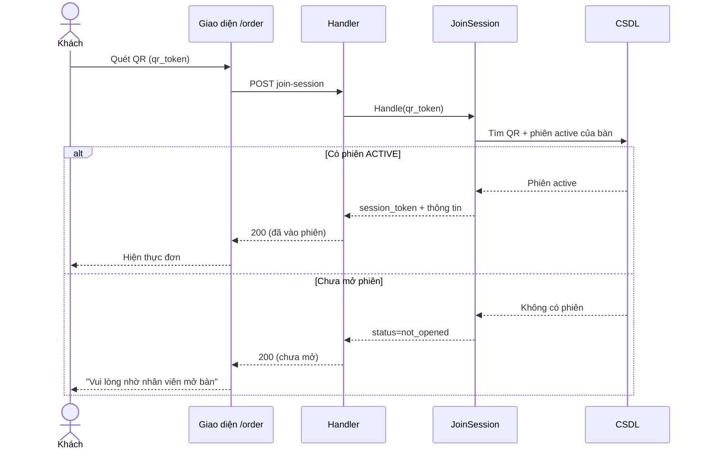

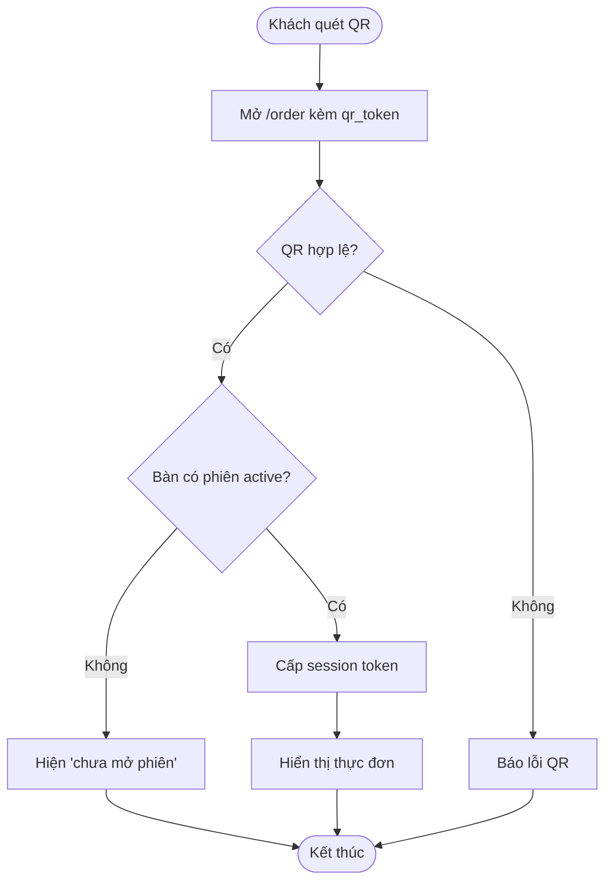

---

## UC-02 — Xem thực đơn  *(chỉ xem)*

| | |
|---|---|
| **Tác nhân** | Khách |
| **Endpoint** | `GET /api/v1/guest/menu/categories`, `GET /api/v1/guest/menu/items` |
| **Tiền điều kiện** | Có session token hợp lệ |

Khách duyệt danh mục và món; backend **lọc bỏ field nhạy cảm**, chỉ trả thông tin cần cho khách (tên,
mô tả, biến thể, tùy chọn, trạng thái còn/hết). Món hết hàng hiển thị nhưng không cho thêm vào giỏ.

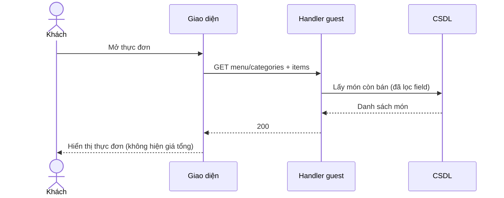

---

## UC-03 — Đặt món

| | |
|---|---|
| **Tác nhân** | Khách |
| **Endpoint** | `POST /api/v1/guest/orders` |
| **Use case** | `ordering.GuestPlaceOrder` |
| **Tiền điều kiện** | Phiên `ACTIVE`; giỏ có ≥ 1 món |
| **Hậu điều kiện** | Tạo Order + OrderItem (status `PENDING`, snapshot tên/giá), sinh phiếu bếp, phát `order.submitted` |

**Luồng chính**
1. Khách chọn món, biến thể, tùy chọn (cay/sốt/nước lẩu…), số lượng → gửi giỏ.
2. Hệ thống khóa phiên để đặt, kiểm tra phiên đang `ACTIVE`.
3. Kiểm từng dòng: món tồn tại, còn bán, biến thể hợp lệ, tùy chọn đủ ràng buộc (min/max, bắt buộc).
4. Tạo Order (`INITIAL` nếu là đơn đầu, `ADDITIONAL` nếu đã có đơn trước), copy **snapshot** tên/giá/tùy
   chọn vào order item, gom **phiếu bếp theo station** (lẩu / nướng / chung).
5. Phát sự kiện `order.submitted` → bếp nhận realtime.

**Ngoại lệ**
- Giỏ rỗng → `400`. Phiên không `ACTIVE` → `409 session is not accepting orders`.
- Dòng lỗi → trả `CartValidationError` kèm danh sách lỗi theo từng dòng (món hết, thiếu tùy chọn bắt buộc…).

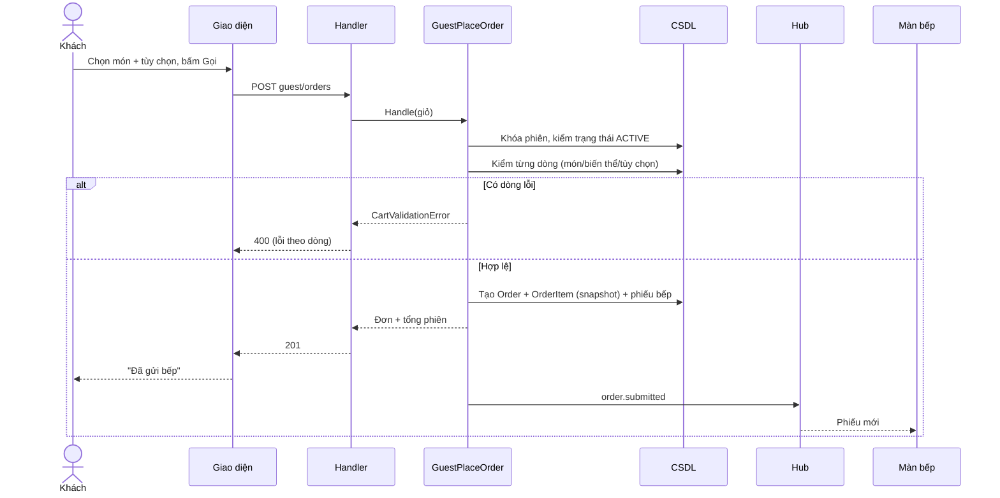

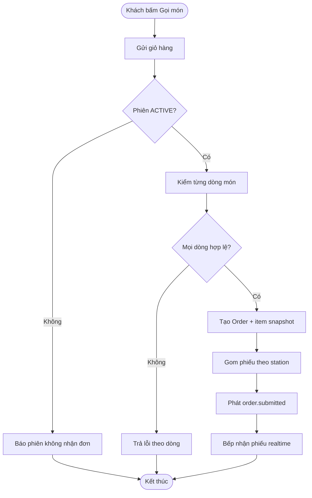

---

## UC-04 — Gọi thêm món

| | |
|---|---|
| **Tác nhân** | Khách |
| **Endpoint** | `POST /api/v1/guest/orders` (như UC-03) |

Cùng luồng UC-03. Khác biệt: vì phiên đã có đơn trước nên Order mới được gắn `order_type = ADDITIONAL`.
Mỗi vòng "gọi thêm" là **một Order mới** trong cùng phiên; tổng phiên cộng dồn. Không cho gọi thêm khi
phiên đã `AWAITING_PAYMENT` (khóa thanh toán — xem UC-08).

---

## UC-05 — Hủy/sửa món đã gọi

| | |
|---|---|
| **Tác nhân** | Khách |
| **Endpoint** | `PATCH /api/v1/guest/orders/{orderId}/items`, `POST …/cancel-requests` |
| **Use case** | `ordering.GuestEditOrder` / `GuestCancelOrder` / `GuestRequestCancel` |
| **Tiền điều kiện** | Món thuộc phiên của khách |

**Luồng chính**
1. Khách chọn món muốn sửa số lượng / hủy.
2. Hệ thống kiểm trạng thái món:
   - Món còn `PENDING` (bếp chưa nhận) → **sửa/hủy trực tiếp**.
   - Món đã `ACKNOWLEDGED` trở lên → tạo **yêu cầu hủy** (`CancelRequest`) chờ bếp duyệt (UC-18).
3. Cập nhật / tạo yêu cầu, phát sự kiện tương ứng.

**Ngoại lệ** — món đã `SERVED` → không cho hủy.

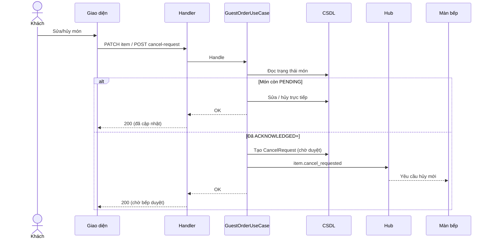

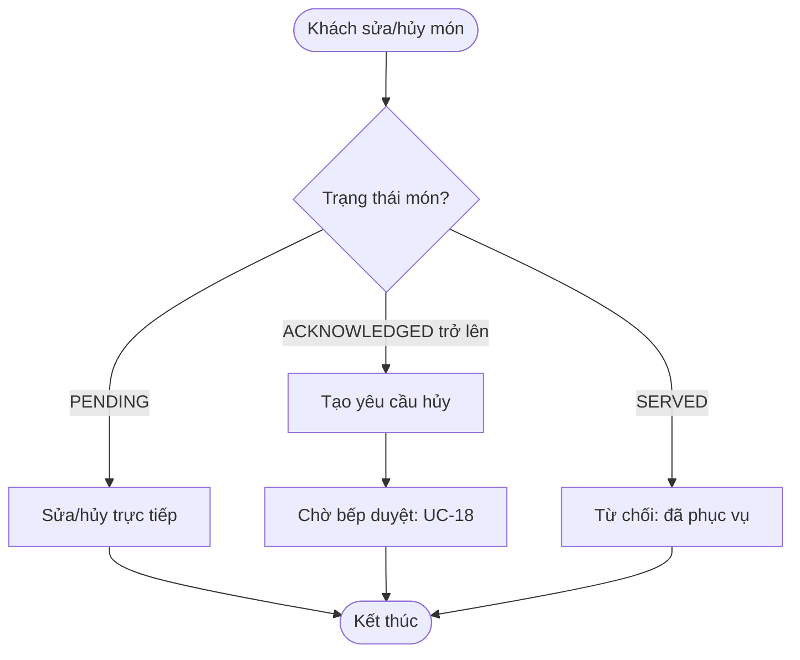

---

## UC-06 — Theo dõi trạng thái món tức thời  *(chỉ xem)*

| | |
|---|---|
| **Tác nhân** | Khách |
| **Kênh** | WebSocket `/ws` + `GET /api/v1/guest/orders/{orderId}` |

Khách mở danh sách món đã gọi; FE kết nối `/ws`, mỗi khi item đổi trạng thái (bếp cập nhật ở UC-17) thì
push về cập nhật giao diện. Khách chỉ thấy **tên món + trạng thái**, không thấy giá.

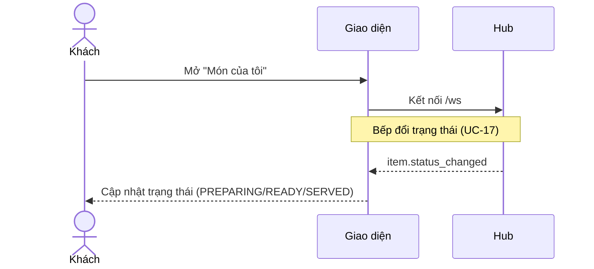

---

## UC-07 — Gọi nhân viên  *(chỉ xem / tín hiệu)*

| | |
|---|---|
| **Tác nhân** | Khách |
| **Hậu điều kiện** | Phát tín hiệu "gọi nhân viên" tới màn phục vụ (UC-12) |

Khách bấm "Gọi nhân viên"; hệ thống phát tín hiệu (có chống spam/dedupe) tới màn phục vụ.

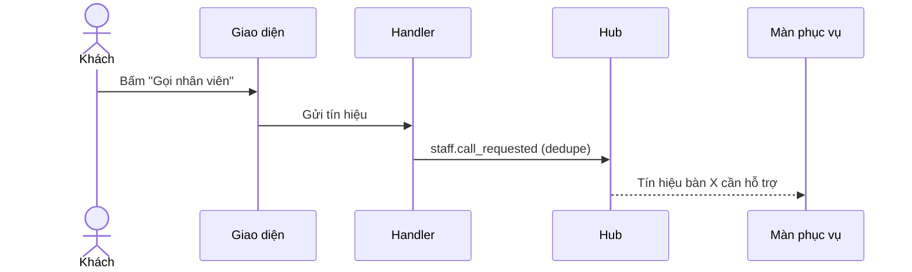

---

## UC-08 — Yêu cầu thanh toán

| | |
|---|---|
| **Tác nhân** | Khách (tín hiệu) → Nhân viên thực hiện |
| **Endpoint** | Không có route cho khách. Việc chuyển phiên dùng `POST /api/v1/staff/sessions/{sessionId}/request-bill` (**staff-only**, JWT + quyền `ordering.staff`) |
| **Use case** | `ordering.StaffRequestBill` (do nhân viên gọi) |
| **Hậu điều kiện** | Phiên `ACTIVE → AWAITING_PAYMENT`; **khóa gọi thêm món**; báo thu ngân |

> **Lưu ý hiện trạng**: khách mang QR session token nên **không qua được cổng quyền `/staff`** — không có
> endpoint yêu-cầu-bill cho khách. Thao tác "Yêu cầu thanh toán" của khách là **một tín hiệu** tới màn
> nhân viên; nhân viên xác nhận và gọi `StaffRequestBill` (cùng đường với UC-14) để thực sự chuyển phiên.

**Luồng chính**
1. Khách bấm "Yêu cầu thanh toán" → phát tín hiệu tới màn phục vụ / thu ngân.
2. Nhân viên xác nhận → gọi `StaffRequestBill`, hệ thống chuyển phiên sang `AWAITING_PAYMENT`, từ đây
   **không nhận đơn mới**.
3. Báo màn thu ngân để dựng hóa đơn (UC-21).

**Ngoại lệ** — phiên không `ACTIVE` → từ chối.

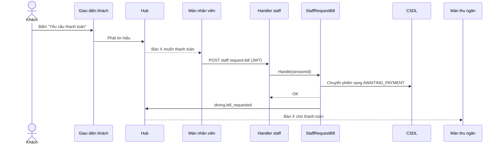

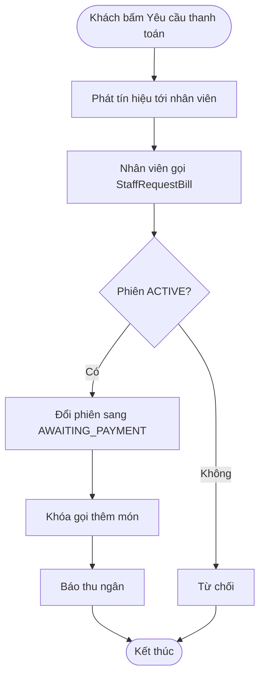

---

# Nhóm Phục vụ

## UC-09 — Mở phiên cho khách vãng lai

| | |
|---|---|
| **Tác nhân** | Phục vụ |
| **Endpoint** | `POST /api/v1/dining/open-session` |
| **Use case** | `dining.OpenSession` |
| **Tiền điều kiện** | Bàn không có phiên active |
| **Hậu điều kiện** | Tạo phiên `ACTIVE` cho bàn; khách quét QR sẽ join được |

**Luồng chính**
1. Phục vụ chọn bàn trống → "Mở bàn".
2. Hệ thống kiểm **1 phiên active/bàn** (partial unique index chặn trùng).
3. Tạo phiên `ACTIVE`, phát sự kiện mở bàn.

**Ngoại lệ** — bàn đã có phiên active → `409`.

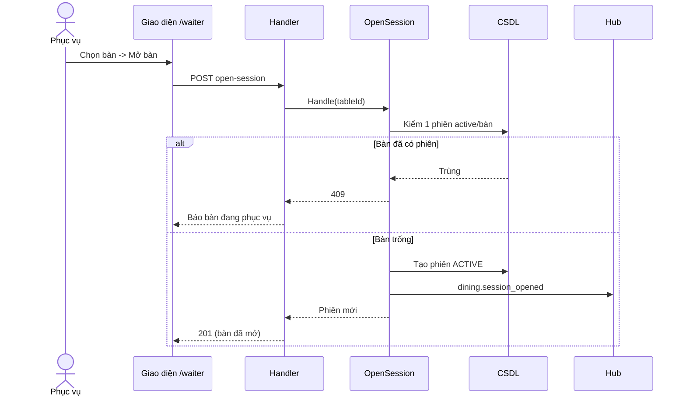

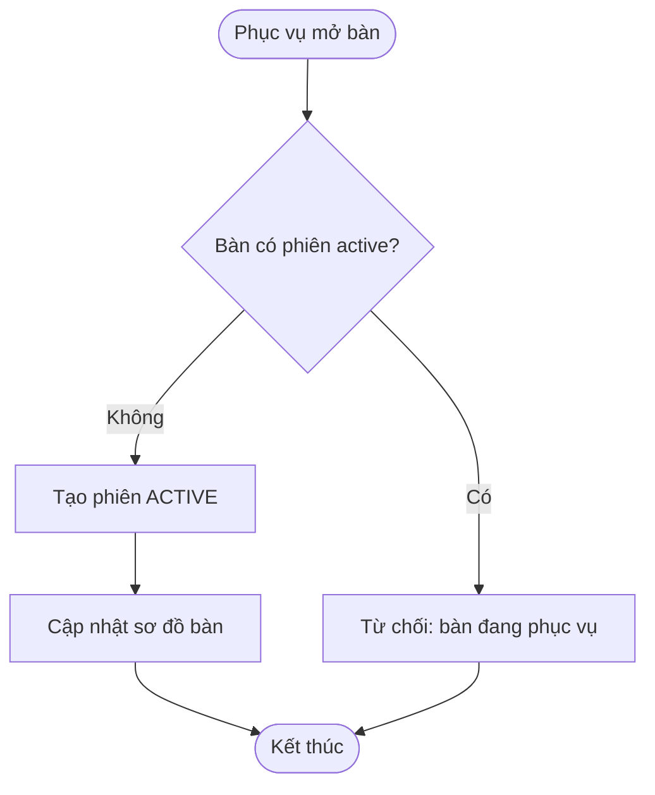

---

## UC-10 — Xem sơ đồ / lưới bàn  *(chỉ xem)*

| | |
|---|---|
| **Tác nhân** | Phục vụ |
| **Endpoint** | `GET /api/v1/staff/tables` |
| **Use case** | `ordering.StaffTables` |

Phục vụ xem lưới bàn theo khu vực kèm trạng thái (trống / đang phục vụ / chờ thanh toán) và tín hiệu.

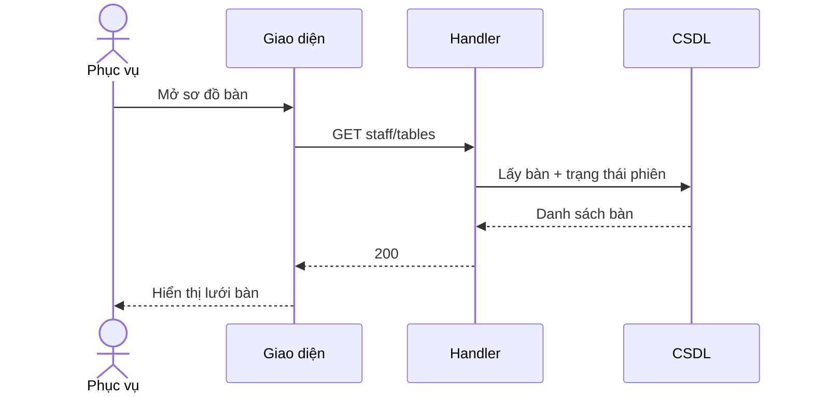

---

## UC-11 — Theo dõi tín hiệu bàn  *(chỉ xem)*

| | |
|---|---|
| **Tác nhân** | Phục vụ |
| **Kênh** | WebSocket `/ws` |

Màn phục vụ kết nối `/ws`, nhận realtime: gọi nhân viên (UC-07), món `READY` cần bưng, yêu cầu bill.

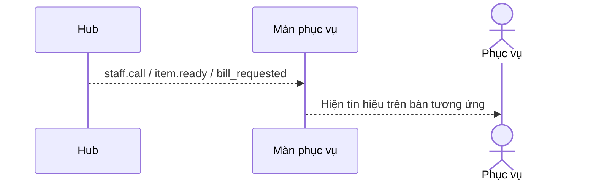

---

## UC-12 — Xác nhận gọi nhân viên  *(chỉ xem / cập nhật nhẹ)*

| | |
|---|---|
| **Tác nhân** | Phục vụ |

Phục vụ thấy tín hiệu (UC-11), bấm "Đã xử lý" để tắt tín hiệu trên màn của các nhân viên khác.

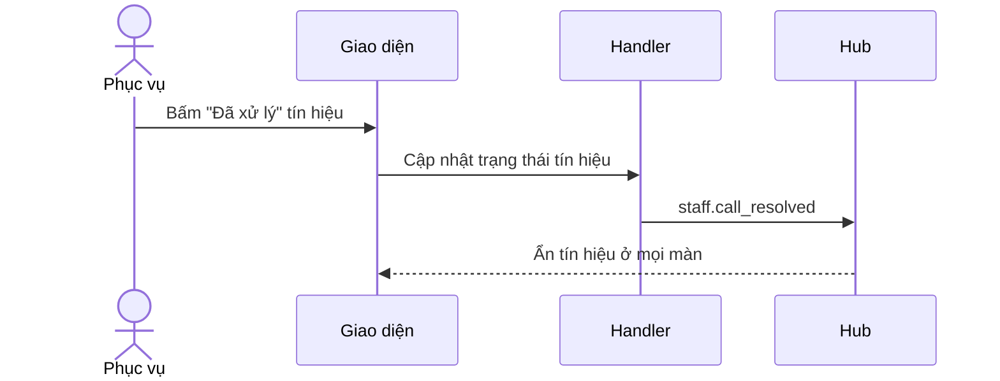

---

## UC-13 — Đánh dấu đã phục vụ

| | |
|---|---|
| **Tác nhân** | Phục vụ |
| **Endpoint** | `PATCH /api/v1/staff/order-items/{itemId}/status` |
| **Use case** | `ordering.StaffUpdateItemStatus` |
| **Tiền điều kiện** | Món ở trạng thái `READY` |
| **Hậu điều kiện** | Món `READY → SERVED`; cập nhật màn khách |

**Luồng chính**
1. Phục vụ bưng món `READY` ra bàn, bấm "Đã phục vụ".
2. Hệ thống kiểm chuyển trạng thái hợp lệ (`READY → SERVED`), cập nhật (optimistic lock theo `version`).
3. Phát sự kiện đổi trạng thái → màn khách cập nhật (UC-06).

**Ngoại lệ** — món chưa `READY` → từ chối (sai thứ tự trạng thái).

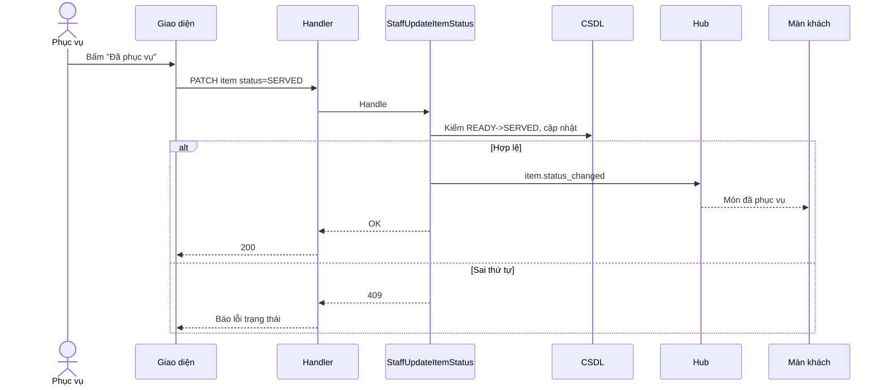

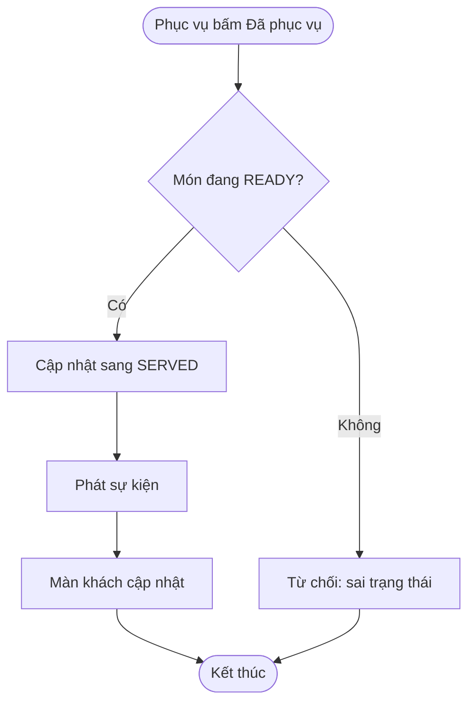

---

## UC-14 — Yêu cầu thanh toán hộ  *(chỉ xem / cập nhật nhẹ)*

| | |
|---|---|
| **Tác nhân** | Phục vụ |
| **Endpoint** | `POST /api/v1/staff/sessions/{sessionId}/request-bill` |

Như UC-08 nhưng do phục vụ thao tác hộ bàn. Cùng use case `StaffRequestBill`, cùng hiệu ứng khóa gọi món
và báo thu ngân.

---

## UC-15 — Xem chi tiết phiên/đơn theo bàn  *(chỉ xem)*

| | |
|---|---|
| **Tác nhân** | Phục vụ |
| **Endpoint** | `GET /api/v1/staff/tables` → chi tiết bàn |

Phục vụ mở một bàn để xem các đơn, từng món và trạng thái, ghi chú. Phục vụ thấy giá; khách thì không.

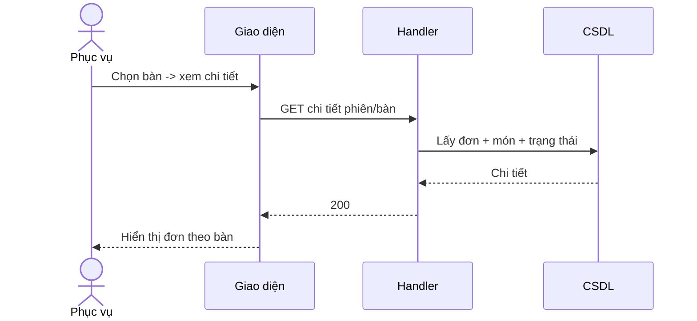

---

# Nhóm Bếp

## UC-16 — Tiếp nhận đơn / xem hàng đợi realtime  *(chỉ xem)*

| | |
|---|---|
| **Tác nhân** | Bếp |
| **Endpoint** | `GET /api/v1/kitchen/queue` + WebSocket `/ws` |
| **Use case** | `ordering.KitchenQueue` |

Màn bếp tải hàng đợi phiếu (gom theo station), giữ kết nối `/ws`; phiếu mới (UC-03) push vào hàng đợi
realtime.

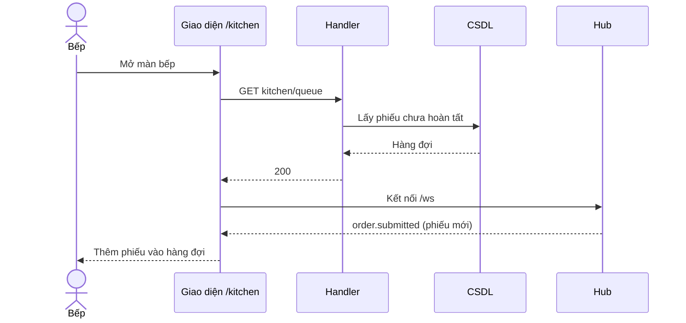

---

## UC-17 — Cập nhật trạng thái món

| | |
|---|---|
| **Tác nhân** | Bếp |
| **Endpoint** | `PATCH /api/v1/kitchen/items/{id}/status` |
| **Use case** | `ordering.UpdateItemStatus` |
| **Tiền điều kiện** | Món thuộc hàng đợi bếp |
| **Hậu điều kiện** | Trạng thái tiến theo vòng đời; cập nhật màn khách + phục vụ |

**Luồng chính**
1. Bếp chọn món, đẩy trạng thái: `PENDING → ACKNOWLEDGED → PREPARING → READY`.
2. Hệ thống kiểm **chuyển trạng thái hợp lệ** (đúng thứ tự) + optimistic lock (`version`).
3. Phát sự kiện đổi trạng thái → màn khách (UC-06) và phục vụ (nếu `READY`).

**Ngoại lệ** — chuyển sai thứ tự (vd `PENDING → READY`) → từ chối.

```mermaid
sequenceDiagram
    actor K as Bếp
    participant FE as Giao diện
    participant API as Handler
    participant SVC as UpdateItemStatus
    participant DB as CSDL
    participant WS as Hub
    participant Other as Màn khách / phục vụ

    K->>FE: Đổi trạng thái món
    FE->>API: PATCH kitchen/items/{id}/status
    API->>SVC: Handle(status đích)
    SVC->>DB: Kiểm chuyển hợp lệ + version
    alt Hợp lệ
        SVC->>DB: Cập nhật trạng thái
        SVC->>WS: item.status_changed
        WS-->>Other: Cập nhật realtime
        SVC-->>API: OK
        API-->>FE: 200
    else Sai thứ tự / version cũ
        SVC-->>API: 409
        API-->>FE: Báo lỗi
    end
```

```mermaid
flowchart TD
    A([Bếp đổi trạng thái]) --> B{Chuyển đúng thứ tự?}
    B -- Không --> X[Từ chối]
    B -- Có --> C{version còn mới?}
    C -- Không --> Y[Từ chối: bị sửa đồng thời]
    C -- Có --> D[Cập nhật trạng thái]
    D --> E[Phát sự kiện realtime]
    E --> Z([Kết thúc])
    X --> Z
    Y --> Z
```

---

## UC-18 — Xác nhận / từ chối yêu cầu hủy món

| | |
|---|---|
| **Tác nhân** | Bếp |
| **Endpoint** | `POST /api/v1/ordering/review-cancel-request` |
| **Use case** | `ordering.ReviewCancelRequest` |
| **Tiền điều kiện** | Tồn tại `CancelRequest` đang chờ (từ UC-05) |
| **Hậu điều kiện** | Yêu cầu được duyệt (món hủy) hoặc từ chối (món giữ nguyên) |

**Luồng chính**
1. Bếp xem yêu cầu hủy của khách.
2. Bếp **duyệt** → hủy món, hoặc **từ chối** → giữ món, kèm lý do.
3. Cập nhật yêu cầu + trạng thái món, phát sự kiện → màn khách biết kết quả.

```mermaid
sequenceDiagram
    actor K as Bếp
    participant FE as Giao diện
    participant API as Handler
    participant SVC as ReviewCancelRequest
    participant DB as CSDL
    participant WS as Hub
    participant G as Màn khách

    K->>FE: Duyệt / từ chối yêu cầu hủy
    FE->>API: POST review-cancel-request
    API->>SVC: Handle(quyết định)
    alt Duyệt
        SVC->>DB: Hủy món, đóng yêu cầu
    else Từ chối
        SVC->>DB: Giữ món, ghi lý do
    end
    SVC->>WS: item.cancel_reviewed
    WS-->>G: Kết quả yêu cầu hủy
    SVC-->>API: OK
    API-->>FE: 200
```

```mermaid
flowchart TD
    A([Bếp xem yêu cầu hủy]) --> B{Quyết định?}
    B -- Duyệt --> C[Hủy món]
    B -- Từ chối --> D[Giữ món + ghi lý do]
    C --> E[Đóng yêu cầu]
    D --> E
    E --> F[Báo kết quả cho khách]
    F --> Z([Kết thúc])
```

---

## UC-19 — Xem lịch sử trạng thái món  *(chỉ xem)*

| | |
|---|---|
| **Tác nhân** | Bếp |

Bếp xem dòng thời gian chuyển trạng thái của một món (ai đổi, lúc nào) phục vụ tra soát.

```mermaid
sequenceDiagram
    actor K as Bếp
    participant FE as Giao diện
    participant API as Handler
    participant DB as CSDL
    K->>FE: Mở lịch sử món
    FE->>API: GET lịch sử trạng thái
    API->>DB: Lấy status history
    DB-->>API: Mốc thời gian
    API-->>FE: 200
    FE-->>K: Hiển thị timeline
```

---

# Nhóm Thu ngân

## UC-20 — Xem danh sách phiên chờ thanh toán  *(chỉ xem)*

| | |
|---|---|
| **Tác nhân** | Thu ngân |
| **Kênh** | WebSocket `/ws` + danh sách phiên `AWAITING_PAYMENT` |

Màn thu ngân liệt kê các phiên `AWAITING_PAYMENT`; có alert realtime khi có yêu cầu bill mới (UC-08).

```mermaid
sequenceDiagram
    actor C as Thu ngân
    participant FE as Giao diện /cashier
    participant API as Handler
    participant DB as CSDL
    participant WS as Hub
    C->>FE: Mở màn thu ngân
    FE->>API: Lấy phiên AWAITING_PAYMENT
    API->>DB: Truy vấn phiên chờ
    DB-->>API: Danh sách
    API-->>FE: 200
    WS-->>FE: dining.bill_requested (alert)
    FE-->>C: Cập nhật danh sách + chuông báo
```

---

## UC-21 — Xem hóa đơn snapshot  *(chỉ xem)*

| | |
|---|---|
| **Tác nhân** | Thu ngân |
| **Endpoint** | `POST /api/v1/billing/build-invoice` |
| **Use case** | `billing.BuildInvoice` |

Thu ngân dựng hóa đơn từ các món của phiên — **snapshot** tên/giá copy tại thời điểm lập hóa đơn; đổi giá
menu sau này không ảnh hưởng. Hiển thị các dòng + tổng tạm tính.

```mermaid
sequenceDiagram
    actor C as Thu ngân
    participant FE as Giao diện
    participant API as Handler
    participant SVC as BuildInvoice
    participant DB as CSDL
    C->>FE: Chọn phiên -> Dựng hóa đơn
    FE->>API: POST build-invoice
    API->>SVC: Handle(sessionId)
    SVC->>DB: Gom món phiên, copy snapshot -> invoice_item
    DB-->>SVC: Hóa đơn
    SVC-->>API: Hóa đơn + tổng
    API-->>FE: 200
    FE-->>C: Hiển thị hóa đơn
```

---

## UC-22 — Điều chỉnh hóa đơn và giảm giá

| | |
|---|---|
| **Tác nhân** | Thu ngân (giảm giá lớn có thể cần Quản lý) |
| **Endpoint** | `POST /api/v1/billing/adjust-invoice` |
| **Use case** | `billing.AdjustInvoice` |
| **Tiền điều kiện** | Hóa đơn đã dựng, chưa thanh toán |
| **Hậu điều kiện** | Cập nhật giảm giá/điều chỉnh + **ghi audit** (high-impact) |

**Luồng chính**
1. Thu ngân nhập giảm giá (theo % hoặc số tiền) / điều chỉnh dòng.
2. Hệ thống tính lại tổng, **ghi audit** (ai · điều chỉnh gì · trước→sau) trong cùng transaction.
3. Trả hóa đơn cập nhật.

**Ngoại lệ** — hóa đơn đã thanh toán → khóa, không cho sửa.

```mermaid
sequenceDiagram
    actor C as Thu ngân
    participant FE as Giao diện
    participant API as Handler
    participant SVC as AdjustInvoice
    participant DB as CSDL

    C->>FE: Nhập giảm giá / điều chỉnh
    FE->>API: POST adjust-invoice
    API->>SVC: Handle(điều chỉnh)
    SVC->>DB: Kiểm hóa đơn chưa thanh toán
    alt Hợp lệ
        SVC->>DB: Tính lại tổng + ghi audit
        SVC-->>API: Hóa đơn mới
        API-->>FE: 200
    else Đã thanh toán
        SVC-->>API: 409 (đã khóa)
        API-->>FE: Báo không thể sửa
    end
```

```mermaid
flowchart TD
    A([Thu ngân điều chỉnh hóa đơn]) --> B{Hóa đơn đã thanh toán?}
    B -- Rồi --> X[Khóa: không sửa]
    B -- Chưa --> C[Nhập giảm giá / điều chỉnh]
    C --> D[Tính lại tổng]
    D --> E[Ghi audit cùng transaction]
    E --> Z([Kết thúc])
    X --> Z
```

---

## UC-23 — Xử lý thanh toán

| | |
|---|---|
| **Tác nhân** | Thu ngân (+ Cổng thanh toán) |
| **Endpoint** | `POST /api/v1/billing/process-payment`; webhook `POST …/payments/webhook/{provider}` |
| **Use case** | `billing.ProcessPayment` + `billing.HandleWebhook` |
| **Tiền điều kiện** | Hóa đơn đã dựng |
| **Hậu điều kiện** | Hóa đơn `PAID`; sự kiện `payment_completed` + `session_closed` |

**Luồng chính — tiền mặt / thẻ (đồng bộ)**
1. Thu ngân chọn phương thức, nhập số tiền nhận.
2. Hệ thống ghi nhận thanh toán, tính tiền thối, phát `payment_completed` **và** `session_closed`.

**Luồng e-wallet (2 pha, bất đồng bộ)**
1. Thu ngân chọn ví (MoMo/ZaloPay) → hệ thống **khởi tạo (Initiate)** giao dịch với cổng, trả link/QR ví,
   phát `payment_initiated`.
2. Khách thanh toán trên app ví → cổng gọi **webhook** về hệ thống.
3. Webhook **idempotent** xác nhận: chốt `PAID`, phát `payment_completed` (không double-confirm nếu webhook
   gọi lại).

**Ngoại lệ** — ví chưa cấu hình gateway → `501 not implemented`; số tiền nhận ≤ 0 (tiền mặt) → `400`.

```mermaid
sequenceDiagram
    actor C as Thu ngân
    participant FE as Giao diện
    participant API as Handler
    participant SVC as ProcessPayment
    participant DB as CSDL
    participant GW as Cổng thanh toán

    C->>FE: Chọn phương thức + số tiền
    FE->>API: POST process-payment
    API->>SVC: Handle
    alt Tiền mặt / thẻ
        SVC->>DB: Ghi thanh toán, tính tiền thối
        SVC->>DB: Phát payment_completed + session_closed
        SVC-->>API: Hóa đơn PAID
        API-->>FE: 200 (in hóa đơn)
    else Ví điện tử (2 pha)
        SVC->>DB: Tạo payment PENDING
        SVC->>GW: Initiate(amount, ipn_url)
        GW-->>SVC: Link/QR ví
        SVC-->>API: Chờ khách trả
        API-->>FE: 200 (hiện QR ví)
        GW->>API: Webhook xác nhận
        API->>SVC: HandleWebhook (idempotent)
        SVC->>DB: Chốt PAID, phát payment_completed
    end
```

```mermaid
flowchart TD
    A([Thu ngân xử lý thanh toán]) --> B{Phương thức?}
    B -- Tiền mặt/thẻ --> C[Ghi thanh toán + tiền thối]
    C --> D[Hóa đơn PAID]
    B -- Ví điện tử --> E[Khởi tạo giao dịch với cổng]
    E --> F[Hiện QR/link ví cho khách]
    F --> G[Chờ webhook]
    G --> H{Webhook hợp lệ & chưa xử lý?}
    H -- Không --> I[Bỏ qua: chống double-confirm]
    H -- Có --> D
    D --> J[Phát payment_completed + session_closed]
    J --> Z([Kết thúc])
    I --> Z
```

---

## UC-24 — In hóa đơn  *(chỉ xem)*

| | |
|---|---|
| **Tác nhân** | Thu ngân |

Sau khi `PAID`, thu ngân in hóa đơn từ snapshot đã chốt (frontend render + print). Không gọi backend mới.

```mermaid
sequenceDiagram
    actor C as Thu ngân
    participant FE as Giao diện
    C->>FE: Bấm In hóa đơn
    FE-->>C: Render hóa đơn snapshot -> máy in
```

---

## UC-25 — Đóng phiên

| | |
|---|---|
| **Tác nhân** | Thu ngân |
| **Endpoint** | `POST /api/v1/dining/close-session` |
| **Use case** | `dining.CloseSession` |
| **Tiền điều kiện** | Hóa đơn đã `PAID` |
| **Hậu điều kiện** | Phiên `→ CLOSED`; bàn được **giải phóng** (high-impact, ghi audit) |

**Luồng chính**
1. Thanh toán hoàn tất → phiên đóng. Với tiền mặt/thẻ, sự kiện `session_closed` đã phát ngay ở UC-23; với
   ví, phát sau khi webhook xác nhận.
2. Phiên chuyển `CLOSED`, bàn trở về trạng thái trống → sẵn sàng phiên mới.
3. Ghi audit đóng phiên.

```mermaid
sequenceDiagram
    actor C as Thu ngân
    participant FE as Giao diện
    participant API as Handler
    participant SVC as CloseSession
    participant DB as CSDL
    participant WS as Hub
    participant S as Màn phục vụ

    C->>FE: Đóng phiên (sau thanh toán)
    FE->>API: POST close-session
    API->>SVC: Handle(sessionId)
    SVC->>DB: Kiểm hóa đơn PAID
    SVC->>DB: Phiên -> CLOSED, giải phóng bàn, ghi audit
    SVC->>WS: dining.session_closed
    WS-->>S: Bàn X đã trống
    SVC-->>API: OK
    API-->>FE: 200
```

```mermaid
flowchart TD
    A([Đóng phiên]) --> B{Hóa đơn đã PAID?}
    B -- Chưa --> X[Từ chối: chưa thanh toán]
    B -- Rồi --> C[Phiên sang CLOSED]
    C --> D[Giải phóng bàn]
    D --> E[Ghi audit + báo phục vụ]
    E --> Z([Kết thúc])
    X --> Z
```

---

# Nhóm Quản lý

## UC-26 — Quản lý thực đơn

| | |
|---|---|
| **Tác nhân** | Quản lý |
| **Endpoint** | `POST create-menu-item`, `PATCH update-menu-item`, `DELETE delete-menu-item` |
| **Use case** | `catalog.CreateMenuItem / UpdateMenuItem / DeleteMenuItem` |
| **Tiền điều kiện** | Có quyền `catalog.manage` |
| **Hậu điều kiện** | Món được tạo/sửa; xóa = **soft delete**; đơn/hóa đơn cũ giữ snapshot không đổi |

**Luồng chính**
1. Quản lý tạo / sửa / xóa món (kèm danh mục, biến thể, tùy chọn, station).
2. Hệ thống kiểm quyền + ràng buộc, ghi thay đổi. **Xóa là soft delete** (`deleted_at`) — không phá đơn cũ.

```mermaid
sequenceDiagram
    actor M as Quản lý
    participant FE as Giao diện /admin/catalog
    participant API as Handler
    participant SVC as CatalogUseCase
    participant DB as CSDL

    M->>FE: Tạo / sửa / xóa món
    FE->>API: POST/PATCH/DELETE menu-item
    API->>SVC: Handle
    SVC->>DB: Kiểm quyền + ràng buộc
    alt Hợp lệ
        SVC->>DB: Ghi (xóa = soft delete)
        SVC-->>API: OK
        API-->>FE: 200
    else Vi phạm ràng buộc
        SVC-->>API: 400/409
        API-->>FE: Báo lỗi
    end
```

```mermaid
flowchart TD
    A([Quản lý quản trị món]) --> B{Hành động?}
    B -- Tạo --> C[Thêm món + biến thể/tùy chọn]
    B -- Sửa --> D[Cập nhật món]
    B -- Xóa --> E[Soft delete]
    C --> F[Ghi CSDL]
    D --> F
    E --> F
    F --> Z([Kết thúc])
```

---

## UC-27 — Bật/tắt trạng thái còn-hết

| | |
|---|---|
| **Tác nhân** | Quản lý |
| **Endpoint** | `POST /api/v1/catalog/toggle-availability` |
| **Use case** | `catalog.ToggleAvailability` |
| **Tiền điều kiện** | Có quyền `catalog.manage` |
| **Hậu điều kiện** | Cập nhật còn/hết; đẩy realtime tới màn khách (high-impact, ghi audit) |

**Luồng chính**
1. Quản lý đặt món còn/hết — gửi **trạng thái đích tường minh** (`available: false`), không "blind toggle".
2. Hệ thống ghi trạng thái + audit, phát sự kiện → màn khách cập nhật (món hết không cho gọi).

```mermaid
sequenceDiagram
    actor M as Quản lý
    participant FE as Giao diện
    participant API as Handler
    participant SVC as ToggleAvailability
    participant DB as CSDL
    participant WS as Hub
    participant G as Màn khách

    M->>FE: Đặt món hết (available=false)
    FE->>API: POST toggle-availability
    API->>SVC: Handle(item, available)
    SVC->>DB: Cập nhật trạng thái + audit
    SVC->>WS: catalog.availability_changed
    WS-->>G: Ẩn/khóa món trên thực đơn
    SVC-->>API: OK
    API-->>FE: 200
```

```mermaid
flowchart TD
    A([Quản lý đặt còn/hết]) --> B[Gửi trạng thái đích tường minh]
    B --> C[Cập nhật + ghi audit]
    C --> D[Phát sự kiện realtime]
    D --> E[Màn khách cập nhật]
    E --> Z([Kết thúc])
```

---

## UC-28 — Quản lý mã QR theo bàn

| | |
|---|---|
| **Tác nhân** | Quản lý |
| **Endpoint** | `POST manage-table-qr`, `GET table-qrs` |
| **Use case** | `dining.ManageTableQR` / `ListTableQRs` |
| **Tiền điều kiện** | Có quyền `dining.manage` |
| **Hậu điều kiện** | Cấp / thu hồi / xoay QR cho bàn (high-impact, ghi audit) |

**Luồng chính**
1. Quản lý chọn bàn → cấp mã QR mới, hoặc thu hồi/xoay mã cũ.
2. Hệ thống ghi QR (đánh dấu mã cũ hết hiệu lực nếu xoay) + audit; QR cũ quét sẽ bị từ chối (UC-01).

```mermaid
sequenceDiagram
    actor M as Quản lý
    participant FE as Giao diện /admin/table-qrs
    participant API as Handler
    participant SVC as ManageTableQR
    participant DB as CSDL

    M->>FE: Cấp / thu hồi / xoay QR
    FE->>API: POST manage-table-qr
    API->>SVC: Handle(table, hành động)
    SVC->>DB: Cập nhật QR (vô hiệu mã cũ) + audit
    SVC-->>API: QR mới
    API-->>FE: 200 (hiện QR để in)
```

```mermaid
flowchart TD
    A([Quản lý quản trị QR]) --> B{Hành động?}
    B -- Cấp mới --> C[Sinh QR active]
    B -- Thu hồi --> D[Đánh dấu QR inactive]
    B -- Xoay --> E[Vô hiệu mã cũ + sinh mã mới]
    C --> F[Ghi audit]
    D --> F
    E --> F
    F --> Z([Kết thúc])
```

---

## UC-29 — Quản lý bàn / khu vực  *(chỉ xem / CRUD nhẹ)*

| | |
|---|---|
| **Tác nhân** | Quản lý |
| **Giao diện** | `/admin/floor-plan` |

Quản lý tạo/sửa khu vực và bàn (tên, sức chứa, vị trí sơ đồ). CRUD cơ bản, scope theo `restaurant_id`.

```mermaid
sequenceDiagram
    actor M as Quản lý
    participant FE as Giao diện /admin/floor-plan
    participant API as Handler
    participant DB as CSDL
    M->>FE: Thêm/sửa khu vực & bàn
    FE->>API: Ghi thay đổi
    API->>DB: Cập nhật bàn/khu vực
    DB-->>API: OK
    API-->>FE: 200
    FE-->>M: Cập nhật sơ đồ
```

---

## UC-30 — Quản lý người dùng và phân quyền

| | |
|---|---|
| **Tác nhân** | Quản lý |
| **Endpoint** | `POST /api/v1/identity/manage-users` |
| **Use case** | `identity.ManageUsers` |
| **Tiền điều kiện** | Có quyền `identity.manage` |
| **Hậu điều kiện** | Tạo/sửa/khóa tài khoản nhân viên + gán vai trò (high-impact, ghi audit) |

**Luồng chính**
1. Quản lý tạo nhân viên (phục vụ/bếp/thu ngân/quản lý), gán vai trò, hoặc khóa tài khoản.
2. Hệ thống kiểm quyền, ghi thay đổi + audit. Vai trò quyết định permission code khi đăng nhập.

**Ngoại lệ** — trùng tài khoản / thiếu quyền → từ chối.

```mermaid
sequenceDiagram
    actor M as Quản lý
    participant FE as Giao diện /admin/staff
    participant API as Handler
    participant SVC as ManageUsers
    participant DB as CSDL

    M->>FE: Tạo / sửa / khóa nhân viên, gán vai trò
    FE->>API: POST manage-users
    API->>SVC: Handle
    SVC->>DB: Kiểm quyền + trùng tài khoản
    alt Hợp lệ
        SVC->>DB: Ghi user/role + audit
        SVC-->>API: OK
        API-->>FE: 200
    else Trùng / thiếu quyền
        SVC-->>API: 409/403
        API-->>FE: Báo lỗi
    end
```

```mermaid
flowchart TD
    A([Quản lý quản trị nhân viên]) --> B{Hành động?}
    B -- Tạo --> C{Tài khoản trùng?}
    C -- Có --> X[Từ chối]
    C -- Không --> D[Tạo user + gán vai trò]
    B -- Sửa/Khóa --> E[Cập nhật user/role]
    D --> F[Ghi audit]
    E --> F
    F --> Z([Kết thúc])
    X --> Z
```

---

## UC-31 — Xem báo cáo và thống kê  *(chỉ xem)*

| | |
|---|---|
| **Tác nhân** | Quản lý |
| **Giao diện** | `/admin/reports` |

Quản lý xem báo cáo doanh thu, số phiên, món bán chạy theo khoảng thời gian. Backend tổng hợp dữ liệu
scope theo `restaurant_id`.

```mermaid
sequenceDiagram
    actor M as Quản lý
    participant FE as Giao diện /admin/reports
    participant API as Handler
    participant DB as CSDL
    M->>FE: Chọn khoảng thời gian
    FE->>API: GET báo cáo
    API->>DB: Tổng hợp doanh thu / phiên / món
    DB-->>API: Số liệu
    API-->>FE: 200
    FE-->>M: Hiển thị biểu đồ / bảng
```
</content>
