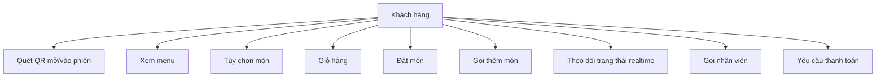
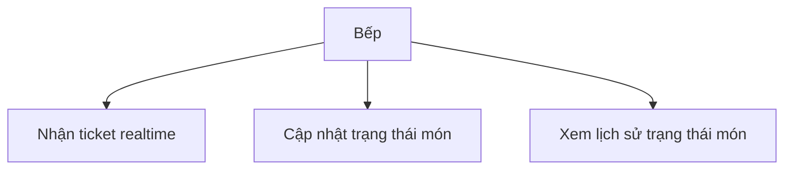
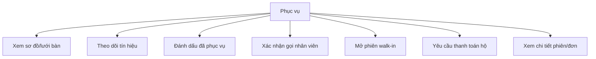
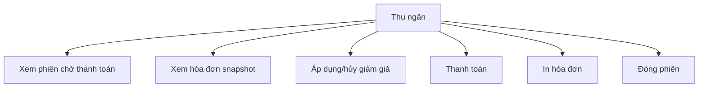
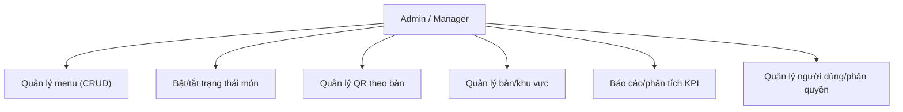

# Sơ đồ phân rã chức năng theo vai trò (BFD)

> Dùng cho mục **2.4.2 Sơ đồ chức năng theo vai trò**. Hai dạng:
> 1. Sơ đồ cây Mermaid — render ở mermaid.live → export PNG/SVG → chèn ảnh vào Word.
> 2. Outline đánh số nhiều cấp — paste thẳng vào Word (Home → Multilevel List).

---

## 1. Sơ đồ cây (Mermaid)

> Cây rộng. Nếu chèn Word thấy bí, tách thành **5 sơ đồ con** (mỗi vai trò một cây) cho dễ đọc — bản tách
> nằm ở mục 3 bên dưới.

```mermaid
graph TD
    SYS["Hệ thống quản lý nhà hàng QR"]

    SYS --> KH["1. Khách hàng"]
    SYS --> BEP["2. Bếp"]
    SYS --> PV["3. Phục vụ"]
    SYS --> TN["4. Thu ngân"]
    SYS --> AD["5. Admin / Manager"]

    KH --> KH1["1.1 Quét QR mở/vào phiên"]
    KH --> KH2["1.2 Xem menu (danh mục, tìm kiếm, hết món, bán chạy)"]
    KH --> KH3["1.3 Tùy chọn món (size, cay, topping, ghi chú)"]
    KH --> KH4["1.4 Giỏ hàng (sửa/xóa trước khi đặt)"]
    KH --> KH5["1.5 Đặt món"]
    KH --> KH6["1.6 Gọi thêm món"]
    KH --> KH7["1.7 Theo dõi trạng thái món realtime"]
    KH --> KH8["1.8 Gọi nhân viên"]
    KH --> KH9["1.9 Yêu cầu thanh toán"]

    BEP --> BEP1["2.1 Nhận ticket realtime"]
    BEP --> BEP2["2.2 Cập nhật trạng thái món"]
    BEP --> BEP3["2.3 Xem lịch sử trạng thái món"]

    PV --> PV1["3.1 Xem sơ đồ bàn / lưới bàn"]
    PV --> PV2["3.2 Theo dõi tín hiệu (ready/gọi NV/bill)"]
    PV --> PV3["3.3 Đánh dấu đã phục vụ"]
    PV --> PV4["3.4 Xác nhận gọi nhân viên"]
    PV --> PV5["3.5 Mở phiên walk-in"]
    PV --> PV6["3.6 Yêu cầu thanh toán hộ khách"]
    PV --> PV7["3.7 Xem chi tiết phiên/đơn theo bàn"]

    TN --> TN1["4.1 Xem danh sách phiên chờ thanh toán"]
    TN --> TN2["4.2 Xem hóa đơn (snapshot giá/tên)"]
    TN --> TN3["4.3 Áp dụng / hủy giảm giá"]
    TN --> TN4["4.4 Thanh toán"]
    TN --> TN5["4.5 In hóa đơn"]
    TN --> TN6["4.6 Đóng phiên"]

    AD --> AD1["5.1 Quản lý menu (CRUD món, danh mục, option)"]
    AD --> AD2["5.2 Bật/tắt trạng thái món (propagate realtime)"]
    AD --> AD3["5.3 Quản lý QR theo bàn (tạo/in/xoay/vô hiệu)"]
    AD --> AD4["5.4 Quản lý bàn / khu vực"]
    AD --> AD5["5.5 Báo cáo / phân tích (KPI từ status_history)"]
    AD --> AD6["5.6 Quản lý người dùng / phân quyền"]
```

---

## 2. Outline nhiều cấp (paste thẳng vào Word)

**0. Hệ thống quản lý nhà hàng QR**

1. **Khách hàng (Customer)**
   1.1. Quét QR mở phiên / vào phiên đang mở
   1.2. Xem menu (danh mục, tìm kiếm, hết món, bán chạy)
   1.3. Tùy chọn món (size, mức cay, topping, ghi chú)
   1.4. Giỏ hàng (sửa/xóa trước khi đặt)
   1.5. Đặt món
   1.6. Gọi thêm món
   1.7. Theo dõi trạng thái món realtime
   1.8. Gọi nhân viên
   1.9. Yêu cầu thanh toán

2. **Bếp (Kitchen)**
   2.1. Nhận ticket realtime
   2.2. Cập nhật trạng thái món
   2.3. Xem lịch sử trạng thái món

3. **Phục vụ (Waiter)**
   3.1. Xem sơ đồ bàn / lưới bàn
   3.2. Theo dõi tín hiệu (ready / gọi NV / yêu cầu bill)
   3.3. Đánh dấu đã phục vụ
   3.4. Xác nhận gọi nhân viên
   3.5. Mở phiên cho khách walk-in
   3.6. Yêu cầu thanh toán hộ khách
   3.7. Xem chi tiết phiên/đơn theo bàn

4. **Thu ngân (Cashier)**
   4.1. Xem danh sách phiên chờ thanh toán
   4.2. Xem hóa đơn (snapshot giá/tên)
   4.3. Áp dụng / hủy giảm giá
   4.4. Thanh toán
   4.5. In hóa đơn
   4.6. Đóng phiên

5. **Admin / Manager**
   5.1. Quản lý menu (CRUD món, danh mục, option)
   5.2. Bật/tắt trạng thái món (propagate realtime)
   5.3. Quản lý QR theo bàn (tạo / in / xoay / vô hiệu)
   5.4. Quản lý bàn / khu vực
   5.5. Báo cáo / phân tích (KPI từ status_history)
   5.6. Quản lý người dùng / phân quyền

---

## 3. Bản tách 5 cây con (nếu sơ đồ tổng quá rộng)

---

## Cách đưa vào Word

| Cách | Thao tác | Khi nào dùng |
|---|---|---|
| **Ảnh từ Mermaid** | Dán block vào mermaid.live → Actions → PNG/SVG → chèn ảnh vào Word | Muốn sơ đồ cây đẹp, giống BFD chuẩn |
| **Multilevel List** | Copy outline mục 2 → Word → Home → Multilevel List | Nhanh, native, sửa text dễ |
| **SmartArt Hierarchy** | Insert → SmartArt → Hierarchy → gõ tay theo outline | Muốn vẽ hộp trong Word, không cần ảnh ngoài |

> Mẹo: sơ đồ tổng (mục 1) thường **quá rộng** khi xuất ảnh khổ A4 dọc. Báo cáo nên dùng **5 cây con
> (mục 3)** — mỗi vai trò một hình, vừa trang, dễ đọc.
</content>
