# Sơ đồ trình tự (sequence) — 4 cột: Actor · UI · Backend · Database

> Nguồn: `usecase chi tieết.docx`. Mỗi UC một sequence, **chỉ 4 làn**: Actor, UI (giao diện),
> Backend, Database. Không vẽ outbox/WebSocket riêng — việc "đẩy realtime" chỉ ghi chú trên Backend
> (`Note over BE`) vì nó là chi tiết hạ tầng sâu DB, không phải nghiệp vụ chính.
>
> Ngoại lệ / luồng thay thế thể hiện bằng `alt` / `opt`. Sơ đồ Mermaid — dán thẳng vào Notion/Confluence.
>
> Quy ước làn: `A` = Actor · `UI` = Giao diện · `BE` = Backend · `DB` = Database.

---

# Nhóm Khách hàng

## UC-01 — Quét QR vào phiên

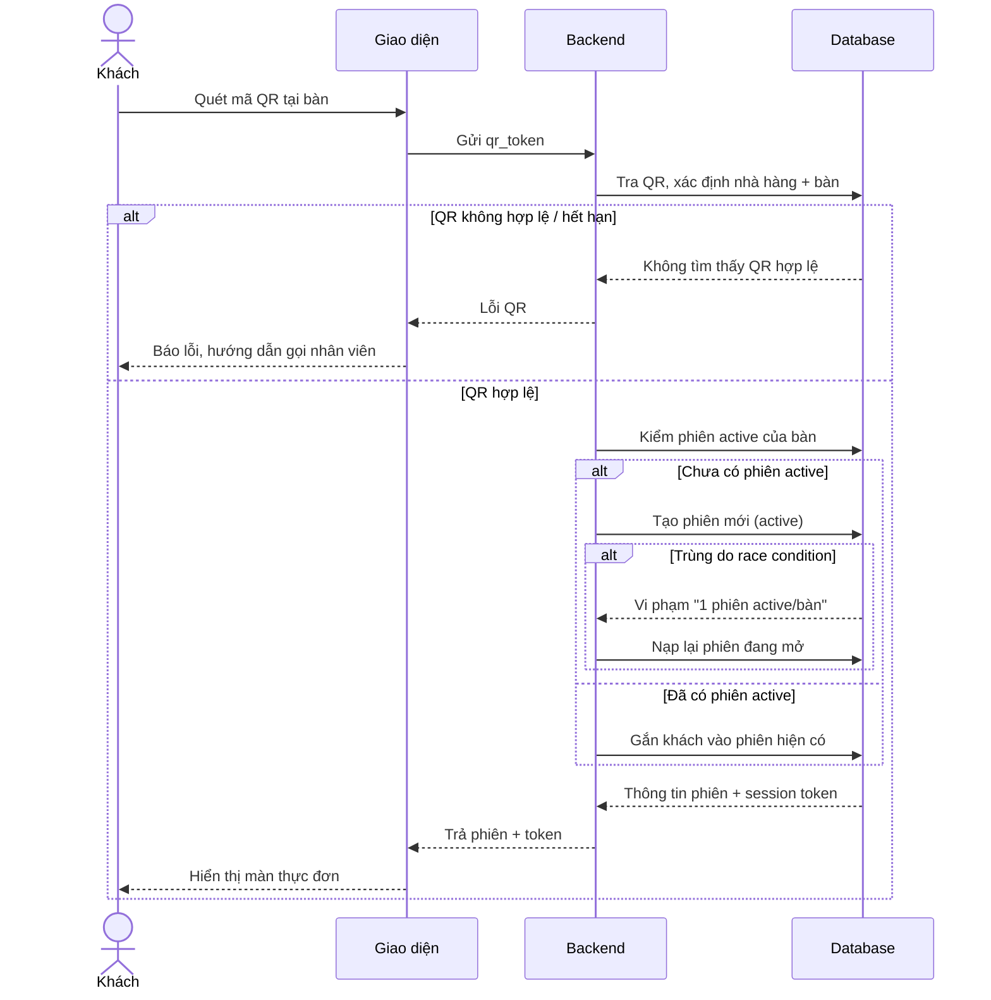
```mermaid
sequenceDiagram
    actor A as Khách
    participant UI as Giao diện
    participant BE as Backend
    participant DB as Database

    A->>UI: Quét mã QR tại bàn
    UI->>BE: Gửi qr_token
    BE->>DB: Tra QR, xác định nhà hàng + bàn
    alt QR không hợp lệ / hết hạn
        DB-->>BE: Không tìm thấy QR hợp lệ
        BE-->>UI: Lỗi QR
        UI-->>A: Báo lỗi, hướng dẫn gọi nhân viên
    else QR hợp lệ
        BE->>DB: Kiểm phiên active của bàn
        alt Chưa có phiên active
            BE->>DB: Tạo phiên mới (active)
            alt Trùng do race condition
                DB-->>BE: Vi phạm "1 phiên active/bàn"
                BE->>DB: Nạp lại phiên đang mở
            end
        else Đã có phiên active
            BE->>DB: Gắn khách vào phiên hiện có
        end
        DB-->>BE: Thông tin phiên + session token
        BE-->>UI: Trả phiên + token
        UI-->>A: Hiển thị màn thực đơn
    end
```

## UC-02 — Xem thực đơn

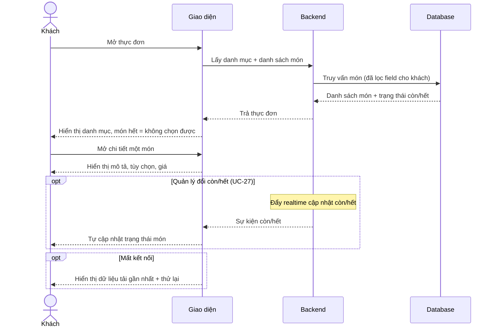
```mermaid
sequenceDiagram
    actor A as Khách
    participant UI as Giao diện
    participant BE as Backend
    participant DB as Database

    A->>UI: Mở thực đơn
    UI->>BE: Lấy danh mục + danh sách món
    BE->>DB: Truy vấn món (đã lọc field cho khách)
    DB-->>BE: Danh sách món + trạng thái còn/hết
    BE-->>UI: Trả thực đơn
    UI-->>A: Hiển thị danh mục, món hết = không chọn được
    A->>UI: Mở chi tiết một món
    UI-->>A: Hiển thị mô tả, tùy chọn, giá
    opt Quản lý đổi còn/hết (UC-27)
        Note over BE: Đẩy realtime cập nhật còn/hết
        BE-->>UI: Sự kiện còn/hết
        UI-->>A: Tự cập nhật trạng thái món
    end
    opt Mất kết nối
        UI-->>A: Hiển thị dữ liệu tải gần nhất + thử lại
    end
```

## UC-03 — Đặt món

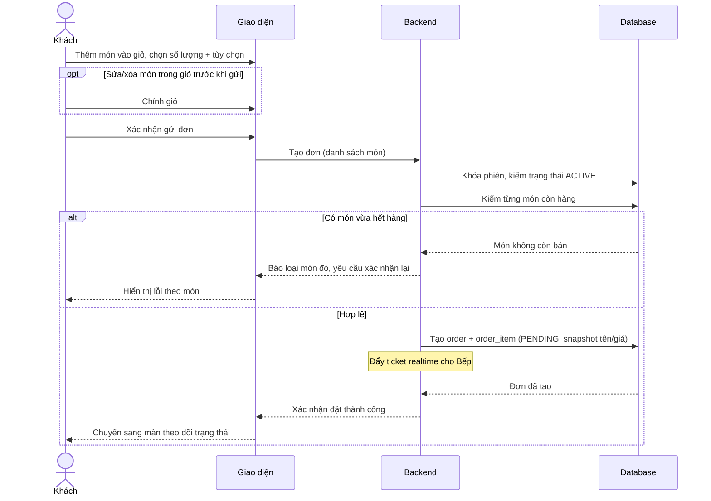
```mermaid
sequenceDiagram
    actor A as Khách
    participant UI as Giao diện
    participant BE as Backend
    participant DB as Database

    A->>UI: Thêm món vào giỏ, chọn số lượng + tùy chọn
    opt Sửa/xóa món trong giỏ trước khi gửi
        A->>UI: Chỉnh giỏ
    end
    A->>UI: Xác nhận gửi đơn
    UI->>BE: Tạo đơn (danh sách món)
    BE->>DB: Khóa phiên, kiểm trạng thái ACTIVE
    BE->>DB: Kiểm từng món còn hàng
    alt Có món vừa hết hàng
        DB-->>BE: Món không còn bán
        BE-->>UI: Báo loại món đó, yêu cầu xác nhận lại
        UI-->>A: Hiển thị lỗi theo món
    else Hợp lệ
        BE->>DB: Tạo order + order_item (PENDING, snapshot tên/giá)
        Note over BE: Đẩy ticket realtime cho Bếp
        DB-->>BE: Đơn đã tạo
        BE-->>UI: Xác nhận đặt thành công
        UI-->>A: Chuyển sang màn theo dõi trạng thái
    end
```

## UC-04 — Gọi thêm món

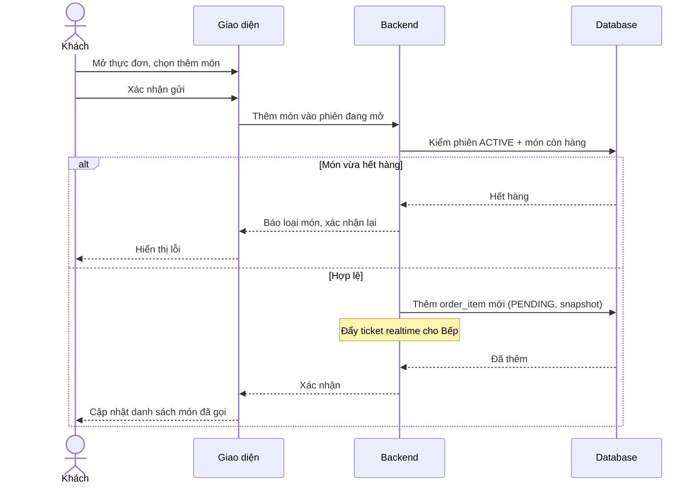
```mermaid
sequenceDiagram
    actor A as Khách
    participant UI as Giao diện
    participant BE as Backend
    participant DB as Database

    A->>UI: Mở thực đơn, chọn thêm món
    A->>UI: Xác nhận gửi
    UI->>BE: Thêm món vào phiên đang mở
    BE->>DB: Kiểm phiên ACTIVE + món còn hàng
    alt Món vừa hết hàng
        DB-->>BE: Hết hàng
        BE-->>UI: Báo loại món, xác nhận lại
        UI-->>A: Hiển thị lỗi
    else Hợp lệ
        BE->>DB: Thêm order_item mới (PENDING, snapshot)
        Note over BE: Đẩy ticket realtime cho Bếp
        DB-->>BE: Đã thêm
        BE-->>UI: Xác nhận
        UI-->>A: Cập nhật danh sách món đã gọi
    end
```

## UC-05 — Hủy / sửa món đã gọi

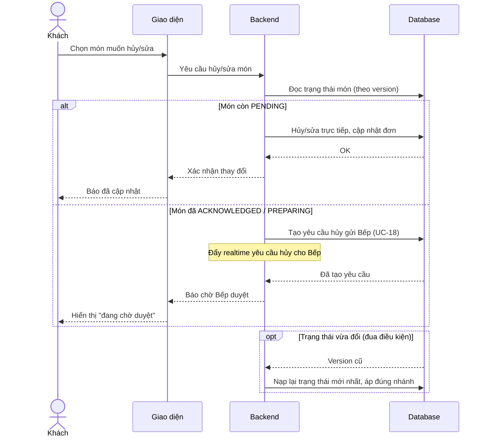
```mermaid
sequenceDiagram
    actor A as Khách
    participant UI as Giao diện
    participant BE as Backend
    participant DB as Database

    A->>UI: Chọn món muốn hủy/sửa
    UI->>BE: Yêu cầu hủy/sửa món
    BE->>DB: Đọc trạng thái món (theo version)
    alt Món còn PENDING
        BE->>DB: Hủy/sửa trực tiếp, cập nhật đơn
        DB-->>BE: OK
        BE-->>UI: Xác nhận thay đổi
        UI-->>A: Báo đã cập nhật
    else Món đã ACKNOWLEDGED / PREPARING
        BE->>DB: Tạo yêu cầu hủy gửi Bếp (UC-18)
        Note over BE: Đẩy realtime yêu cầu hủy cho Bếp
        DB-->>BE: Đã tạo yêu cầu
        BE-->>UI: Báo chờ Bếp duyệt
        UI-->>A: Hiển thị "đang chờ duyệt"
    end
    opt Trạng thái vừa đổi (đua điều kiện)
        DB-->>BE: Version cũ
        BE->>DB: Nạp lại trạng thái mới nhất, áp đúng nhánh
    end
```

## UC-06 — Theo dõi trạng thái món (realtime)

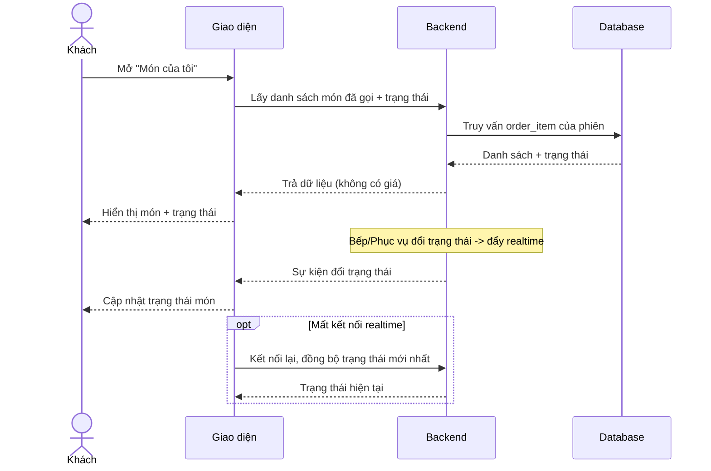
```mermaid
sequenceDiagram
    actor A as Khách
    participant UI as Giao diện
    participant BE as Backend
    participant DB as Database

    A->>UI: Mở "Món của tôi"
    UI->>BE: Lấy danh sách món đã gọi + trạng thái
    BE->>DB: Truy vấn order_item của phiên
    DB-->>BE: Danh sách + trạng thái
    BE-->>UI: Trả dữ liệu (không có giá)
    UI-->>A: Hiển thị món + trạng thái
    Note over BE: Bếp/Phục vụ đổi trạng thái -> đẩy realtime
    BE-->>UI: Sự kiện đổi trạng thái
    UI-->>A: Cập nhật trạng thái món
    opt Mất kết nối realtime
        UI->>BE: Kết nối lại, đồng bộ trạng thái mới nhất
        BE-->>UI: Trạng thái hiện tại
    end
```

## UC-07 — Gọi nhân viên

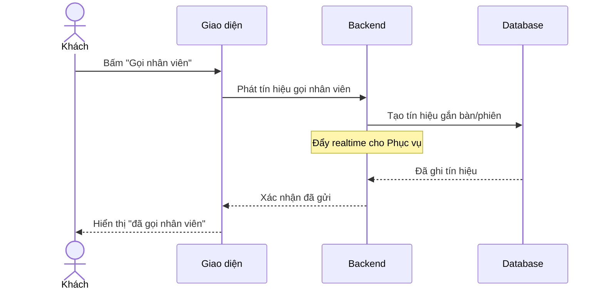
```mermaid
sequenceDiagram
    actor A as Khách
    participant UI as Giao diện
    participant BE as Backend
    participant DB as Database

    A->>UI: Bấm "Gọi nhân viên"
    UI->>BE: Phát tín hiệu gọi nhân viên
    BE->>DB: Tạo tín hiệu gắn bàn/phiên
    Note over BE: Đẩy realtime cho Phục vụ
    DB-->>BE: Đã ghi tín hiệu
    BE-->>UI: Xác nhận đã gửi
    UI-->>A: Hiển thị "đã gọi nhân viên"
```

## UC-08 — Yêu cầu thanh toán

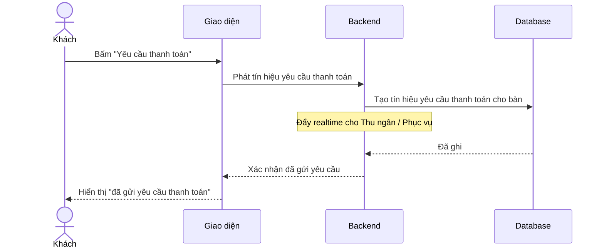
```mermaid
sequenceDiagram
    actor A as Khách
    participant UI as Giao diện
    participant BE as Backend
    participant DB as Database

    A->>UI: Bấm "Yêu cầu thanh toán"
    UI->>BE: Phát tín hiệu yêu cầu thanh toán
    BE->>DB: Tạo tín hiệu yêu cầu thanh toán cho bàn
    Note over BE: Đẩy realtime cho Thu ngân / Phục vụ
    DB-->>BE: Đã ghi
    BE-->>UI: Xác nhận đã gửi yêu cầu
    UI-->>A: Hiển thị "đã gửi yêu cầu thanh toán"
```

---

# Nhóm Phục vụ

## UC-09 — Mở phiên walk-in

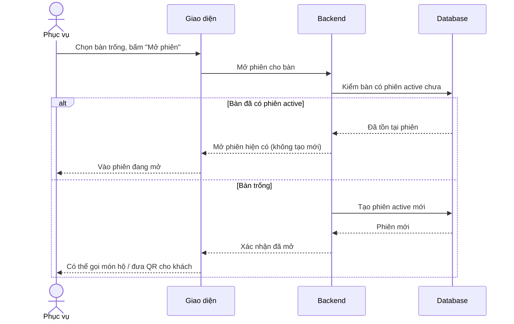
```mermaid
sequenceDiagram
    actor A as Phục vụ
    participant UI as Giao diện
    participant BE as Backend
    participant DB as Database

    A->>UI: Chọn bàn trống, bấm "Mở phiên"
    UI->>BE: Mở phiên cho bàn
    BE->>DB: Kiểm bàn có phiên active chưa
    alt Bàn đã có phiên active
        DB-->>BE: Đã tồn tại phiên
        BE-->>UI: Mở phiên hiện có (không tạo mới)
        UI-->>A: Vào phiên đang mở
    else Bàn trống
        BE->>DB: Tạo phiên active mới
        DB-->>BE: Phiên mới
        BE-->>UI: Xác nhận đã mở
        UI-->>A: Có thể gọi món hộ / đưa QR cho khách
    end
```

## UC-10 — Xem sơ đồ bàn / lưới bàn

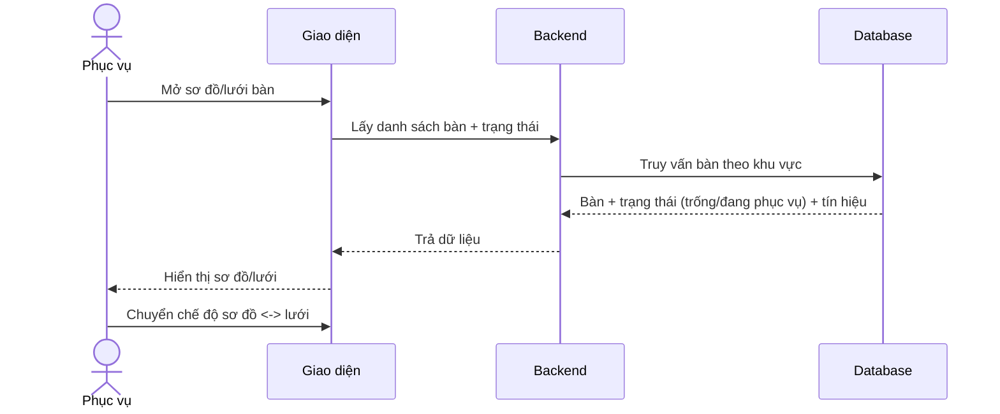
```mermaid
sequenceDiagram
    actor A as Phục vụ
    participant UI as Giao diện
    participant BE as Backend
    participant DB as Database

    A->>UI: Mở sơ đồ/lưới bàn
    UI->>BE: Lấy danh sách bàn + trạng thái
    BE->>DB: Truy vấn bàn theo khu vực
    DB-->>BE: Bàn + trạng thái (trống/đang phục vụ) + tín hiệu
    BE-->>UI: Trả dữ liệu
    UI-->>A: Hiển thị sơ đồ/lưới
    A->>UI: Chuyển chế độ sơ đồ <-> lưới
```

## UC-11 — Theo dõi tín hiệu bàn

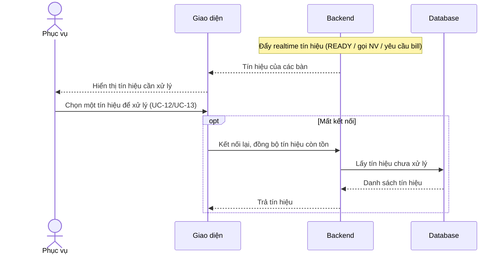
```mermaid
sequenceDiagram
    actor A as Phục vụ
    participant UI as Giao diện
    participant BE as Backend
    participant DB as Database

    Note over BE: Đẩy realtime tín hiệu (READY / gọi NV / yêu cầu bill)
    BE-->>UI: Tín hiệu của các bàn
    UI-->>A: Hiển thị tín hiệu cần xử lý
    A->>UI: Chọn một tín hiệu để xử lý (UC-12/UC-13)
    opt Mất kết nối
        UI->>BE: Kết nối lại, đồng bộ tín hiệu còn tồn
        BE->>DB: Lấy tín hiệu chưa xử lý
        DB-->>BE: Danh sách tín hiệu
        BE-->>UI: Trả tín hiệu
    end
```

## UC-12 — Xác nhận gọi nhân viên

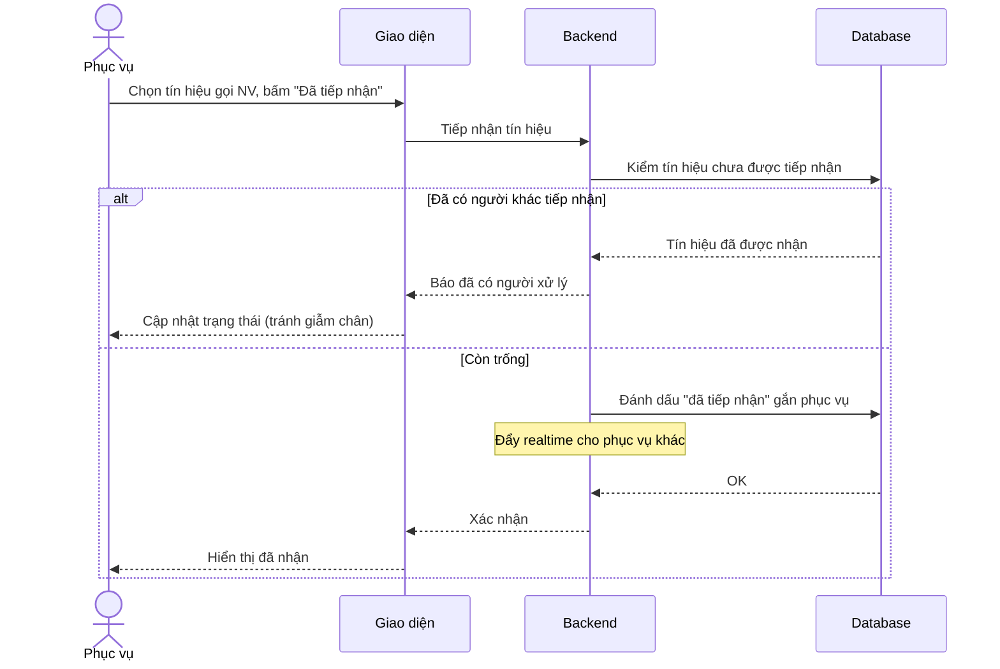
```mermaid
sequenceDiagram
    actor A as Phục vụ
    participant UI as Giao diện
    participant BE as Backend
    participant DB as Database

    A->>UI: Chọn tín hiệu gọi NV, bấm "Đã tiếp nhận"
    UI->>BE: Tiếp nhận tín hiệu
    BE->>DB: Kiểm tín hiệu chưa được tiếp nhận
    alt Đã có người khác tiếp nhận
        DB-->>BE: Tín hiệu đã được nhận
        BE-->>UI: Báo đã có người xử lý
        UI-->>A: Cập nhật trạng thái (tránh giẫm chân)
    else Còn trống
        BE->>DB: Đánh dấu "đã tiếp nhận" gắn phục vụ
        Note over BE: Đẩy realtime cho phục vụ khác
        DB-->>BE: OK
        BE-->>UI: Xác nhận
        UI-->>A: Hiển thị đã nhận
    end
```

## UC-13 — Đánh dấu đã phục vụ

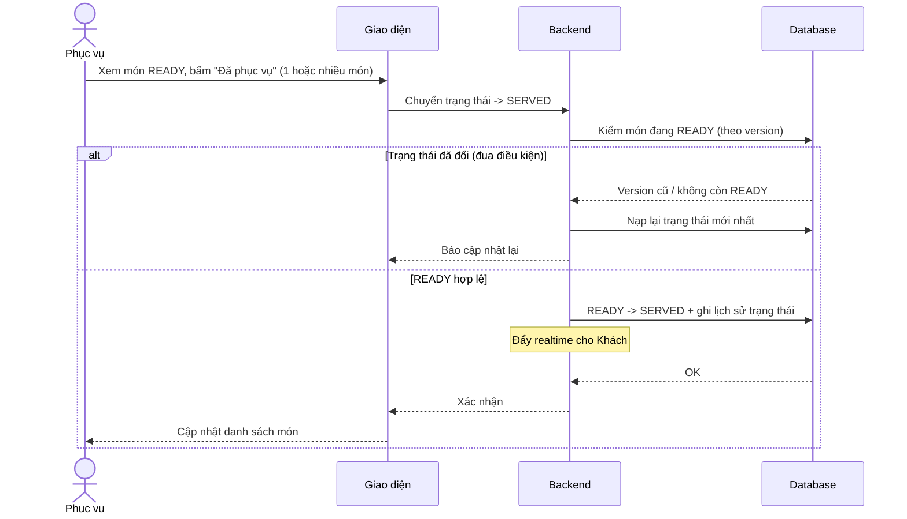
```mermaid
sequenceDiagram
    actor A as Phục vụ
    participant UI as Giao diện
    participant BE as Backend
    participant DB as Database

    A->>UI: Xem món READY, bấm "Đã phục vụ" (1 hoặc nhiều món)
    UI->>BE: Chuyển trạng thái -> SERVED
    BE->>DB: Kiểm món đang READY (theo version)
    alt Trạng thái đã đổi (đua điều kiện)
        DB-->>BE: Version cũ / không còn READY
        BE->>DB: Nạp lại trạng thái mới nhất
        BE-->>UI: Báo cập nhật lại
    else READY hợp lệ
        BE->>DB: READY -> SERVED + ghi lịch sử trạng thái
        Note over BE: Đẩy realtime cho Khách
        DB-->>BE: OK
        BE-->>UI: Xác nhận
        UI-->>A: Cập nhật danh sách món
    end
```

## UC-14 — Yêu cầu thanh toán hộ

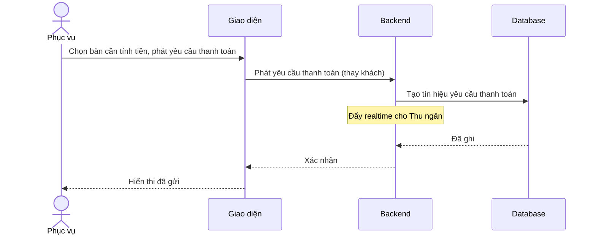
```mermaid
sequenceDiagram
    actor A as Phục vụ
    participant UI as Giao diện
    participant BE as Backend
    participant DB as Database

    A->>UI: Chọn bàn cần tính tiền, phát yêu cầu thanh toán
    UI->>BE: Phát yêu cầu thanh toán (thay khách)
    BE->>DB: Tạo tín hiệu yêu cầu thanh toán
    Note over BE: Đẩy realtime cho Thu ngân
    DB-->>BE: Đã ghi
    BE-->>UI: Xác nhận
    UI-->>A: Hiển thị đã gửi
```

## UC-15 — Xem chi tiết phiên/đơn theo bàn

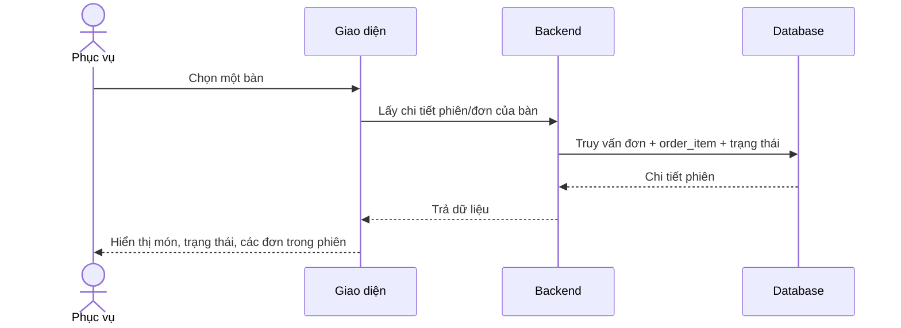
```mermaid
sequenceDiagram
    actor A as Phục vụ
    participant UI as Giao diện
    participant BE as Backend
    participant DB as Database

    A->>UI: Chọn một bàn
    UI->>BE: Lấy chi tiết phiên/đơn của bàn
    BE->>DB: Truy vấn đơn + order_item + trạng thái
    DB-->>BE: Chi tiết phiên
    BE-->>UI: Trả dữ liệu
    UI-->>A: Hiển thị món, trạng thái, các đơn trong phiên
```

---

# Nhóm Bếp

## UC-16 — Tiếp nhận đơn / xem hàng đợi (realtime)

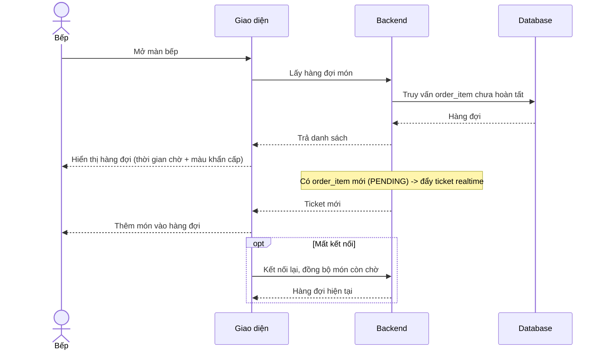
```mermaid
sequenceDiagram
    actor A as Bếp
    participant UI as Giao diện
    participant BE as Backend
    participant DB as Database

    A->>UI: Mở màn bếp
    UI->>BE: Lấy hàng đợi món
    BE->>DB: Truy vấn order_item chưa hoàn tất
    DB-->>BE: Hàng đợi
    BE-->>UI: Trả danh sách
    UI-->>A: Hiển thị hàng đợi (thời gian chờ + màu khẩn cấp)
    Note over BE: Có order_item mới (PENDING) -> đẩy ticket realtime
    BE-->>UI: Ticket mới
    UI-->>A: Thêm món vào hàng đợi
    opt Mất kết nối
        UI->>BE: Kết nối lại, đồng bộ món còn chờ
        BE-->>UI: Hàng đợi hiện tại
    end
```

## UC-17 — Cập nhật trạng thái món

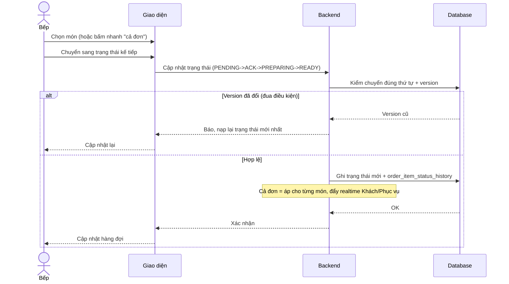
```mermaid
sequenceDiagram
    actor A as Bếp
    participant UI as Giao diện
    participant BE as Backend
    participant DB as Database

    A->>UI: Chọn món (hoặc bấm nhanh "cả đơn")
    A->>UI: Chuyển sang trạng thái kế tiếp
    UI->>BE: Cập nhật trạng thái (PENDING->ACK->PREPARING->READY)
    BE->>DB: Kiểm chuyển đúng thứ tự + version
    alt Version đã đổi (đua điều kiện)
        DB-->>BE: Version cũ
        BE-->>UI: Báo, nạp lại trạng thái mới nhất
        UI-->>A: Cập nhật lại
    else Hợp lệ
        BE->>DB: Ghi trạng thái mới + order_item_status_history
        Note over BE: Cả đơn = áp cho từng món, đẩy realtime Khách/Phục vụ
        DB-->>BE: OK
        BE-->>UI: Xác nhận
        UI-->>A: Cập nhật hàng đợi
    end
```

## UC-18 — Xác nhận / từ chối yêu cầu hủy món

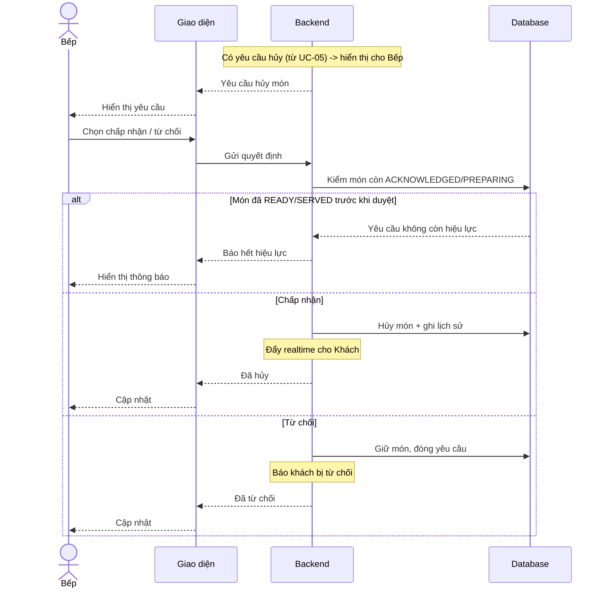
```mermaid
sequenceDiagram
    actor A as Bếp
    participant UI as Giao diện
    participant BE as Backend
    participant DB as Database

    Note over BE: Có yêu cầu hủy (từ UC-05) -> hiển thị cho Bếp
    BE-->>UI: Yêu cầu hủy món
    UI-->>A: Hiển thị yêu cầu
    A->>UI: Chọn chấp nhận / từ chối
    UI->>BE: Gửi quyết định
    BE->>DB: Kiểm món còn ACKNOWLEDGED/PREPARING
    alt Món đã READY/SERVED trước khi duyệt
        DB-->>BE: Yêu cầu không còn hiệu lực
        BE-->>UI: Báo hết hiệu lực
        UI-->>A: Hiển thị thông báo
    else Chấp nhận
        BE->>DB: Hủy món + ghi lịch sử
        Note over BE: Đẩy realtime cho Khách
        BE-->>UI: Đã hủy
        UI-->>A: Cập nhật
    else Từ chối
        BE->>DB: Giữ món, đóng yêu cầu
        Note over BE: Báo khách bị từ chối
        BE-->>UI: Đã từ chối
        UI-->>A: Cập nhật
    end
```

## UC-19 — Xem lịch sử trạng thái món

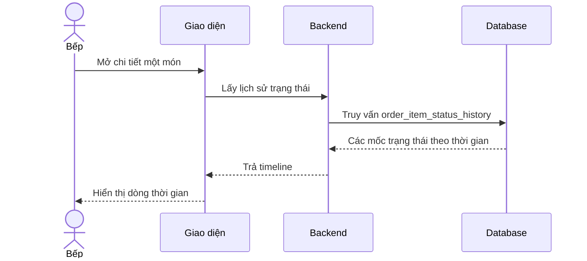
```mermaid
sequenceDiagram
    actor A as Bếp
    participant UI as Giao diện
    participant BE as Backend
    participant DB as Database

    A->>UI: Mở chi tiết một món
    UI->>BE: Lấy lịch sử trạng thái
    BE->>DB: Truy vấn order_item_status_history
    DB-->>BE: Các mốc trạng thái theo thời gian
    BE-->>UI: Trả timeline
    UI-->>A: Hiển thị dòng thời gian
```

---

# Nhóm Thu ngân

## UC-20 — Xem danh sách phiên chờ thanh toán

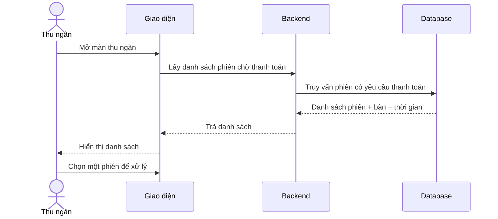
```mermaid
sequenceDiagram
    actor A as Thu ngân
    participant UI as Giao diện
    participant BE as Backend
    participant DB as Database

    A->>UI: Mở màn thu ngân
    UI->>BE: Lấy danh sách phiên chờ thanh toán
    BE->>DB: Truy vấn phiên có yêu cầu thanh toán
    DB-->>BE: Danh sách phiên + bàn + thời gian
    BE-->>UI: Trả danh sách
    UI-->>A: Hiển thị danh sách
    A->>UI: Chọn một phiên để xử lý
```

## UC-21 — Xem hóa đơn (snapshot)

```mermaid
sequenceDiagram
    actor A as Thu ngân
    participant UI as Giao diện
    participant BE as Backend
    participant DB as Database

    A->>UI: Chọn phiên
    UI->>BE: Lập/lấy hóa đơn của phiên
    BE->>DB: Gom món của phiên, lập invoice_items (snapshot tên/giá)
    DB-->>BE: Hóa đơn + dòng món + tổng tiền
    BE-->>UI: Trả hóa đơn
    UI-->>A: Hiển thị hóa đơn + tổng tiền
```

## UC-22 — Điều chỉnh hóa đơn & giảm giá

```mermaid
sequenceDiagram
    actor A as Thu ngân
    participant UI as Giao diện
    participant BE as Backend
    participant DB as Database

    A->>UI: Mở hóa đơn
    A->>UI: Chỉnh số lượng / loại bỏ món / áp giảm giá
    UI->>BE: Gửi điều chỉnh (cố định hoặc %)
    BE->>DB: Kiểm hóa đơn chưa thanh toán
    alt Đã thanh toán
        DB-->>BE: Hóa đơn đã khóa
        BE-->>UI: Không thể điều chỉnh
        UI-->>A: Báo lỗi
    else Chưa thanh toán
        BE->>DB: Tính lại tổng + ghi log điều chỉnh/giảm giá
        DB-->>BE: Hóa đơn mới
        BE-->>UI: Trả hóa đơn cập nhật
        UI-->>A: Hiển thị tổng mới
    end
    opt Hủy giảm giá đã áp
        A->>UI: Hủy giảm giá
        UI->>BE: Yêu cầu hủy giảm giá
        BE->>DB: Tính lại tổng + ghi log
        BE-->>UI: Hóa đơn cập nhật
    end
```

## UC-23 — Xử lý thanh toán

```mermaid
sequenceDiagram
    actor A as Thu ngân
    participant UI as Giao diện
    participant BE as Backend
    participant DB as Database
    participant GW as Cổng thanh toán

    A->>UI: Chọn phương thức thanh toán
    alt Tiền mặt / thẻ
        A->>UI: Nhập số tiền / xác nhận
        UI->>BE: Ghi nhận thanh toán
        BE->>DB: Ghi giao dịch + cập nhật hóa đơn PAID
        DB-->>BE: OK
        BE-->>UI: Thanh toán thành công
        UI-->>A: Hiển thị đã thanh toán
    else Ví điện tử (2 pha)
        UI->>BE: Khởi tạo thanh toán ví
        BE->>DB: Tạo payment PENDING
        BE->>GW: Pha 1 - Khởi tạo giao dịch
        GW-->>BE: QR / đường dẫn cổng
        BE-->>UI: Hiển thị QR cổng thanh toán
        UI-->>A: Chờ khách quét trả
        opt Thu ngân chuyển sang phiên khác trong khi chờ
            A->>UI: Mở phiên khác
        end
        GW->>BE: Pha 2 - Webhook callback
        BE->>DB: Xác thực + đánh dấu PAID (idempotent)
        alt Cổng báo thất bại / hết hạn
            GW->>BE: Callback thất bại
            BE->>DB: Giữ hóa đơn chưa thanh toán
            BE-->>UI: Cho thử lại / đổi phương thức
        else Webhook lặp lại
            GW->>BE: Callback trùng
            Note over BE: Idempotent - không cộng tiền hai lần
        end
        DB-->>BE: Hóa đơn PAID
        BE-->>UI: Cập nhật trạng thái (nền)
    end
```

## UC-24 — In hóa đơn

```mermaid
sequenceDiagram
    actor A as Thu ngân
    participant UI as Giao diện
    participant BE as Backend
    participant DB as Database

    A->>UI: Bấm "In hóa đơn"
    UI->>BE: Lấy hóa đơn (snapshot) để in
    BE->>DB: Truy vấn invoice + invoice_items
    DB-->>BE: Dữ liệu hóa đơn
    BE-->>UI: Trả bản in
    UI-->>A: Hiển thị bản in + gửi máy in
```

## UC-25 — Đóng phiên

```mermaid
sequenceDiagram
    actor A as Thu ngân
    participant UI as Giao diện
    participant BE as Backend
    participant DB as Database

    A->>UI: Bấm "Đóng phiên"
    UI->>BE: Yêu cầu đóng phiên
    BE->>DB: Kiểm hóa đơn đã thanh toán + còn món chưa phục vụ?
    alt Còn món chưa phục vụ / chưa thanh toán
        DB-->>BE: Còn ràng buộc
        BE-->>UI: Cảnh báo, yêu cầu xử lý trước
        UI-->>A: Hiển thị cảnh báo
    else Đủ điều kiện
        BE->>DB: Phiên -> CLOSED, bàn -> AVAILABLE
        DB-->>BE: OK
        BE-->>UI: Đã đóng phiên
        UI-->>A: Bàn về trạng thái trống
    end
```

---

# Nhóm Quản lý

## UC-26 — Quản lý thực đơn (CRUD)

```mermaid
sequenceDiagram
    actor A as Quản lý
    participant UI as Giao diện
    participant BE as Backend
    participant DB as Database

    A->>UI: Mở quản lý thực đơn
    A->>UI: Thêm / sửa / xóa danh mục, món, tùy chọn, giá
    UI->>BE: Gửi thay đổi
    alt Xóa món đang còn trong phiên active
        BE->>DB: Soft delete (deleted_at)
        Note over DB: order_item đã snapshot giữ nguyên
        DB-->>BE: OK
    else Thêm / sửa
        BE->>DB: Lưu thay đổi (đổi giá chỉ áp lần gọi mới)
        DB-->>BE: OK
    end
    BE-->>UI: Xác nhận
    UI-->>A: Cập nhật danh sách thực đơn
```

## UC-27 — Bật/tắt trạng thái còn-hết

```mermaid
sequenceDiagram
    actor A as Quản lý
    participant UI as Giao diện
    participant BE as Backend
    participant DB as Database

    A->>UI: Chọn món, đổi trạng thái còn/hết
    UI->>BE: Cập nhật còn/hết (trạng thái đích tường minh)
    BE->>DB: Lưu trạng thái + ghi audit
    Note over BE: Đẩy realtime tới màn Khách (ảnh hưởng UC-02)
    DB-->>BE: OK
    BE-->>UI: Xác nhận
    UI-->>A: Cập nhật trạng thái món
```

## UC-28 — Quản lý mã QR theo bàn

```mermaid
sequenceDiagram
    actor A as Quản lý
    participant UI as Giao diện
    participant BE as Backend
    participant DB as Database

    A->>UI: Chọn bàn
    A->>UI: Sinh / đổi / khóa mã QR
    UI->>BE: Gửi yêu cầu
    BE->>DB: Lưu QR mới (vô hiệu mã cũ khi đổi)
    DB-->>BE: OK
    BE-->>UI: Trả mã QR
    UI-->>A: Cho tải / in mã
```

## UC-29 — Quản lý bàn / khu vực

```mermaid
sequenceDiagram
    actor A as Quản lý
    participant UI as Giao diện
    participant BE as Backend
    participant DB as Database

    A->>UI: Mở quản lý bàn/khu vực
    A->>UI: Thêm / sửa / xóa bàn, gán khu vực, sắp xếp sơ đồ
    UI->>BE: Gửi thay đổi
    alt Xóa bàn đang có phiên active
        BE->>DB: Kiểm phiên active
        DB-->>BE: Bàn còn phiên
        BE-->>UI: Chặn, yêu cầu đóng phiên trước
        UI-->>A: Báo lỗi
    else Hợp lệ
        BE->>DB: Lưu (soft delete khi xóa)
        DB-->>BE: OK
        BE-->>UI: Xác nhận
        UI-->>A: Cập nhật sơ đồ
    end
```

## UC-30 — Quản lý người dùng & phân quyền

```mermaid
sequenceDiagram
    actor A as Quản lý
    participant UI as Giao diện
    participant BE as Backend
    participant DB as Database

    A->>UI: Mở quản lý người dùng
    A->>UI: Tạo / sửa / khóa tài khoản, gán vai trò
    UI->>BE: Gửi thay đổi
    BE->>DB: Lưu user + vai trò
    DB-->>BE: OK
    BE-->>UI: Xác nhận
    UI-->>A: Cập nhật danh sách (quyền theo vai trò)
```

## UC-31 — Xem báo cáo & thống kê

```mermaid
sequenceDiagram
    actor A as Quản lý
    participant UI as Giao diện
    participant BE as Backend
    participant DB as Database

    A->>UI: Chọn loại báo cáo + khoảng thời gian
    UI->>BE: Yêu cầu báo cáo
    BE->>DB: Tổng hợp dữ liệu (gồm order_item_status_history)
    DB-->>BE: Số liệu KPI
    BE-->>UI: Trả báo cáo
    UI-->>A: Hiển thị KPI / biểu đồ
```
</content>
