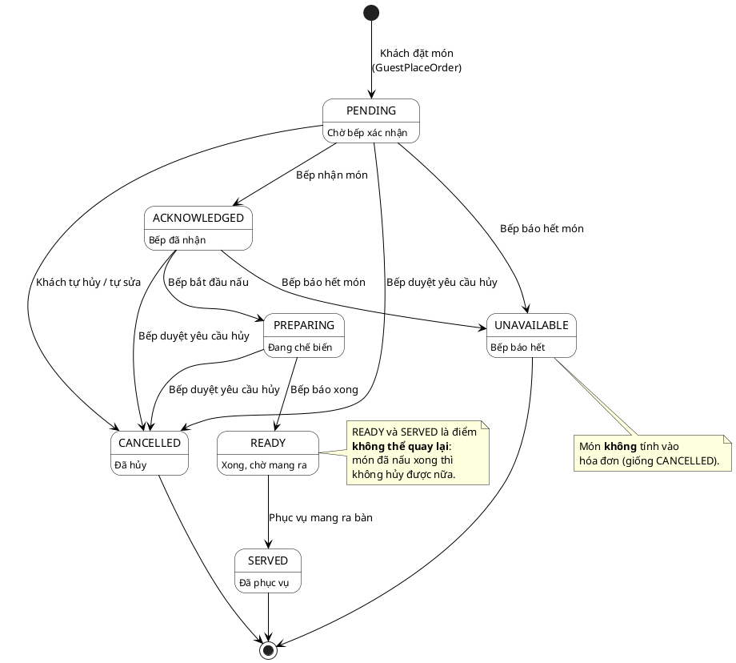
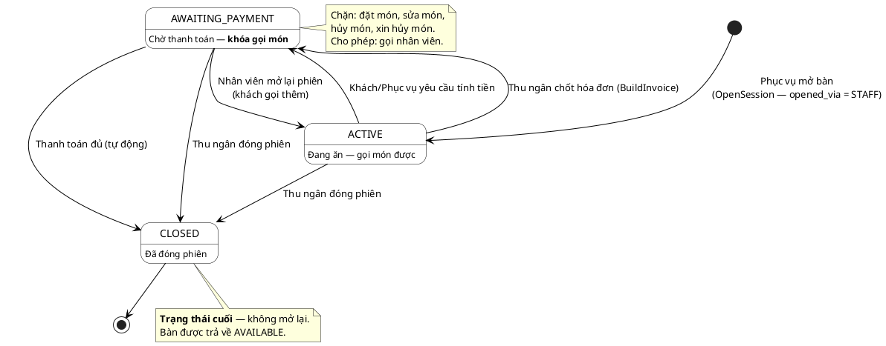
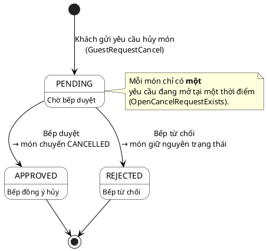
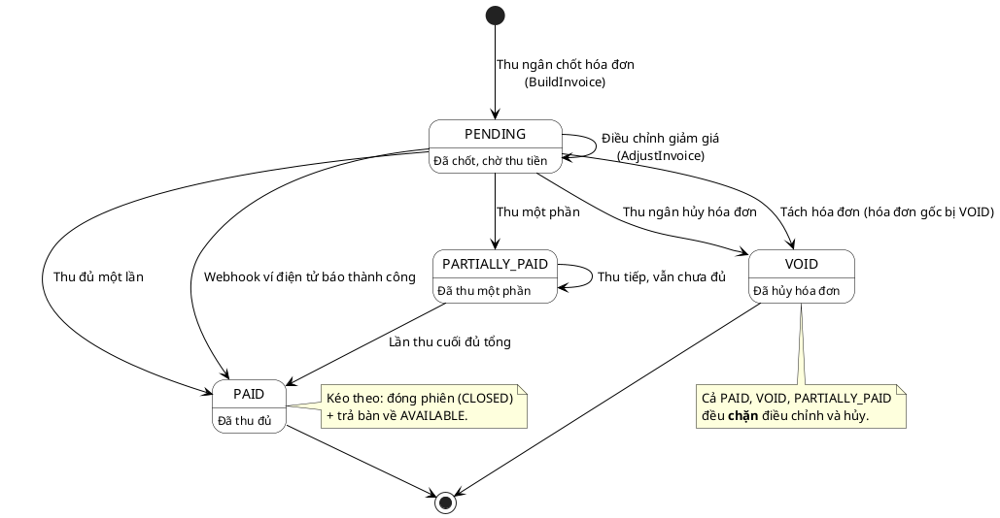
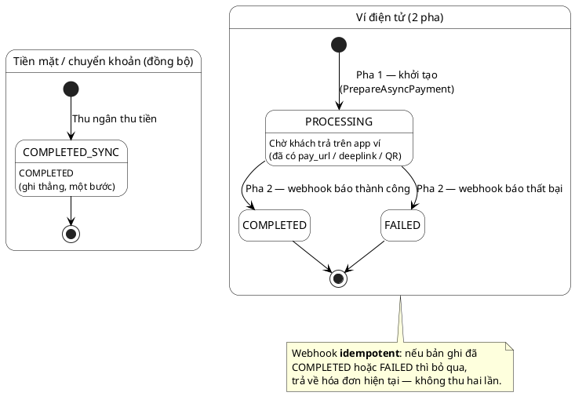

# Sơ đồ trạng thái (State Machine Diagrams)

> **Phạm vi:** Mô tả các máy trạng thái nghiệp vụ lõi của hệ thống gọi món QR.
> Mỗi máy trạng thái gồm: sơ đồ PlantUML + bảng chuyển trạng thái đối chiếu trực tiếp
> vào mã nguồn (endpoint, use-case, ràng buộc, sự kiện outbox).
>
> **Nguyên tắc lập tài liệu:** mọi trạng thái và mọi phép chuyển trong tài liệu này đều
> được đối chiếu với `CHECK constraint` trong `backend/migrations/` và mã kiểm tra trong
> tầng `application/` + `infrastructure/postgres/`. Trạng thái có trong lược đồ CSDL nhưng
> **chưa được mã nguồn dùng đến** được đánh dấu rõ ở mục *Ghi chú hiện trạng triển khai*
> của từng máy trạng thái — không vẽ như thể đã chạy.
>
> **Phạm vi nghiệp vụ:** tài liệu này chỉ vẽ các máy trạng thái **nghiệp vụ** — thứ mà
> nhân viên nhà hàng nhìn thấy và quyết định. Máy trạng thái hạ tầng (hàng đợi sự kiện
> `event_outbox`, vòng đời kết nối WebSocket) thuộc về tài liệu kiến trúc, xem
> [`SYSTEM_ARCHITECTURE.md` §4 — Real-time: transactional outbox + WebSocket](./SYSTEM_ARCHITECTURE.md).
>
> **Bổ sung cho:** [`USE_CASES_AND_DIAGRAMS.md`](./USE_CASES_AND_DIAGRAMS.md) (đặc tả + sơ đồ trình tự),
> [`docs/use-cases/`](./use-cases/) (đặc tả chi tiết 39 use-case),
> [`database_schema_lau_nuong_my_cay.md`](./database_schema_lau_nuong_my_cay.md) (lược đồ CSDL).

## Mục lục

| # | Máy trạng thái | Thực thể | Vì sao quan trọng |
|---|---|---|---|
| 1 | [Trạng thái món đã gọi](#1--trạng-thái-món-đã-gọi-order_itemstatus) | `order_items.status` | Quy tắc lõi: **trạng thái theo từng món**, không theo cả đơn |
| 2 | [Trạng thái phiên ăn](#2--trạng-thái-phiên-ăn-dining_sessionsstatus) | `dining_sessions.status` | Quy tắc **khóa thanh toán** (payment lock) |
| 3 | [Trạng thái yêu cầu hủy món](#3--trạng-thái-yêu-cầu-hủy-món-cancel_requestsstatus) | `cancel_requests.status` | Quy tắc **hủy sau khi bếp nhận phải xin duyệt** |
| 4 | [Trạng thái hóa đơn](#4--trạng-thái-hóa-đơn-invoicesstatus) | `invoices.status` | Chốt sổ, giảm giá, hủy, thanh toán từng phần |
| 5 | [Trạng thái thanh toán](#5--trạng-thái-thanh-toán-paymentsstatus) | `payments.status` | Quy tắc **ví điện tử 2 pha**, webhook idempotent |

**Quy ước đọc bảng chuyển trạng thái**

| Cột | Ý nghĩa |
|---|---|
| **Từ → Đến** | Trạng thái trước và sau phép chuyển |
| **Tác nhân** | Vai trò kích hoạt (Khách / Bếp / Phục vụ / Thu ngân / Quản lý / Hệ thống) |
| **Kích hoạt bởi** | Endpoint HTTP + use-case (tầng `application/`) thực hiện phép chuyển |
| **Ràng buộc (guard)** | Điều kiện phải thỏa; nếu sai trả lỗi (mã lỗi ghi nguyên văn từ mã nguồn) |
| **Sự kiện phát ra** | Bản ghi ghi vào `event_outbox` trong **cùng transaction** → đẩy realtime |

Đường dẫn endpoint viết rút gọn, bỏ tiền tố `/api/v1`. Nhóm `/customer/*` dùng
**device access token** (header `X-Device-Access-Token`); nhóm `/restaurant/*` dùng **JWT + phân quyền**.

---

## 1 — Trạng thái món đã gọi (`order_items.status`)

Đây là máy trạng thái quan trọng nhất của hệ thống. Quy tắc nghiệp vụ:
**trạng thái gắn với từng món (order item), không gắn với cả đơn hàng.** Các nút
"cả đơn" trên màn hình bếp chỉ là thao tác hàng loạt (bulk shortcut) lặp lại phép
chuyển này trên từng món.

**Nguồn:** `chk_order_items_status` (migration `00001` + mở rộng `00006`) —
`PENDING`, `ACKNOWLEDGED`, `PREPARING`, `READY`, `SERVED`, `CANCELLED`, `UNAVAILABLE`.

### Sơ đồ



### Bảng chuyển trạng thái

| Từ → Đến | Tác nhân | Kích hoạt bởi | Ràng buộc (guard) | Sự kiện phát ra |
|---|---|---|---|---|
| *(khởi tạo)* → `PENDING` | Khách | `POST /customer/orders` — `GuestPlaceOrder` | Phiên phải `ACTIVE`; món phải `orderable` (`PUBLISHED` + `is_available` + `availability_status='AVAILABLE'`) | `order.submitted` |
| `PENDING` → `ACKNOWLEDGED` | Bếp | `PATCH /restaurant/kitchen/items/:id/status` — `StaffUpdateItemStatus` | `canMoveStatus` cho phép; khóa dòng `FOR UPDATE` | `ordering.item_status_updated` |
| `ACKNOWLEDGED` → `PREPARING` | Bếp | như trên | như trên | như trên |
| `PREPARING` → `READY` | Bếp | như trên | như trên | như trên |
| `READY` → `SERVED` | Phục vụ | `PATCH /restaurant/order-items/:itemId/status` — `StaffUpdateItemStatus` | như trên; ghi thêm `served_at`, `served_by` | như trên |
| `PENDING` → `CANCELLED` | Khách | `DELETE /customer/orders/:orderId` — `GuestCancelOrder`<br>`PUT /customer/orders/:orderId/items` — `GuestEditOrder` | Phiên `ACTIVE`; **mọi** món của đơn còn `PENDING`, nếu có món đã vào bếp → `409 "order has items already in the kitchen"` | `order.cancelled` / `order.updated` |
| `PENDING` `ACKNOWLEDGED` `PREPARING` → `CANCELLED` | Bếp | `POST /restaurant/kitchen/cancel-requests/:id/review` (`action=approve`) — `KitchenReviewCancelRequest` | Yêu cầu hủy phải còn `PENDING`; món **không** ở `READY`/`SERVED`/`CANCELLED`/`UNAVAILABLE`, nếu không → `409 "item can no longer be cancelled: <status>"` | `cancel_request.reviewed` |
| `PENDING` `ACKNOWLEDGED` → `UNAVAILABLE` | Bếp | `POST /restaurant/kitchen/items/:id/unavailable` — `StaffMarkUnavailable` | Chỉ từ `PENDING`/`ACKNOWLEDGED`, nếu không → `409 "item cannot be marked unavailable in current status: <status>"` | `ordering.item_unavailable` |

**Vết kiểm toán:** mọi phép chuyển đều chèn một dòng vào `order_item_status_history`
(`from_status`, `to_status`, `changed_by`, `changed_by_role`) trong cùng transaction —
đây là nguồn dữ liệu cho UC-B19 (xem lịch sử trạng thái món).

**Đồng bộ phiếu bếp:** khi món chuyển trạng thái, `syncKitchenStatus` cập nhật
`kitchen_ticket_items.status` tương ứng. Khi mọi món của một phiếu đã `CANCELLED`
thì `kitchen_tickets.status` cũng chuyển `CANCELLED` (phiếu biến mất khỏi hàng đợi bếp).
Vì vậy trạng thái phiếu bếp là **dẫn xuất**, không phải máy trạng thái độc lập.

### Ghi chú hiện trạng triển khai

1. **Có hai bản luật chuyển trạng thái, chỉ một bản chạy thật.** Tầng `domain` có
   `OrderItemStatus.CanMoveTo` (`ordering/domain/model.go`) nhưng **không nơi nào gọi**
   — mã chết. Luật thực sự thi hành nằm ở hàm `canMoveStatus` trong
   `ordering/infrastructure/postgres/ordering_repository.go`. Hai bản còn **khác nhau**:
   bản `domain` cho `PENDING`/`ACKNOWLEDGED → UNAVAILABLE`, bản repo thì không (đường
   `UNAVAILABLE` đi qua `MarkItemUnavailable` riêng). *Việc cần bổ sung:* dồn luật về
   `domain` và cho repo gọi vào, tránh trôi lệch.
2. **Khách chỉ xin hủy được món đang `PREPARING`.** `GuestRequestCancel` chỉ nhận
   `PREPARING`; `PENDING` bị trả `409 "use PUT to edit pending items"` (đúng thiết kế),
   nhưng `ACKNOWLEDGED` rơi vào nhánh mặc định `409 "item cannot be cancelled"`. Trong
   khi đó phía bếp `ReviewCancelRequest` **lại chấp nhận** duyệt hủy món `ACKNOWLEDGED`.
   Nghĩa là món vừa được bếp nhận nhưng chưa nấu thì khách **không** tạo được yêu cầu hủy.
   *Việc cần bổ sung:* cho `ACKNOWLEDGED` vào nhánh hợp lệ của `GuestRequestCancel`.
3. `UNAVAILABLE` được thêm bởi migration `00006`, tách bạch với UC-QL27 (bật/tắt "còn/hết"
   ở mức **thực đơn**): `UNAVAILABLE` là trạng thái của **một món đã gọi**, còn UC-QL27
   đổi `menu_items.availability_status`.

---

## 2 — Trạng thái phiên ăn (`dining_sessions.status`)

Máy trạng thái này hiện thực quy tắc **khóa thanh toán**: khi đã yêu cầu tính tiền,
phiên chuyển `AWAITING_PAYMENT` và **chặn gọi thêm món**.

**Nguồn:** `chk_dining_sessions_status` — `ACTIVE`, `AWAITING_PAYMENT`, `CLOSED`.

**Ràng buộc "một phiên mở trên một bàn"** được bảo đảm ở mức CSDL bằng chỉ mục duy nhất
từng phần:

```sql
CREATE UNIQUE INDEX uq_dining_sessions_one_open_per_table
    ON dining_sessions(restaurant_id, table_id)
    WHERE status IN ('ACTIVE', 'AWAITING_PAYMENT') AND deleted_at IS NULL;
```

### Sơ đồ



### Bảng chuyển trạng thái

| Từ → Đến | Tác nhân | Kích hoạt bởi | Ràng buộc (guard) | Sự kiện phát ra |
|---|---|---|---|---|
| *(khởi tạo)* → `ACTIVE` | Phục vụ | `POST /restaurant/sessions` — `OpenSession` | Bàn chưa có phiên mở (chỉ mục `uq_dining_sessions_one_open_per_table`); `opened_via = 'STAFF'` | — *(chưa ghi sự kiện — xem ghi chú 3)* |
| `ACTIVE` → `AWAITING_PAYMENT` | Khách | `POST /customer/request-bill` — `GuestRequestBill` | Phiên phải đúng `ACTIVE`, nếu không → `409 "session is not active"` | `dining.bill_requested` |
| `ACTIVE` → `AWAITING_PAYMENT` | Phục vụ | `POST /restaurant/sessions/:sessionId/request-bill` — `StaffRequestBill` | như trên | như trên |
| `ACTIVE` → `AWAITING_PAYMENT` | Thu ngân | `POST /restaurant/invoices` — `BuildInvoice` | Chốt hóa đơn **tự động** khóa phiên trong cùng transaction (`UPDATE ... WHERE status='ACTIVE'`) | `billing.invoice_built` |
| `AWAITING_PAYMENT` → `ACTIVE` | Phục vụ / Thu ngân | `POST /restaurant/sessions/:sessionId/reopen` — `StaffReopenSession` | Phiên phải đúng `AWAITING_PAYMENT`, nếu không → `409 "session is not awaiting payment"` | `dining.session_reopened` |
| `ACTIVE` / `AWAITING_PAYMENT` → `CLOSED` | Thu ngân | `POST /restaurant/sessions/:sessionId/close` — `CloseSession` | Không còn hóa đơn nào khác `PAID`/`VOID` (chặn đóng phiên khi còn nợ); phiên đã `CLOSED` → trả về **thành công, không đổi gì** (idempotent) | `dining.session_closed` |
| `AWAITING_PAYMENT` → `CLOSED` | Hệ thống | `ProcessPayment` / `ProcessPartialPayment` / `CompleteWebhookPayment` → `closeSessionAndFreeTable` | Chỉ khi hóa đơn chuyển sang `PAID` (trả đủ tiền) | `billing.payment_completed` |

**Tác dụng phụ khi đóng phiên:** `closeSessionAndFreeTable` đặt `closed_at`, `closed_by`
và trả `tables.status = 'AVAILABLE'` trong cùng transaction.

### Ghi chú hiện trạng triển khai

1. **`CLOSED` là trạng thái cuối — không có đường mở lại.** Use-case "Mở lại phiên"
   (UC-TN37) thực chất là `AWAITING_PAYMENT → ACTIVE` (bỏ khóa thanh toán để khách gọi
   thêm món), **không phải** `CLOSED → ACTIVE`. Tên tiếng Việt dễ gây hiểu nhầm; sơ đồ
   trên vẽ đúng theo mã nguồn (`ReopenSession` có mệnh đề `WHERE ... status='AWAITING_PAYMENT'`).
2. **Có hai đường vào `AWAITING_PAYMENT`.** Ngoài yêu cầu tính tiền tường minh của
   khách/phục vụ, việc thu ngân chốt hóa đơn (`BuildInvoice`) cũng tự khóa phiên. Cả hai
   đều dùng `UPDATE ... WHERE status='ACTIVE'` nên chạy song song vẫn an toàn.
3. **Mở phiên chưa ghi sự kiện outbox.** `OpenSession` (`dining/application/open_session.go`)
   nhận `OutboxWriter` khi khởi tạo nhưng thân hàm chỉ có `_ = s.outbox` — không sự kiện nào
   được ghi. Hệ quả: màn lưới bàn của phục vụ **không tự cập nhật** khi bàn khác vừa được mở,
   phải chờ vòng polling của TanStack Query. (Cùng dạng với UC-QL28 quản lý mã QR.)
   *Việc cần bổ sung:* ghi `dining.session_opened` trong cùng transaction.
4. **Trạng thái bàn (`tables.status`) chưa phải một máy trạng thái thật.** Lược đồ định
   nghĩa 5 giá trị (`AVAILABLE`, `OCCUPIED`, `RESERVED`, `CLEANING`, `INACTIVE`) nhưng mã
   nguồn **chỉ ghi** giá trị `'AVAILABLE'` (lúc đóng phiên). Giá trị `OCCUPIED` mà màn hình
   lưới bàn hiển thị được **tính trong Go lúc đọc** (suy ra từ việc bàn có phiên mở), không
   lưu xuống CSDL. `RESERVED`/`CLEANING`/`INACTIVE` chưa dùng. Vì vậy tài liệu này **không**
   vẽ sơ đồ trạng thái cho bàn. *Việc cần bổ sung:* nếu cần đặt bàn trước / dọn bàn thì phải
   làm CRUD trạng thái bàn (xem UC-QL29, hiện cũng chưa triển khai).

---

## 3 — Trạng thái yêu cầu hủy món (`cancel_requests.status`)

Máy trạng thái này hiện thực quy tắc: **khách chỉ được tự ý hủy khi món còn `PENDING`;
sau khi bếp đã nhận thì phải gửi yêu cầu hủy để bếp duyệt.**

**Nguồn:** `chk_cancel_requests_status` — `PENDING`, `APPROVED`, `REJECTED`.

### Sơ đồ



### Bảng chuyển trạng thái

| Từ → Đến | Tác nhân | Kích hoạt bởi | Ràng buộc (guard) | Sự kiện phát ra |
|---|---|---|---|---|
| *(khởi tạo)* → `PENDING` | Khách | `POST /customer/orders/:orderId/cancel-requests` — `GuestRequestCancel` | Phiên `ACTIVE`; đơn chưa `CANCELLED`; món đang `PREPARING`; chưa có yêu cầu mở nào cho món đó (`409 "cancel request already pending"`) | `cancel_request.created` |
| `PENDING` → `APPROVED` | Bếp | `POST /restaurant/kitchen/cancel-requests/:id/review` `{"action":"approve"}` — `KitchenReviewCancelRequest` | Yêu cầu còn `PENDING` (`409 "cancel request already reviewed"`); món chưa `READY`/`SERVED`/`CANCELLED`/`UNAVAILABLE` (`409 "item can no longer be cancelled: <status>"`) | `cancel_request.reviewed` |
| `PENDING` → `REJECTED` | Bếp | như trên, `{"action":"reject"}` | Yêu cầu còn `PENDING`. **Không** kiểm tra trạng thái món (từ chối thì không đụng tới món) | `cancel_request.reviewed` |

**Tác dụng khi duyệt (`APPROVED`) — tất cả trong một transaction:**

1. `order_items.status = 'CANCELLED'`, `version + 1`;
2. chèn `order_item_status_history` (`to_status='CANCELLED'`, `changed_by_role='kitchen'`);
3. `kitchen_ticket_items.status = 'CANCELLED'` (món rời hàng đợi bếp);
4. `cancel_requests`: `status`, `reviewed_by`, `reviewed_at = NOW()`, `review_note`, `version + 1`;
5. ghi `event_outbox` → đẩy realtime về màn bếp và màn khách.

**Khóa đồng thời:** yêu cầu hủy được khóa `FOR UPDATE OF cr`, món được khóa `FOR UPDATE`
riêng — hai bếp bấm duyệt cùng lúc thì người thứ hai nhận `409 "cancel request already reviewed"`.

### Ghi chú hiện trạng triển khai

Máy trạng thái này **đã triển khai đủ cả hai chiều** (khách gửi ↔ bếp duyệt/từ chối),
bao gồm cả giao diện màn bếp (KDS). Xem [`use-cases/uc-bep-18-xu-ly-yeu-cau-huy-mon.md`](./use-cases/uc-bep-18-xu-ly-yeu-cau-huy-mon.md).
Hạn chế còn lại: khách chưa gửi được yêu cầu cho món `ACKNOWLEDGED` — xem ghi chú (2) ở
máy trạng thái [món đã gọi](#ghi-chú-hiện-trạng-triển-khai).

---

## 4 — Trạng thái hóa đơn (`invoices.status`)

**Nguồn:** `chk_invoices_status` — `DRAFT`, `PENDING`, `PAID`, `PARTIALLY_PAID`, `VOID`, `REFUNDED`.

### Sơ đồ



### Bảng chuyển trạng thái

| Từ → Đến | Tác nhân | Kích hoạt bởi | Ràng buộc (guard) | Sự kiện phát ra |
|---|---|---|---|---|
| *(khởi tạo)* → `PENDING` | Thu ngân | `POST /restaurant/invoices` — `BuildInvoice` | Phiên `ACTIVE`/`AWAITING_PAYMENT`, `CLOSED` → `409 "dining session is closed"`; phiên đã tách hóa đơn → `409 "session has split invoices"`; **idempotent**: đã có hóa đơn chưa `VOID` thì trả lại chính nó, không tạo mới | `billing.invoice_built` |
| `PENDING` → `PENDING` | Thu ngân | `POST /restaurant/invoices/:id/adjust` — `AdjustInvoice` | Chặn nếu đã `PAID`/`VOID`/`REFUNDED`/`PARTIALLY_PAID`; tính lại phí dịch vụ + VAT + tổng | `billing.invoice_adjusted` |
| `PENDING` → `VOID` | Thu ngân | `POST /restaurant/invoices/:id/void` — `VoidInvoice` | Chặn nếu đã `PAID`/`VOID`/`REFUNDED`/`PARTIALLY_PAID`; ghi `voided_reason`, `voided_at` | `billing.invoice_voided` |
| `PENDING` → `VOID` | Thu ngân | `POST /restaurant/invoices/split` — `SplitInvoice` | Hóa đơn gốc bị `VOID` với `voided_reason='SPLIT'`, sinh các hóa đơn con `PENDING`; chặn nếu có thanh toán đang `PROCESSING` | `billing.invoice_split` |
| `PENDING` → `PAID` | Thu ngân | `POST /restaurant/invoices/:id/pay` — `ProcessPayment` | Số tiền nhận ≥ tổng; phương thức cần mã tham chiếu thì bắt buộc `reference_code`; không có thanh toán `PROCESSING` treo | `billing.payment_completed` |
| `PENDING` / `PARTIALLY_PAID` → `PARTIALLY_PAID` | Thu ngân | `POST /restaurant/invoices/:id/pay-partial` — `ProcessPartialPayment` | Khoản áp dụng chưa đủ tổng; ví điện tử không được hỗ trợ | `billing.payment_partial` |
| `PENDING` / `PARTIALLY_PAID` → `PAID` | Thu ngân | như trên | Lần thu trả đủ phần còn lại; tiền mặt đưa dư được tách thành `amount_vnd = phần còn lại` và `change_amount_vnd = phần dư`; thẻ/chuyển khoản đưa dư bị từ chối | `billing.payment_completed` |
| `PENDING` → `PAID` | Hệ thống | `POST /billing/payments/webhook/:provider` — `HandleWebhook` → `CompleteWebhookPayment` | Ví điện tử báo thành công; **idempotent** qua bảng `payment_webhook_events` | `billing.payment_completed` |

**Kéo theo khi `PAID`:** `closeSessionAndFreeTable` — phiên `CLOSED`, bàn `AVAILABLE`.

### Ghi chú hiện trạng triển khai

1. **`DRAFT` không bao giờ được dùng.** Hằng số `InvoiceDraft` có trong `billing/domain/model.go`
   và trong `CHECK constraint`, nhưng `BuildInvoice` chèn thẳng `status = 'PENDING'`. Hệ
   thống không có khái niệm hóa đơn nháp. *Việc cần bổ sung:* bỏ `DRAFT` khỏi lược đồ, hoặc
   làm luồng nháp cho phép sửa trước khi chốt.
2. **`REFUNDED` chưa triển khai.** Không có use-case hoàn tiền; trạng thái chỉ tồn tại trong
   lược đồ và hằng số. Các hàm `AdjustInvoice`/`VoidInvoice` có kiểm tra `REFUNDED` để phòng
   xa nhưng nhánh đó không bao giờ chạy tới.
3. **`PAID` và `VOID` là trạng thái cuối.** Không có đường quay lại (không mở lại hóa đơn đã
   thu, không bỏ hủy hóa đơn). Muốn sửa thì phải chốt hóa đơn mới cho phiên.

---

## 5 — Trạng thái thanh toán (`payments.status`)

Máy trạng thái này hiện thực quy tắc **ví điện tử 2 pha**: khởi tạo (initiate) → khách trả
tiền trên app ví → cổng gọi webhook về. Webhook **bắt buộc idempotent** để không thu tiền hai lần.

**Nguồn:** `chk_payments_status` — `PENDING`, `PROCESSING`, `COMPLETED`, `FAILED`, `REFUNDED`.

### Sơ đồ



### Bảng chuyển trạng thái

| Từ → Đến | Tác nhân | Kích hoạt bởi | Ràng buộc (guard) | Sự kiện phát ra |
|---|---|---|---|---|
| *(khởi tạo)* → `COMPLETED` | Thu ngân | `ProcessPayment` / `ProcessPartialPayment` | Tiền mặt & chuyển khoản ghi **thẳng** `COMPLETED` trong một bước (không qua `PENDING`/`PROCESSING`) | `billing.payment_completed` |
| *(khởi tạo)* → `PROCESSING` | Thu ngân / Khách | `POST /restaurant/invoices/:id/pay` (phương thức `E_WALLET`) — `ProcessPayment.processAsync` → `PrepareAsyncPayment` | Pha 1 ví điện tử; **idempotent**: đã có bản ghi `PROCESSING` cùng phương thức thì tái sử dụng, không tạo mới. Phương thức `E_WALLET` mà chưa cấu hình cổng → `501 "payment provider not configured"` | `billing.payment_initiated` |
| `PROCESSING` → `PROCESSING` | Hệ thống | `AttachGatewayResult` | Gắn `pay_url`, `deeplink`, `qr_code_url`, `gateway_transaction_id` do cổng trả về | — |
| `PROCESSING` → `COMPLETED` | Hệ thống | `POST /billing/payments/webhook/:provider` — `CompleteWebhookPayment` | Đã `COMPLETED`/`FAILED` → **bỏ qua** (idempotent), trả hóa đơn hiện tại. Kéo theo: hóa đơn `PAID` + đóng phiên + trả bàn | `billing.payment_completed` |
| `PROCESSING` → `FAILED` | Hệ thống | `POST /billing/payments/webhook/:provider` — `FailWebhookPayment` | Đã `COMPLETED`/`FAILED` → bỏ qua (idempotent). Hóa đơn **giữ nguyên** `PENDING` để thu lại | `billing.payment_failed` |

**Ba lớp chống thu trùng:**

| Lớp | Cơ chế |
|---|---|
| 1 | `payment_webhook_events` — khóa duy nhất `(provider, event_id)`; webhook lặp bị nhận diện ngay |
| 2 | `lockPayment` (`FOR UPDATE`) + kiểm tra `COMPLETED`/`FAILED` → thoát sớm |
| 3 | `ensureNoPaymentConflict` — chặn thu tiền mặt khi còn thanh toán ví đang `PROCESSING` |

### Ghi chú hiện trạng triển khai

1. **`PENDING` không bao giờ được dùng.** Hằng số `PaymentPending` có trong domain và trong
   `CHECK constraint`, nhưng không câu lệnh nào chèn `status='PENDING'`: đồng bộ ghi thẳng
   `COMPLETED`, bất đồng bộ ghi thẳng `PROCESSING`. Sơ đồ trên vẽ đúng theo mã nguồn.
2. **`REFUNDED` chưa triển khai** — không có luồng hoàn tiền (đồng bộ với ghi chú hóa đơn).
3. **Không có endpoint riêng cho ví điện tử.** Cùng một route `POST /restaurant/invoices/:id/pay`
   phục vụ cả hai luồng: `ProcessPayment` tra `payment_methods.type`, nếu là `E_WALLET` **và** cổng
   đã cấu hình thì rẽ sang `processAsync` (2 pha), ngược lại thu đồng bộ một bước. Vì vậy máy trạng
   thái rẽ nhánh ngay tại điểm khởi tạo, không phải ở tầng định tuyến.
4. **Nhà cung cấp thật đang khóa sau cấu hình.** MoMo/ZaloPay chỉ bật khi có khóa sandbox;
   mặc định chạy cổng mock. Máy trạng thái giống hệt nhau ở cả hai chế độ — chỉ khác ai gọi webhook.

---

## Tổng hợp: trạng thái khai báo nhưng chưa dùng

Bảng dưới là kết quả đối chiếu **toàn bộ** `CHECK constraint` trong lược đồ với mã nguồn thực
thi. Đây là khoảng cách giữa thiết kế CSDL (vẽ rộng, phòng xa) và phạm vi đã triển khai.

| Bảng | Trạng thái chưa dùng | Lý do / hướng xử lý |
|---|---|---|
| `invoices` | `DRAFT`, `REFUNDED` | Không có luồng hóa đơn nháp và hoàn tiền |
| `payments` | `PENDING`, `REFUNDED` | Đồng bộ ghi thẳng `COMPLETED`, bất đồng bộ ghi thẳng `PROCESSING` |
| `tables` | `OCCUPIED`, `RESERVED`, `CLEANING`, `INACTIVE` | `OCCUPIED` tính lúc đọc, không lưu; ba giá trị còn lại chưa có nghiệp vụ (xem UC-QL29) |
| `dining_sessions.opened_via` | `QR_SCAN`, `RESERVATION` | Mã nguồn **chỉ ghi** `'STAFF'`: phiên luôn do nhân viên mở, khách quét QR chỉ **tham gia** phiên có sẵn. Chưa có đặt bàn trước |
| `users` | `LOCKED` | `ManageUsers` chỉ nhận `ACTIVE`/`INACTIVE` (`400 "status must be ACTIVE or INACTIVE"`); `UserStatusLocked` chỉ là hằng số, chưa có cơ chế khóa tài khoản (xem UC-QL30) |
| `restaurants` | `INACTIVE`, `SUSPENDED` | Triển khai một nhà hàng, không có vòng đời nhà hàng |

**Cách đọc bảng này trong luận văn:** lược đồ CSDL được thiết kế theo hướng mở rộng (multi-tenant,
đặt bàn, hoàn tiền), còn phần triển khai tập trung vào luồng gọi món tại bàn. Các trạng thái
trên là **điểm mở rộng đã chuẩn bị sẵn chỗ**, không phải lỗi thiết kế — nhưng cần nói rõ để
không tạo cảm giác hệ thống làm nhiều hơn thực tế.
