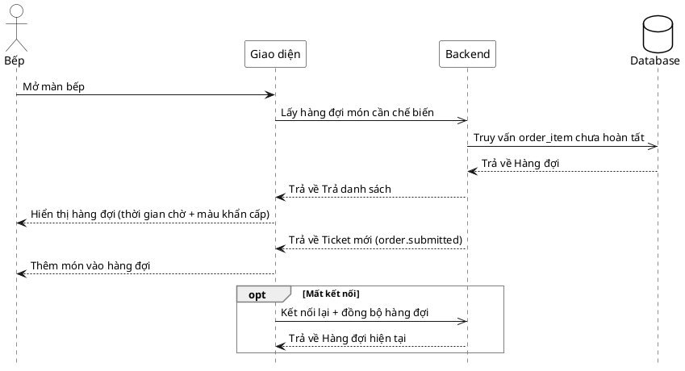

# Đặc tả Use-Case — Nhóm BẾP (KITCHEN)

> **Mô tả nhóm:** Use-case mô tả nghiệp vụ bếp: tiếp nhận đơn & xem hàng đợi realtime,
> cập nhật trạng thái món, xử lý yêu cầu hủy, xem lịch sử trạng thái món.
> **Group:** BẾP (KITCHEN)
> **Nguồn luồng:** `docs/sequence-diagrams-4cot.md` — *"UC-16 — Tiếp nhận đơn / xem hàng đợi (realtime)"*
> Route: `GET /api/v1/restaurant/kitchen/queue` (quyền `kitchen:operate`).

---

## UC-K16 — Tiếp nhận đơn / xem hàng đợi (realtime)

### 1) Use-case đặc tả tổng quan

*Hình: ĐẶC TẢ USE-CASE BẾP — HÀNG ĐỢI MÓN*
Tác nhân **Bếp** giao tiếp với use-case «Xem hàng đợi món»; use-case «include» «Lấy order_item chưa hoàn tất». Món mới (`PENDING`) từ «Đặt món»/«Gọi thêm món» đẩy ticket realtime vào hàng đợi. Dẫn sang «Cập nhật trạng thái món» (UC-K17).

### 2) Bảng use-case chi tiết

| Mục | Nội dung |
|---|---|
| **Tên Use-Case** | Tiếp nhận đơn / xem hàng đợi (realtime) |
| **Tác nhân** | Bếp (Kitchen) — phụ: Hệ thống |
| **Mô tả** | Bếp mở màn bếp xem hàng đợi các món chưa hoàn tất (kèm thời gian chờ, màu khẩn cấp). Món mới `PENDING` đẩy ticket realtime vào hàng đợi. Mất kết nối thì nối lại và đồng bộ món còn chờ. |
| **Điều kiện** | Bếp đã đăng nhập (JWT, quyền `kitchen:operate`). |

**Luồng sự kiện chính (Thành công)**

| STT | Thực hiện bởi | Mô tả hành động | Kết quả hệ thống |
|---|---|---|---|
| 1 | Bếp | Mở màn bếp. | Giao diện gọi `GET /restaurant/kitchen/queue`. |
| 2 | Hệ thống | Truy vấn `order_item` chưa hoàn tất. | Trả `tickets[]` (đơn + món + trạng thái + lịch sử). |
| 3 | Bếp | Xem hàng đợi. | Hiển thị hàng đợi (thời gian chờ + màu khẩn cấp). |
| 4 | Khách | Đặt/gọi thêm món (`order.submitted`). | Đẩy ticket realtime `/ws`; giao diện làm mới hàng đợi, thêm món mới. |

**Luồng sự kiện thay thế**

| STT | Thực hiện bởi | Mô tả hành động | Kết quả hệ thống |
|---|---|---|---|
| 4a | Giao diện | Mất kết nối realtime. | Tự nối lại; sau đó làm mới `GET /restaurant/kitchen/queue` đồng bộ món còn chờ. |

> **Ghi chú hiện trạng triển khai:** Cập nhật realtime theo cơ chế chung — hub broadcast mọi sự kiện, giao diện **invalidate + refetch** `GET /restaurant/kitchen/queue`. `tickets[].items[]` đã nhúng `status_history` (dùng lại cho UC-K19).

**Hậu điều kiện**

| | |
|---|---|
| **Thành công** | Bếp thấy hàng đợi món chưa hoàn tất, cập nhật realtime khi có món mới. Chỉ đọc. |
| **Thất bại** | Mất realtime → nối lại đồng bộ; trong lúc đứt hiển thị lần tải gần nhất. |

### 3) Sơ đồ tuần tự (Sequence)

