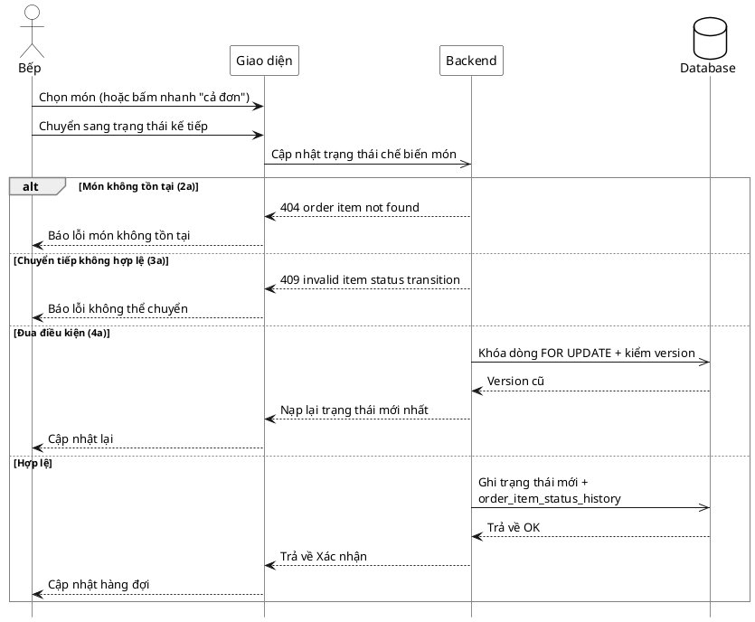

# Đặc tả Use-Case — Nhóm BẾP (KITCHEN)

> **Mô tả nhóm:** Use-case mô tả nghiệp vụ bếp: tiếp nhận đơn & xem hàng đợi realtime,
> cập nhật trạng thái món, xử lý yêu cầu hủy, xem lịch sử trạng thái món.
> **Group:** BẾP (KITCHEN)
> **Nguồn luồng:** `docs/sequence-diagrams-4cot.md` — *"UC-17 — Cập nhật trạng thái món"*
> Route: `PATCH /api/v1/restaurant/kitchen/items/:id/status` (quyền `kitchen:operate`).

---

## UC-K17 — Cập nhật trạng thái món

### 1) Use-case đặc tả tổng quan

*Hình: ĐẶC TẢ USE-CASE BẾP — CẬP NHẬT TRẠNG THÁI MÓN*
Tác nhân **Bếp** giao tiếp với use-case «Cập nhật trạng thái món»; chuyển món qua chuỗi `PENDING → ACKNOWLEDGED → PREPARING → READY`. Ghi lịch sử trạng thái và phát realtime cho Khách/Phục vụ. "Cả đơn" là bấm nhanh áp cho từng món của đơn.

### 2) Bảng use-case chi tiết

| Mục | Nội dung |
|---|---|
| **Tên Use-Case** | Cập nhật trạng thái món |
| **Tác nhân** | Bếp (Kitchen) — phụ: Hệ thống, Khách/Phục vụ (nhận realtime) |
| **Mô tả** | Bếp chọn món (hoặc bấm nhanh "cả đơn") và chuyển sang trạng thái kế tiếp. Hệ thống khóa dòng món (`FOR UPDATE`), cập nhật trạng thái, tăng `version`, ghi `order_item_status_history` và phát realtime. |
| **Điều kiện** | Bếp đã đăng nhập (JWT, quyền `kitchen:operate`). Món tồn tại trong hàng đợi. |

**Luồng sự kiện chính (Thành công)**

| STT | Thực hiện bởi | Mô tả hành động | Kết quả hệ thống |
|---|---|---|---|
| 1 | Bếp | Chọn món (hoặc "cả đơn"), chuyển trạng thái kế tiếp. | Giao diện gọi `PATCH /restaurant/kitchen/items/:id/status` (`{ status }`) cho từng món. |
| 2 | Hệ thống | Kiểm trạng thái hợp lệ + khóa dòng món (`FOR UPDATE`). | Cập nhật trạng thái, `version + 1`, ghi `order_item_status_history` (`from → to`). |
| 3 | Hệ thống | Phát realtime. | đẩy `/ws` cho Khách/Phục vụ. |
| 4 | Bếp | Nhận xác nhận. | Cập nhật hàng đợi. |

**Luồng sự kiện thay thế**

| STT | Thực hiện bởi | Mô tả hành động | Kết quả hệ thống |
|---|---|---|---|
| 1a | Hệ thống | `status` không thuộc `{PENDING, ACKNOWLEDGED, PREPARING, READY, SERVED}`. | Trả `400 "invalid item status"`. |
| 2a | Hệ thống | Món không tồn tại / `item_id` sai / đã bị xoá mềm. | Trả `404 "order item not found"`. |
| 3a | Hệ thống | Chuyển trạng thái không hợp lệ (VD: `PENDING → READY` nhảy cóc, hoặc `SERVED → PREPARING` ngược). | Trả `409 "invalid item status transition"`. |
| 4a | Hệ thống | Đua điều kiện — trạng thái vừa được thay đổi bởi thao tác khác. | Cập nhật theo bản mới nhất; giao diện nạp lại trạng thái. |
| 5a | Hệ thống | Lỗi DB / backend 5xx / timeout. | Trả lỗi; giao diện thông báo + thử lại. |

> **Ghi chú hiện trạng triển khai:** Endpoint chỉ nhận **một `item_id`**; "cả đơn" do giao diện lặp gọi cho từng món (không có route bulk theo đơn). Impl kiểm **giá trị trạng thái hợp lệ** + khóa dòng + `version` + ràng buộc `allowedTransitions` ở tầng domain; việc ép đúng thứ tự chuyển tiếp đã có kiểm tường minh trước khi UPDATE.

**Hậu điều kiện**

| | |
|---|---|
| **Thành công** | Món ở trạng thái mới; `order_item_status_history` ghi `from → to`; `version + 1`; sự kiện `ordering.item_status_updated` phát realtime. |
| **Thất bại** | Trạng thái không hợp lệ → báo lỗi, không đổi. |

### 3) Sơ đồ tuần tự (Sequence)

