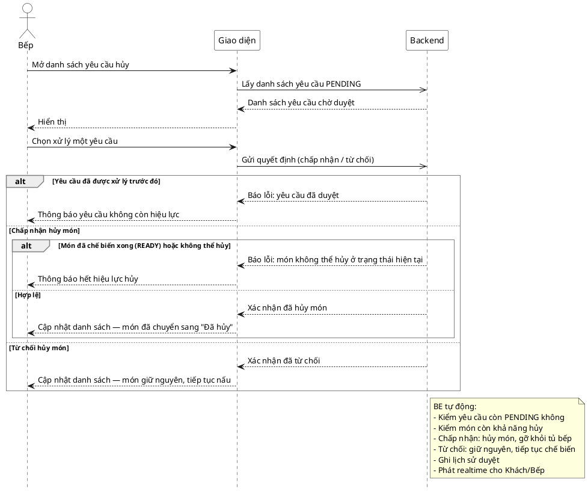

# Đặc tả Use-Case — Nhóm BẾP (KITCHEN)

> **Mô tả nhóm:** Use-case mô tả nghiệp vụ bếp: tiếp nhận đơn & xem hàng đợi realtime,
> cập nhật trạng thái món, xử lý yêu cầu hủy, xem lịch sử trạng thái món.
> **Group:** BẾP (KITCHEN)
> **Nguồn luồng:** `docs/sequence-diagrams-4cot.md` — _"UC-18 — Xác nhận / từ chối yêu cầu hủy món"_

---

## UC-K18 — Xác nhận / từ chối yêu cầu hủy món

### 1) Use-case đặc tả tổng quan

> Sơ đồ: [`uc-bep-18-xu-ly-yeu-cau-huy-mon.drawio`](./uc-bep-18-xu-ly-yeu-cau-huy-mon.drawio) — mở bằng draw.io / diagrams.net.

_Hình: ĐẶC TẢ USE-CASE BẾP — DUYỆT YÊU CẦU HỦY MÓN_
Tác nhân **Bếp** giao tiếp với use-case «Xác nhận/từ chối yêu cầu hủy món»; nhận yêu cầu hủy (do UC-G05b tạo khi món đã `PREPARING`) và quyết định chấp nhận (hủy món → `CANCELLED`) hoặc từ chối (giữ món, tiếp tục nấu). Hai nhánh chạy trong **một transaction**; kết quả phát realtime cho Khách.

### 2) Bảng use-case chi tiết

| Mục              | Nội dung                                                                                                                                                                                                                                                                                                                                                                                                                       |
| ---------------- | ------------------------------------------------------------------------------------------------------------------------------------------------------------------------------------------------------------------------------------------------------------------------------------------------------------------------------------------------------------------------------------------------------------------------------ |
| **Tên Use-Case** | Xác nhận / từ chối yêu cầu hủy món                                                                                                                                                                                                                                                                                                                                                                                             |
| **Tác nhân**     | Bếp (Kitchen) — phụ: Hệ thống, Khách (nhận realtime)                                                                                                                                                                                                                                                                                                                                                                           |
| **Mô tả**        | Bếp xem danh sách yêu cầu hủy `PENDING`; chọn chấp nhận / từ chối cho từng yêu cầu. Chấp nhận → món chuyển `CANCELLED`, ghi `order_item_status_history`, gỡ khỏi hàng đợi bếp (`kitchen_ticket_items` → `CANCELLED`), đóng `cancel_request` = `APPROVED`. Từ chối → giữ món, đóng `cancel_request` = `REJECTED`. Ghi `reviewed_by`/`reviewed_at`/`review_note`. Phát realtime `cancel_request.reviewed` cho Khách/Bếp/Phục vụ. |
| **Điều kiện**    | Bếp đã đăng nhập (JWT, quyền `kitchen:operate`). Tồn tại `cancel_request` `PENDING` cho món.                                                                                                                                                                                                                                                                                                                                   |

**Luồng sự kiện chính (Thành công — chấp nhận)**

| STT | Thực hiện bởi | Mô tả hành động                                                                                                                                    | Kết quả hệ thống                                                                                      |
| --- | ------------- | -------------------------------------------------------------------------------------------------------------------------------------------------- | ----------------------------------------------------------------------------------------------------- |
| 1   | Bếp           | Mở danh sách yêu cầu hủy.                                                                                                                          | Giao diện gọi `GET /restaurant/kitchen/cancel-requests` (chỉ `PENDING`).                              |
| 2   | Bếp           | Chọn "Chấp nhận" một yêu cầu.                                                                                                                      | Gọi `POST /restaurant/kitchen/cancel-requests/:id/review` `{action:"approve"}`.                       |
| 3   | Hệ thống      | Khóa `cancel_request` (`FOR UPDATE`), kiểm còn `PENDING`; khóa `order_item`, kiểm còn hủy được (không `READY`/`SERVED`/`CANCELLED`/`UNAVAILABLE`). | Món → `CANCELLED` + ghi lịch sử; `kitchen_ticket_items` → `CANCELLED`; `cancel_request` → `APPROVED`. |
| 4   | Hệ thống      | Phát realtime.                                                                                                                                     | (item_status `CANCELLED`); Khách thấy món đã hủy.                                                     |

**Luồng sự kiện thay thế**

| STT | Thực hiện bởi | Mô tả hành động                                                        | Kết quả hệ thống                                                                                  |
| --- | ------------- | ---------------------------------------------------------------------- | ------------------------------------------------------------------------------------------------- |
| 2a  | Bếp           | Chọn "Từ chối" (`action:"reject"`).                                    | `cancel_request` → `REJECTED`; món giữ nguyên; phát `cancel_request.reviewed` (item_status rỗng). |
| 3a  | Hệ thống      | Món đã `READY`/`SERVED`/`CANCELLED`/`UNAVAILABLE` khi duyệt chấp nhận. | Từ chối `409 "item can no longer be cancelled: <status>"`; yêu cầu giữ `PENDING`.                 |
| 3b  | Hệ thống      | `cancel_request` đã được duyệt trước đó.                               | Từ chối `409 "cancel request already reviewed"` (idempotent-guard).                               |
| 3c  | Hệ thống      | `action` ngoài {approve, reject}.                                      | Từ chối `400 "action must be approve or reject"`.                                                 |

**Hậu điều kiện**

|                |                                                                                                                                                 |
| -------------- | ----------------------------------------------------------------------------------------------------------------------------------------------- |
| **Thành công** | `cancel_request` giải quyết (approve → món `CANCELLED` / reject → giữ món); lịch sử ghi lại; `cancel_request.reviewed` phát realtime báo Khách. |
| **Thất bại**   | Món hết hiệu lực hủy (đã READY/SERVED) hoặc yêu cầu đã duyệt → `409`, không đổi dữ liệu.                                                        |

**Ghi chú hiện trạng triển khai**

- ✅ **Đã triển khai** (bổ sung sau bản nguồn luồng). Route thật: `GET /restaurant/kitchen/cancel-requests`, `POST /restaurant/kitchen/cancel-requests/:id/review` (`ordering/interfaces/http/kitchen_handler.go`, quyền `PermissionKitchenOperate`).
- Use-case: `KitchenListCancelRequests` (đọc) + `KitchenReviewCancelRequest` (realtime) — `ordering/application/kitchen_review_cancel.go`.
- Repo: `ListPendingCancelRequests` + `ReviewCancelRequest` — khóa lạc quan `version+1`, transaction gộp cập nhật `cancel_requests` + `order_items` + `kitchen_ticket_items`.
- Sự kiện: `cancel_request.reviewed` (một loại cho cả approve/reject; trường `status` = `APPROVED`/`REJECTED`, `item_status` = `CANCELLED`/rỗng). Hub broadcast-all → frontend invalidate query.
- Phía Khách tạo yêu cầu (UC-G05b): `POST /customer/orders/:orderId/cancel-requests` → `cancel_request` `PENDING` + `cancel_request.created` (đã có từ trước).
- **Còn thiếu (frontend):** panel KDS liệt kê yêu cầu hủy + nút Chấp nhận/Từ chối chưa gắn (API client đã có: `fetchPendingCancelRequests` / `reviewCancelRequest` trong `features/kitchen/api.ts`).

### 3) Sơ đồ tuần tự (Sequence)

@startuml
hide footbox
skinparam participant {
BackgroundColor White
BorderColor Black
}
skinparam actor {
BackgroundColor White
BorderColor Black
}
skinparam sequenceGroupBorderThickness 1
skinparam sequenceGroupBorderColor Gray
actor "Bếp" as A
participant "Giao diện" as UI
participant "Hệ thống" as SYS

A ->> UI : Mở danh sách yêu cầu hủy
UI -> SYS : Lấy danh sách yêu cầu PENDING
SYS -->> UI : Danh sách yêu cầu chờ duyệt
UI -->> A : Hiển thị

A ->> UI : Chọn xử lý một yêu cầu
UI -> SYS : Gửi quyết định (chấp nhận / từ chối)

alt Yêu cầu đã được xử lý trước đó
SYS -->> UI : Báo lỗi: yêu cầu đã duyệt
UI --> A : Thông báo yêu cầu không còn hiệu lực
else Chấp nhận hủy món
alt Món đã chế biến xong (READY) hoặc không thể hủy
SYS -->> UI : Báo lỗi: món không thể hủy ở trạng thái hiện tại
UI -->> A : Thông báo hết hiệu lực hủy
else Hợp lệ
SYS -->> UI : Xác nhận đã hủy món
UI -->> A : Cập nhật danh sách và món đã chuyển sang "Đã hủy"
end
else Từ chối hủy món
SYS -->> UI : Xác nhận đã từ chối
UI -->> A : Cập nhật danh sách và món giữ nguyên, tiếp tục nấu
end

@enduml
