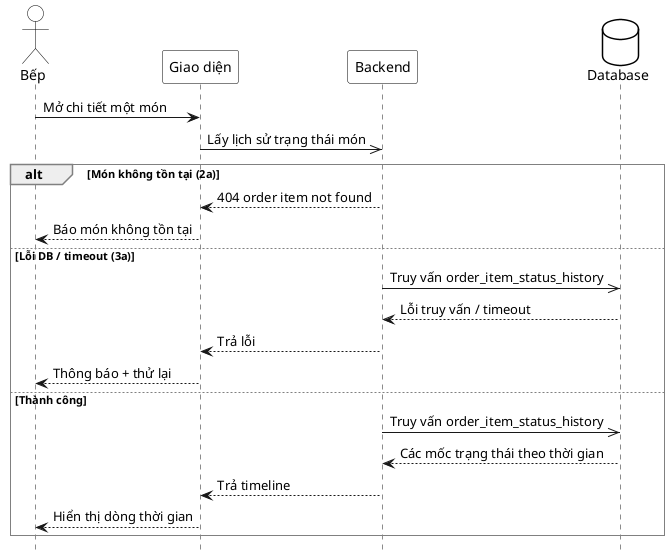

# Đặc tả Use-Case — Nhóm BẾP (KITCHEN)

> **Mô tả nhóm:** Use-case mô tả nghiệp vụ bếp: tiếp nhận đơn & xem hàng đợi realtime,
> cập nhật trạng thái món, xử lý yêu cầu hủy, xem lịch sử trạng thái món.
> **Group:** BẾP (KITCHEN)
> **Nguồn luồng:** `docs/sequence-diagrams-4cot.md` — *"UC-19 — Xem lịch sử trạng thái món"*
> Dữ liệu: `order_item_status_history` — nhúng trong payload hàng đợi/lưới bàn.

---

## UC-K19 — Xem lịch sử trạng thái món

### 1) Use-case đặc tả tổng quan

> Sơ đồ: [`uc-bep-19-lich-su-trang-thai-mon.drawio`](./uc-bep-19-lich-su-trang-thai-mon.drawio) — mở bằng draw.io / diagrams.net.

*Hình: ĐẶC TẢ USE-CASE BẾP — LỊCH SỬ TRẠNG THÁI MÓN*
Tác nhân **Bếp** giao tiếp với use-case «Xem lịch sử trạng thái món»; use-case «include» «Lấy `order_item_status_history`». Hiển thị dòng thời gian các mốc trạng thái của một món (ai đổi, khi nào). Là bước drill-down từ hàng đợi (UC-K16).

### 2) Bảng use-case chi tiết

| Mục | Nội dung |
|---|---|
| **Tên Use-Case** | Xem lịch sử trạng thái món |
| **Tác nhân** | Bếp (Kitchen) — phụ: Hệ thống |
| **Mô tả** | Bếp mở chi tiết một món để xem timeline các mốc trạng thái (`from → to`, thời gian, người đổi). Dữ liệu lấy từ `order_item_status_history` đã nhúng trong payload hàng đợi. |
| **Điều kiện** | Bếp đã đăng nhập (JWT, quyền `kitchen:operate`). Món có lịch sử trạng thái. |

**Luồng sự kiện chính (Thành công)**

| STT | Thực hiện bởi | Mô tả hành động | Kết quả hệ thống |
|---|---|---|---|
| 1 | Bếp | Mở chi tiết một món. | Giao diện đọc `status_history` của món từ payload `GET /restaurant/kitchen/queue`. |
| 2 | Hệ thống | Truy vấn `order_item_status_history` (đã gộp trong hàng đợi). | Trả các mốc trạng thái theo thời gian. |
| 3 | Bếp | Xem timeline. | Hiển thị dòng thời gian trạng thái. |

**Luồng sự kiện thay thế**

| STT | Thực hiện bởi | Mô tả hành động | Kết quả hệ thống |
|---|---|---|---|
| 1a | Hệ thống | Món chưa có mốc lịch sử (mới `PENDING`). | Hiển thị timeline chỉ có mốc tạo. |
| 2a | Hệ thống | Món không tồn tại / `item_id` sai / đã xoá mềm. | Trả `404 "order item not found"`. |
| 3a | Hệ thống | Lỗi DB / backend 5xx / timeout khi load hàng đợi. | Trả lỗi; giao diện thông báo + thử lại. |

> **Ghi chú hiện trạng triển khai:** Không có endpoint "lịch sử món" riêng. `order_item_status_history` được nhúng sẵn dưới `items[].status_history` trong payload `GET /restaurant/kitchen/queue` (và `GET /restaurant/tables`); giao diện hiển thị timeline từ dữ liệu này (client-side). Vì là drill-down client-side, lỗi chủ yếu xảy ra ở bước tải hàng đợi (UC-K16), không phải lúc xem lịch sử.

**Hậu điều kiện**

| | |
|---|---|
| **Thành công** | Bếp xem được timeline trạng thái của món. Chỉ đọc. |
| **Thất bại** | Không có (chỉ đọc từ dữ liệu đã tải). |

### 3) Sơ đồ tuần tự (Sequence)

