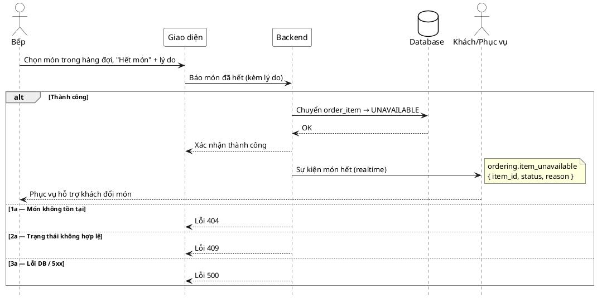

# Đặc tả Use-Case — Nhóm BẾP (KITCHEN)

> **Group:** BẾP (KITCHEN) — dùng chung với Phục vụ
> **Nguồn:** Bổ sung từ hệ thống đã triển khai (không có trong danh sách UC-01…31 gốc).
> Route: `POST /api/v1/restaurant/kitchen/items/:id/unavailable` (quyền `kitchen:operate`) — route Bếp chính.
> Có route tương đương cho nhóm staff ordering: `POST /api/v1/restaurant/order-items/:itemId/unavailable`. Cả hai dùng chung use-case `StaffMarkUnavailable`.

---

## UC-K39 — Bếp báo hết món (order-item không làm được)

### 1) Use-case đặc tả tổng quan

*Hình: ĐẶC TẢ USE-CASE BẾP — BÁO HẾT MÓN*
Tác nhân **Bếp** giao tiếp với use-case «Báo hết món»; đánh dấu một `order_item` đã gọi là `UNAVAILABLE` khi hết nguyên liệu giữa ca, và phát realtime để khách/Phục vụ biết. Khác «Bật/tắt còn-hết» của Quản lý (UC-27) — cái này tác động lên **một dòng món đã gọi trong đơn**, không phải trạng thái toàn menu.

### 2) Bảng use-case chi tiết

| Mục | Nội dung |
|---|---|
| **Tên Use-Case** | Bếp báo hết món (order-item) |
| **Tác nhân** | Bếp (Kitchen) — phụ: Hệ thống, Khách/Phục vụ (nhận realtime) |
| **Mô tả** | Bếp đánh dấu một món đã gọi không làm được (hết nguyên liệu) kèm lý do. Hệ thống chuyển `order_item` sang `UNAVAILABLE` và phát realtime để màn khách/Phục vụ cập nhật (báo khách chọn món khác). |
| **Điều kiện** | Bếp đã đăng nhập (JWT, quyền staff/bếp). `order_item` tồn tại và chưa phục vụ xong. |

**Luồng sự kiện chính (Thành công)**

| STT | Thực hiện bởi | Mô tả hành động | Kết quả hệ thống |
|---|---|---|---|
| 1 | Bếp | Chọn món trong hàng đợi, bấm "Hết món" + nhập lý do. | Giao diện gọi `POST /restaurant/kitchen/items/:id/unavailable` (`{ reason }`). |
| 2 | Hệ thống | Chuyển `order_item` sang `UNAVAILABLE`. | Cập nhật trạng thái; phát `ordering.item_unavailable` (`{ item_id, status: UNAVAILABLE, reason }`). |
| 3 | Khách/Phục vụ | Nhận realtime. | Màn khách cập nhật món hết; Phục vụ hỗ trợ khách đổi món. |

**Luồng sự kiện thay thế**

| STT | Thực hiện bởi | Mô tả hành động | Kết quả hệ thống |
|---|---|---|---|
| 1a | Hệ thống | `itemId` không hợp lệ / món không tồn tại. | Trả lỗi `400/404`; không đổi trạng thái. |
| 2a | Hệ thống | Món ở trạng thái không hợp lệ (chỉ cho phép `PENDING`/`ACKNOWLEDGED`). | Trả lỗi `409 Conflict`; không đổi trạng thái. |
| 3a | Hệ thống | Lỗi DB / 5xx / timeout. | Trả lỗi `500`; trạng thái giữ nguyên. |

**Hậu điều kiện**

| | |
|---|---|
| **Thành công** | `order_item` ở `UNAVAILABLE`; sự kiện `ordering.item_unavailable` phát realtime; khách/Phục vụ biết để đổi món. |
| **Thất bại** | Lỗi `404` (không tìm thấy), `409` (trạng thái không hợp lệ) hoặc `500` (lỗi hệ thống); trạng thái giữ nguyên. |

### 3) Sơ đồ tuần tự (Sequence)

