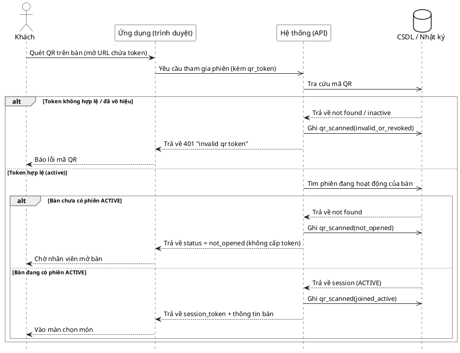

# Đặc tả Use-Case — Nhóm KHÁCH (GUEST)

> **Mô tả nhóm:** Use-case mô tả các nghiệp vụ khách hàng thực hiện khi gọi món tại
> bàn qua mã QR: vào phiên, đặt món, theo dõi món, gọi nhân viên, yêu cầu tính tiền.
> **Group:** KHÁCH (GUEST)
> **Nguồn luồng:** `docs/diagrams/luong-chuc-nang-chinh.drawio` — trang *"1. Quet QR vao phien"*

---

## UC-G01 — Quét QR vào phiên

### 1) Use-case đặc tả tổng quan

*Hình: ĐẶC TẢ USE-CASE KHÁCH — QUÉT QR VÀO PHIÊN*
Tác nhân **Khách** giao tiếp với use-case «Quét QR vào phiên»; use-case «include» thao tác «Kiểm tra mã QR» và «Ghi nhật ký quét QR». Trường hợp bàn chưa mở phiên «extend» sang use-case «Mở phiên cho khách» (tác nhân Phục vụ).

### 2) Bảng use-case chi tiết

| Mục | Nội dung |
|---|---|
| **Tên Use-Case** | Quét QR vào phiên |
| **Tác nhân** | Khách (Guest) — phụ: Hệ thống, Phục vụ (nhánh mở bàn) |
| **Mô tả** | Khách quét mã QR dán trên bàn để tham gia phiên ăn đang mở của bàn. Hệ thống kiểm tra token trong mã QR, nếu bàn đang có phiên ACTIVE thì cấp session token và đưa khách vào màn chọn món; nếu chưa có phiên, khách chờ nhân viên mở bàn. Mỗi lần quét đều được ghi nhật ký (audit). |
| **Điều kiện** | Bàn đã được dán mã QR còn hiệu lực (QR active). Khách truy cập được URL trong mã QR. |

**Luồng sự kiện chính (Thành công — vào phiên đang mở)**

| STT | Thực hiện bởi | Mô tả hành động | Kết quả hệ thống |
|---|---|---|---|
| 1 | Khách | Quét mã QR trên bàn, mở URL gọi món (chứa token). | Hiển thị màn tham gia phiên. |
| 2 | Khách | Gửi yêu cầu tham gia phiên (`POST /customer/sessions/join` kèm `qr_token`). | Hệ thống tra cứu token (`FindQRByToken`) và kiểm tra token còn hiệu lực. |
| 3 | Hệ thống | Token hợp lệ → tìm phiên đang mở của bàn (`FindActiveSessionByTable`). | Bàn đang có phiên ACTIVE → cấp `session_token`, trả thông tin bàn; ghi sự kiện `qr_scanned(joined_active)`. |
| 4 | Khách | Vào màn hình chọn món. | Hiển thị thực đơn; khách sẵn sàng đặt món (chuyển UC-G02). |

**Luồng sự kiện thay thế**

| STT | Thực hiện bởi | Mô tả hành động | Kết quả hệ thống |
|---|---|---|---|
| 2a | Hệ thống | Token không tồn tại hoặc đã bị vô hiệu (rotate/revoke). | Trả lỗi `401 "invalid qr token"`; ghi sự kiện `qr_scanned(invalid_or_revoked)`; hiển thị "Báo lỗi mã QR". |
| 3a | Hệ thống | Token hợp lệ nhưng bàn **chưa có** phiên ACTIVE. | Trả `status = not_opened`, **không cấp** session token; ghi `qr_scanned(not_opened)`; khách được yêu cầu chờ nhân viên mở bàn → **extend** UC «Mở phiên cho khách» (Phục vụ). |
| 3b | Hệ thống | Bàn đang ở trạng thái AWAITING_PAYMENT (đã yêu cầu tính tiền). | Trả trạng thái phiên `awaiting_payment`; khách không đặt thêm món (phiên đã khóa order). |

**Hậu điều kiện**

| | |
|---|---|
| **Thành công** | Khách nhận `session_token`, vào phiên ăn của bàn và thấy màn chọn món. Sự kiện `dining.qr_scanned(joined_active)` được ghi vào nhật ký. Dữ liệu phiên không bị thay đổi (chỉ đọc + cập nhật tên khách nếu có). |
| **Thất bại** | Không cấp session token. Token lỗi → hiển thị lỗi mã QR; bàn chưa mở phiên → trạng thái `not_opened`, chờ nhân viên. Không phát sinh thay đổi trạng thái phiên ngoài ý muốn. Mọi lần quét vẫn được ghi audit. |

### 3) Sơ đồ tuần tự (Sequence)

