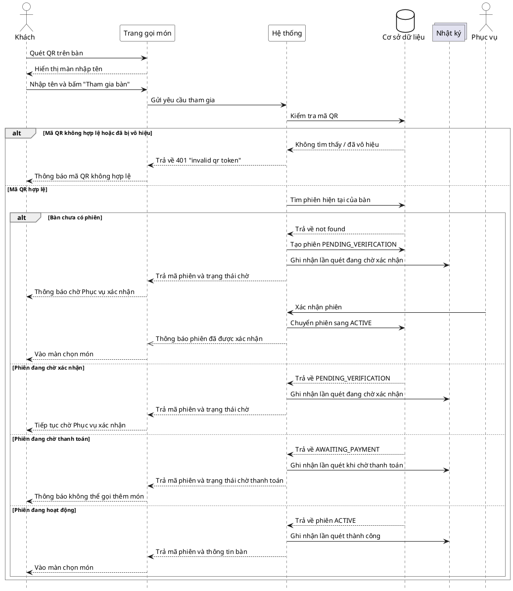

# Đặc tả Use-Case — Nhóm KHÁCH (GUEST)

> **Mô tả nhóm:** Use-case mô tả các nghiệp vụ khách hàng thực hiện khi gọi món tại
> bàn qua mã QR: vào phiên, đặt món, theo dõi món, gọi nhân viên, yêu cầu tính tiền.
> **Group:** KHÁCH (GUEST)
> **Nguồn luồng:** `docs/diagrams/luong-chuc-nang-chinh.drawio` — trang *"1. Quet QR vao phien"*

---

## UC-G01 — Quét QR vào phiên

### 1) Use-case đặc tả tổng quan

> Sơ đồ: [`uc-khach-01-quet-qr-vao-phien.drawio`](./uc-khach-01-quet-qr-vao-phien.drawio) — mở bằng draw.io / diagrams.net.

*Hình: ĐẶC TẢ USE-CASE KHÁCH — QUÉT QR VÀO PHIÊN*
Tác nhân **Khách** giao tiếp với use-case «Quét QR vào phiên»; hệ thống kiểm tra mã QR
và tình trạng phiên của bàn. Nếu bàn chưa có phiên, hệ thống tạo một phiên chờ xác
nhận; **Phục vụ** xác nhận trước khi khách được gọi món.

### 2) Bảng use-case chi tiết

| Mục | Nội dung |
|---|---|
| **Tên Use-Case** | Quét QR vào phiên |
| **Tác nhân** | Khách (Guest) — phụ: Hệ thống, Phục vụ (xác nhận phiên mới) |
| **Mô tả** | Khách quét mã QR dán trên bàn, nhập tên và gửi yêu cầu tham gia. Nếu bàn đang có phiên `ACTIVE`, hệ thống đưa khách vào màn chọn món. Nếu chưa có phiên, hệ thống tạo phiên `PENDING_VERIFICATION` và yêu cầu khách chờ Phục vụ xác nhận. |
| **Điều kiện** | Bàn đã được dán mã QR còn hiệu lực (QR active). Khách truy cập được URL trong mã QR. |

**Luồng sự kiện chính (Thành công — vào phiên đang mở)**

| STT | Thực hiện bởi | Mô tả hành động | Kết quả hệ thống |
|---|---|---|---|
| 1 | Khách | Quét mã QR trên bàn và mở trang gọi món. | Hiển thị màn nhập tên để tham gia bàn. |
| 2 | Khách | Nhập tên, bấm **Tham gia bàn**. | Gửi yêu cầu tham gia kèm mã QR và tên khách. |
| 3 | Hệ thống | Kiểm tra mã QR và tìm phiên hiện tại của bàn. | Mã hợp lệ, bàn đang có phiên `ACTIVE` → trả mã phiên và thông tin bàn; ghi nhận lần quét thành công. |
| 4 | Khách | Nhận kết quả tham gia. | Vào màn hình chọn món và chuyển sang UC-G02. |

**Luồng sự kiện thay thế**

| STT | Thực hiện bởi | Mô tả hành động | Kết quả hệ thống |
|---|---|---|---|
| 3a | Hệ thống | Mã QR không tồn tại hoặc đã bị vô hiệu. | Trả lỗi `401 "invalid qr token"`; khách được thông báo mã QR không hợp lệ. |
| 3b | Hệ thống | Mã QR hợp lệ nhưng bàn chưa có phiên. | Tạo phiên `PENDING_VERIFICATION`, cấp mã phiên và yêu cầu khách chờ Phục vụ xác nhận. Sau khi được xác nhận, phiên chuyển sang `ACTIVE` và khách vào màn chọn món. |
| 3c | Hệ thống | Bàn đã có phiên `PENDING_VERIFICATION`. | Trả lại thông tin phiên đang chờ; khách tiếp tục chờ Phục vụ xác nhận. |
| 3d | Hệ thống | Bàn đang ở trạng thái `AWAITING_PAYMENT`. | Trả trạng thái chờ thanh toán; thông báo khách không thể gọi thêm món. |

**Hậu điều kiện**

| | |
|---|---|
| **Thành công** | Khách nhận mã phiên, tham gia phiên `ACTIVE` và thấy màn chọn món. Lần quét thành công được ghi nhận. |
| **Chờ xác nhận** | Khách nhận mã phiên `PENDING_VERIFICATION` nhưng chưa được gọi món. Sau khi Phục vụ xác nhận, khách được chuyển vào màn chọn món. |
| **Thất bại** | Mã QR không hợp lệ → không cấp mã phiên và hiển thị thông báo lỗi. Phiên `AWAITING_PAYMENT` → không cho gọi thêm món. |

### 3) Sơ đồ tuần tự (Sequence)

