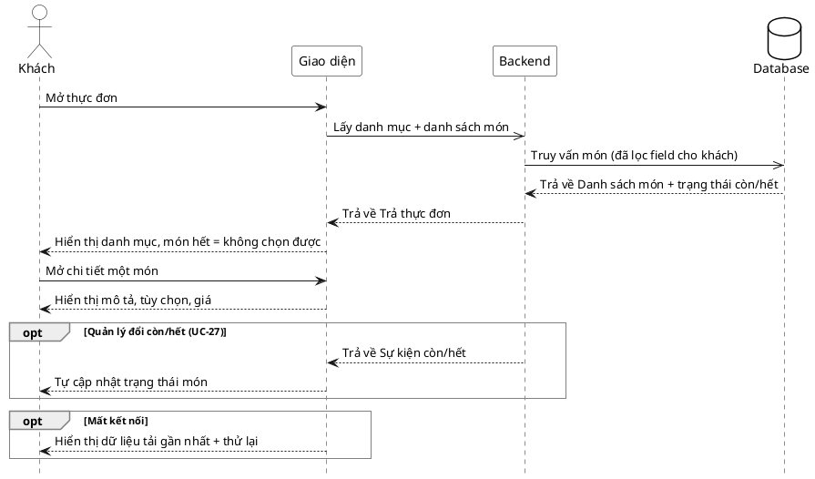

# Đặc tả Use-Case — Nhóm KHÁCH (GUEST)

> **Mô tả nhóm:** Use-case mô tả các nghiệp vụ khách hàng thực hiện khi gọi món tại
> bàn qua mã QR: vào phiên, đặt món, theo dõi món, gọi nhân viên, yêu cầu tính tiền.
> **Group:** KHÁCH (GUEST)
> **Nguồn luồng:** `docs/sequence-diagrams-4cot.md` — *"UC-02 — Xem thực đơn"*

---

## UC-G02 — Xem thực đơn

### 1) Use-case đặc tả tổng quan

> Sơ đồ: [`uc-khach-02-xem-thuc-don.drawio`](./uc-khach-02-xem-thuc-don.drawio) — mở bằng draw.io / diagrams.net.

*Hình: ĐẶC TẢ USE-CASE KHÁCH — XEM THỰC ĐƠN*
Tác nhân **Khách** giao tiếp với use-case «Xem thực đơn»; use-case «include» thao tác «Lấy danh mục & danh sách món» và «Xem chi tiết món». Trường hợp Quản lý đổi trạng thái còn/hết «extend» sang use-case «Cập nhật trạng thái món» (đẩy realtime, UC-G/Quản lý). Xem thực đơn là bước tiếp nối sau «Quét QR vào phiên» (UC-G01).

### 2) Bảng use-case chi tiết

| Mục | Nội dung |
|---|---|
| **Tên Use-Case** | Xem thực đơn |
| **Tác nhân** | Khách (Guest) — phụ: Hệ thống, Quản lý (nhánh đổi còn/hết) |
| **Mô tả** | Khách mở thực đơn để duyệt danh mục và các món. Hệ thống trả về danh sách món đã lọc field phù hợp cho khách kèm trạng thái còn/hết; món hết không chọn được. Khách mở chi tiết một món để xem mô tả, tùy chọn và giá. Trạng thái còn/hết được cập nhật realtime khi Quản lý thay đổi. |
| **Điều kiện** | Khách đã vào được phiên hoặc màn duyệt menu công khai (route menu là public, không bắt buộc session token để duyệt). Thực đơn đã được cấu hình (có danh mục và món). |

**Luồng sự kiện chính (Thành công — duyệt thực đơn)**

| STT | Thực hiện bởi | Mô tả hành động | Kết quả hệ thống |
|---|---|---|---|
| 1 | Khách | Mở thực đơn. | Giao diện gọi `GET /customer/menu/categories` và `GET /customer/menu/items`. |
| 2 | Hệ thống | Truy vấn danh mục và món (đã lọc field cho khách). | Trả danh sách món kèm trạng thái còn/hết. |
| 3 | Khách | Xem danh mục; món hết hiển thị nhưng không chọn được. | Hiển thị lưới danh mục + món; món hết bị vô hiệu hóa. |
| 4 | Khách | Mở chi tiết một món (`GET /customer/menu/items/:id`). | Hiển thị mô tả, tùy chọn và giá của món; khách sẵn sàng đặt món (chuyển UC-G03). |

**Luồng sự kiện thay thế**

| STT | Thực hiện bởi | Mô tả hành động | Kết quả hệ thống |
|---|---|---|---|
| 2a | Hệ thống | `category_id` hoặc `id` món không hợp lệ (không phải UUID / không tồn tại). | Trả lỗi `400/404`; giao diện báo không tìm thấy món, giữ nguyên danh sách hiện có. |
| 4a | Hệ thống | Quản lý đổi trạng thái còn/hết (UC-27). | Đẩy realtime sự kiện còn/hết; giao diện tự cập nhật trạng thái món không cần tải lại. |
| 4b | Giao diện | Mất kết nối mạng. | Hiển thị dữ liệu đã tải gần nhất kèm nút thử lại; không mất ngữ cảnh duyệt. |

**Hậu điều kiện**

| | |
|---|---|
| **Thành công** | Khách xem được danh mục, danh sách món kèm trạng thái còn/hết và chi tiết món (mô tả, tùy chọn, giá). Không phát sinh thay đổi dữ liệu (chỉ đọc). |
| **Thất bại** | Không tải được thực đơn (lỗi mạng/truy vấn) → hiển thị dữ liệu gần nhất + thử lại, hoặc báo không tìm thấy món với id lỗi. Không ảnh hưởng phiên. |

### 3) Sơ đồ tuần tự (Sequence)

