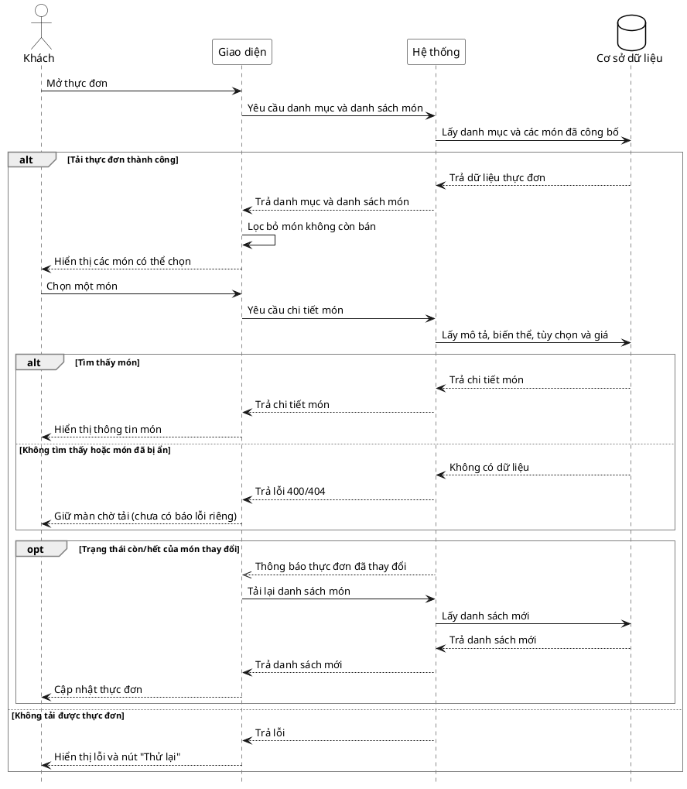

# Đặc tả Use-Case — Nhóm KHÁCH (GUEST)

> **Mô tả nhóm:** Use-case mô tả các nghiệp vụ khách hàng thực hiện khi gọi món tại
> bàn qua mã QR: vào phiên, đặt món, theo dõi món, gọi nhân viên, yêu cầu tính tiền.
> **Group:** KHÁCH (GUEST)
> **Nguồn luồng:** `docs/sequence-diagrams-4cot.md` — *"UC-02 — Xem thực đơn"*

---

## UC-G02 — Xem thực đơn

### 1) Use-case đặc tả tổng quan

> Sơ đồ: [`uc-khach-02-xem-thuc-don.drawio`](./uc-khach-02-xem-thuc-don.drawio) — mở bằng draw.io / diagrams.net.

*Hình: ĐẶC TẢ USE-CASE KHÁCH — XEM THỰC ĐƠN*
Tác nhân **Khách** mở thực đơn sau khi tham gia phiên ở UC-G01. Hệ thống tải danh
mục và danh sách món còn bán. Khi khách chọn một món, hệ thống lấy thêm mô tả, giá,
biến thể và tùy chọn của món đó. Khi trạng thái còn/hết của món thay đổi, danh sách
món của khách được tải lại.

### 2) Bảng use-case chi tiết

| Mục | Nội dung |
|---|---|
| **Tên Use-Case** | Xem thực đơn |
| **Tác nhân** | Khách (Guest) — phụ: Hệ thống |
| **Mô tả** | Khách mở thực đơn để xem danh mục và các món còn bán. Khách có thể lọc theo danh mục, tìm theo tên và mở chi tiết món để xem mô tả, biến thể, tùy chọn và giá. Khi trạng thái còn/hết thay đổi, giao diện tải lại danh sách món. |
| **Điều kiện** | Trên giao diện hiện tại, khách đã tham gia phiên và có mã phiên. Thực đơn đã được cấu hình. |

**Luồng sự kiện chính (Thành công — duyệt thực đơn)**

| STT | Thực hiện bởi | Mô tả hành động | Kết quả hệ thống |
|---|---|---|---|
| 1 | Khách | Mở thực đơn. | Giao diện lấy danh mục và danh sách món. |
| 2 | Hệ thống | Truy vấn danh mục và các món đã công bố, không bị ẩn. | Trả dữ liệu cần thiết để hiển thị thực đơn. |
| 3 | Giao diện | Lọc bỏ món không còn bán; lọc danh mục và tìm kiếm ngay trên dữ liệu đã tải. | Hiển thị danh mục và các món khách có thể chọn. |
| 4 | Khách | Chọn một món. | Giao diện yêu cầu thông tin chi tiết của món. |
| 5 | Hệ thống | Lấy mô tả, hình ảnh, biến thể, tùy chọn và giá của món. | Trả chi tiết món để giao diện hiển thị; khách có thể chuyển sang UC-G03. |

**Luồng sự kiện thay thế**

| STT | Thực hiện bởi | Mô tả hành động | Kết quả hệ thống |
|---|---|---|---|
| 2a | Giao diện | Không tải được danh sách món. | Hiển thị thông báo lỗi và nút **Thử lại**. |
| 5a | Hệ thống | Món không tồn tại, đã bị ẩn hoặc đường dẫn món không hợp lệ. | Trả lỗi `400/404`. Giao diện chi tiết hiện chưa có thông báo lỗi riêng và vẫn giữ màn chờ tải. |
| 5b | Hệ thống | Trạng thái còn/hết của món thay đổi. | Gửi thông báo thay đổi; giao diện tải lại danh sách và món không còn bán sẽ biến mất. |

**Hậu điều kiện**

| | |
|---|---|
| **Thành công** | Khách xem được danh mục, danh sách món còn bán và chi tiết món gồm mô tả, biến thể, tùy chọn và giá. Việc xem không làm thay đổi dữ liệu. |
| **Thất bại** | Không tải được danh sách → hiển thị lỗi và nút thử lại. Không tải được chi tiết → hiện vẫn giữ màn chờ tải; không ảnh hưởng đến phiên của khách. |

> **Ghi chú hiện trạng:** Các đường dẫn lấy thực đơn ở phía máy chủ có thể gọi không
> cần mã phiên, nhưng màn thực đơn hiện tại chỉ bắt đầu tải dữ liệu sau khi khách đã
> tham gia phiên. Khi nhận thông báo món thay đổi, giao diện tải lại danh sách thay vì
> sửa trực tiếp món đang hiển thị.

### 3) Sơ đồ tuần tự (Sequence)

