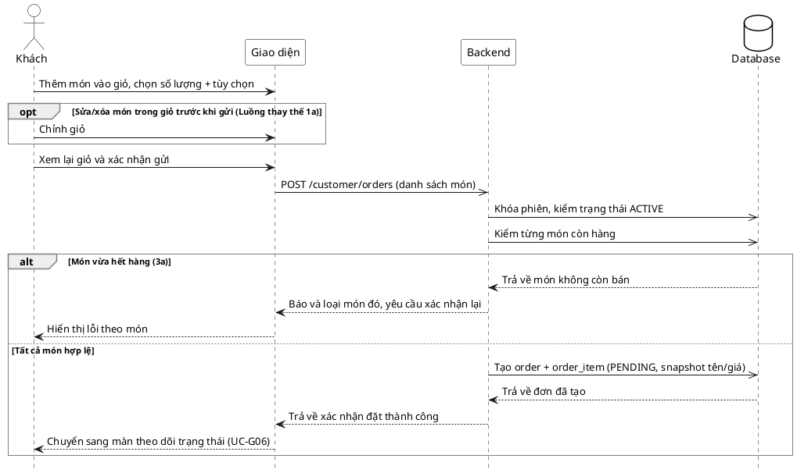

# Đặc tả Use-Case — Nhóm KHÁCH (GUEST)

> **Mô tả nhóm:** Use-case mô tả các nghiệp vụ khách hàng thực hiện khi gọi món tại
> bàn qua mã QR: vào phiên, đặt món, theo dõi món, gọi nhân viên, yêu cầu tính tiền.
> **Group:** KHÁCH (GUEST)
> **Nguồn luồng:** `docs/sequence-diagrams-4cot.md` — *"UC-03 — Đặt món"*

---

## UC-G03 — Đặt món

### 1) Use-case đặc tả tổng quan

*Hình: ĐẶC TẢ USE-CASE KHÁCH — ĐẶT MÓN*
Tác nhân **Khách** giao tiếp với use-case «Đặt món»; use-case «include» thao tác «Kiểm phiên ACTIVE» và «Kiểm món còn hàng». Việc «Đẩy ticket cho Bếp» phát sinh sau khi tạo đơn thành công (realtime). Đặt món tiếp nối sau «Xem thực đơn» (UC-G02) và dẫn sang «Theo dõi trạng thái món» (UC-G06).

### 2) Bảng use-case chi tiết

| Mục | Nội dung |
|---|---|
| **Tên Use-Case** | Đặt món |
| **Mã Use-Case** | UC-03 |
| **Tác nhân chính** | Khách (Guest) — phụ: Hệ thống, Bếp (nhận ticket) |
| **Mô tả** | Khách chọn món vào giỏ, tùy chỉnh tùy chọn và gửi đơn đầu tiên tới bếp. |
| **Tiền điều kiện** | Khách đã vào phiên và đang xem thực đơn; món còn hàng. Phiên ở trạng thái ACTIVE (chưa `AWAITING_PAYMENT`). |

**Luồng sự kiện chính (Thành công — gửi đơn hợp lệ)**

| STT | Thực hiện bởi | Mô tả hành động | Kết quả hệ thống |
|---|---|---|---|
| 1 | Khách | Thêm món vào giỏ, chọn số lượng và tùy chọn. | Giao diện cập nhật giỏ cục bộ (chưa gửi). |
| 2 | Khách | Xem lại giỏ và xác nhận gửi (`POST /customer/orders` kèm danh sách món). | Hệ thống khóa phiên, kiểm trạng thái ACTIVE và kiểm từng món còn hàng. |
| 3 | Hệ thống | Tất cả món hợp lệ. | Tạo `order` + `order_item` (PENDING, snapshot tên/giá tại thời điểm gọi). |
| 4 | Hệ thống | Đẩy ticket realtime cho Bếp. | Bếp nhận ticket món mới. |
| 5 | Khách | Nhận xác nhận đặt thành công. | Chuyển sang màn theo dõi trạng thái món (UC-G06). |

**Luồng thay thế**

| STT | Thực hiện bởi | Mô tả hành động | Kết quả hệ thống |
|---|---|---|---|
| 1a | Khách | Sửa hoặc xóa món trong giỏ trước khi gửi. | Giao diện cập nhật giỏ; không gọi backend. |

**Luồng ngoại lệ**

| STT | Thực hiện bởi | Mô tả hành động | Kết quả hệ thống |
|---|---|---|---|
| 3a | Hệ thống | Một món vừa chuyển sang hết hàng khi kiểm. | Báo và loại món đó khỏi đơn; yêu cầu khách xác nhận lại; không tạo đơn. |
| 4a | Hệ thống | Đẩy realtime thất bại tạm thời. | Hệ thống tự retry; ticket vẫn tới bếp khi khôi phục. |

**Hậu điều kiện**

| | |
|---|---|
| **Thành công** | Một đơn (order) được tạo với các món ở trạng thái PENDING; bếp nhận ticket realtime; tên/giá món được snapshot — menu đổi giá sau này **không** ảnh hưởng đơn đã tạo. |
| **Thất bại** | Không tạo đơn: phiên đã khóa order, hoặc có món hết hàng → báo lỗi theo món, giỏ được giữ để khách sửa. Không phát sinh order_item mồ côi. |

**Quy tắc nghiệp vụ**

| | |
|---|---|
| Snapshot giá & tên | Tên và giá món được lưu snapshot trong `order_item` tại thời điểm gọi đơn, không thay đổi khi thực đơn đổi giá sau đó. |
| Món hết hàng | Món không còn hàng sẽ bị loại khỏi đơn và yêu cầu xác nhận lại; đơn chỉ được tạo khi tất cả món đều còn hàng. |
| Phiên ACTIVE | Chỉ phiên ở trạng thái `ACTIVE` mới được phép đặt món; phiên `AWAITING_PAYMENT` / `CLOSED` bị từ chối. |

### 3) Sơ đồ tuần tự (Sequence)

