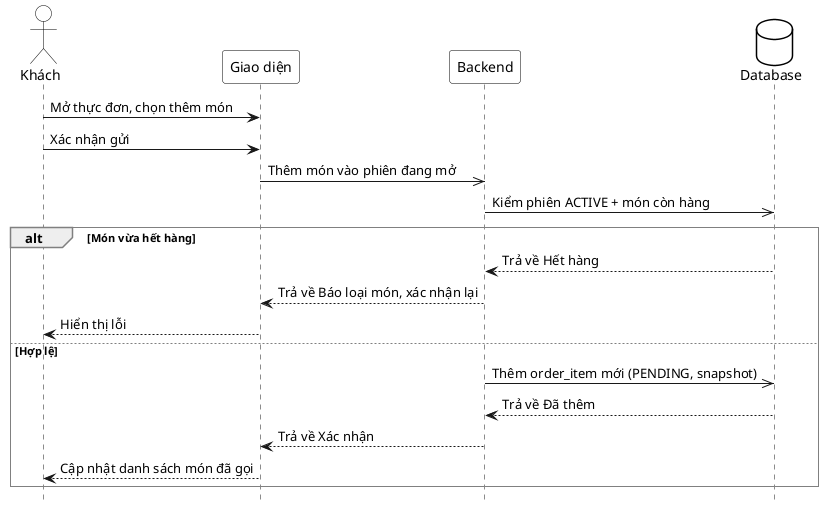

# Đặc tả Use-Case — Nhóm KHÁCH (GUEST)

> **Mô tả nhóm:** Use-case mô tả các nghiệp vụ khách hàng thực hiện khi gọi món tại
> bàn qua mã QR: vào phiên, đặt món, theo dõi món, gọi nhân viên, yêu cầu tính tiền.
> **Group:** KHÁCH (GUEST)
> **Nguồn luồng:** `docs/sequence-diagrams-4cot.md` — *"UC-04 — Gọi thêm món"*

---

## UC-G04 — Gọi thêm món

### 1) Use-case đặc tả tổng quan

> Sơ đồ: [`uc-khach-04-goi-them-mon.drawio`](./uc-khach-04-goi-them-mon.drawio) — mở bằng draw.io / diagrams.net.

*Hình: ĐẶC TẢ USE-CASE KHÁCH — GỌI THÊM MÓN*
Tác nhân **Khách** giao tiếp với use-case «Gọi thêm món»; use-case «include» thao tác «Kiểm phiên ACTIVE» và «Kiểm món còn hàng». Đây là vòng gọi món bổ sung ("add more") trong cùng phiên đang mở: thêm `order_item` mới vào đơn của phiên và «Đẩy ticket cho Bếp». Tiếp nối sau «Đặt món» (UC-G03).

### 2) Bảng use-case chi tiết

| Mục | Nội dung |
|---|---|
| **Tên Use-Case** | Gọi thêm món |
| **Tác nhân** | Khách (Guest) — phụ: Hệ thống, Bếp (nhận ticket) |
| **Mô tả** | Trong phiên đang mở, khách mở lại thực đơn và chọn thêm món rồi xác nhận gửi. Hệ thống kiểm phiên còn ACTIVE và món còn hàng; nếu hợp lệ thì thêm `order_item` mới (PENDING, snapshot tên/giá) vào phiên, đẩy ticket realtime cho Bếp và cập nhật danh sách món đã gọi. Món cũ không bị ảnh hưởng. |
| **Điều kiện** | Khách đang trong phiên với `session_token`, phiên ở trạng thái ACTIVE (chưa `AWAITING_PAYMENT`). Đã có ít nhất một lượt đặt trước đó (hoặc đang trong cùng phiên). |

**Luồng sự kiện chính (Thành công — thêm món hợp lệ)**

| STT | Thực hiện bởi | Mô tả hành động | Kết quả hệ thống |
|---|---|---|---|
| 1 | Khách | Mở thực đơn, chọn thêm món. | Giao diện cập nhật giỏ bổ sung cục bộ. |
| 2 | Khách | Xác nhận gửi (`PUT /customer/orders/:orderId/items` — thêm món vào phiên đang mở). | Hệ thống kiểm phiên ACTIVE và từng món còn hàng. |
| 3 | Hệ thống | Món hợp lệ. | Thêm `order_item` mới (PENDING, snapshot tên/giá); đẩy ticket realtime cho Bếp. |
| 4 | Khách | Nhận xác nhận. | Cập nhật danh sách món đã gọi (món mới ở PENDING). |

**Luồng sự kiện thay thế**

| STT | Thực hiện bởi | Mô tả hành động | Kết quả hệ thống |
|---|---|---|---|
| 2a | Hệ thống | Phiên không còn ACTIVE (đã `AWAITING_PAYMENT`/`CLOSED`). | Từ chối thêm món; báo phiên đã khóa order; không thêm `order_item`. |
| 3a | Hệ thống | Món vừa hết hàng khi kiểm. | Trả lỗi theo món (hết hàng); yêu cầu xác nhận lại; không thêm món đó. |

**Hậu điều kiện**

| | |
|---|---|
| **Thành công** | Thêm `order_item` mới PENDING với snapshot tên/giá vào phiên; ticket đẩy realtime cho Bếp; danh sách món đã gọi cập nhật. Món đã gọi trước đó và trạng thái của chúng không đổi. |
| **Thất bại** | Không thêm món: phiên đã khóa order, hoặc món hết hàng → báo lỗi theo món. Đơn hiện có giữ nguyên. |

### 3) Sơ đồ tuần tự (Sequence)

