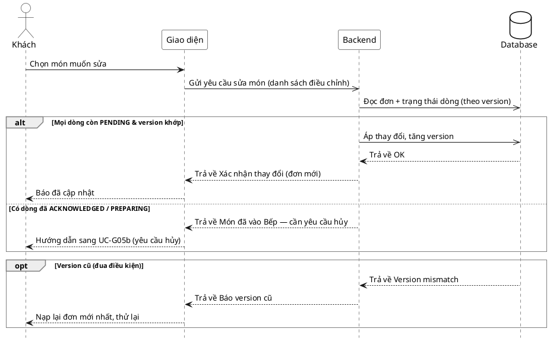

# Đặc tả Use-Case — Nhóm KHÁCH (GUEST)

> **Mô tả nhóm:** Use-case mô tả các nghiệp vụ khách hàng thực hiện khi gọi món tại
> bàn qua mã QR: vào phiên, đặt món, theo dõi món, gọi nhân viên, yêu cầu tính tiền.
> **Group:** KHÁCH (GUEST)
> **Nguồn luồng:** `docs/sequence-diagrams-4cot.md` — *"UC-05 — Hủy / sửa món đã gọi"* (tách nhánh **Sửa**)

---

## UC-G05a — Sửa món đã gọi

### 1) Use-case đặc tả tổng quan

*Hình: ĐẶC TẢ USE-CASE KHÁCH — SỬA MÓN ĐÃ GỌI*
Tác nhân **Khách** giao tiếp với use-case «Sửa món đã gọi»; use-case «include» thao tác «Đọc trạng thái món theo version» (khóa lạc quan). Sửa trực tiếp **chỉ** khi món còn `PENDING`. Khi món đã `ACKNOWLEDGED`+ thì không sửa được trực tiếp → chuyển sang «Hủy món đã gọi» (UC-G05b) gửi Bếp duyệt.

### 2) Bảng use-case chi tiết

| Mục | Nội dung |
|---|---|
| **Tên Use-Case** | Sửa món đã gọi |
| **Tác nhân** | Khách (Guest) — phụ: Hệ thống |
| **Mô tả** | Khách sửa số lượng / ghi chú / tùy chọn của các món trong một đơn khi món còn `PENDING`. Hệ thống đọc đơn theo `version` (optimistic lock), kiểm từng dòng còn `PENDING` rồi áp thay đổi, tăng version và đẩy realtime cập nhật. Món đã được Bếp tiếp nhận (`ACKNOWLEDGED`+) không sửa được trực tiếp. |
| **Điều kiện** | Khách trong phiên ACTIVE với `session_token`. Đơn tồn tại, có ít nhất một dòng món còn `PENDING`. Client giữ `version` hiện tại của đơn. |

**Luồng sự kiện chính (Thành công — sửa món PENDING)**

| STT | Thực hiện bởi | Mô tả hành động | Kết quả hệ thống |
|---|---|---|---|
| 1 | Khách | Chọn món muốn sửa, đổi số lượng/ghi chú/tùy chọn. | Giao diện dựng payload sửa (kèm `version`). |
| 2 | Khách | Gửi yêu cầu sửa (`PUT /customer/orders/:orderId/items` — `{ version, items[] }`). | Hệ thống đọc đơn theo `version`, kiểm từng dòng còn `PENDING`. |
| 3 | Hệ thống | Tất cả dòng còn `PENDING` và `version` khớp. | Áp thay đổi, tăng `version`; trả đơn mới. |
| 4 | Khách | Nhận xác nhận. | Báo đã cập nhật; danh sách món phản ánh thay đổi. |

**Luồng sự kiện thay thế**

| STT | Thực hiện bởi | Mô tả hành động | Kết quả hệ thống |
|---|---|---|---|
| 2a | Khách | Danh sách `items` rỗng (muốn bỏ hết). | Bị từ chối `400`; hướng dẫn dùng `DELETE /orders/:orderId` để hủy cả đơn (UC-G05b). |
| 3a | Hệ thống | Có dòng đã `ACKNOWLEDGED`/`PREPARING`+. | Từ chối sửa dòng đó; báo món đã vào Bếp, cần **yêu cầu hủy** (UC-G05b). |
| 3b | Hệ thống | `version` gửi lên khác version hiện tại (đua điều kiện). | Trả lỗi version cũ; client nạp lại đơn mới nhất và thử lại đúng nhánh. |

**Hậu điều kiện**

| | |
|---|---|
| **Thành công** | Đơn được cập nhật, `version` tăng, event `order.updated` phát realtime. Chỉ các dòng còn `PENDING` bị đổi; snapshot giá dòng được tính lại theo cấu hình hiện tại của món. |
| **Thất bại** | Không thay đổi đơn: món đã vào Bếp, version cũ, hoặc payload rỗng. Đơn giữ nguyên trạng thái. |

### 3) Sơ đồ tuần tự (Sequence)

