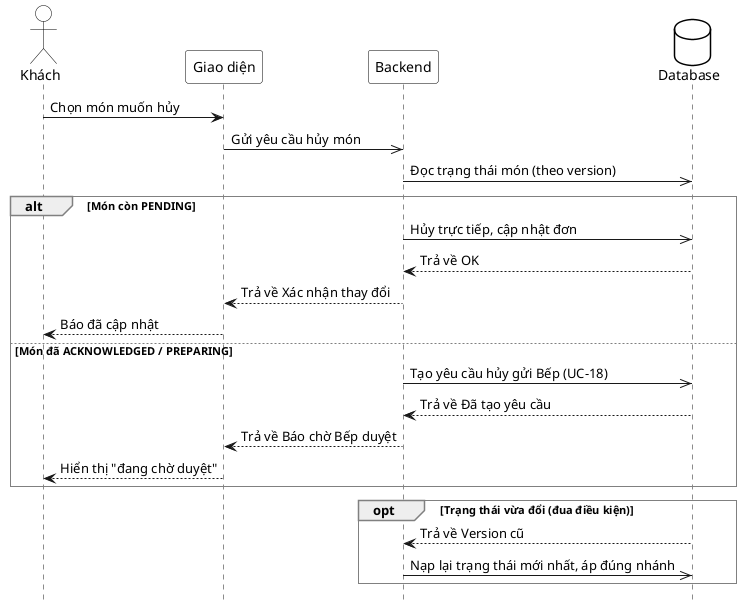

# Đặc tả Use-Case — Nhóm KHÁCH (GUEST)

> **Mô tả nhóm:** Use-case mô tả các nghiệp vụ khách hàng thực hiện khi gọi món tại
> bàn qua mã QR: vào phiên, đặt món, theo dõi món, gọi nhân viên, yêu cầu tính tiền.
> **Group:** KHÁCH (GUEST)
> **Nguồn luồng:** `docs/sequence-diagrams-4cot.md` — _"UC-05 — Hủy / sửa món đã gọi"_ (tách nhánh **Hủy**)

---

## UC-G05b — Hủy món đã gọi

### 1) Use-case đặc tả tổng quan

> Sơ đồ: [`uc-khach-05b-huy-mon-da-goi.drawio`](./uc-khach-05b-huy-mon-da-goi.drawio) — mở bằng draw.io / diagrams.net.

_Hình: ĐẶC TẢ USE-CASE KHÁCH — HỦY MÓN ĐÃ GỌI_
Tác nhân **Khách** giao tiếp với use-case «Hủy món đã gọi»; use-case «include» «Đọc trạng thái món theo version». Món còn `PENDING` → hủy trực tiếp. Món đã `ACKNOWLEDGED`/`PREPARING` → «extend» sang «Xác nhận / từ chối yêu cầu hủy» của Bếp (UC-18): tạo yêu cầu hủy, đẩy realtime cho Bếp duyệt.

### 2) Bảng use-case chi tiết

| Mục              | Nội dung                                                                                                                                                                                                                                          |
| ---------------- | ------------------------------------------------------------------------------------------------------------------------------------------------------------------------------------------------------------------------------------------------- |
| **Tên Use-Case** | Hủy món đã gọi                                                                                                                                                                                                                                    |
| **Tác nhân**     | Khách (Guest) — phụ: Hệ thống, Bếp (duyệt yêu cầu hủy)                                                                                                                                                                                            |
| **Mô tả**        | Khách yêu cầu hủy món đã gọi. Nếu món còn `PENDING`, hệ thống hủy trực tiếp (bỏ dòng khỏi đơn hoặc hủy cả đơn) và cập nhật. Nếu món đã được Bếp tiếp nhận (`ACKNOWLEDGED`+), hệ thống tạo **yêu cầu hủy** gửi Bếp và khách chờ Bếp duyệt/từ chối. |
| **Điều kiện**    | Khách trong phiên ACTIVE với `access_token`. Đơn/món tồn tại. Client giữ `version` hiện tại của đơn.                                                                                                                                             |

**Luồng sự kiện chính (Thành công — hủy món PENDING trực tiếp)**

| STT | Thực hiện bởi | Mô tả hành động                                                                                                                       | Kết quả hệ thống                                      |
| --- | ------------- | ------------------------------------------------------------------------------------------------------------------------------------- | ----------------------------------------------------- |
| 1   | Khách         | Chọn món muốn hủy.                                                                                                                    | Giao diện xác định phạm vi hủy (một dòng hay cả đơn). |
| 2   | Khách         | Gửi yêu cầu hủy — bỏ dòng: `PUT /customer/orders/:orderId/items` (danh sách còn lại); hủy cả đơn: `DELETE /customer/orders/:orderId`. | Hệ thống đọc trạng thái món theo `version`.           |
| 3   | Hệ thống      | Món còn `PENDING`.                                                                                                                    | Hủy trực tiếp, cập nhật đơn, tăng `version`;.         |
| 4   | Khách         | Nhận xác nhận.                                                                                                                        | Báo đã cập nhật; món/đơn bị bỏ khỏi danh sách.        |

**Luồng sự kiện thay thế**

| STT | Thực hiện bởi | Mô tả hành động                                          | Kết quả hệ thống                                                                                                                                                    |
| --- | ------------- | -------------------------------------------------------- | ------------------------------------------------------------------------------------------------------------------------------------------------------------------- |
| 3a  | Hệ thống      | Món đã `ACKNOWLEDGED`/`PREPARING`.                       | Tạo **yêu cầu hủy** gửi Bếp (`POST /customer/orders/:orderId/cancel-requests`); đẩy realtime cho Bếp (UC-18); trả trạng thái "đang chờ duyệt"; món **chưa** bị hủy. |
| 3b  | Bếp           | Bếp duyệt / từ chối yêu cầu hủy (UC-18).                 | Duyệt → món chuyển hủy, cập nhật đơn realtime; từ chối → món giữ nguyên, báo khách.                                                                                 |
| 3c  | Hệ thống      | `version` gửi lên khác version hiện tại (đua điều kiện). | Trả lỗi version cũ; client nạp lại trạng thái mới nhất, áp đúng nhánh (PENDING vs đã tiếp nhận).                                                                    |

**Hậu điều kiện**

|                |                                                                                                                                              |
| -------------- | -------------------------------------------------------------------------------------------------------------------------------------------- |
| **Thành công** | Món `PENDING` bị hủy trực tiếp và đơn cập nhật (`version` tăng, event `order.updated`); hoặc yêu cầu hủy được tạo và chờ Bếp duyệt.          |
| **Thất bại**   | Không hủy được trực tiếp do món đã vào Bếp → chuyển sang luồng yêu cầu hủy; hoặc version cũ → nạp lại. Đơn giữ nguyên đến khi có quyết định. |

### 3) Sơ đồ tuần tự (Sequence)

@startuml
hide footbox
skinparam participant {
BackgroundColor White
BorderColor Black
}
skinparam actor {
BackgroundColor White
BorderColor Black
}
skinparam database {
BackgroundColor White
BorderColor Black
}
skinparam sequenceGroupBorderThickness 1
skinparam sequenceGroupBorderColor Gray
actor "Khách" as A
participant "Giao diện" as UI
participant "Backend" as BE
database "Database" as DB

A ->> UI : Chọn món muốn hủy
UI -> BE : Yêu cầu hủy món
BE -> DB : Kiểm tra đơn đặt trong hệ thống và trạng thái của món

alt Nếu món còn đang ở trạng thái PENDING
BE -> DB : Hủy trực tiếp, cập nhật đơn
DB --> BE : Trả về trạng thái thành công
BE --> UI : Trả về xác nhận thay đổi thành công
UI --> A : Báo đã cập nhật cho khách hàng
else Nếu món đã được chấp thuận ACKNOWLEDGED / PREPARING
BE -> DB : Tạo yêu cầu hủy gửi Bếp (UC-18)
DB -->> BE : Đã tạo yêu cầu
BE --> UI : Báo chờ Bếp duyệt
UI --> A : Hiển thị "đang chờ duyệt"
alt Nếu yêu cầu huỷ được duyệt thành công
BE-->>A : Yều câu được duyệt món đã được huỷ
BE--> DB: Tính chi phí thiệt hại của đơn huỷ đó vào phiên ăn của khách hàng
DB-->> BE: Lưu thành công
BE-->> A: Thông báo yêu cầu huỷ món được duyệt thành công

else Nếu yêu cầu huỷ không thể duyệt được
BE -->> A: Không thể huỷ món này được hệ thông từ chối yêu cầu
end

@enduml
