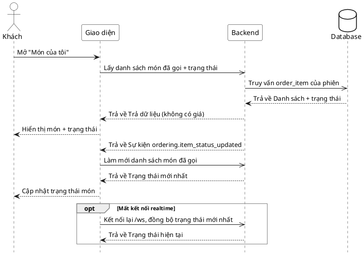

# Đặc tả Use-Case — Nhóm KHÁCH (GUEST)

> **Mô tả nhóm:** Use-case mô tả các nghiệp vụ khách hàng thực hiện khi gọi món tại
> bàn qua mã QR: vào phiên, đặt món, theo dõi món, gọi nhân viên, yêu cầu tính tiền.
> **Group:** KHÁCH (GUEST)
> **Nguồn luồng:** `docs/sequence-diagrams-4cot.md` — *"UC-06 — Theo dõi trạng thái món (realtime)"*

---

## UC-G06 — Theo dõi trạng thái món (realtime)

### 1) Use-case đặc tả tổng quan

> Sơ đồ: [`uc-khach-06-theo-doi-trang-thai-mon.drawio`](./uc-khach-06-theo-doi-trang-thai-mon.drawio) — mở bằng draw.io / diagrams.net.

*Hình: ĐẶC TẢ USE-CASE KHÁCH — THEO DÕI TRẠNG THÁI MÓN*
Tác nhân **Khách** giao tiếp với use-case «Theo dõi trạng thái món»; use-case «include» «Lấy món đã gọi của phiên». Bếp/Phục vụ đổi trạng thái món phát sự kiện realtime «extend» cập nhật màn khách. Trạng thái là **theo từng order-item**: `PENDING → ACKNOWLEDGED → PREPARING → READY → SERVED`. Tiếp nối sau «Đặt món» / «Gọi thêm món».

### 2) Bảng use-case chi tiết

| Mục | Nội dung |
|---|---|
| **Tên Use-Case** | Theo dõi trạng thái món (realtime) |
| **Tác nhân** | Khách (Guest) — phụ: Hệ thống, Bếp/Phục vụ (nguồn đổi trạng thái) |
| **Mô tả** | Khách mở màn "Món của tôi" xem danh sách món đã gọi kèm trạng thái từng món (**không hiển thị giá/tổng tiền**). Khi Bếp/Phục vụ đổi trạng thái, hệ thống phát sự kiện realtime qua WebSocket; giao diện làm mới danh sách để cập nhật trạng thái. Mất kết nối realtime thì kết nối lại và đồng bộ trạng thái mới nhất. |
| **Điều kiện** | Khách trong phiên với `access_token`. Đã có ít nhất một món được gọi trong phiên. |

**Luồng sự kiện chính (Thành công — xem + cập nhật realtime)**

| STT | Thực hiện bởi | Mô tả hành động | Kết quả hệ thống |
|---|---|---|---|
| 1 | Khách | Mở "Món của tôi". | Giao diện gọi `GET /customer/orders`. |
| 2 | Hệ thống | Truy vấn `order_item` của phiên. | Trả danh sách món + trạng thái từng món (giao diện **ẩn giá/tổng**). |
| 3 | Khách | Xem danh sách món + trạng thái. | Hiển thị món theo trạng thái (`PENDING`…`SERVED`). |
| 4 | Bếp/Phục vụ | Đổi trạng thái một món (UC-17). | Backend dispatcher đẩy sự kiện lên WebSocket `/ws`. |
| 5 | Hệ thống | Giao diện nhận sự kiện `ordering.*`/`dining.*`. | Vô hiệu hóa cache và làm mới `GET /customer/orders` → cập nhật trạng thái món trên màn khách. |

**Luồng sự kiện thay thế**

| STT | Thực hiện bởi | Mô tả hành động | Kết quả hệ thống |
|---|---|---|---|
| 5a | Giao diện | Mất kết nối realtime (WebSocket đứt). | Tự kết nối lại `/ws`; sau khi nối lại, làm mới `GET /customer/orders` để đồng bộ trạng thái hiện tại. |

> **Ghi chú hiện trạng triển khai:** Hub WebSocket hiện **broadcast mọi sự kiện tới mọi client** (Topic chưa lọc theo phiên ở server); giao diện lọc/đồng bộ phía client bằng cách làm mới truy vấn theo `session`. Vì vậy bước cập nhật là **invalidate + refetch** `GET /customer/orders`, không phải đẩy thẳng payload trạng thái vào UI.

**Hậu điều kiện**

| | |
|---|---|
| **Thành công** | Khách thấy trạng thái từng món và luôn được cập nhật khi Bếp/Phục vụ đổi trạng thái. Chỉ đọc — không thay đổi dữ liệu; không lộ giá/tổng tiền. |
| **Thất bại** | Mất realtime → sau khi kết nối lại đồng bộ trạng thái mới nhất; trong lúc đứt, dữ liệu hiển thị là lần tải gần nhất. |

### 3) Sơ đồ tuần tự (Sequence)

