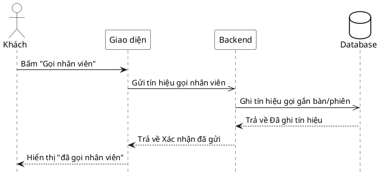

# Đặc tả Use-Case — Nhóm KHÁCH (GUEST)

> **Mô tả nhóm:** Use-case mô tả các nghiệp vụ khách hàng thực hiện khi gọi món tại
> bàn qua mã QR: vào phiên, đặt món, theo dõi món, gọi nhân viên, yêu cầu tính tiền.
> **Group:** KHÁCH (GUEST)
> **Nguồn luồng:** `docs/sequence-diagrams-4cot.md` — _"UC-07 — Gọi nhân viên"_

---

## UC-G07 — Gọi nhân viên

### 1) Use-case đặc tả tổng quan

> Sơ đồ: [`uc-khach-07-goi-nhan-vien.drawio`](./uc-khach-07-goi-nhan-vien.drawio) — mở bằng draw.io / diagrams.net.

_Hình: ĐẶC TẢ USE-CASE KHÁCH — GỌI NHÂN VIÊN_
Tác nhân **Khách** giao tiếp với use-case «Gọi nhân viên»; phát tín hiệu gắn bàn/phiên và «Đẩy realtime cho Phục vụ». Phục vụ xác nhận tín hiệu ở use-case «Xác nhận gọi nhân viên» (UC-12). Không đổi trạng thái phiên.

### 2) Bảng use-case chi tiết

| Mục              | Nội dung                                                                                                                                                                                                       |
| ---------------- | -------------------------------------------------------------------------------------------------------------------------------------------------------------------------------------------------------------- |
| **Tên Use-Case** | Gọi nhân viên                                                                                                                                                                                                  |
| **Tác nhân**     | Khách (Guest) — phụ: Hệ thống, Phục vụ (nhận tín hiệu)                                                                                                                                                         |
| **Mô tả**        | Khách bấm "Gọi nhân viên"; hệ thống ghi tín hiệu gọi gắn với phiên/bàn và đẩy realtime cho Phục vụ. Giao diện báo "đã gọi nhân viên". Không thay đổi trạng thái phiên (vẫn ACTIVE/AWAITING_PAYMENT như trước). |
| **Điều kiện**    | Khách trong phiên với `session_token`.                                                                                                                                                                         |

**Luồng sự kiện chính (Thành công)**

| STT | Thực hiện bởi | Mô tả hành động                 | Kết quả hệ thống                            |
| --- | ------------- | ------------------------------- | ------------------------------------------- |
| 1   | Khách         | Bấm "Gọi nhân viên".            | Giao diện gọi `POST /customer/call-waiter`. |
| 2   | Hệ thống      | Ghi tín hiệu gọi gắn phiên/bàn. | dispatcher đẩy realtime `/ws` cho Phục vụ.  |
| 3   | Khách         | Nhận xác nhận.                  | Hiển thị "đã gọi nhân viên".                |

**Luồng sự kiện thay thế**

| STT | Thực hiện bởi | Mô tả hành động                             | Kết quả hệ thống                                        |
| --- | ------------- | ------------------------------------------- | ------------------------------------------------------- |
| 1a  | Hệ thống      | Thiếu `session_token` / phiên không hợp lệ. | Trả `401 "missing guest session"`; không phát tín hiệu. |

**Hậu điều kiện**

|                |                                                                                                                            |
| -------------- | -------------------------------------------------------------------------------------------------------------------------- |
| **Thành công** | Tín hiệu `dining.waiter_called` được ghi và đẩy realtime cho màn Phục vụ; khách thấy xác nhận. Không đổi trạng thái phiên. |
| **Thất bại**   | Không có session hợp lệ → không phát tín hiệu.                                                                             |

### 3) Sơ đồ tuần tự (Sequence)

@startuml
hide footbox
skinparam participant {
BackgroundColor White
BorderColor Black
}
skinparam actor {
BackgroundColor White
BorderColor Black
}
skinparam database {
BackgroundColor White
BorderColor Black
}
skinparam sequenceGroupBorderThickness 1
skinparam sequenceGroupBorderColor Gray
actor "Khách" as A
participant "Giao diện" as UI
participant "Backend" as BE
database "Database" as DB

A ->> UI : Bấm "Gọi nhân viên"
UI -> BE : Gửi tín hiệu gọi nhân viên

BE -> DB : Kiểm tra phiên hợp lệ
alt Phiên không hợp lệ hoặc không tìm thấy bàn
DB -->> BE : Không tìm thấy bàn hoặc phiên hợp lệ
else Phiên hợp lệ
DB -->> BE: Xác thực phiên thành công
BE -->> UI : Trả về Xác nhận đã gửi tín hiệu yêu cầu phục vụ thành công
UI -->> A : Hiển thị "đã gọi nhân viên"
@enduml
