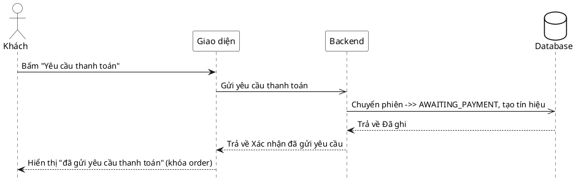

# Đặc tả Use-Case — Nhóm KHÁCH (GUEST)

> **Mô tả nhóm:** Use-case mô tả các nghiệp vụ khách hàng thực hiện khi gọi món tại
> bàn qua mã QR: vào phiên, đặt món, theo dõi món, gọi nhân viên, yêu cầu tính tiền.
> **Group:** KHÁCH (GUEST)
> **Nguồn luồng:** `docs/sequence-diagrams-4cot.md` — *"UC-08 — Yêu cầu thanh toán"*

---

## UC-G08 — Yêu cầu thanh toán

### 1) Use-case đặc tả tổng quan

> Sơ đồ: [`uc-khach-08-yeu-cau-thanh-toan.drawio`](./uc-khach-08-yeu-cau-thanh-toan.drawio) — mở bằng draw.io / diagrams.net.

*Hình: ĐẶC TẢ USE-CASE KHÁCH — YÊU CẦU THANH TOÁN*
Tác nhân **Khách** giao tiếp với use-case «Yêu cầu thanh toán»; use-case «include» «Khóa order của phiên» (chuyển phiên sang `AWAITING_PAYMENT`) và «Đẩy realtime cho Thu ngân/Phục vụ». Dẫn sang nghiệp vụ lập hóa đơn & thu tiền của Thu ngân.

### 2) Bảng use-case chi tiết

| Mục | Nội dung |
|---|---|
| **Tên Use-Case** | Yêu cầu thanh toán |
| **Tác nhân** | Khách (Guest) — phụ: Hệ thống, Thu ngân / Phục vụ (nhận tín hiệu) |
| **Mô tả** | Khách bấm "Yêu cầu thanh toán"; hệ thống chuyển phiên sang `AWAITING_PAYMENT` (khóa đặt/sửa món tiếp), ghi tín hiệu và đẩy realtime cho Thu ngân/Phục vụ. Giao diện báo "đã gửi yêu cầu thanh toán". |
| **Điều kiện** | Khách trong phiên ACTIVE với `access_token`. |

**Luồng sự kiện chính (Thành công)**

| STT | Thực hiện bởi | Mô tả hành động | Kết quả hệ thống |
|---|---|---|---|
| 1 | Khách | Bấm "Yêu cầu thanh toán". | Giao diện gọi `POST /customer/request-bill`. |
| 2 | Hệ thống | Chuyển phiên sang `AWAITING_PAYMENT`, tạo tín hiệu yêu cầu thanh toán cho bàn. | dispatcher đẩy realtime `/ws` cho Thu ngân/Phục vụ. |
| 3 | Khách | Nhận xác nhận. | Hiển thị "đã gửi yêu cầu thanh toán"; giao diện khóa đặt/sửa món tiếp. |

**Luồng sự kiện thay thế**

| STT | Thực hiện bởi | Mô tả hành động | Kết quả hệ thống |
|---|---|---|---|
| 1a | Hệ thống | Thiếu `access_token` / phiên không hợp lệ. | Trả `401 "missing device access token"`; không đổi trạng thái. |
| 2a | Hệ thống | Phiên đã ở `AWAITING_PAYMENT` (bấm lại). | Idempotent — giữ trạng thái `AWAITING_PAYMENT`, không tạo lỗi; xác nhận lại cho khách. |

**Hậu điều kiện**

| | |
|---|---|
| **Thành công** | Phiên chuyển `AWAITING_PAYMENT` (khóa order); tín hiệu `dining.bill_requested` đẩy realtime cho Thu ngân/Phục vụ; khách không đặt/sửa món thêm. |
| **Thất bại** | Không có session hợp lệ → không đổi trạng thái, không phát tín hiệu. |

### 3) Sơ đồ tuần tự (Sequence)

