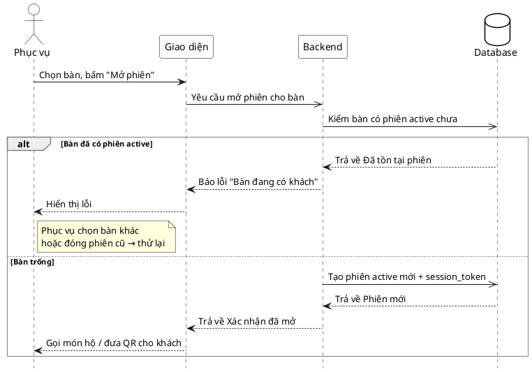

# Đặc tả Use-Case — Nhóm PHỤC VỤ (SERVER)

> **Mô tả nhóm:** Use-case mô tả nghiệp vụ phục vụ điều hành sàn: mở phiên walk-in,
> theo dõi lưới bàn & tín hiệu, xác nhận gọi nhân viên, đánh dấu đã phục vụ, xem chi
> tiết phiên theo bàn.
> **Group:** PHỤC VỤ (SERVER)
> **Nguồn luồng:** `docs/sequence-diagrams-4cot.md` — _"UC-09 — Mở phiên cho khách vãng lai"_
> Route: `POST /api/v1/restaurant/sessions` (quyền `dining:serve`).

---

## UC-P09 — Mở phiên cho khách vãng lai

### 1) Use-case đặc tả tổng quan

> Sơ đồ: [`uc-phuc-vu-09-mo-phien-walk-in.drawio`](./uc-phuc-vu-09-mo-phien-walk-in.drawio) — mở bằng draw.io / diagrams.net.

_Hình: ĐẶC TẢ USE-CASE PHỤC VỤ — MỞ PHIÊN WALK-IN_
Tác nhân **Phục vụ** giao tiếp với use-case «Mở phiên cho khách vãng lai»; use-case «include» «Kiểm bàn có phiên ACTIVE chưa» (bất biến: **một phiên ACTIVE mỗi bàn**).

- Bàn trống (không có ACTIVE) → tạo phiên mới và cấp `session_token`.
- Bàn đã có phiên ACTIVE → báo lỗi "bàn đang có khách", không cho mở thêm. Phục vụ có thể **đóng phiên cũ** (nếu khách đã về, quên close) qua thao tác riêng, rồi thực hiện lại việc mở phiên.
  Dẫn sang «Gọi món hộ» hoặc khách tự quét QR vào phiên (UC-G01).

### 2) Bảng use-case chi tiết

| Mục              | Nội dung                                                                                                                                                                                                                                               |
| ---------------- | ------------------------------------------------------------------------------------------------------------------------------------------------------------------------------------------------------------------------------------------------------ |
| **Tên Use-Case** | Mở phiên cho khách vãng lai                                                                                                                                                                                                                                       |
| **Tác nhân**     | Phục vụ (Server) — phụ: Hệ thống                                                                                                                                                                                                                       |
| **Mô tả**        | Phục vụ chọn bàn trống và mở phiên. Hệ thống kiểm bàn đã có phiên ACTIVE chưa; nếu có thì báo lỗi "bàn đang có khách" — không tự động dùng lại phiên cũ, giữ bất biến một phiên ACTIVE/bàn); nếu chưa thì tạo phiên `ACTIVE` mới, cấp `session_token`. |
| **Điều kiện**    | Phục vụ đã đăng nhập (JWT, quyền `dining:serve`). Bàn tồn tại và có mã QR còn hiệu lực.                                                                                                                                                                |

**Luồng sự kiện chính (Thành công — bàn trống, tạo phiên mới)**

| STT | Thực hiện bởi | Mô tả hành động                 | Kết quả hệ thống                                            |
| --- | ------------- | ------------------------------- | ----------------------------------------------------------- |
| 1   | Phục vụ       | Chọn bàn trống, bấm "Mở phiên". | Giao diện gọi `POST /restaurant/sessions` (`{ table_id }`). |
| 2   | Hệ thống      | Kiểm bàn có phiên ACTIVE chưa.  | Bàn trống → tạo phiên `ACTIVE`, cấp `session_token`.        |
| 3   | Phục vụ       | Nhận xác nhận.                  | Có thể gọi món hộ hoặc đưa QR cho khách tự quét.            |

**Luồng sự kiện thay thế**

| STT | Thực hiện bởi | Mô tả hành động                           | Kết quả hệ thống                                                                                                                             |
| --- | ------------- | ----------------------------------------- | -------------------------------------------------------------------------------------------------------------------------------------------- |
| 2a  | Hệ thống      | Bàn đã có phiên ACTIVE.                   | Báo lỗi "bàn đang có khách"; không tạo phiên mới, không dùng lại phiên cũ. Phục vụ chọn bàn khác hoặc đóng phiên cũ trước (nếu khách đã về). |
| 1a  | Hệ thống      | Bàn không có QR hiệu lực / không tồn tại. | Trả lỗi; không mở phiên.                                                                                                                     |

**Hậu điều kiện**

|                |                                                                                        |
| -------------- | -------------------------------------------------------------------------------------- |
| **Thành công** | Bàn có đúng một phiên `ACTIVE` mới tạo; `session_token` sẵn sàng cho khách/gọi món hộ. |
| **Thất bại**   | Bàn không hợp lệ → không mở phiên. Không tạo phiên trùng cho bàn đã ACTIVE.            |

### 3) Sơ đồ tuần tự (Sequence)

@startuml
hide footbox
skinparam participant {
BackgroundColor White
BorderColor Black
}
skinparam actor {
BackgroundColor White
BorderColor Black
}
skinparam database {
BackgroundColor White
BorderColor Black
}
skinparam sequenceGroupBorderThickness 1
skinparam sequenceGroupBorderColor Gray
actor "Phục vụ" as A
participant "Giao diện" as UI
participant "Backend" as BE
database "Database" as DB

A -> UI : Chọn bàn, bấm "Mở phiên"
UI -> BE : Gửi yêu cầu mở phiên cho bàn
BE -> DB : Kiểm bàn có phiên active chưa

alt Bàn đã có phiên active
DB -->> BE : Trả về Đã tồn tại phiên
BE -->> UI : Báo lỗi "Bàn đang có khách"
UI -->> A : Hiển thị lỗi

else Bàn trống
BE ->> DB : Tạo phiên active mới và session token
DB -->> BE : Trả về Phiên mới
BE -->> UI : Trả về Xác nhận đã mở
UI -->> A : Tiến hành vào phần menu để chọn món
end
@enduml
