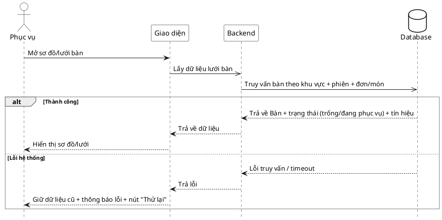

# Đặc tả Use-Case — Nhóm PHỤC VỤ (SERVER)

> **Mô tả nhóm:** Use-case mô tả nghiệp vụ phục vụ điều hành sàn: mở phiên walk-in,
> theo dõi lưới bàn & tín hiệu, xác nhận gọi nhân viên, đánh dấu đã phục vụ, xem chi
> tiết phiên theo bàn.
> **Group:** PHỤC VỤ (SERVER)
> **Nguồn luồng:** `docs/sequence-diagrams-4cot.md` — _"UC-10 — Xem sơ đồ bàn / lưới bàn"_
> Route: `GET /api/v1/restaurant/tables` (quyền staff ordering).

---

## UC-P10 — Xem sơ đồ bàn / lưới bàn

### 1) Use-case đặc tả tổng quan

_Hình: ĐẶC TẢ USE-CASE PHỤC VỤ — LƯỚI BÀN_
Tác nhân **Phục vụ** giao tiếp với use-case «Xem sơ đồ/lưới bàn»; use-case «include» «Lấy bàn + trạng thái + tín hiệu». Đây là màn điều hành chính, dẫn sang «Theo dõi tín hiệu» (UC-P11), «Xem chi tiết phiên» (UC-P15) và các thao tác xử lý.

### 2) Bảng use-case chi tiết

| Mục              | Nội dung                                                                                                                                                                                                                    |
| ---------------- | --------------------------------------------------------------------------------------------------------------------------------------------------------------------------------------------------------------------------- |
| **Tên Use-Case** | Xem sơ đồ bàn / lưới bàn                                                                                                                                                                                                    |
| **Tác nhân**     | Phục vụ (Server) — phụ: Hệ thống                                                                                                                                                                                            |
| **Mô tả**        | Phục vụ mở lưới bàn. Hệ thống trả danh sách bàn kèm trạng thái (trống/đang phục vụ), phiên và tín hiệu (`waiter_called_at`, `bill_requested_at`), lồng cả đơn + món của từng bàn. Phục vụ chuyển giữa chế độ sơ đồ và lưới. |
| **Điều kiện**    | Phục vụ đã đăng nhập (JWT, quyền staff).                                                                                                                                                                                    |

**Luồng sự kiện chính (Thành công)**

| STT | Thực hiện bởi | Mô tả hành động                              | Kết quả hệ thống                                            |
| --- | ------------- | -------------------------------------------- | ----------------------------------------------------------- |
| 1   | Phục vụ       | Mở sơ đồ/lưới bàn.                           | Giao diện gọi `GET /restaurant/tables`.                     |
| 2   | Hệ thống      | Truy vấn bàn theo khu vực + phiên + đơn/món. | Trả `tables[]` (trạng thái + tín hiệu + orders lồng items). |
| 3   | Phục vụ       | Xem lưới.                                    | Hiển thị bàn theo trạng thái/tín hiệu.                      |
| 4   | Phục vụ       | Chuyển chế độ sơ đồ ↔ lưới.                  | Giao diện đổi cách hiển thị (client-side).                  |

**Luồng sự kiện thay thế**

| STT | Thực hiện bởi | Mô tả hành động                                | Kết quả hệ thống                                                                                   |
| --- | ------------- | ---------------------------------------------- | -------------------------------------------------------------------------------------------------- |
| —   | Hệ thống      | Có sự kiện realtime (`ordering.*`/`dining.*`). | Giao diện làm mới `GET /restaurant/tables` để cập nhật lưới (xem UC-P11).                          |
| 2a  | Hệ thống      | Lỗi truy vấn DB / backend trả 5xx / timeout.   | Backend trả lỗi. Giao diện giữ dữ liệu gần nhất (nếu có) + hiển thị thông báo lỗi + nút "Thử lại". |

> **Ghi chú hiện trạng triển khai:** `GET /restaurant/tables` (StaffTables) trả **một payload lồng đầy đủ**: `tables → session (bill_requested_at, waiter_called_at) → orders → items (status, status_history)`. UC-P10, UC-P11, UC-P15 đều dùng chung endpoint này; khác nhau ở cách giao diện hiển thị.

**Hậu điều kiện**

|                |                                                              |
| -------------- | ------------------------------------------------------------ |
| **Thành công** | Phục vụ thấy toàn cảnh bàn + trạng thái + tín hiệu. Chỉ đọc. |
| **Thất bại**   | Lỗi tải → hiển thị dữ liệu gần nhất / thử lại.               |

### 3) Sơ đồ tuần tự (Sequence)

@startuml
hide footbox
skinparam participant {
BackgroundColor White
BorderColor Black
}
skinparam actor {
BackgroundColor White
BorderColor Black
}
skinparam database {
BackgroundColor White
BorderColor Black
}
skinparam sequenceGroupBorderThickness 1
skinparam sequenceGroupBorderColor Gray
actor "Phục vụ" as A
participant "Giao diện" as UI
participant "Backend" as BE
database "Database" as DB

A ->> UI : Mở sơ đồ/lưới bàn
UI -> BE : Lấy dữ liệu lưới bàn
BE -> DB : Truy vấn bàn theo khu vực + phiên + đơn/món

alt Thành công
DB -->> BE : Trả về Bàn + trạng thái (trống/đang phục vụ) + tín hiệu
BE -->> UI : Trả về dữ liệu
UI -->> A : Hiển thị sơ đồ bàn
else Lỗi hệ thống
DB -->> BE : Lỗi truy vấn / timeout
BE -->> UI : Trả lỗi về giao diện
UI -->> A : Thông báo lỗi
end

@enduml
