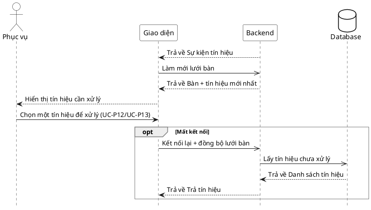

# Đặc tả Use-Case — Nhóm PHỤC VỤ (SERVER)

> **Mô tả nhóm:** Use-case mô tả nghiệp vụ phục vụ điều hành sàn: mở phiên walk-in,
> theo dõi lưới bàn & tín hiệu, xác nhận gọi nhân viên, đánh dấu đã phục vụ, xem chi
> tiết phiên theo bàn.
> **Group:** PHỤC VỤ (SERVER)
> **Nguồn luồng:** `docs/sequence-diagrams-4cot.md` — *"UC-11 — Theo dõi tín hiệu bàn"*
> Realtime: WebSocket `/ws` + làm mới `GET /api/v1/restaurant/tables`.

---

## UC-P11 — Theo dõi tín hiệu bàn (realtime)

### 1) Use-case đặc tả tổng quan

*Hình: ĐẶC TẢ USE-CASE PHỤC VỤ — THEO DÕI TÍN HIỆU BÀN*
Tác nhân **Phục vụ** giao tiếp với use-case «Theo dõi tín hiệu bàn»; nhận realtime các tín hiệu cần xử lý: món `READY`, khách gọi nhân viên (`dining.waiter_called`), yêu cầu tính tiền (`dining.bill_requested`). Chọn một tín hiệu dẫn sang «Xác nhận gọi nhân viên» (UC-P12) hoặc «Đánh dấu đã phục vụ» (UC-P13).

### 2) Bảng use-case chi tiết

| Mục | Nội dung |
|---|---|
| **Tên Use-Case** | Theo dõi tín hiệu bàn (realtime) |
| **Tác nhân** | Phục vụ (Server) — phụ: Hệ thống |
| **Mô tả** | Giao diện lắng nghe WebSocket; khi có sự kiện `ordering.*`/`dining.*`, làm mới lưới bàn để hiển thị tín hiệu cần xử lý (món READY, gọi NV, yêu cầu bill). Phục vụ chọn tín hiệu để xử lý. Mất kết nối thì nối lại và đồng bộ tín hiệu còn tồn qua `GET /restaurant/tables`. |
| **Điều kiện** | Phục vụ đã đăng nhập (JWT, quyền staff) và đang mở màn điều hành (UC-P10). |

**Luồng sự kiện chính (Thành công)**

| STT | Thực hiện bởi | Mô tả hành động | Kết quả hệ thống |
|---|---|---|---|
| 1 | Bếp/Khách | Phát sinh tín hiệu (món READY / gọi NV / yêu cầu bill). | Backend dispatcher đẩy sự kiện lên `/ws`. |
| 2 | Hệ thống | Giao diện nhận sự kiện `ordering.*`/`dining.*`. | Làm mới `GET /restaurant/tables`; hiển thị tín hiệu (`waiter_called_at`, `bill_requested_at`, món READY). |
| 3 | Phục vụ | Chọn một tín hiệu để xử lý. | Chuyển sang UC-P12 (gọi NV) hoặc UC-P13 (đã phục vụ). |

**Luồng sự kiện thay thế**

| STT | Thực hiện bởi | Mô tả hành động | Kết quả hệ thống |
|---|---|---|---|
| 2a | Giao diện | Mất kết nối realtime (`/ws` đứt). | Tự nối lại; sau khi nối lại làm mới `GET /restaurant/tables` để đồng bộ tín hiệu còn tồn. |

> **Ghi chú hiện trạng triển khai:** Hub WebSocket broadcast mọi sự kiện tới mọi client (chưa lọc theo bàn ở server). Giao diện phục vụ cập nhật bằng **invalidate + refetch** `GET /restaurant/tables`; tín hiệu suy ra từ các trường `waiter_called_at`/`bill_requested_at` và trạng thái item `READY` trong payload.

**Hậu điều kiện**

| | |
|---|---|
| **Thành công** | Phục vụ luôn thấy tín hiệu cần xử lý được cập nhật realtime; chọn được tín hiệu để xử lý. Chỉ đọc. |
| **Thất bại** | Mất realtime → sau khi nối lại đồng bộ tín hiệu còn tồn; trong lúc đứt hiển thị lần tải gần nhất. |

### 3) Sơ đồ tuần tự (Sequence)

