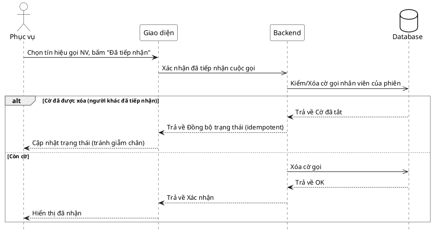

# Đặc tả Use-Case — Nhóm PHỤC VỤ (SERVER)

> **Mô tả nhóm:** Use-case mô tả nghiệp vụ phục vụ điều hành sàn: mở phiên walk-in,
> theo dõi lưới bàn & tín hiệu, xác nhận gọi nhân viên, đánh dấu đã phục vụ, xem chi
> tiết phiên theo bàn.
> **Group:** PHỤC VỤ (SERVER)
> **Nguồn luồng:** `docs/sequence-diagrams-4cot.md` — _"UC-12 — Xác nhận gọi nhân viên"_
> Route: `POST /api/v1/restaurant/sessions/:sessionId/ack-waiter-call` (quyền staff).

---

## UC-P12 — Xác nhận gọi nhân viên

### 1) Use-case đặc tả tổng quan

_Hình: ĐẶC TẢ USE-CASE PHỤC VỤ — XÁC NHẬN GỌI NHÂN VIÊN_
Tác nhân **Phục vụ** giao tiếp với use-case «Xác nhận gọi nhân viên»; tiếp nhận tín hiệu gọi NV (do UC-G07 phát) bằng cách xóa cờ gọi của phiên và phát realtime cho các phục vụ khác. Là bước xử lý một tín hiệu chọn từ UC-P11.

### 2) Bảng use-case chi tiết

| Mục              | Nội dung                                                                                                                                                                        |
| ---------------- | ------------------------------------------------------------------------------------------------------------------------------------------------------------------------------- |
| **Tên Use-Case** | Xác nhận gọi nhân viên                                                                                                                                                          |
| **Tác nhân**     | Phục vụ (Server) — phụ: Hệ thống                                                                                                                                                |
| **Mô tả**        | Phục vụ bấm "Đã tiếp nhận" cho một tín hiệu gọi NV. Hệ thống xóa cờ gọi nhân viên của phiên và phát realtime để các phục vụ khác thấy tín hiệu đã được xử lý (tránh giẫm chân). |
| **Điều kiện**    | Phục vụ đã đăng nhập (JWT, quyền staff). Phiên đang có cờ gọi nhân viên.                                                                                                        |

**Luồng sự kiện chính (Thành công)**

| STT | Thực hiện bởi | Mô tả hành động                           | Kết quả hệ thống                                                              |
| --- | ------------- | ----------------------------------------- | ----------------------------------------------------------------------------- |
| 1   | Phục vụ       | Chọn tín hiệu gọi NV, bấm "Đã tiếp nhận". | Giao diện gọi `POST /restaurant/sessions/:sessionId/ack-waiter-call`.         |
| 2   | Hệ thống      | Xóa cờ gọi nhân viên của phiên.           | Phát `dining.waiter_call_acked`; trả trạng thái.                              |
| 3   | Phục vụ       | Nhận xác nhận.                            | Hiển thị "đã nhận"; lưới bàn của các phục vụ khác cập nhật (cờ tín hiệu tắt). |

**Luồng sự kiện thay thế**

| STT | Thực hiện bởi | Mô tả hành động                                           | Kết quả hệ thống                                                                                          |
| --- | ------------- | --------------------------------------------------------- | --------------------------------------------------------------------------------------------------------- |
| 2a  | Hệ thống      | Cờ gọi NV đã được xóa trước đó (người khác đã tiếp nhận). | Idempotent — cờ đã tắt, không lỗi; sự kiện `dining.waiter_call_acked` vẫn đồng bộ trạng thái cho mọi màn. |

> **Ghi chú hiện trạng triển khai:** Impl **xóa cờ gọi** ở cấp phiên (không gán tín hiệu cho một phục vụ cụ thể). "Tránh giẫm chân" đạt được nhờ realtime tắt cờ ở mọi màn, không phải bằng khóa/gán per-staff.

**Hậu điều kiện**

|                |                                                                                                                |
| -------------- | -------------------------------------------------------------------------------------------------------------- |
| **Thành công** | Cờ gọi nhân viên của phiên bị xóa; sự kiện `dining.waiter_call_acked` phát realtime; các màn phục vụ cập nhật. |
| **Thất bại**   | Phiên/tham số không hợp lệ → không đổi trạng thái.                                                             |

### 3) Sơ đồ tuần tự (Sequence)

@startuml
hide footbox
skinparam participant {
BackgroundColor White
BorderColor Black
}
skinparam actor {
BackgroundColor White
BorderColor Black
}
skinparam database {
BackgroundColor White
BorderColor Black
}
skinparam sequenceGroupBorderThickness 1
skinparam sequenceGroupBorderColor Gray
actor "Phục vụ" as A
participant "Giao diện" as UI
participant "Backend" as BE
database "Database" as DB

A -> UI : Chọn tín hiệu gọi NV, bấm "Đã tiếp nhận"
UI ->> BE : Xác nhận đã tiếp nhận cuộc gọi
BE ->> DB : Cập nhật trạng thái của tín hiệu là đã tiếp nhận

alt Cập nhật trạng thái thất bại
DB --> BE : Trả về cập nhật trạng thái không thành công do đã được tiếp nhận sử lí bởi 1 ai phục khác
BE --> UI : Trả về thông báo lỗi
UI --> A : Cập nhật trạng thái
else Cập nhật trạng thái thành công

DB --> BE : Trả về trạng thái thành công
BE --> UI : Trả về Xác nhận
UI --> A : Hiển thị đã nhận
end
@enduml
