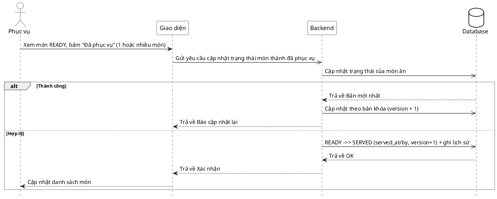

# Đặc tả Use-Case — Nhóm PHỤC VỤ (SERVER)

> **Mô tả nhóm:** Use-case mô tả nghiệp vụ phục vụ điều hành sàn: mở phiên walk-in,
> theo dõi lưới bàn & tín hiệu, xác nhận gọi nhân viên, đánh dấu đã phục vụ, xem chi
> tiết phiên theo bàn.
> **Group:** PHỤC VỤ (SERVER)
> **Nguồn luồng:** `docs/sequence-diagrams-4cot.md` — *"UC-13 — Đánh dấu đã phục vụ"*
> Route: `PATCH /api/v1/restaurant/order-items/:itemId/status` (quyền staff).

---

## UC-P13 — Đánh dấu đã phục vụ

### 1) Use-case đặc tả tổng quan

> Sơ đồ: [`uc-phuc-vu-13-danh-dau-da-phuc-vu.drawio`](./uc-phuc-vu-13-danh-dau-da-phuc-vu.drawio) — mở bằng draw.io / diagrams.net.

*Hình: ĐẶC TẢ USE-CASE PHỤC VỤ — ĐÁNH DẤU ĐÃ PHỤC VỤ*
Tác nhân **Phục vụ** giao tiếp với use-case «Đánh dấu đã phục vụ»; chuyển trạng thái món `READY → SERVED`, ghi lịch sử trạng thái (audit) và phát realtime cho Khách. Trạng thái là **theo từng order-item**; "phục vụ nhiều món" là gọi lặp thao tác cho từng món.

### 2) Bảng use-case chi tiết

| Mục | Nội dung |
|---|---|
| **Tên Use-Case** | Đánh dấu đã phục vụ |
| **Tác nhân** | Phục vụ (Server) — phụ: Hệ thống, Khách (nhận realtime) |
| **Mô tả** | Phục vụ bấm "Đã phục vụ" cho món đang `READY`. Hệ thống cập nhật trạng thái món; nếu trạng thái đã đổi bởi thao tác khác thì cập nhật theo bản khóa mới nhất (version + 1); nếu hợp lệ thì chuyển `READY → SERVED` (ghi `served_at`/`served_by`), tăng `version`, ghi lịch sử trạng thái `from → to` và phát realtime. |
| **Điều kiện** | Phục vụ đã đăng nhập (JWT, quyền staff). Món tồn tại (thường ở `READY`). |

**Luồng sự kiện chính (Thành công)**

| STT | Thực hiện bởi | Mô tả hành động | Kết quả hệ thống |
|---|---|---|---|
| 1 | Phục vụ | Xem món `READY`, bấm "Đã phục vụ" (1 hoặc nhiều món). | Giao diện gọi `PATCH /restaurant/order-items/:itemId/status` (`{ status: "SERVED" }`) cho từng món. |
| 2 | Hệ thống | Cập nhật trạng thái món. | Nếu trạng thái đã đổi (đua điều kiện) → cập nhật theo bản khóa mới nhất (version + 1). Nếu hợp lệ → chuyển `READY → SERVED`, đặt `served_at`/`served_by`, `version + 1`, ghi lịch sử `from → to`. |
| 3 | Hệ thống | Phát realtime. | Đẩy `/ws` cho màn Khách. |
| 4 | Phục vụ | Nhận xác nhận. | Cập nhật danh sách món. |

**Luồng sự kiện thay thế**

| STT | Thực hiện bởi | Mô tả hành động | Kết quả hệ thống |
|---|---|---|---|
| 1a | Hệ thống | `status` không thuộc `{PENDING, ACKNOWLEDGED, PREPARING, READY, SERVED}`. | Trả `400 "invalid item status"`. |
| 2a | Hệ thống | Trạng thái vừa đổi bởi thao tác khác (đua điều kiện). | Cập nhật theo bản khóa mới nhất (`version + 1` + lịch sử); giao diện nạp lại trạng thái mới. |

**Hậu điều kiện**

| | |
|---|---|
| **Thành công** | Món ở `SERVED` với `served_at`/`served_by`; lịch sử trạng thái ghi `from → to`; sự kiện `ordering.item_status_updated` phát realtime cho Khách. |
| **Thất bại** | Trạng thái không hợp lệ → báo lỗi, không đổi. |

### 3) Sơ đồ tuần tự (Sequence)

