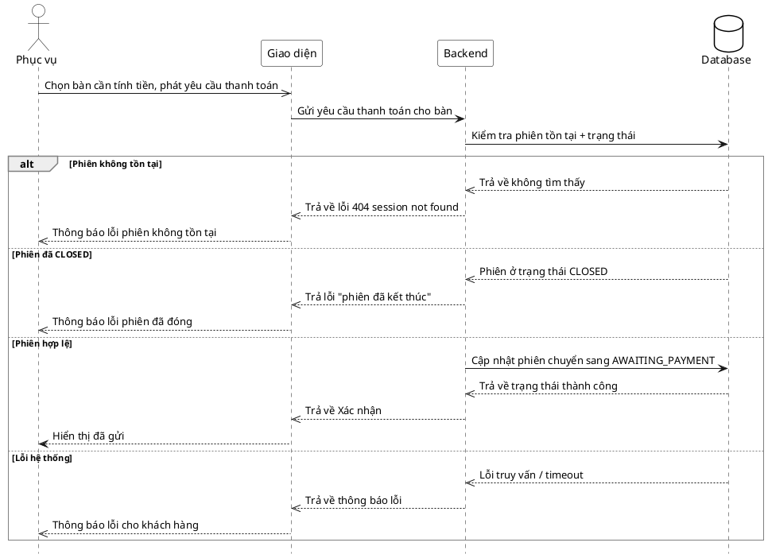

# Đặc tả Use-Case — Nhóm PHỤC VỤ (SERVER)

> **Mô tả nhóm:** Use-case mô tả nghiệp vụ phục vụ điều hành sàn: mở phiên walk-in,
> theo dõi lưới bàn & tín hiệu, xác nhận gọi nhân viên, đánh dấu đã phục vụ, xem chi
> tiết phiên theo bàn.
> **Group:** PHỤC VỤ (SERVER)
> **Nguồn luồng:** `docs/sequence-diagrams-4cot.md` — _"UC-14 — Yêu cầu thanh toán hộ"_
> Route: `POST /api/v1/restaurant/sessions/:sessionId/request-bill` (quyền staff).

---

## UC-P14 — Yêu cầu thanh toán hộ

### 1) Use-case đặc tả tổng quan

_Hình: ĐẶC TẢ USE-CASE PHỤC VỤ — YÊU CẦU THANH TOÁN HỘ_
Tác nhân **Phục vụ** giao tiếp với use-case «Yêu cầu thanh toán hộ»; thay khách phát yêu cầu tính tiền cho một bàn. Dùng chung use-case backend với «Yêu cầu thanh toán» của khách (UC-G08): chuyển phiên `AWAITING_PAYMENT` (khóa order) và đẩy realtime cho Thu ngân.

### 2) Bảng use-case chi tiết

| Mục              | Nội dung                                                                                                                                                        |
| ---------------- | --------------------------------------------------------------------------------------------------------------------------------------------------------------- |
| **Tên Use-Case** | Yêu cầu thanh toán hộ                                                                                                                                           |
| **Tác nhân**     | Phục vụ (Server) — phụ: Hệ thống, Thu ngân (nhận tín hiệu)                                                                                                      |
| **Mô tả**        | Phục vụ chọn bàn cần tính tiền và phát yêu cầu thanh toán thay khách. Hệ thống chuyển phiên sang `AWAITING_PAYMENT`, ghi tín hiệu và đẩy realtime cho Thu ngân. |
| **Điều kiện**    | Phục vụ đã đăng nhập (JWT, quyền staff). Phiên tồn tại và đang `ACTIVE`.                                                                                        |

**Luồng sự kiện chính (Thành công)**

| STT | Thực hiện bởi | Mô tả hành động                                                   | Kết quả hệ thống                                                   |
| --- | ------------- | ----------------------------------------------------------------- | ------------------------------------------------------------------ |
| 1   | Phục vụ       | Chọn bàn cần tính tiền, phát yêu cầu thanh toán.                  | Giao diện gọi `POST /restaurant/sessions/:sessionId/request-bill`. |
| 2   | Hệ thống      | Chuyển phiên `AWAITING_PAYMENT`, tạo tín hiệu yêu cầu thanh toán. | đẩy realtime cho Thu ngân.                                         |
| 3   | Phục vụ       | Nhận xác nhận.                                                    | Hiển thị "đã gửi"; bàn chuyển trạng thái chờ thanh toán.           |

**Luồng sự kiện thay thế**

| STT | Thực hiện bởi | Mô tả hành động                                    | Kết quả hệ thống                                                       |
| --- | ------------- | -------------------------------------------------- | ---------------------------------------------------------------------- |
| 1a  | Hệ thống      | Phiên không tồn tại (`sessionId` sai).             | Trả `404 session not found`.                                           |
| 1b  | Hệ thống      | Phiên đã `CLOSED`.                                 | Trả lỗi `phiên đã kết thúc`; không đổi trạng thái.                     |
| 2a  | Hệ thống      | Phiên đã `AWAITING_PAYMENT` (đã yêu cầu trước đó). | Idempotent — giữ trạng thái, xác nhận lại; không tạo lỗi.              |
| 2b  | Hệ thống      | Lỗi DB / backend 5xx / timeout.                    | Không đổi trạng thái, trả lỗi; giao diện hiển thị thông báo + thử lại. |

**Hậu điều kiện**

|                |                                                                                                                        |
| -------------- | ---------------------------------------------------------------------------------------------------------------------- |
| **Thành công** | Phiên chuyển `AWAITING_PAYMENT` (khóa order); tín hiệu `dining.bill_requested` đẩy realtime cho Thu ngân.              |
| **Thất bại**   | Phiên không tồn tại / đã `CLOSED` / lỗi hệ thống → không đổi trạng thái, không phát tín hiệu. Giao diện thông báo lỗi. |

### 3) Sơ đồ tuần tự (Sequence)

