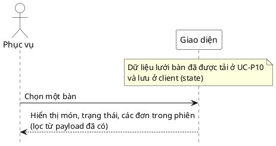

# Đặc tả Use-Case — Nhóm PHỤC VỤ (SERVER)

> **Mô tả nhóm:** Use-case mô tả nghiệp vụ phục vụ điều hành sàn: mở phiên walk-in,
> theo dõi lưới bàn & tín hiệu, xác nhận gọi nhân viên, đánh dấu đã phục vụ, xem chi
> tiết phiên theo bàn.
> **Group:** PHỤC VỤ (SERVER)
> **Nguồn luồng:** `docs/sequence-diagrams-4cot.md` — *"UC-15 — Xem chi tiết phiên/đơn theo bàn"*
> Route: `GET /api/v1/restaurant/tables` (payload lồng — không có endpoint chi tiết riêng).

---

## UC-P15 — Xem chi tiết phiên/đơn theo bàn

### 1) Use-case đặc tả tổng quan

*Hình: ĐẶC TẢ USE-CASE PHỤC VỤ — CHI TIẾT PHIÊN THEO BÀN*
Tác nhân **Phục vụ** giao tiếp với use-case «Xem chi tiết phiên/đơn theo bàn»; use-case «include» «Lấy đơn + order_item + trạng thái» của một bàn. Là bước drill-down từ lưới bàn (UC-P10) để xem món, trạng thái và các đơn trong phiên.

### 2) Bảng use-case chi tiết

| Mục | Nội dung |
|---|---|
| **Tên Use-Case** | Xem chi tiết phiên/đơn theo bàn |
| **Tác nhân** | Phục vụ (Server) — phụ: Hệ thống |
| **Mô tả** | Phục vụ chọn một bàn để xem chi tiết: các đơn trong phiên, từng `order_item` và trạng thái (kèm lịch sử). Dữ liệu lấy từ payload lồng của lưới bàn. |
| **Điều kiện** | Phục vụ đã đăng nhập (JWT, quyền staff). Bàn có phiên. |

**Luồng sự kiện chính (Thành công)**

| STT | Thực hiện bởi | Mô tả hành động | Kết quả hệ thống |
|---|---|---|---|---|
| 1 | Phục vụ | Chọn một bàn từ lưới bàn. | Giao diện lọc dữ liệu từ payload `GET /restaurant/tables` đã tải ở UC-P10 (client-side), không gọi thêm API. |
| 2 | Phục vụ | Xem chi tiết. | Hiển thị món, trạng thái, các đơn trong phiên. |

**Luồng sự kiện thay thế**

| STT | Thực hiện bởi | Mô tả hành động | Kết quả hệ thống |
|---|---|---|---|---|
| 1a | Giao diện | Bàn chưa có phiên. | Hiển thị bàn trống, không có đơn. |

> **Ghi chú hiện trạng triển khai:** UC-P15 hoàn toàn là client-side drill-down từ payload `GET /restaurant/tables` (StaffTables) đã tải ở UC-P10. Không gọi thêm API, không có lỗi backend riêng. Các lỗi "bàn không tồn tại" / "lỗi hệ thống" đã được xử lý ở UC-P10 khi tải lưới bàn.

**Hậu điều kiện**

| | |
|---|---|
| **Thành công** | Phục vụ xem được toàn bộ đơn/món + trạng thái của một bàn. Chỉ đọc. |
| **Thất bại** | Bàn chưa có phiên → hiển thị trống. |

### 3) Sơ đồ tuần tự (Sequence)

