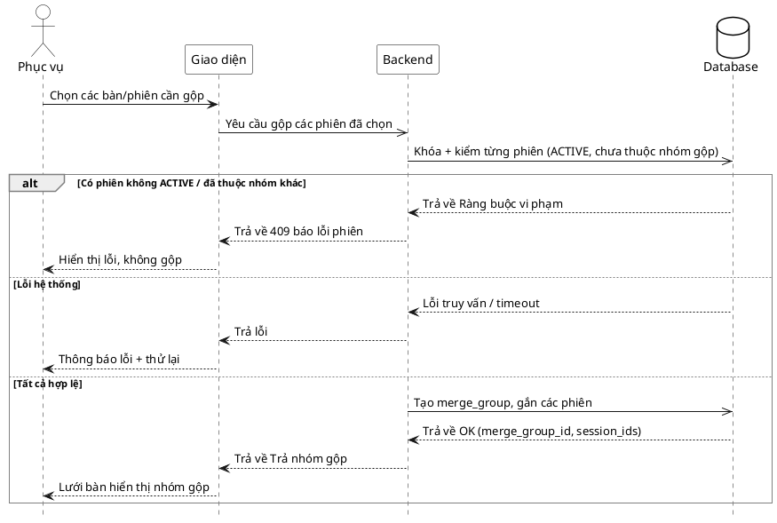

# Đặc tả Use-Case — Nhóm PHỤC VỤ (SERVER)

> **Mô tả nhóm:** Use-case mô tả nghiệp vụ phục vụ điều hành sàn: mở phiên walk-in,
> theo dõi lưới bàn & tín hiệu, xác nhận gọi nhân viên, đánh dấu đã phục vụ, gộp/tách
> phiên nhiều bàn.
> **Group:** PHỤC VỤ (SERVER)
> **Nguồn:** Bổ sung từ hệ thống đã triển khai (không có trong danh sách UC-01…31 gốc).
> Route: `POST /api/v1/restaurant/sessions/merge` (quyền `dining:serve`).

---

## UC-P32 — Gộp phiên (nhiều bàn)

### 1) Use-case đặc tả tổng quan

_Hình: ĐẶC TẢ USE-CASE PHỤC VỤ — GỘP PHIÊN_
Tác nhân **Phục vụ** giao tiếp với use-case «Gộp phiên»; use-case «include» «Kiểm phiên ACTIVE & chưa thuộc nhóm gộp». Khi một nhóm khách ngồi nhiều bàn muốn tính tiền chung, phục vụ gộp các phiên ACTIVE thành một `merge_group` để lập hóa đơn gộp cuối phiên. Nghịch đảo là «Tách phiên» (UC-P33).

### 2) Bảng use-case chi tiết

| Mục              | Nội dung                                                                                                                                                                                                                                                                            |
| ---------------- | ----------------------------------------------------------------------------------------------------------------------------------------------------------------------------------------------------------------------------------------------------------------------------------- |
| **Tên Use-Case** | Gộp phiên (nhiều bàn)                                                                                                                                                                                                                                                               |
| **Tác nhân**     | Phục vụ (Server) — phụ: Hệ thống                                                                                                                                                                                                                                                    |
| **Mô tả**        | Phục vụ chọn từ 2 phiên ACTIVE trở lên để gộp thành một nhóm (`merge_group`). Hệ thống kiểm mỗi phiên đang ACTIVE và chưa thuộc nhóm gộp nào, tạo nhóm và gắn các phiên vào, phát realtime. Từng phiên/bàn vẫn giữ nguyên món đã gọi; việc gộp phục vụ cho tính tiền/hóa đơn chung. |
| **Điều kiện**    | Phục vụ đã đăng nhập (JWT, quyền `dining:serve`). Có ≥ 2 phiên ACTIVE chưa thuộc nhóm gộp nào.                                                                                                                                                                                      |

**Luồng sự kiện chính (Thành công)**

| STT | Thực hiện bởi | Mô tả hành động                                                     | Kết quả hệ thống                                                                                 |
| --- | ------------- | ------------------------------------------------------------------- | ------------------------------------------------------------------------------------------------ |
| 1   | Phục vụ       | Chọn các bàn/phiên cần gộp (≥ 2 phiên).                             | Giao diện kiểm `session_ids` ≥ 2; dựng danh sách gửi đi.                                         |
| 2   | Phục vụ       | Xác nhận gộp (`POST /restaurant/sessions/merge` `{ session_ids }`). | Gửi request đến hệ thống.                                                                        |
| 3   | Hệ thống      | Khóa & kiểm từng phiên: ACTIVE và chưa thuộc nhóm gộp nào.          | Tất cả hợp lệ → tạo `merge_group`, gắn các phiên vào nhóm; trả `merge_group_id` + `session_ids`. |
| 4   | Phục vụ       | Nhận kết quả.                                                       | Lưới bàn hiển thị các bàn thuộc cùng nhóm gộp.                                                   |

**Luồng sự kiện thay thế (trong khi gộp)**

| STT | Thực hiện bởi | Mô tả hành động                       | Kết quả hệ thống                                                   |
| --- | ------------- | ------------------------------------- | ------------------------------------------------------------------ |
| 1a  | Giao diện     | Số bàn/phiên được chọn < 2.           | Vô hiệu nút "Xác nhận gộp"; hướng dẫn chọn ≥ 2 phiên.              |
| 3a  | Hệ thống      | Một phiên không ở trạng thái ACTIVE.  | Trả `409 "session … is not active"`; không tạo nhóm.               |
| 3b  | Hệ thống      | Một phiên đã thuộc một nhóm gộp khác. | Trả `409 "session … is already in a merge group"`; không tạo nhóm. |
| 3c  | Hệ thống      | Lỗi DB / backend 5xx / timeout.       | Trả lỗi; không tạo nhóm. Giao diện thông báo + thử lại.            |

**Sau khi gộp**

| STT | Thực hiện bởi | Mô tả hành động                                   | Kết quả hệ thống                                                                                                                                                                                                                                          |
| --- | ------------- | ------------------------------------------------- | --------------------------------------------------------------------------------------------------------------------------------------------------------------------------------------------------------------------------------------------------------- |
| —   | Phục vụ       | Gộp xong phát hiện sai (gộp lộn bàn / thiếu bàn). | Dùng UC-P33 (Tách phiên) để **giải tán toàn bộ nhóm**, sau đó gộp lại đúng từ đầu. _(Giới hạn: UC-P33 hiện chỉ hỗ trợ giải tán cả merge_group, không hỗ trợ tách từng phiên riêng lẻ.)_                                                                   |
| —   | Phục vụ       | Muốn thêm một phiên nữa vào nhóm gộp đã có.       | Gộp lại với danh sách `session_ids` bao gồm cả phiên đã trong nhóm + phiên mới. Hệ thống kiểm tất cả hợp lệ và gắn thêm. _(Lưu ý: nếu dùng chung endpoint `POST /sessions/merge` thì cần cho phép gộp phiên đã trong nhóm — thiết kế triển khai cụ thể.)_ |

> **Design note — Tách một phiên riêng lẻ khỏi nhóm:**  
> Hiện tại UC-P33 chỉ hỗ trợ giải tán **toàn bộ** merge_group. Nếu sau này cần tách từng phiên riêng lẻ (vd gộp 3 bàn, chỉ muốn rút 1 bàn ra trước khi tính tiền), cần:
> - Mở rộng UC-P33 hoặc thêm endpoint `POST /sessions/merge/remove` cho phép chỉ định `session_id` cần rút.
> - Xử lý trường hợp đặc biệt: nhóm chỉ còn **1 phiên** sau khi rút → tự động giải tán nhóm (không để nhóm 1 phiên tồn tại).

**Hậu điều kiện**

|                |                                                                                                                                                                   |
| -------------- | ----------------------------------------------------------------------------------------------------------------------------------------------------------------- |
| **Thành công** | Các phiên được gắn vào một `merge_group`; sự kiện `dining.sessions_merged` phát realtime; hóa đơn cuối phiên có thể lập gộp. Món đã gọi của từng phiên không đổi. |
| **Thất bại**   | Không tạo nhóm gộp: thiếu phiên, phiên không ACTIVE, hoặc phiên đã thuộc nhóm khác. Các phiên giữ nguyên.                                                         |
| **Hoàn tác**   | Gộp nhầm → dùng UC-P33 (Tách phiên) để tách.                                                                                                                      |

### 3) Sơ đồ tuần tự (Sequence)

@startuml
hide footbox
skinparam participant {
BackgroundColor White
BorderColor Black
}
skinparam actor {
BackgroundColor White
BorderColor Black
}
skinparam database {
BackgroundColor White
BorderColor Black
}
skinparam sequenceGroupBorderThickness 1
skinparam sequenceGroupBorderColor Gray
actor "Phục vụ" as A
participant "Giao diện" as UI
participant "Backend" as BE
database "Database" as DB

A ->> UI : Chọn các bàn/phiên cần gộp
UI -> BE : Yêu cầu gộp các phiên đã chọn
BE -> DB: Kiểm tra yêu cầu gộp của yêu cầu

alt Có phiên không ACTIVE / đã thuộc nhóm khác
DB -->> BE : Trả về Ràng buộc vi phạm
BE -->> UI : Trả về trạng thái 409 báo lỗi phiên
UI -->> A : Hiển thị lỗi không thể gộp bàn
else Lỗi hệ thống
DB -->> BE : Lỗi truy vấn / timeout
BE -->> UI : Trả về lỗi
UI -->> A : Thông báo lỗi cho khách hàng
else Tất cả hợp lệ
BE -> DB : Tạo group
DB -->> BE : Trả về trạng thái thành công
BE -->> UI : Trả về thông tin nhóm đã gộp
UI -->> A : Lưới bàn hiển thị nhóm gộp
end
@enduml
