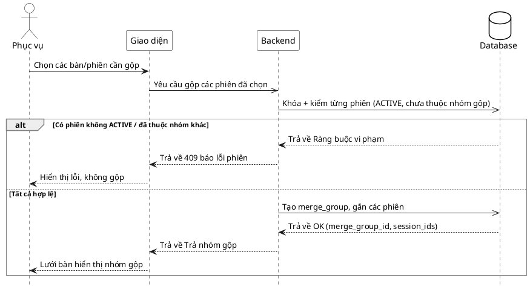

# Đặc tả Use-Case — Nhóm PHỤC VỤ (SERVER)

> **Mô tả nhóm:** Use-case mô tả nghiệp vụ phục vụ điều hành sàn: mở phiên walk-in,
> theo dõi lưới bàn & tín hiệu, xác nhận gọi nhân viên, đánh dấu đã phục vụ, gộp/tách
> phiên nhiều bàn.
> **Group:** PHỤC VỤ (SERVER)
> **Nguồn:** Bổ sung từ hệ thống đã triển khai (không có trong danh sách UC-01…31 gốc).
> Route: `POST /api/v1/restaurant/sessions/merge` (quyền `dining:serve`).

---

## UC-P32 — Gộp phiên (nhiều bàn)

### 1) Use-case đặc tả tổng quan

*Hình: ĐẶC TẢ USE-CASE PHỤC VỤ — GỘP PHIÊN*
Tác nhân **Phục vụ** giao tiếp với use-case «Gộp phiên»; use-case «include» «Kiểm phiên ACTIVE & chưa thuộc nhóm gộp». Khi một nhóm khách ngồi nhiều bàn muốn tính tiền chung, phục vụ gộp các phiên ACTIVE thành một `merge_group` để lập hóa đơn gộp cuối phiên. Nghịch đảo là «Tách phiên» (UC-P33).

### 2) Bảng use-case chi tiết

| Mục | Nội dung |
|---|---|
| **Tên Use-Case** | Gộp phiên (nhiều bàn) |
| **Tác nhân** | Phục vụ (Server) — phụ: Hệ thống |
| **Mô tả** | Phục vụ chọn từ 2 phiên ACTIVE trở lên để gộp thành một nhóm (`merge_group`). Hệ thống kiểm mỗi phiên đang ACTIVE và chưa thuộc nhóm gộp nào, tạo nhóm và gắn các phiên vào, phát realtime. Từng phiên/bàn vẫn giữ nguyên món đã gọi; việc gộp phục vụ cho tính tiền/hóa đơn chung. |
| **Điều kiện** | Phục vụ đã đăng nhập (JWT, quyền `dining:serve`). Có ≥ 2 phiên ACTIVE chưa thuộc nhóm gộp nào. |

**Luồng sự kiện chính (Thành công)**

| STT | Thực hiện bởi | Mô tả hành động | Kết quả hệ thống |
|---|---|---|---|
| 1 | Phục vụ | Chọn các bàn/phiên cần gộp. | Giao diện dựng danh sách `session_ids` (≥ 2). |
| 2 | Phục vụ | Xác nhận gộp (`POST /restaurant/sessions/merge` `{ session_ids }`). | Hệ thống khóa & kiểm từng phiên: ACTIVE + chưa thuộc nhóm gộp. |
| 3 | Hệ thống | Tất cả phiên hợp lệ. | Tạo `merge_group`, gắn các phiên vào nhóm; trả `merge_group_id` + `session_ids`. |
| 4 | Phục vụ | Nhận kết quả. | Lưới bàn hiển thị các bàn thuộc cùng nhóm gộp. |

**Luồng sự kiện thay thế**

| STT | Thực hiện bởi | Mô tả hành động | Kết quả hệ thống |
|---|---|---|---|
| 2a | Hệ thống | `session_ids` < 2. | Trả `400 "at least 2 sessions are required to merge"`; không gộp. |
| 3a | Hệ thống | Một phiên không ở trạng thái ACTIVE. | Trả `409 "session … is not active"`; không tạo nhóm. |
| 3b | Hệ thống | Một phiên đã thuộc một nhóm gộp khác. | Trả `409 "session … is already in a merge group"`; không tạo nhóm. |

**Hậu điều kiện**

| | |
|---|---|
| **Thành công** | Các phiên được gắn vào một `merge_group`; sự kiện `dining.sessions_merged` phát realtime; hóa đơn cuối phiên có thể lập gộp. Món đã gọi của từng phiên không đổi. |
| **Thất bại** | Không tạo nhóm gộp: thiếu phiên, phiên không ACTIVE, hoặc phiên đã thuộc nhóm khác. Các phiên giữ nguyên. |

### 3) Sơ đồ tuần tự (Sequence)

