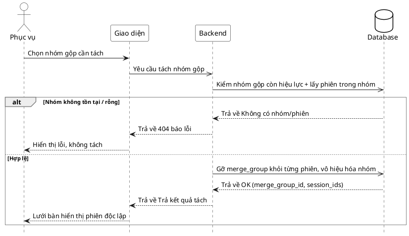

# Đặc tả Use-Case — Nhóm PHỤC VỤ (SERVER)

> **Mô tả nhóm:** Use-case mô tả nghiệp vụ phục vụ điều hành sàn: mở phiên walk-in,
> theo dõi lưới bàn & tín hiệu, xác nhận gọi nhân viên, đánh dấu đã phục vụ, gộp/tách
> phiên nhiều bàn.
> **Group:** PHỤC VỤ (SERVER)
> **Nguồn:** Bổ sung từ hệ thống đã triển khai (không có trong danh sách UC-01…31 gốc).
> Route: `POST /api/v1/restaurant/sessions/split` (quyền `dining:serve`).

---

## UC-P33 — Tách phiên (hủy gộp)

### 1) Use-case đặc tả tổng quan

> Sơ đồ: [`uc-phuc-vu-33-tach-phien.drawio`](./uc-phuc-vu-33-tach-phien.drawio) — mở bằng draw.io / diagrams.net.

*Hình: ĐẶC TẢ USE-CASE PHỤC VỤ — TÁCH PHIÊN*
Tác nhân **Phục vụ** giao tiếp với use-case «Tách phiên»; use-case «include» «Kiểm nhóm gộp còn hiệu lực». Đây là nghịch đảo của «Gộp phiên» (UC-P32): gỡ các phiên khỏi `merge_group` và vô hiệu hóa nhóm, trả mỗi phiên về độc lập (tính tiền riêng).

### 2) Bảng use-case chi tiết

| Mục | Nội dung |
|---|---|
| **Tên Use-Case** | Tách phiên (hủy gộp) |
| **Tác nhân** | Phục vụ (Server) — phụ: Hệ thống |
| **Mô tả** | Phục vụ chọn một nhóm gộp để tách. Hệ thống kiểm nhóm gộp còn hiệu lực, gỡ `merge_group` khỏi từng phiên trong nhóm, vô hiệu hóa nhóm và phát realtime. Sau tách, mỗi phiên độc lập trở lại và tính tiền riêng. |
| **Điều kiện** | Phục vụ đã đăng nhập (JWT, quyền `dining:serve`). Tồn tại một `merge_group` đang hiệu lực (chưa lập/đóng hóa đơn gộp). |

**Luồng sự kiện chính (Thành công)**

| STT | Thực hiện bởi | Mô tả hành động | Kết quả hệ thống |
|---|---|---|---|
| 1 | Phục vụ | Chọn nhóm gộp cần tách. | Giao diện gửi `merge_group_id`. |
| 2 | Phục vụ | Xác nhận tách (`POST /restaurant/sessions/split` `{ merge_group_id }`). | Hệ thống kiểm nhóm gộp còn hiệu lực, lấy các phiên trong nhóm. |
| 3 | Hệ thống | Nhóm hợp lệ, có phiên. | Gỡ `merge_group` khỏi từng phiên, vô hiệu hóa nhóm; trả `merge_group_id` + `session_ids` đã tách. |
| 4 | Phục vụ | Nhận kết quả. | Lưới bàn hiển thị các phiên độc lập trở lại. |

**Luồng sự kiện thay thế**

| STT | Thực hiện bởi | Mô tả hành động | Kết quả hệ thống |
|---|---|---|---|
| 2a | Hệ thống | Thiếu `merge_group_id`. | Trả `400 "merge_group_id is required"`; không tách. |
| 2b | Hệ thống | Nhóm gộp không tồn tại / không còn hiệu lực. | Trả `404`; không tách. |
| 3a | Hệ thống | Nhóm không có phiên nào. | Trả `404 "no sessions found in merge group"`. |

**Hậu điều kiện**

| | |
|---|---|
| **Thành công** | Các phiên được gỡ khỏi `merge_group`, nhóm bị vô hiệu hóa; sự kiện `dining.sessions_split` phát realtime; mỗi phiên độc lập, tính tiền riêng. |
| **Thất bại** | Không tách: thiếu tham số, nhóm không tồn tại/không hiệu lực, hoặc nhóm rỗng. Trạng thái gộp giữ nguyên. |

### 3) Sơ đồ tuần tự (Sequence)

