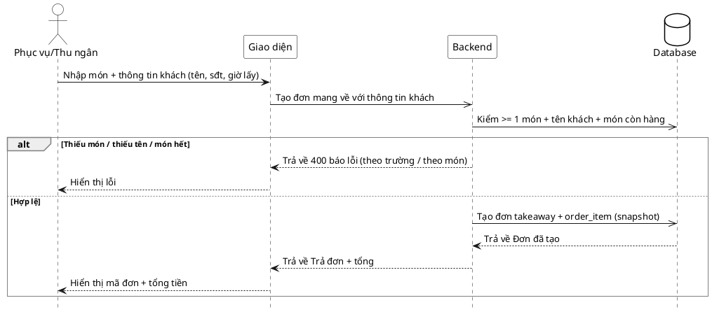

# Đặc tả Use-Case — Nhóm PHỤC VỤ (SERVER)

> **Group:** PHỤC VỤ (SERVER) — dùng chung với Thu ngân
> **Nguồn:** Bổ sung từ hệ thống đã triển khai (không có trong danh sách UC-01…31 gốc).
> Route: `POST /api/v1/restaurant/orders/takeaway` (route nhóm staff ordering).

---

## UC-P38 — Đơn mang về (takeaway)

### 1) Use-case đặc tả tổng quan

*Hình: ĐẶC TẢ USE-CASE PHỤC VỤ — ĐƠN MANG VỀ*
Tác nhân **Phục vụ/Thu ngân** giao tiếp với use-case «Đơn mang về»; use-case «include» «Kiểm món còn hàng». Khác đơn tại bàn: đơn mang về gắn thông tin khách (tên/điện thoại/giờ lấy) thay vì phiên bàn, nhưng vẫn tạo `order_item` (snapshot) và đẩy ticket cho Bếp.

### 2) Bảng use-case chi tiết

| Mục | Nội dung |
|---|---|
| **Tên Use-Case** | Đơn mang về (takeaway) |
| **Tác nhân** | Phục vụ / Thu ngân — phụ: Hệ thống, Bếp (nhận ticket) |
| **Mô tả** | Nhân viên tạo đơn mang về với danh sách món và thông tin khách (tên bắt buộc, điện thoại/giờ lấy/ghi chú tùy chọn). Hệ thống kiểm món còn hàng, tạo đơn loại takeaway với snapshot tên/giá và đẩy ticket cho Bếp. |
| **Điều kiện** | Nhân viên đã đăng nhập (JWT, quyền staff). Có ≥ 1 món và tên khách. |

**Luồng sự kiện chính (Thành công)**

| STT | Thực hiện bởi | Mô tả hành động | Kết quả hệ thống |
|---|---|---|---|
| 1 | Nhân viên | Nhập món + thông tin khách (tên, [điện thoại, giờ lấy, ghi chú]). | Giao diện gọi `POST /restaurant/orders/takeaway`. |
| 2 | Hệ thống | Kiểm có ≥ 1 món, có tên khách, kiểm từng món còn hàng. | Hợp lệ. |
| 3 | Hệ thống | Tạo đơn takeaway + `order_item` (snapshot tên/giá). | đẩy ticket realtime cho Bếp; trả đơn + tổng. |
| 4 | Nhân viên | Nhận xác nhận. | Hiển thị mã đơn + tổng tiền. |

**Luồng sự kiện thay thế**

| STT | Thực hiện bởi | Mô tả hành động | Kết quả hệ thống |
|---|---|---|---|
| 2a | Hệ thống | Danh sách món rỗng. | Trả `400 "order must contain at least one item"`. |
| 2b | Hệ thống | Thiếu tên khách. | Trả `400 "customer_name is required for takeaway orders"`. |
| 3a | Hệ thống | Có món hết hàng. | Trả lỗi theo món; không tạo đơn. |

**Hậu điều kiện**

| | |
|---|---|
| **Thành công** | Tạo đơn takeaway với `order_item` snapshot; ticket đẩy cho Bếp; nhân viên nhận mã đơn + tổng. |
| **Thất bại** | Không tạo đơn: thiếu món, thiếu tên khách, hoặc món hết hàng. |

### 3) Sơ đồ tuần tự (Sequence)

