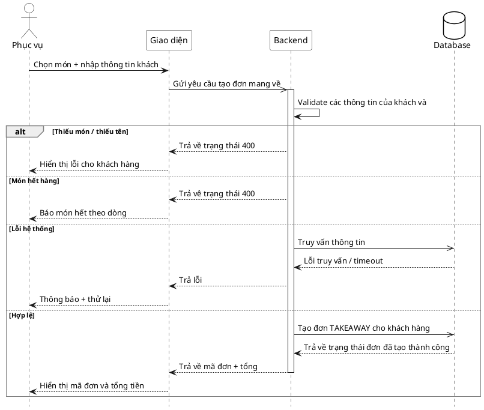

# Đặc tả Use-Case — Nhóm PHỤC VỤ (SERVER)

> **Group:** PHỤC VỤ (SERVER) — dùng chung với Thu ngân
> **Nguồn:** Bổ sung từ hệ thống đã triển khai (không có trong danh sách UC-01…31 gốc).
> **Ghi chú:** Use-case chia làm 2 sub-flow riêng: (A) takeaway cho khách đang có phiên tại bàn, (B) takeaway cho khách walk-in.

---

## UC-P38A — Đơn mang về (takeaway tại bàn — dine-in)

### 1) Đặc tả tổng quan

> Sơ đồ: [`uc-phuc-vu-38-don-mang-ve.drawio`](./uc-phuc-vu-38-don-mang-ve.drawio) — mở bằng draw.io / diagrams.net.

Tác nhân **Phục vụ** giao tiếp với use-case «Đơn mang về tại bàn». Khách đang có phiên ACTIVE muốn gọi thêm món **mang về** (không ăn tại bàn). Món này vẫn thuộc phiên hiện tại và tính vào hóa đơn chung của bàn. **Không cần nhập thông tin khách** vì đã có thông tin phiên.

Hiện trạng: chưa triển khai backend. Cần mở rộng endpoint gọi món để đánh dấu `is_takeaway: true` trên từng order-item hoặc tạo đơn riêng nhưng gắn cùng phiên.

### 2) Bảng use-case chi tiết

| Mục              | Nội dung                                                                                                                                             |
| ---------------- | ---------------------------------------------------------------------------------------------------------------------------------------------------- |
| **Tên Use-Case** | Đơn mang về tại bàn                                                                                                                                  |
| **Tác nhân**     | Phục vụ — phụ: Hệ thống, Bếp (nhận ticket)                                                                                                           |
| **Mô tả**        | Phục vụ chọn bàn có phiên ACTIVE, thêm món mang về vào phiên đó. Món tạo ra gắn `is_takeaway` để Bếp biết đóng gói. Tính tiền chung với hóa đơn bàn. |
| **Điều kiện**    | Phục vụ đã đăng nhập (JWT, quyền staff). Bàn có phiên ACTIVE. Có ≥ 1 món.                                                                            |

**Luồng sự kiện chính (Thành công)**

| STT | Thực hiện bởi | Mô tả hành động                                                              | Kết quả hệ thống                                       |
| --- | ------------- | ---------------------------------------------------------------------------- | ------------------------------------------------------ |
| 1   | Phục vụ       | Chọn bàn, chọn món, bật toggle "Mang về" cho món đó.                         | Giao diện đánh dấu `is_takeaway: true` trên từng item. |
| 2   | Phục vụ       | Xác nhận — gửi đơn.                                                          | Gọi API gọi món với cờ takeaway (ghi chú món).         |
| 3   | Hệ thống      | Kiểm: phiên ACTIVE, món còn hàng, ≥ 1 món.                                   | Hợp lệ.                                                |
| 4   | Hệ thống      | Tạo `order_item` với `is_takeaway = true` (snapshot tên/giá), gắn vào phiên. | Đẩy ticket Bếp có tag "MANG VỀ"; trả xác nhận.         |
| 5   | Phục vụ       | Nhận kết quả.                                                                | Món mang về hiển thị trong phiên với badge "Mang về".  |

**Luồng sự kiện thay thế**

| STT | Thực hiện bởi | Mô tả hành động                             | Kết quả hệ thống                                       |
| --- | ------------- | ------------------------------------------- | ------------------------------------------------------ |
| 1a  | Hệ thống      | Phiên không ACTIVE.                         | Báo lỗi; không cho thêm món.                           |
| 3a  | Hệ thống      | Có món hết hàng / sai variant / sai option. | Báo lỗi theo dòng; không tạo đơn.                      |
| 3b  | Hệ thống      | Lỗi DB / backend 5xx / timeout.             | Trả lỗi; không tạo đơn. Giao diện thông báo + thử lại. |

**Hậu điều kiện**

|                |                                                                                                                      |
| -------------- | -------------------------------------------------------------------------------------------------------------------- |
| **Thành công** | Món mang về được tạo trong phiên với `is_takeaway = true`; ticket Bếp có tag "MANG VỀ"; tính tiền chung hóa đơn bàn. |
| **Thất bại**   | Không tạo được món: phiên không hợp lệ / món hết / lỗi hệ thống.                                                     |

---

## UC-P38B — Đơn mang về (walk-in takeaway)

### 1) Đặc tả tổng quan

Tác nhân **Phục vụ** giao tiếp với use-case «Đơn mang về walk-in». Khách đến mua đồ mang về, không ngồi bàn. Hệ thống tạo đơn takeaway **độc lập** (không gắn session) với thông tin khách hàng và đẩy ticket cho Bếp.

Đã triển khai backend: `POST /api/v1/restaurant/orders/takeaway` (StaffTakeawayOrder).

### 2) Bảng use-case chi tiết

| Mục              | Nội dung                                                                                                                                                                |
| ---------------- | ----------------------------------------------------------------------------------------------------------------------------------------------------------------------- |
| **Tên Use-Case** | Đơn mang về walk-in                                                                                                                                                     |
| **Tác nhân**     | Phục vụ / Thu ngân — phụ: Hệ thống, Bếp (nhận ticket)                                                                                                                   |
| **Mô tả**        | Nhân viên tạo đơn mang về độc lập với danh sách món và thông tin khách. Hệ thống kiểm món còn hàng, tạo đơn loại `TAKEAWAY` với snapshot tên/giá và đẩy ticket cho Bếp. |
| **Điều kiện**    | Nhân viên đã đăng nhập (JWT, quyền staff). Có ≥ 1 món. Có tên khách hàng.                                                                                               |

**Luồng sự kiện chính (Thành công)**

| STT | Thực hiện bởi | Mô tả hành động                                                                   | Kết quả hệ thống                                                              |
| --- | ------------- | --------------------------------------------------------------------------------- | ----------------------------------------------------------------------------- |
| 1   | Phục vụ       | Nhập món (có thể chọn variant/option).                                            | Giỏ hàng dựng danh sách `items[]`.                                            |
| 2   | Phục vụ       | Nhập thông tin khách: tên (bắt buộc), điện thoại, giờ lấy, ghi chú (tuỳ chọn).    | Giao diện dựng `{ items, customer_name, customer_phone, pickup_time, note }`. |
| 3   | Phục vụ       | Xác nhận gửi đơn (`POST /restaurant/orders/takeaway`).                            | Gửi request đến hệ thống.                                                     |
| 4   | Hệ thống      | Kiểm: ≥ 1 món, có tên khách, từng món còn hàng (variant/option hợp lệ).           | Hợp lệ.                                                                       |
| 5   | Hệ thống      | Tạo đơn `TAKEAWAY` + `order_item` (snapshot tên/giá), gắn mã đơn dạng `TA-xxxxx`. | Đẩy ticket realtime cho Bếp; trả `order_id` + `order_number` + `total_vnd`.   |
| 6   | Phục vụ       | Nhận kết quả.                                                                     | Hiển thị mã đơn + tổng tiền + thông tin khách.                                |

**Luồng sự kiện thay thế**

| STT | Thực hiện bởi | Mô tả hành động                             | Kết quả hệ thống                                        |
| --- | ------------- | ------------------------------------------- | ------------------------------------------------------- |
| 1a  | Giao diện     | Không có món nào trong giỏ.                 | Vô hiệu nút "Tạo đơn"; hướng dẫn chọn ≥ 1 món.          |
| 2a  | Giao diện     | Thiếu tên khách hàng.                       | Vô hiệu nút "Tạo đơn"; báo nhập tên.                    |
| 4a  | Hệ thống      | Có món hết hàng / sai variant / sai option. | Trả `400` + lỗi theo dòng `line_errors`; không tạo đơn. |
| 4b  | Hệ thống      | Lỗi DB / backend 5xx / timeout.             | Trả lỗi; không tạo đơn. Giao diện thông báo + thử lại.  |

**Hậu điều kiện**

|                |                                                                                                      |
| -------------- | ---------------------------------------------------------------------------------------------------- |
| **Thành công** | Tạo đơn `TAKEAWAY` với `order_item` snapshot; ticket đẩy cho Bếp; nhân viên nhận mã đơn + tổng tiền. |
| **Thất bại**   | Không tạo đơn: thiếu món, thiếu tên khách, món hết hàng, hoặc lỗi hệ thống.                          |

### 3) Sơ đồ tuần tự (Sequence) — Walk-in takeaway

