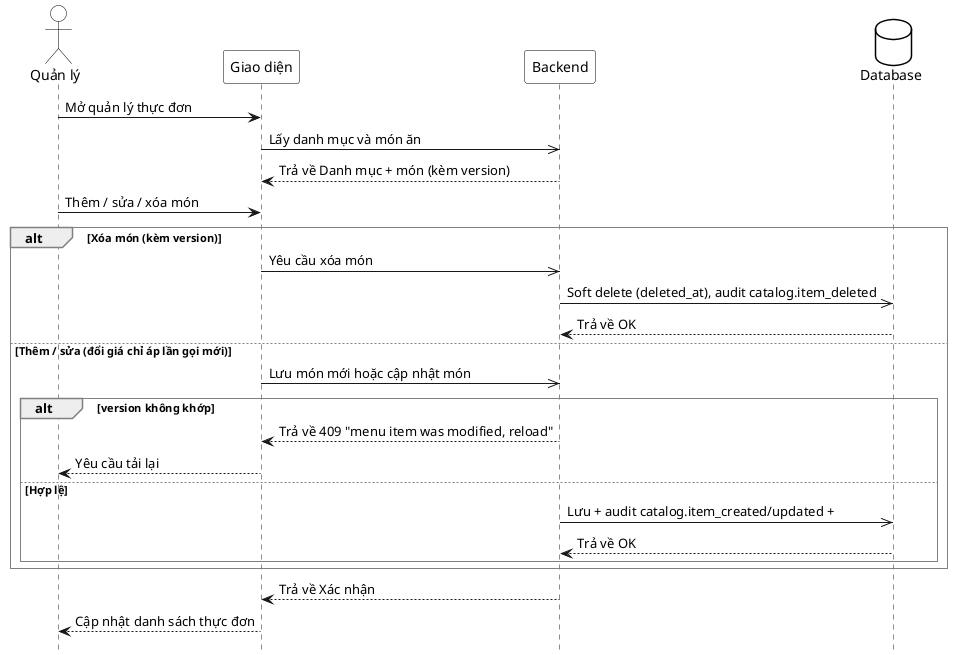

# Đặc tả Use-Case — Nhóm QUẢN LÝ (MANAGER)

> **Mô tả nhóm:** Use-case mô tả nghiệp vụ quản trị: quản lý thực đơn (CRUD),
> bật/tắt còn-hết, quản lý mã QR theo bàn, quản lý bàn/khu vực, quản lý người
> dùng & phân quyền, xem báo cáo & thống kê. Toàn bộ dùng JWT + RBAC theo quyền.
> **Group:** QUẢN LÝ (MANAGER)
> **Nguồn luồng:** `docs/sequence-diagrams-4cot.md` — _"UC-26 — Quản lý thực đơn (CRUD)"_

---

## UC-M26 — Quản lý thực đơn (CRUD)

### 1) Use-case đặc tả tổng quan

> Sơ đồ: [`uc-quan-ly-26-quan-ly-thuc-don.drawio`](./uc-quan-ly-26-quan-ly-thuc-don.drawio) — mở bằng draw.io / diagrams.net.

_Hình: ĐẶC TẢ USE-CASE QUẢN LÝ — QUẢN LÝ THỰC ĐƠN_
Tác nhân **Quản lý** giao tiếp với use-case «Quản lý thực đơn»; use-case gồm các thao tác «Thêm món», «Sửa món», «Xóa món» (soft delete) và «Xem danh mục/món». «Xóa» và «Sửa» «include» «Kiểm khóa lạc quan (version)». Đổi giá **chỉ áp cho lần gọi mới** — order_item đã snapshot giữ nguyên. Mỗi thao tác ghi/phát sự kiện realtime + ghi audit.

### 2) Bảng use-case chi tiết

| Mục              | Nội dung                                                                                                                                                                                                                                                                                          |
| ---------------- | ------------------------------------------------------------------------------------------------------------------------------------------------------------------------------------------------------------------------------------------------------------------------------------------------- |
| **Tên Use-Case** | Quản lý thực đơn (CRUD)                                                                                                                                                                                                                                                                           |
| **Tác nhân**     | Quản lý (Manager) — quyền `catalog:manage`                                                                                                                                                                                                                                                        |
| **Mô tả**        | Quản lý xem danh mục/món, thêm món mới, sửa (tên/giá/mô tả/ảnh/danh mục), xóa món (soft delete `deleted_at`). Sửa/xóa cần đúng `version` (khóa lạc quan). Đổi giá **không** ảnh hưởng order_item/invoice_item đã snapshot. Mỗi thao tác ghi audit + phát realtime để màn Khách (UC-K02) cập nhật. |
| **Điều kiện**    | Quản lý đã đăng nhập (JWT), có quyền `catalog:manage`.                                                                                                                                                                                                                                            |

**Luồng sự kiện chính (Thêm / Sửa món)**

| STT | Thực hiện bởi | Mô tả hành động                                              | Kết quả hệ thống                                                                                      |
| --- | ------------- | ------------------------------------------------------------ | ----------------------------------------------------------------------------------------------------- |
| 1   | Quản lý       | Mở quản lý thực đơn.                                         | Giao diện gọi `GET /restaurant/menu/categories` và `GET /restaurant/menu/items` (lọc `?category_id`). |
| 2   | Quản lý       | Thêm món mới, điền tên/giá/danh mục.                         | Gọi `POST /restaurant/menu/items`.                                                                    |
| 3   | Hệ thống      | Lưu món; ghi audit `catalog.item_created`.                   | trả món đã tạo (kèm `version`).                                                                       |
| 4   | Quản lý       | Sửa món có sẵn, gửi kèm `version` hiện tại.                  | Gọi `PUT /restaurant/menu/items/:id`.                                                                 |
| 5   | Hệ thống      | Kiểm `version` khớp; cập nhật; audit `catalog.item_updated`. | trả món mới (`version+1`).                                                                            |
| 6   | Quản lý       | Nhận kết quả.                                                | Danh sách thực đơn cập nhật; màn Khách nhận realtime.                                                 |

**Luồng sự kiện thay thế**

| STT | Thực hiện bởi | Mô tả hành động                                | Kết quả hệ thống                                                                                                      |
| --- | ------------- | ---------------------------------------------- | --------------------------------------------------------------------------------------------------------------------- |
| A1  | Quản lý       | Xóa món (gửi kèm `version`).                   | Gọi `DELETE /restaurant/menu/items/:id`; soft delete (`deleted_at`), audit +. order_item đã snapshot giữ nguyên.      |
| A2  | Hệ thống      | `version` gửi lên không khớp (bản ghi đã đổi). | Từ chối `409 "menu item was modified, reload"`; giao diện tải lại rồi thử lại.                                        |
| A3  | Hệ thống      | Thiếu `id` hoặc `version` khi sửa/xóa.         | Từ chối `400 "id is required"` / `"version is required"`.                                                             |
| A4  | Quản lý       | Tải ảnh món.                                   | (Nếu cấu hình storage) gọi `POST /restaurant/menu/upload/presign` lấy URL PUT tạm 15 phút, upload thẳng lên S3/MinIO. |

**Hậu điều kiện**

|                |                                                                                                    |
| -------------- | -------------------------------------------------------------------------------------------------- |
| **Thành công** | Thực đơn cập nhật; audit ghi lại; sự kiện `catalog.item_*` phát realtime → màn Khách làm mới menu. |
| **Thất bại**   | Xung đột `version` / thiếu tham số → không đổi dữ liệu, giao diện báo lỗi.                         |

**Ghi chú hiện trạng triển khai**

- Route thật: `GET|POST /restaurant/menu/items`, `GET|PUT|DELETE /restaurant/menu/items/:id`, `GET /restaurant/menu/categories` (`catalog/interfaces/http/handler.go` — `RegisterStaffRoutes`, quyền `PermissionCatalogManage`).
- **Danh mục (category) chưa có CRUD** — chỉ đọc (`GET /categories`). Thêm/sửa/xóa danh mục trong nguồn luồng UC-26 **chưa triển khai**; danh mục lấy từ seed.
- Xóa là **soft delete** (`deleted_at`); khóa lạc quan bằng `version` cho cả sửa và xóa.
- Ảnh: chỉ có `POST /menu/upload/presign` khi `Storage != nil`.

### 3) Sơ đồ tuần tự (Sequence)

@startuml
hide footbox
skinparam participant {
BackgroundColor White
BorderColor Black
}
skinparam actor {
BackgroundColor White
BorderColor Black
}
skinparam database {
BackgroundColor White
BorderColor Black
}
skinparam sequenceGroupBorderThickness 1
skinparam sequenceGroupBorderColor Gray
actor "Quản lý" as A
participant "Giao diện" as UI
participant "Backend" as BE
database "Database" as DB

A ->> UI : Mở quản lý thực đơn
UI -> BE : Lấy danh mục và món ăn
BE->DB: Lấy dữ liệu danh mục và món ăn
DB-->>BE: Trả về danh sách
BE -->> UI : Danh mục + món

A ->> UI : Chọn thao tác (thêm / sửa / xóa)

alt Thêm món mới
UI -> BE : Gửi yêu cầu tạo món mới
BE -> BE : Validate tên không rỗng, giá > 0
alt Dữ liệu không hợp lệ
BE -->> UI : Trả về lỗi 400 cùng với lỗi
UI -->> A : Hiển thị lỗi cho admin
else Hợp lệ
BE -> DB : Tạo món mới
DB -->> BE : Trả về trạng thái thành công
BE -->> UI : Món đã tạo
UI -->> A : Cập nhật danh sách
end

else Sửa / Xóa món
UI -> BE : Gửi thông tin đã sửa cùng với id của món
BE -> BE : Validate thông tin được gửi lên

alt Thiếu id
BE -->> UI : Trả về trạng thái 400 cùng với lỗi
UI -->> A : Hiển thị lỗi
else Đủ tham số
BE -> DB : Kiểm tra món tồn tại

    alt Món không tồn tại
      DB -->> BE : Trả về không tìm thấy
      BE -->> UI : Trả về trạng thái 400 cùng với message không tìm thấy
      UI -->> A : Hiển thị lỗi
    else Lỗi hệ thống / timeout DB
      DB -->> BE : Trả về lỗi truy vấn
      BE -->> UI : Trả về trạng thái 500
      UI -->> A : Thông báo + thử lại
    alt Sửa món
        BE -> DB : Cập nhật thông tin món
        DB -->> BE : Trả về trạng thái cập nhật thành công
        BE -->> UI : Trả về trạng thái cập nhật thành công
    else Xóa món
        BE -> DB : Xoá mềm món thành công
        DB -->> BE : Trả về trạng thái xoá mềm thành công
      BE -->> UI : Xác nhận
      UI -->> A : Cập nhật danh sách thực đơn
    end

end
end
@enduml
