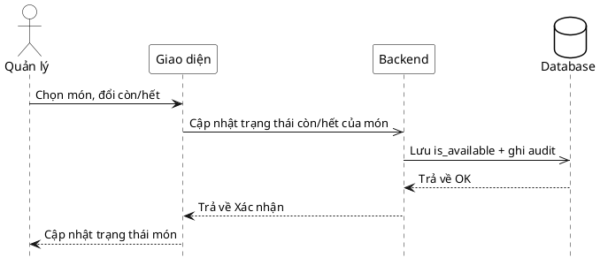

# Đặc tả Use-Case — Nhóm QUẢN LÝ (MANAGER)

> **Mô tả nhóm:** Use-case mô tả nghiệp vụ quản trị: quản lý thực đơn (CRUD),
> bật/tắt còn-hết, quản lý mã QR theo bàn, quản lý bàn/khu vực, quản lý người
> dùng & phân quyền, xem báo cáo & thống kê. Toàn bộ dùng JWT + RBAC theo quyền.
> **Group:** QUẢN LÝ (MANAGER)
> **Nguồn luồng:** `docs/sequence-diagrams-4cot.md` — *"UC-27 — Bật/tắt trạng thái còn-hết"*

---

## UC-M27 — Bật/tắt trạng thái còn-hết

### 1) Use-case đặc tả tổng quan

*Hình: ĐẶC TẢ USE-CASE QUẢN LÝ — BẬT/TẮT CÒN-HẾT*
Tác nhân **Quản lý** giao tiếp với use-case «Bật/tắt còn-hết»; đặt trạng thái đích tường minh (`is_available = true|false`) cho một món trong thực đơn. Đủ điều kiện → lưu trạng thái, ghi audit, phát realtime tới màn Khách (ảnh hưởng UC-K02: món hết bị ẩn/khóa). Khác với UC-B39 (Bếp báo hết cho *order-item* trong bếp) — UC-27 đổi cờ còn/hết của *món trong thực đơn*.

### 2) Bảng use-case chi tiết

| Mục | Nội dung |
|---|---|
| **Tên Use-Case** | Bật/tắt trạng thái còn-hết |
| **Tác nhân** | Quản lý (Manager) — quyền `catalog:manage` |
| **Mô tả** | Quản lý chọn món, đặt trạng thái đích còn/hết (`is_available`). Hệ thống lưu, ghi audit, màn Khách cập nhật realtime (món hết không đặt được). |
| **Điều kiện** | Quản lý đã đăng nhập (JWT), quyền `catalog:manage`. Món tồn tại. |

**Luồng sự kiện chính (Thành công)**

| STT | Thực hiện bởi | Mô tả hành động | Kết quả hệ thống |
|---|---|---|---|
| 1 | Quản lý | Chọn món, gạt còn → hết (hoặc ngược lại). | Giao diện gọi `PATCH /restaurant/menu/items/:id/availability` với trạng thái đích tường minh. |
| 2 | Hệ thống | Cập nhật `is_available`, ghi audit. |. |
| 3 | Hệ thống | Phát realtime. | Màn Khách nhận sự kiện, làm mới menu. |
| 4 | Quản lý | Nhận kết quả. | Trạng thái món cập nhật trên giao diện. |

**Luồng sự kiện thay thế**

| STT | Thực hiện bởi | Mô tả hành động | Kết quả hệ thống |
|---|---|---|---|
| 2a | Hệ thống | Món không tồn tại / đã xóa. | Từ chối `404`; giao diện báo lỗi. |
| 2b | Hệ thống | Thân request không hợp lệ. | Từ chối `400 "invalid request body"`. |

**Hậu điều kiện**

| | |
|---|---|
| **Thành công** | `is_available` cập nhật; audit ghi lại; `catalog.item_availability_toggled` phát realtime → màn Khách. |
| **Thất bại** | Món không tồn tại / body sai → không đổi dữ liệu. |

**Ghi chú hiện trạng triển khai**

- Route thật: `PATCH /restaurant/menu/items/:id/availability` (`ToggleAvailability`), quyền `PermissionCatalogManage`.
- Trạng thái đích **tường minh** (không toggle mù) — body mang giá trị đích.
- Đây là cờ còn/hết của **món thực đơn**; phân biệt với UC-B39 (`StaffMarkUnavailable` đánh dấu *order-item* trong hàng đợi bếp).

### 3) Sơ đồ tuần tự (Sequence)

