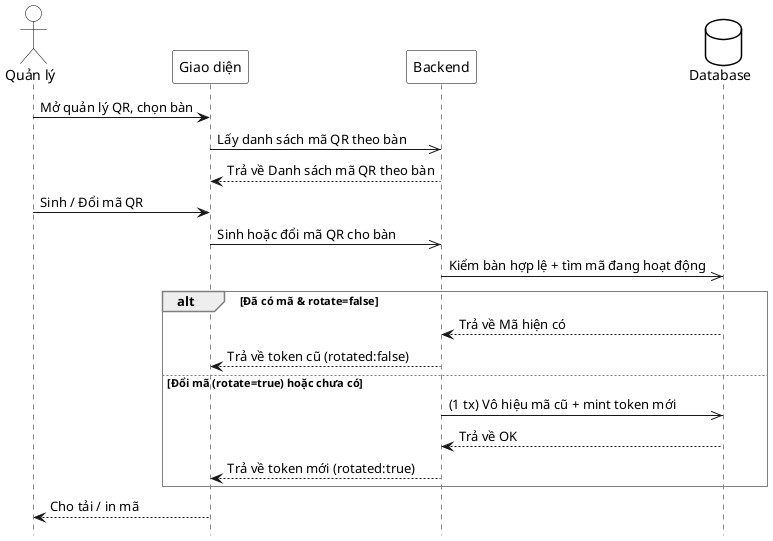

# Đặc tả Use-Case — Nhóm QUẢN LÝ (MANAGER)

> **Mô tả nhóm:** Use-case mô tả nghiệp vụ quản trị: quản lý thực đơn (CRUD),
> bật/tắt còn-hết, quản lý mã QR theo bàn, quản lý bàn/khu vực, quản lý người
> dùng & phân quyền, xem báo cáo & thống kê. Toàn bộ dùng JWT + RBAC theo quyền.
> **Group:** QUẢN LÝ (MANAGER)
> **Nguồn luồng:** `docs/sequence-diagrams-4cot.md` — _"UC-28 — Quản lý mã QR theo bàn"_

---

## UC-M28 — Quản lý mã QR theo bàn

### 1) Use-case đặc tả tổng quan

_Hình: ĐẶC TẢ USE-CASE QUẢN LÝ — QUẢN LÝ MÃ QR THEO BÀN_
Tác nhân **Quản lý** giao tiếp với use-case «Quản lý mã QR»; gồm «Xem mã QR các bàn» và «Sinh/Đổi mã QR». Sinh khi bàn chưa có mã hoạt động là **idempotent** (trả mã cũ nếu đã có, `rotate=false`). «Đổi mã» (`rotate=true`) là hành động ảnh hưởng cao: vô hiệu mã cũ (in ra vô dụng) rồi mint token mới — cả hai bước trong **một transaction** để không vi phạm chỉ mục `uq_qr_codes_one_active_per_table` (một mã hoạt động/bàn).

### 2) Bảng use-case chi tiết

| Mục              | Nội dung                                                                                                                                                                                                                           |
| ---------------- | ---------------------------------------------------------------------------------------------------------------------------------------------------------------------------------------------------------------------------------- |
| **Tên Use-Case** | Quản lý mã QR theo bàn                                                                                                                                                                                                             |
| **Tác nhân**     | Quản lý (Manager) — quyền `dining:manage`                                                                                                                                                                                          |
| **Mô tả**        | Quản lý xem danh sách mã QR theo bàn; sinh mã cho bàn chưa có (idempotent), hoặc đổi mã (`rotate`) để vô hiệu mã cũ và cấp token mới. Đổi mã invalidate QR đã in → gated hành động ảnh hưởng cao trên client. Trả token để tải/in. |
| **Điều kiện**    | Quản lý đã đăng nhập (JWT), quyền `dining:manage`. Bàn thuộc nhà hàng.                                                                                                                                                             |

**Luồng sự kiện chính (Sinh / Đổi mã)**

| STT | Thực hiện bởi | Mô tả hành động                                                                | Kết quả hệ thống                                                              |
| --- | ------------- | ------------------------------------------------------------------------------ | ----------------------------------------------------------------------------- |
| 1   | Quản lý       | Mở quản lý QR.                                                                 | Giao diện gọi `GET /restaurant/tables/qrs`.                                   |
| 2   | Quản lý       | Chọn bàn, bấm "Sinh mã".                                                       | Gọi `POST /restaurant/tables/qrs` `{table_id, rotate:false}`.                 |
| 3   | Hệ thống      | Kiểm bàn hợp lệ; nếu đã có mã hoạt động → trả nguyên (idempotent).             | Trả `{token, status:"active", rotated:false}`.                                |
| 4   | Quản lý       | Bấm "Đổi mã" (in mới).                                                         | Gọi `POST /restaurant/tables/qrs` `{table_id, rotate:true}` sau confirm-gate. |
| 5   | Hệ thống      | Trong 1 transaction: vô hiệu mã cũ (`deactivated_by`), mint token 24 byte mới. | Trả `{token, status:"active", rotated:true}`.                                 |
| 6   | Quản lý       | Nhận token.                                                                    | Tải / in mã QR mới; mã cũ hết hiệu lực.                                       |

**Luồng sự kiện thay thế**

| STT | Thực hiện bởi | Mô tả hành động                  | Kết quả hệ thống                      |
| --- | ------------- | -------------------------------- | ------------------------------------- |
| 3a  | Hệ thống      | `table_id` không thuộc nhà hàng. | Từ chối `404` (FindTable lỗi).        |
| 3b  | Hệ thống      | Body không hợp lệ.               | Từ chối `400 "invalid request body"`. |

**Hậu điều kiện**

|                |                                                                                              |
| -------------- | -------------------------------------------------------------------------------------------- |
| **Thành công** | Bàn có đúng một mã QR hoạt động; đổi mã thì mã cũ `is_active=false`, token mới trả về để in. |
| **Thất bại**   | Bàn sai / body sai → không tạo mã.                                                           |

**Ghi chú hiện trạng triển khai**

- Route thật: `GET|POST /restaurant/tables/qrs` (`dining/interfaces/http/handler.go`), quyền `PermissionDiningManage`.
- `ManageTableQR` **không phát realtime** (`_ = s.outbox` — chủ đích bỏ qua). Ràng buộc một-mã-hoạt-động/bàn đảm bảo bằng chỉ mục `uq_qr_codes_one_active_per_table` + deactivate-then-create trong cùng transaction.
- Nguồn luồng nhắc "khóa mã QR" — hiện **chỉ có sinh/đổi (rotate)**; không có thao tác "khóa" độc lập (deactivate không kèm mint mới).

### 3) Sơ đồ tuần tự (Sequence)

@startuml
hide footbox
skinparam participant {
BackgroundColor White
BorderColor Black
}
skinparam actor {
BackgroundColor White
BorderColor Black
}
skinparam database {
BackgroundColor White
BorderColor Black
}
skinparam sequenceGroupBorderThickness 1
skinparam sequenceGroupBorderColor Gray
actor "Quản lý" as A
participant "Giao diện" as UI
participant "Backend" as BE
database "Database" as DB

A ->> UI : Mở quản lý QR, chọn bàn
UI -> BE : Lấy danh sách mã QR theo bàn
BE -->> UI : Danh sách mã QR

A ->> UI : Chọn thao tác (Sinh / Đổi / Khóa)
UI -> BE : Yêu cầu thao tác QR cho bàn
BE -> DB : Kiểm tra bàn + mã đang hoạt động

alt Bàn không tồn tại
BE -->> UI : Báo lỗi không tìm thấy bàn
UI -->> A : Hiển thị lỗi
else Khóa mã nhưng không có mã đang hoạt động
BE -->> UI : Không có mã để khóa
UI -->> A : Hiển thị thông báo
else Hợp lệ
BE -> DB : Vô hiệu mã cũ
DB -->> BE : OK
BE -->> UI : Kết quả
UI -->> A : Hiển thị tải và in mã mới
end
@enduml
