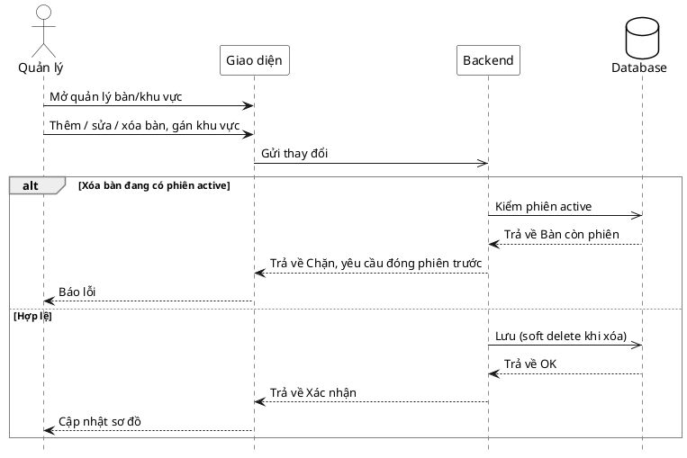

# Đặc tả Use-Case — Nhóm QUẢN LÝ (MANAGER)

> **Mô tả nhóm:** Use-case mô tả nghiệp vụ quản trị: quản lý thực đơn (CRUD),
> bật/tắt còn-hết, quản lý mã QR theo bàn, quản lý bàn/khu vực, quản lý người
> dùng & phân quyền, xem báo cáo & thống kê. Toàn bộ dùng JWT + RBAC theo quyền.
> **Group:** QUẢN LÝ (MANAGER)
> **Nguồn luồng:** `docs/sequence-diagrams-4cot.md` — *"UC-29 — Quản lý bàn / khu vực"*

---

## UC-M29 — Quản lý bàn / khu vực

> ⚠️ **CHƯA TRIỂN KHAI (thiết kế-only).** Nguồn luồng mô tả CRUD bàn/khu vực
> (thêm/sửa/xóa bàn, gán khu vực, sắp xếp sơ đồ, chặn xóa bàn còn phiên active).
> Backend hiện **không có** endpoint tạo/sửa/xóa bàn hay khu vực — bàn lấy từ
> seed. Chỉ có route **đọc** danh sách bàn. Đặc tả dưới đây ghi lại *thiết kế
> mong muốn*, đánh dấu rõ phần thiếu để bổ sung.

### 1) Use-case đặc tả tổng quan

*Hình: ĐẶC TẢ USE-CASE QUẢN LÝ — QUẢN LÝ BÀN / KHU VỰC*
Tác nhân **Quản lý** giao tiếp với use-case «Quản lý bàn/khu vực»; gồm «Thêm/Sửa/Xóa bàn», «Gán khu vực», «Sắp xếp sơ đồ». «Xóa bàn» «include» «Kiểm phiên active» — bàn đang có phiên `ACTIVE` bị chặn xóa, yêu cầu đóng phiên trước.

### 2) Bảng use-case chi tiết

| Mục | Nội dung |
|---|---|
| **Tên Use-Case** | Quản lý bàn / khu vực |
| **Tác nhân** | Quản lý (Manager) |
| **Mô tả** | Quản lý thêm/sửa/xóa bàn, gán khu vực (zone), sắp xếp sơ đồ. Xóa bàn còn phiên active bị chặn (đóng phiên trước); hợp lệ → lưu (soft delete khi xóa). |
| **Điều kiện** | Quản lý đã đăng nhập, có quyền quản lý bàn. |

**Luồng sự kiện chính (Thiết kế mong muốn — CHƯA CÓ endpoint)**

| STT | Thực hiện bởi | Mô tả hành động | Kết quả hệ thống |
|---|---|---|---|
| 1 | Quản lý | Mở quản lý bàn/khu vực. | *(Chỉ có route đọc — xem Ghi chú.)* |
| 2 | Quản lý | Thêm/sửa/xóa bàn, gán khu vực. | *(Chưa có endpoint ghi.)* |
| 3 | Hệ thống | Xóa bàn: kiểm phiên active. | Còn phiên → chặn, yêu cầu đóng trước. Hợp lệ → lưu (soft delete). |

**Luồng sự kiện thay thế**

| STT | Thực hiện bởi | Mô tả hành động | Kết quả hệ thống |
|---|---|---|---|
| 3a | Hệ thống | Xóa bàn đang có phiên `ACTIVE`. | Chặn, báo "đóng phiên trước". |

**Hậu điều kiện**

| | |
|---|---|
| **Thành công** | *(Khi triển khai)* sơ đồ bàn/khu vực cập nhật; xóa là soft delete. |
| **Thất bại** | Bàn còn phiên active → chặn xóa. |

**Ghi chú hiện trạng triển khai**

- **Ghi (create/update/delete bàn, zone) chưa triển khai.** Không có handler nào trong `dining/interfaces/http`.
- Chỉ có **đọc**: `GET /customer/tables` (`listGuestTables`, công khai) và lưới bàn nhân viên `GET /restaurant/tables` (module ordering — dùng chung ở UC-PV10/11/15). Bàn khởi tạo từ `make seed`.
- **Việc cần bổ sung:** module `dining` cần use-case + route CRUD bàn/khu vực, kèm guard "chặn xóa bàn còn phiên active" như nguồn luồng mô tả.

### 3) Sơ đồ tuần tự (Sequence)

