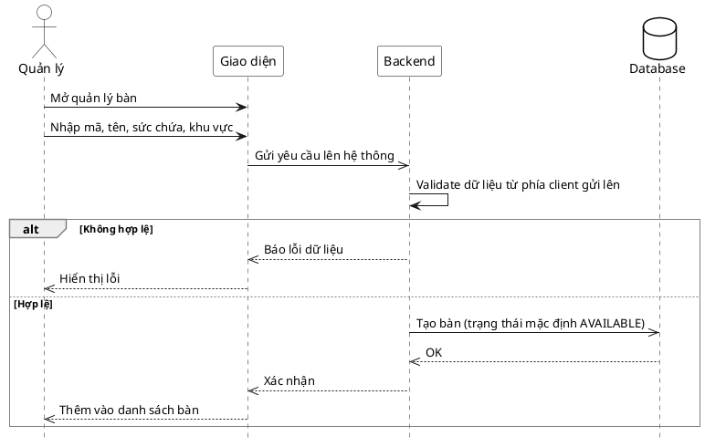
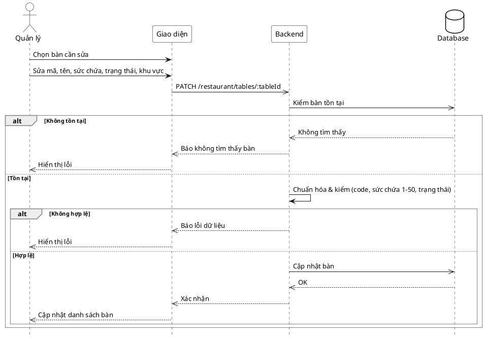
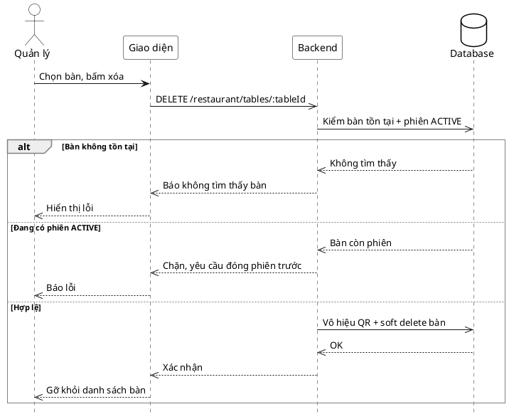

# Đặc tả Use-Case — Nhóm QUẢN LÝ (MANAGER)

> **Mô tả nhóm:** Use-case mô tả nghiệp vụ quản trị: quản lý thực đơn (CRUD),
> bật/tắt còn-hết, quản lý mã QR theo bàn, quản lý bàn, quản lý khu vực, quản lý
> người dùng & phân quyền, xem báo cáo & thống kê. Toàn bộ dùng JWT + RBAC theo quyền.
> **Group:** QUẢN LÝ (MANAGER)
> **Nguồn luồng:** `docs/sequence-diagrams-4cot.md` — _"UC-29 — Quản lý bàn"_

---

## UC-M29 — Quản lý bàn

> ✅ **ĐÃ TRIỂN KHAI.** Module `dining` có use-case `SaveTable` (thêm/sửa) và
> `DeleteTable` (xóa mềm), route gắn ở nhóm **Manager** (JWT + RBAC). Xóa bàn còn
> phiên `ACTIVE` bị chặn; xóa hợp lệ sẽ vô hiệu QR của bàn rồi soft delete.

### 1) Use-case đặc tả tổng quan

> Sơ đồ: [`uc-quan-ly-29-quan-ly-ban.drawio`](./uc-quan-ly-29-quan-ly-ban.drawio) — mở bằng draw.io / diagrams.net.

_Hình: ĐẶC TẢ USE-CASE QUẢN LÝ — QUẢN LÝ BÀN_
Tác nhân **Quản lý** giao tiếp với use-case «Quản lý bàn»; gồm «Thêm bàn», «Sửa bàn», «Xóa bàn». «Xóa bàn» kiểm phiên `ACTIVE` của bàn — còn phiên thì chặn, yêu cầu đóng phiên trước.

### 2) Bảng use-case chi tiết

| Mục              | Nội dung                                                                                                                                                        |
| ---------------- | --------------------------------------------------------------------------------------------------------------------------------------------------------------- |
| **Tên Use-Case** | Quản lý bàn                                                                                                                                                     |
| **Tác nhân**     | Quản lý (Manager)                                                                                                                                               |
| **Mô tả**        | Thêm / sửa / xóa bàn. Bàn có mã (`code`), tên, sức chứa (1–50), trạng thái, khu vực (`area_id`). Xóa bàn còn phiên `ACTIVE` bị chặn; xóa hợp lệ là soft delete. |
| **Điều kiện**    | Quản lý đã đăng nhập (JWT), có quyền quản lý bàn.                                                                                                               |

**Route (đã có):** `POST /restaurant/tables` · `PATCH /restaurant/tables/:tableId` · `DELETE /restaurant/tables/:tableId` (nhóm Manager).

**Luồng sự kiện chính**

| STT | Thực hiện bởi | Mô tả hành động                              | Kết quả hệ thống                                                                                                                        |
| --- | ------------- | -------------------------------------------- | --------------------------------------------------------------------------------------------------------------------------------------- |
| 1   | Quản lý       | Mở màn quản lý bàn.                          | Hiện danh sách bàn.                                                                                                                     |
| 2   | Quản lý       | Thêm / sửa bàn (mã, tên, sức chứa, khu vực). | Chuẩn hóa: `code` viết hoa & bắt buộc; tên rỗng → lấy theo `code`; sức chứa 1–50; trạng thái mặc định `AVAILABLE`. Lưu (create/update). |
| 3   | Quản lý       | Xóa bàn.                                     | Kiểm bàn tồn tại + phiên `ACTIVE`. Hợp lệ → vô hiệu QR của bàn, soft delete.                                                            |

**Luồng sự kiện thay thế**

| STT | Thực hiện bởi | Mô tả hành động                       | Kết quả hệ thống                                              |
| --- | ------------- | ------------------------------------- | ------------------------------------------------------------- |
| 2a  | Hệ thống      | `code` rỗng hoặc sức chứa ngoài 1–50. | Báo lỗi hợp lệ, không lưu.                                    |
| 2b  | Hệ thống      | Sửa bàn không tồn tại.                | Báo không tìm thấy bàn.                                       |
| 3a  | Hệ thống      | Xóa bàn không tồn tại.                | Báo không tìm thấy bàn.                                       |
| 3b  | Hệ thống      | Xóa bàn đang có phiên `ACTIVE`.       | Chặn, báo "đóng phiên trước" (`table has an active session`). |

**Hậu điều kiện**

|                |                                                                                  |
| -------------- | -------------------------------------------------------------------------------- |
| **Thành công** | Bàn được tạo/cập nhật; xóa là soft delete (`deleted_at`), QR của bàn bị vô hiệu. |
| **Thất bại**   | Dữ liệu không hợp lệ, bàn không tồn tại, hoặc bàn còn phiên `ACTIVE` → chặn.     |

**Ghi chú hiện trạng triển khai**

- Thêm/sửa: `SaveTable` — `code` bắt buộc (TRIM + viết hoa), `name` rỗng → bằng `code`, `capacity` 1–50, `status` ∈ {`AVAILABLE`,`OCCUPIED`,`RESERVED`,`CLEANING`,`INACTIVE`} (mặc định `AVAILABLE`), `area_id` tùy chọn. Sửa: kiểm bàn tồn tại trước.
- Xóa: `DeleteTable` — kiểm bàn tồn tại → kiểm `FindActiveSessionByTable`; còn phiên `ACTIVE` → `CodeConflict`. Hợp lệ → `DeactivateActiveQR` (QR in ra ngừng phân giải) + `SoftDeleteTable`.
- Đọc lưới bàn (nhân viên) và danh sách bàn (khách) ở module `ordering` / `dining` dùng chung, xem UC-PV10/11/15.

### 3) Sơ đồ tuần tự (Sequence)

#### 3.1) Thêm bàn

#### 3.2) Sửa bàn

#### 3.3) Xóa bàn

