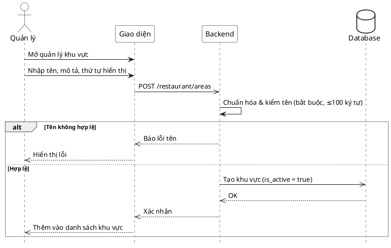
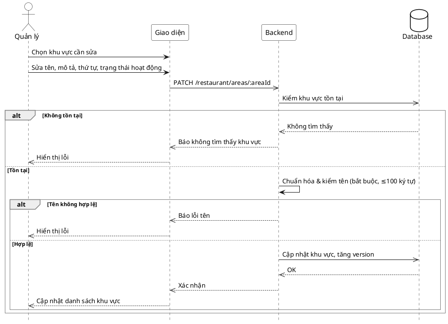
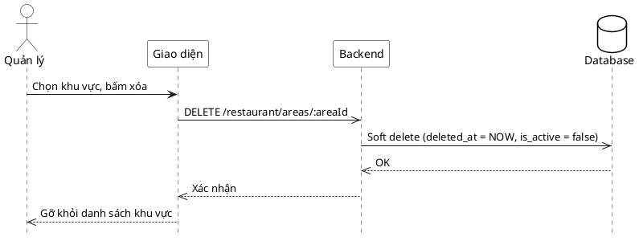

# Đặc tả Use-Case — Nhóm QUẢN LÝ (MANAGER)

> **Mô tả nhóm:** Use-case mô tả nghiệp vụ quản trị: quản lý thực đơn (CRUD),
> bật/tắt còn-hết, quản lý mã QR theo bàn, quản lý bàn, quản lý khu vực, quản lý
> người dùng & phân quyền, xem báo cáo & thống kê. Toàn bộ dùng JWT + RBAC theo quyền.
> **Group:** QUẢN LÝ (MANAGER)
> **Nguồn luồng:** `docs/sequence-diagrams-4cot.md` — _"UC-29a — Quản lý khu vực"_

---

## UC-M29a — Quản lý khu vực

> ✅ **ĐÃ TRIỂN KHAI.** Module `dining` có use-case `SaveArea` (thêm/sửa) và
> `DeleteArea` (xóa mềm), route gắn ở nhóm **Manager** (JWT + RBAC). Khu vực gom
> nhóm bàn theo tên, mô tả, thứ tự hiển thị, trạng thái hoạt động.

### 1) Use-case đặc tả tổng quan

> Sơ đồ: [`uc-quan-ly-29a-quan-ly-khu-vuc.drawio`](./uc-quan-ly-29a-quan-ly-khu-vuc.drawio) — mở bằng draw.io / diagrams.net.

_Hình: ĐẶC TẢ USE-CASE QUẢN LÝ — QUẢN LÝ KHU VỰC_
Tác nhân **Quản lý** giao tiếp với use-case «Quản lý khu vực»; gồm «Thêm khu vực», «Sửa khu vực», «Xóa khu vực». Xóa là soft delete (đánh dấu đã xóa + tắt hoạt động).

### 2) Bảng use-case chi tiết

| Mục              | Nội dung                                                                                                                                        |
| ---------------- | ---------------------------------------------------------------------------------------------------------------------------------------------- |
| **Tên Use-Case** | Quản lý khu vực                                                                                                                                |
| **Tác nhân**     | Quản lý (Manager)                                                                                                                              |
| **Mô tả**        | Thêm / sửa / xóa khu vực. Khu vực có tên (≤100 ký tự, bắt buộc), mô tả, thứ tự hiển thị, trạng thái hoạt động. Sửa tăng `version` (khóa lạc quan). Xóa là soft delete. |
| **Điều kiện**    | Quản lý đã đăng nhập (JWT), có quyền quản lý khu vực.                                                                                          |

**Route (đã có):** `GET /restaurant/areas` · `POST /restaurant/areas` · `PATCH /restaurant/areas/:areaId` · `DELETE /restaurant/areas/:areaId` (nhóm Manager).

**Luồng sự kiện chính**

| STT | Thực hiện bởi | Mô tả hành động                                    | Kết quả hệ thống                                                             |
| --- | ------------- | -------------------------------------------------- | ---------------------------------------------------------------------------- |
| 1   | Quản lý       | Mở màn quản lý khu vực.                            | Hiện danh sách khu vực.                                                      |
| 2   | Quản lý       | Thêm / sửa khu vực (tên, mô tả, thứ tự, hoạt động).| Chuẩn hóa: tên bắt buộc, ≤100 ký tự. Thêm → tạo (mặc định hoạt động). Sửa → cập nhật, tăng `version`. |
| 3   | Quản lý       | Xóa khu vực.                                        | Soft delete: đánh dấu đã xóa + tắt hoạt động.                               |

**Luồng sự kiện thay thế**

| STT | Thực hiện bởi | Mô tả hành động                | Kết quả hệ thống                        |
| --- | ------------- | ------------------------------ | --------------------------------------- |
| 2a  | Hệ thống      | Tên rỗng hoặc dài >100 ký tự.  | Báo lỗi tên, không lưu.                 |
| 2b  | Hệ thống      | Sửa khu vực không tồn tại.     | Báo không tìm thấy khu vực.            |

**Hậu điều kiện**

|                |                                                              |
| -------------- | ------------------------------------------------------------ |
| **Thành công** | Khu vực được tạo/cập nhật; xóa là soft delete (`deleted_at`, `is_active=false`). |
| **Thất bại**   | Tên không hợp lệ hoặc khu vực không tồn tại.                 |

**Ghi chú hiện trạng triển khai**

- Thêm/sửa: `SaveArea` — `name` bắt buộc & ≤100 ký tự; `description`, `display_order`, `is_active` (chỉ khi sửa; tạo mới luôn hoạt động). Sửa: kiểm khu vực tồn tại → `UpdateArea` tăng `version`.
- Xóa: `DeleteArea` — soft delete (`deleted_at = NOW()`, `is_active = FALSE`).
- ⚠️ **Lỗ nghiệp vụ:** `DeleteArea` **chưa** chặn xóa khu vực còn bàn đang gán → bàn thành mồ côi (`area_id` trỏ khu vực đã xóa). Cần bổ sung guard (kiểm bàn còn gán) hoặc gỡ gán bàn trước khi xóa.

### 3) Sơ đồ tuần tự (Sequence)

#### 3.1) Thêm khu vực

#### 3.2) Sửa khu vực

#### 3.3) Xóa khu vực

