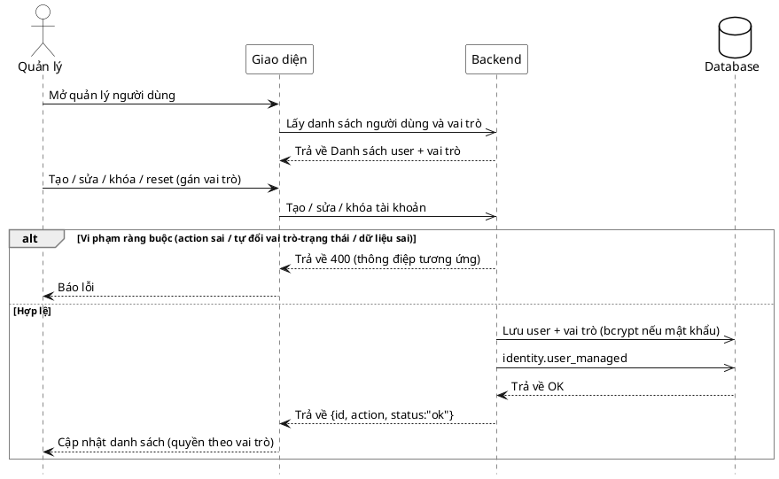

# Đặc tả Use-Case — Nhóm QUẢN LÝ (MANAGER)

> **Mô tả nhóm:** Use-case mô tả nghiệp vụ quản trị: quản lý thực đơn (CRUD),
> bật/tắt còn-hết, quản lý mã QR theo bàn, quản lý bàn/khu vực, quản lý người
> dùng & phân quyền, xem báo cáo & thống kê. Toàn bộ dùng JWT + RBAC theo quyền.
> **Group:** QUẢN LÝ (MANAGER)
> **Nguồn luồng:** `docs/sequence-diagrams-4cot.md` — *"UC-30 — Quản lý người dùng & phân quyền"*

---

## UC-M30 — Quản lý người dùng & phân quyền

### 1) Use-case đặc tả tổng quan

*Hình: ĐẶC TẢ USE-CASE QUẢN LÝ — QUẢN LÝ NGƯỜI DÙNG & PHÂN QUYỀN*
Tác nhân **Quản lý** giao tiếp với use-case «Quản lý người dùng»; một endpoint kiểu action chọn thao tác «Tạo», «Sửa», «Khóa/Mở (set_status)», «Đặt lại mật khẩu». Gán vai trò lúc tạo/sửa; quyền suy ra theo vai trò (RBAC). «Sửa» và «Khóa» «include» «Chặn tự-thao-tác» — không đổi vai trò/trạng thái của chính mình (tránh tự khóa khỏi màn quản trị).

### 2) Bảng use-case chi tiết

| Mục | Nội dung |
|---|---|
| **Tên Use-Case** | Quản lý người dùng & phân quyền |
| **Tác nhân** | Quản lý (Manager) — quyền `identity:manage` |
| **Mô tả** | Quản lý tạo tài khoản nhân viên, sửa (họ tên/email/phone/vai trò), khóa/mở (`set_status` ACTIVE/INACTIVE), đặt lại mật khẩu. Gán vai trò → quyền theo RBAC. Chặn tự đổi vai trò/trạng thái của bản thân. Mỗi thao tác (không đẩy websocket — nhạy cảm tenant). |
| **Điều kiện** | Quản lý đã đăng nhập (JWT + phiên hợp lệ), quyền `identity:manage`. |

**Luồng sự kiện chính (Tạo / Sửa / Khóa / Reset)**

| STT | Thực hiện bởi | Mô tả hành động | Kết quả hệ thống |
|---|---|---|---|
| 1 | Quản lý | Mở quản lý người dùng. | Giao diện gọi `GET /restaurant/users` và `GET /restaurant/users/roles`. |
| 2 | Quản lý | Tạo tài khoản: username, họ tên, mật khẩu, vai trò. | Gọi `POST /restaurant/users` `{action:"create",...}`. |
| 3 | Hệ thống | Kiểm username (regex 3–80), họ tên, mật khẩu ≥8, vai trò tồn tại; băm bcrypt; tạo user. | (action `user.create`); trả `{id, status:"ok"}`. |
| 4 | Quản lý | Sửa / khóa / reset (kèm `user_id`). | Gọi `POST /restaurant/users` với `action` tương ứng. |
| 5 | Hệ thống | Áp thao tác;. | Trả `{id, action, status:"ok"}`. |
| 6 | Quản lý | Nhận kết quả. | Danh sách người dùng cập nhật (quyền theo vai trò). |

**Luồng sự kiện thay thế**

| STT | Thực hiện bởi | Mô tả hành động | Kết quả hệ thống |
|---|---|---|---|
| 3a | Hệ thống | `action` ngoài {create, update, set_status, reset_password}. | Từ chối `400 "action must be one of create, update, set_status, reset_password"`. |
| 3b | Hệ thống | Username sai định dạng / thiếu họ tên / mật khẩu <8 / thiếu vai trò. | Từ chối `400` với thông điệp tương ứng. |
| 5a | Hệ thống | Đổi vai trò của **chính mình**. | Từ chối `400 "cannot change your own role"`. |
| 5b | Hệ thống | Đổi trạng thái của **chính mình**. | Từ chối `400 "cannot change your own status"`. |
| 5c | Hệ thống | `set_status` giá trị ngoài ACTIVE/INACTIVE. | Từ chối `400 "status must be ACTIVE or INACTIVE"`. |
| 5d | Hệ thống | `update` không có trường nào thay đổi. | Từ chối `400 "nothing to update"`. |

**Hậu điều kiện**

| | |
|---|---|
| **Thành công** | Người dùng được tạo/sửa/khóa/reset; audit `identity.user_managed` ghi lại ( không lên websocket công khai). |
| **Thất bại** | Vi phạm ràng buộc → không đổi dữ liệu, giao diện báo lỗi. |

**Ghi chú hiện trạng triển khai**

- Route thật: `POST /restaurant/users` (`manageUsers`, action-style), `GET /restaurant/users` (`listStaff`), `GET /restaurant/users/roles` (`listRoles`) — `identity/interfaces/http/handler.go`, quyền `PermissionIdentityManage`.
- **Vai trò cố định** — `FindRoleByName` tra vai trò có sẵn; **không có CRUD vai trò/quyền**. "Phân quyền" = gán vai trò cho user, không phải sửa ma trận quyền.
- Sự kiện `identity.user_managed` có `SuppressRealtime: true` — chủ đích không đẩy lên hub websocket (thay đổi tài khoản nhạy cảm tenant).

### 3) Sơ đồ tuần tự (Sequence)

