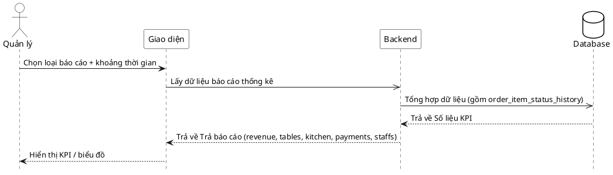

# Đặc tả Use-Case — Nhóm QUẢN LÝ (MANAGER)

> **Mô tả nhóm:** Use-case mô tả nghiệp vụ quản trị: quản lý thực đơn (CRUD),
> bật/tắt còn-hết, quản lý mã QR theo bàn, quản lý bàn/khu vực, quản lý người
> dùng & phân quyền, xem báo cáo & thống kê. Toàn bộ dùng JWT + RBAC theo quyền.
> **Group:** QUẢN LÝ (MANAGER)
> **Nguồn luồng:** `docs/sequence-diagrams-4cot.md` — *"UC-31 — Xem báo cáo & thống kê"*

---

## UC-M31 — Xem báo cáo & thống kê

> ⚠️ **DỮ LIỆU GIẢ (mock).** Endpoint `GET /restaurant/dashboard` hiện trả
> **số liệu hardcode** (doanh thu, bàn, bếp, thanh toán, ca nhân viên) — chưa
> tổng hợp thật từ hóa đơn/order/`order_item_status_history`. Đặc tả ghi lại
> thiết kế mong muốn + đánh dấu rõ phần cần thay bằng truy vấn thật.

### 1) Use-case đặc tả tổng quan

*Hình: ĐẶC TẢ USE-CASE QUẢN LÝ — XEM BÁO CÁO & THỐNG KÊ*
Tác nhân **Quản lý** giao tiếp với use-case «Xem báo cáo»; chọn loại báo cáo + khoảng thời gian, hệ thống tổng hợp KPI (doanh thu, số bàn phục vụ, thời gian chờ bếp, thanh toán…) từ dữ liệu vận hành (gồm `order_item_status_history`) và trả về để hiển thị KPI/biểu đồ.

### 2) Bảng use-case chi tiết

| Mục | Nội dung |
|---|---|
| **Tên Use-Case** | Xem báo cáo & thống kê |
| **Tác nhân** | Quản lý (Manager) — quyền `identity:manage` |
| **Mô tả** | Quản lý mở bảng điều khiển; hệ thống trả các KPI: doanh thu, tỉ lệ bàn đang phục vụ, số món trong bếp + thời gian chờ, số thanh toán, ca làm nhân viên. *(Thiết kế: chọn loại báo cáo + khoảng thời gian, tổng hợp từ dữ liệu thật.)* |
| **Điều kiện** | Quản lý đã đăng nhập (JWT + phiên), quyền `identity:manage`. |

**Luồng sự kiện chính**

| STT | Thực hiện bởi | Mô tả hành động | Kết quả hệ thống |
|---|---|---|---|
| 1 | Quản lý | Mở bảng điều khiển / chọn báo cáo. | Giao diện gọi `GET /restaurant/dashboard`. |
| 2 | Hệ thống | Tổng hợp số liệu KPI. | *(Hiện: trả mock hardcode. Thiết kế: truy vấn hóa đơn/order/status_history theo khoảng thời gian.)* |
| 3 | Hệ thống | Trả báo cáo. | JSON gồm `revenue`, `tables`, `kitchen`, `payments`, `staffs`. |
| 4 | Quản lý | Xem KPI. | Hiển thị số liệu / biểu đồ. |

**Luồng sự kiện thay thế**

| STT | Thực hiện bởi | Mô tả hành động | Kết quả hệ thống |
|---|---|---|---|
| 1a | Hệ thống | Thiếu/không đủ quyền `identity:manage`. | Từ chối `403`. |

**Hậu điều kiện**

| | |
|---|---|
| **Thành công** | Trả KPI cho bảng điều khiển. |
| **Thất bại** | Không đủ quyền → `403`. |

**Ghi chú hiện trạng triển khai**

- Route thật: `GET /restaurant/dashboard` (`identity/interfaces/http/handler_dashboard.go`), quyền `PermissionIdentityManage`.
- **Trả DỮ LIỆU GIẢ** — comment trong code ghi rõ `// MOCK DATA for AdminDashboard`. Các con số (12.450.000 ₫, 18/24 bàn, 8 món bếp, danh sách ca nhân viên) là hardcode.
- **Không có** tham số loại báo cáo / khoảng thời gian; không truy vấn `order_item_status_history` như nguồn luồng mô tả.
- **Việc cần bổ sung:** use-case tổng hợp KPI thật (doanh thu theo hóa đơn `PAID`, thời gian chờ từ status_history, tỉ lệ bàn từ session), nhận filter thời gian.

### 3) Sơ đồ tuần tự (Sequence)

