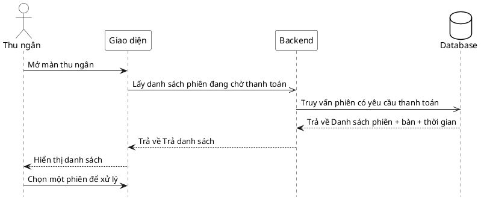

# Đặc tả Use-Case — Nhóm THU NGÂN (CASHIER)

> **Mô tả nhóm:** Use-case mô tả nghiệp vụ thu ngân xử lý cuối phiên: xem phiên chờ
> thanh toán, lập/điều chỉnh hóa đơn (snapshot), xử lý thanh toán (tiền mặt / thẻ /
> ví điện tử 2 pha) và in hóa đơn.
> **Group:** THU NGÂN (CASHIER)
> **Nguồn luồng:** `docs/sequence-diagrams-4cot.md` — *"UC-20 — Xem danh sách phiên chờ thanh toán"*

---

## UC-C20 — Xem danh sách phiên chờ thanh toán

### 1) Use-case đặc tả tổng quan

*Hình: ĐẶC TẢ USE-CASE THU NGÂN — DANH SÁCH PHIÊN CHỜ THANH TOÁN*
Tác nhân **Thu ngân** giao tiếp với use-case «Xem danh sách phiên chờ thanh toán»; use-case «include» «Lấy trạng thái bàn/phiên». Đây là màn khởi đầu của thu ngân, dẫn sang «Xem hóa đơn» (UC-C21) khi chọn một phiên. Nguồn tín hiệu là phiên đã ở `AWAITING_PAYMENT` (khách đã yêu cầu thanh toán — UC-G08).

### 2) Bảng use-case chi tiết

| Mục | Nội dung |
|---|---|
| **Tên Use-Case** | Xem danh sách phiên chờ thanh toán |
| **Tác nhân** | Thu ngân (Cashier) — phụ: Hệ thống |
| **Mô tả** | Thu ngân mở màn thu ngân để xem các bàn/phiên đang chờ thanh toán (đã `AWAITING_PAYMENT`). Hệ thống trả lưới bàn kèm trạng thái phiên, bàn và thời gian; thu ngân chọn một phiên để xử lý. |
| **Điều kiện** | Thu ngân đã đăng nhập (JWT, quyền thu ngân). |

**Luồng sự kiện chính (Thành công)**

| STT | Thực hiện bởi | Mô tả hành động | Kết quả hệ thống |
|---|---|---|---|
| 1 | Thu ngân | Mở màn thu ngân. | Giao diện gọi `GET /restaurant/tables` (lưới bàn + trạng thái phiên). |
| 2 | Hệ thống | Truy vấn bàn/phiên, lọc phiên có yêu cầu thanh toán (`AWAITING_PAYMENT`). | Trả danh sách phiên + bàn + thời gian. |
| 3 | Thu ngân | Xem danh sách. | Hiển thị các bàn/phiên chờ thanh toán. |
| 4 | Thu ngân | Chọn một phiên để xử lý. | Chuyển sang xem hóa đơn của phiên (UC-C21). |

**Luồng sự kiện thay thế**

| STT | Thực hiện bởi | Mô tả hành động | Kết quả hệ thống |
|---|---|---|---|
| 2a | Hệ thống | Không có phiên nào chờ thanh toán. | Trả danh sách rỗng; giao diện hiển thị "không có phiên chờ". |
| — | Hệ thống | Có phiên mới chuyển `AWAITING_PAYMENT` (realtime `dining.bill_requested`). | Giao diện làm mới danh sách, phiên mới xuất hiện. |

> **Ghi chú hiện trạng triển khai:** Chưa có endpoint riêng "danh sách phiên chờ thanh toán". Thu ngân dùng chung lưới bàn `GET /restaurant/tables` (staffTables) và lọc theo trạng thái `AWAITING_PAYMENT` phía giao diện.

**Hậu điều kiện**

| | |
|---|---|
| **Thành công** | Thu ngân thấy danh sách phiên chờ thanh toán và chọn được một phiên để xử lý. Chỉ đọc. |
| **Thất bại** | Không có phiên chờ → danh sách rỗng; không phát sinh thay đổi. |

### 3) Sơ đồ tuần tự (Sequence)

