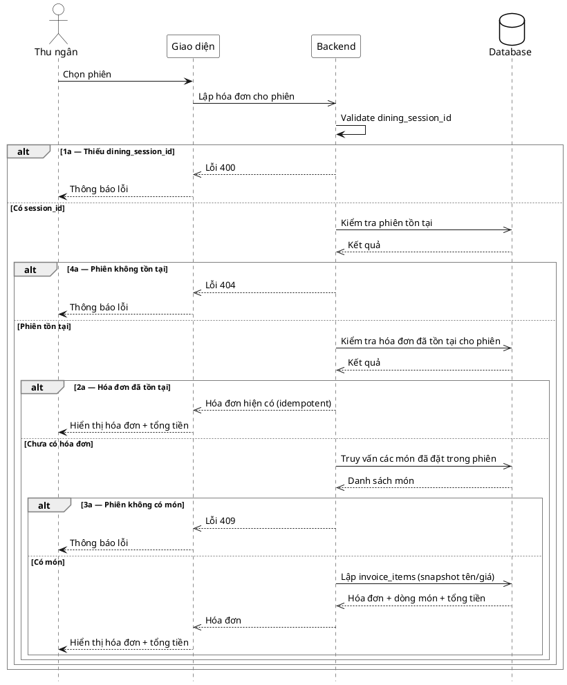

# Đặc tả Use-Case — Nhóm THU NGÂN (CASHIER)

> **Mô tả nhóm:** Use-case mô tả nghiệp vụ thu ngân xử lý cuối phiên: xem phiên chờ
> thanh toán, lập/điều chỉnh hóa đơn (snapshot), xử lý thanh toán (tiền mặt / thẻ /
> ví điện tử 2 pha) và in hóa đơn.
> **Group:** THU NGÂN (CASHIER)
> **Nguồn luồng:** `docs/sequence-diagrams-4cot.md` — _"UC-21 — Xem hóa đơn (snapshot)"_

---

## UC-C21 — Xem hóa đơn (snapshot)

### 1) Use-case đặc tả tổng quan

_Hình: ĐẶC TẢ USE-CASE THU NGÂN — XEM HÓA ĐƠN_
Tác nhân **Thu ngân** giao tiếp với use-case «Xem hóa đơn»; use-case «include» «Lập hóa đơn (snapshot)» — gom món của phiên và sao chép **tên & giá tại thời điểm lập** vào `invoice_item`. Lập hóa đơn **idempotent**: gọi lại trả đúng hóa đơn đã có. Tiếp nối sau «Chọn phiên» (UC-C20), dẫn sang «Điều chỉnh» (UC-C22) / «Xử lý thanh toán» (UC-C23).

### 2) Bảng use-case chi tiết

| Mục              | Nội dung                                                                                                                                                                                                        |
| ---------------- | --------------------------------------------------------------------------------------------------------------------------------------------------------------------------------------------------------------- |
| **Tên Use-Case** | Xem hóa đơn (snapshot)                                                                                                                                                                                          |
| **Tác nhân**     | Thu ngân (Cashier) — phụ: Hệ thống                                                                                                                                                                              |
| **Mô tả**        | Thu ngân chọn phiên để lập hoặc lấy hóa đơn. Hệ thống gom món của phiên, lập `invoice_items` với snapshot tên/giá (nếu chưa có), tính tổng và trả hóa đơn. Menu đổi giá sau này không ảnh hưởng hóa đơn đã lập. |
| **Điều kiện**    | Thu ngân đã đăng nhập (JWT, quyền `billing:process`). Phiên tồn tại và có món đã gọi.                                                                                                                           |

**Luồng sự kiện chính (Thành công)**

| STT | Thực hiện bởi | Mô tả hành động                                                        | Kết quả hệ thống                                                                                                                           |
| --- | ------------- | ---------------------------------------------------------------------- | ------------------------------------------------------------------------------------------------------------------------------------------ |
| 1   | Thu ngân      | Chọn phiên.                                                            | Giao diện gọi `POST /restaurant/invoices` (`{ dining_session_id }`) để lập/lấy, hoặc `GET /restaurant/invoices?dining_session_id=` để lấy. |
| 2   | Hệ thống      | Gom món của phiên, lập `invoice_items` (snapshot tên/giá) nếu chưa có. | Tạo hóa đơn (hoặc trả hóa đơn đã có — idempotent), tính tổng; phát `billing.invoice_built` khi tạo mới.                                    |
| 3   | Thu ngân      | Xem hóa đơn.                                                           | Hiển thị hóa đơn + dòng món + tổng tiền.                                                                                                   |

**Luồng sự kiện thay thế**

| STT | Thực hiện bởi | Mô tả hành động                                 | Kết quả hệ thống                                             |
| --- | ------------- | ----------------------------------------------- | ------------------------------------------------------------ |
| 1a  | Hệ thống      | Thiếu `dining_session_id`.                      | Trả `400 "dining_session_id is required"`.                   |
| 2a  | Hệ thống      | Hóa đơn của phiên đã tồn tại.                   | Không lập lại; trả nguyên hóa đơn hiện có (giữ snapshot cũ). |
| 3a  | Hệ thống      | Phiên không có món nào (chưa gọi / đã huỷ hết). | Trả lỗi `409`; không lập hóa đơn.                            |
| 4a  | Hệ thống      | `dining_session_id` không tồn tại.              | Trả lỗi `404`; không lập hóa đơn.                            |
| 5a  | Hệ thống      | Lỗi DB / 5xx / timeout.                         | Trả lỗi `500`; không lập hóa đơn.                            |

**Hậu điều kiện**

|                |                                                                                                                                       |
| -------------- | ------------------------------------------------------------------------------------------------------------------------------------- |
| **Thành công** | Hóa đơn của phiên tồn tại với `invoice_items` snapshot tên/giá và tổng tiền; thu ngân xem được. Gọi lại không tạo trùng (idempotent). |
| **Thất bại**   | Thiếu tham số phiên → 400; phiên không có món → 409; phiên không tồn tại → 404; lỗi hệ thống → 500; không tạo hóa đơn.                |

### 3) Sơ đồ tuần tự (Sequence)

@startuml
hide footbox
skinparam participant {
BackgroundColor White
BorderColor Black
}
skinparam actor {
BackgroundColor White
BorderColor Black
}
skinparam database {
BackgroundColor White
BorderColor Black
}
skinparam sequenceGroupBorderThickness 1
skinparam sequenceGroupBorderColor Gray
actor "Thu ngân" as A
participant "Giao diện" as UI
participant "Backend" as BE
database "Database" as DB

A ->> UI : Chọn phiên
UI ->> BE : Lập hóa đơn cho phiên
BE -> BE : Kiểm tra thông tin của yêu cầu lập hoá đơn
alt 1a Thiếu id của phiên ăn
BE -->> UI : Trả về lỗi 400 cùng message
UI -->> A : Thông báo lỗi cho thu ngân
else Có session_id
BE -> DB : Kiểm tra phiên tồn tại
DB -->> BE : Kết quả
alt 4a Phiên không tồn tại
BE -->> UI : Trả về lỗi 404 cùng message
UI -->> A : Thông báo lỗi cho thu ngân
else Phiên tồn tại
BE -> DB : Kiểm tra hóa đơn đã tồn tại cho phiên
DB -->> BE : Kết quả
alt 2a Hóa đơn đã tồn tại
BE -->> UI : Hóa đơn hiện có
UI -->> A : Hiển thị hóa đơn + tổng tiền
else Chưa có hóa đơn
BE -> DB : Truy vấn các món đã đặt trong phiên
DB -->> BE : Trả về danh sách món
alt 3a Phiên không có món
BE -->> UI : Trả về lỗi phiên không có món không thể lập hoá đơn
UI -->> A : Thông báo lỗi cho thu ngân
else Có món
BE -> DB : Tạo hoá đơn snapshot
DB -->> BE : Trả về thông tin hóa đơn + dòng món + tổng tiền
BE -->> UI : Trả về hóa đơn
UI -->> A : Hiển thị hóa đơn + tổng tiền cho thu ngân
end
end
end
end
@enduml
