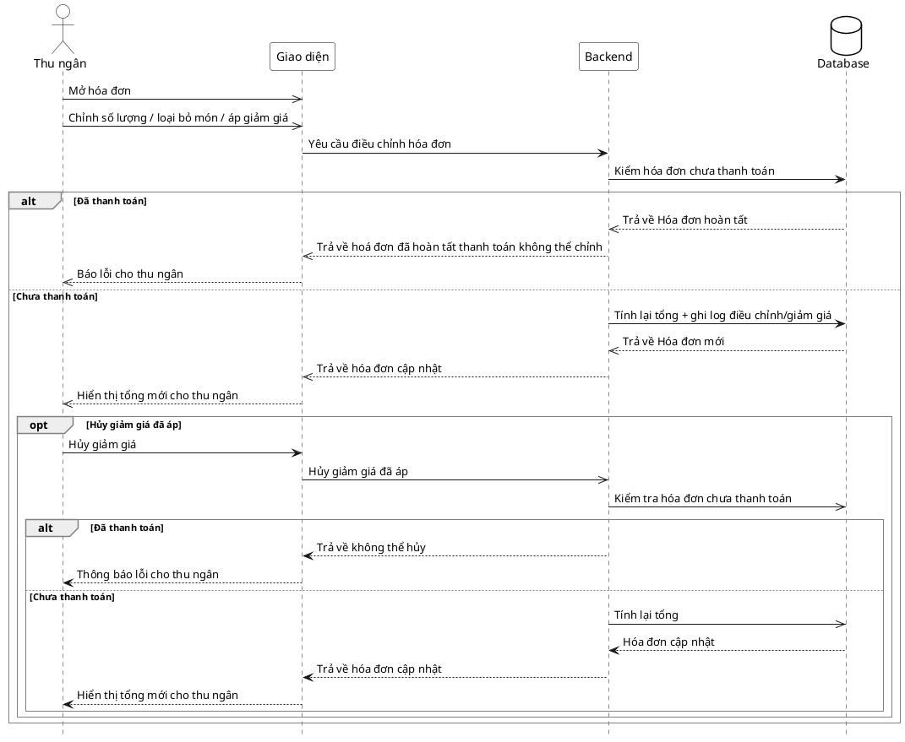

# Đặc tả Use-Case — Nhóm THU NGÂN (CASHIER)

> **Mô tả nhóm:** Use-case mô tả nghiệp vụ thu ngân xử lý cuối phiên: xem phiên chờ
> thanh toán, lập/điều chỉnh hóa đơn (snapshot), xử lý thanh toán (tiền mặt / thẻ /
> ví điện tử 2 pha) và in hóa đơn.
> **Group:** THU NGÂN (CASHIER)
> **Nguồn luồng:** `docs/sequence-diagrams-4cot.md` — _"UC-22 — Điều chỉnh hóa đơn & giảm giá"_

---

## UC-C22 — Điều chỉnh hóa đơn & giảm giá

### 1) Use-case đặc tả tổng quan

_Hình: ĐẶC TẢ USE-CASE THU NGÂN — ĐIỀU CHỈNH HÓA ĐƠN & GIẢM GIÁ_
Tác nhân **Thu ngân** giao tiếp với use-case «Điều chỉnh hóa đơn & giảm giá»; use-case «include» «Kiểm hóa đơn chưa thanh toán» và «Tính lại tổng + ghi log điều chỉnh». Chỉ áp dụng khi hóa đơn **chưa** `PAID`. Tiếp nối sau «Xem hóa đơn» (UC-C21), dẫn sang «Xử lý thanh toán» (UC-C23).

### 2) Bảng use-case chi tiết

| Mục              | Nội dung                                                                                                                                                                                                                                                                           |
| ---------------- | ---------------------------------------------------------------------------------------------------------------------------------------------------------------------------------------------------------------------------------------------------------------------------------- |
| **Tên Use-Case** | Điều chỉnh hóa đơn & giảm giá                                                                                                                                                                                                                                                      |
| **Tác nhân**     | Thu ngân (Cashier) — phụ: Hệ thống                                                                                                                                                                                                                                                 |
| **Mô tả**        | Thu ngân áp giảm giá cho hóa đơn chưa thanh toán với số tiền và lý do (`promo` / `regular` / `complaint`). Hệ thống kiểm hóa đơn chưa `PAID`, tính lại tổng, ghi log điều chỉnh. Có thể hủy giảm giá đã áp (đặt lại số tiền = 0). Hóa đơn đã thanh toán bị khóa, không điều chỉnh. |
| **Điều kiện**    | Thu ngân đã đăng nhập (JWT, quyền `billing:process`). Hóa đơn tồn tại và chưa `PAID`.                                                                                                                                                                                              |

**Luồng sự kiện chính (Thành công — áp giảm giá hóa đơn chưa thanh toán)**

| STT | Thực hiện bởi | Mô tả hành động                                             | Kết quả hệ thống                                                                                   |
| --- | ------------- | ----------------------------------------------------------- | -------------------------------------------------------------------------------------------------- |
| 1   | Thu ngân      | Mở hóa đơn, nhập giảm giá (số tiền + lý do).                | Giao diện gọi `POST /restaurant/invoices/:id/adjust` (`{ discount_amount_vnd, discount_reason }`). |
| 2   | Hệ thống      | Kiểm hóa đơn chưa `PAID`, kiểm số tiền ≥ 0 và lý do hợp lệ. | Chưa thanh toán → tính lại tổng, ghi log điều chỉnh/giảm giá.                                      |
| 3   | Thu ngân      | Nhận hóa đơn cập nhật.                                      | Hiển thị tổng mới.                                                                                 |

**Luồng sự kiện thay thế**

| STT | Thực hiện bởi | Mô tả hành động                                                             | Kết quả hệ thống                                                                                    |
| --- | ------------- | --------------------------------------------------------------------------- | --------------------------------------------------------------------------------------------------- |
| 2a  | Hệ thống      | Hóa đơn đã `PAID`.                                                          | Từ chối — "hóa đơn đã khóa/không thể điều chỉnh"; không đổi tổng.                                   |
| 2b  | Hệ thống      | `discount_amount_vnd` < 0 hoặc lý do không thuộc `promo/regular/complaint`. | Trả `400`; không áp giảm giá.                                                                       |
| 4   | Thu ngân      | Hủy giảm giá đã áp.                                                         | Gửi `adjust` với `discount_amount_vnd = 0`; hệ thống tính lại tổng + ghi log; trả hóa đơn cập nhật. |

**Hậu điều kiện**

|                |                                                                                                 |
| -------------- | ----------------------------------------------------------------------------------------------- |
| **Thành công** | Hóa đơn (chưa thanh toán) có tổng mới sau điều chỉnh/giảm giá; log điều chỉnh được ghi (audit). |
| **Thất bại**   | Hóa đơn đã `PAID` → khóa, không đổi; tham số giảm giá không hợp lệ → báo lỗi, giữ tổng cũ.      |

### 3) Sơ đồ tuần tự (Sequence)

