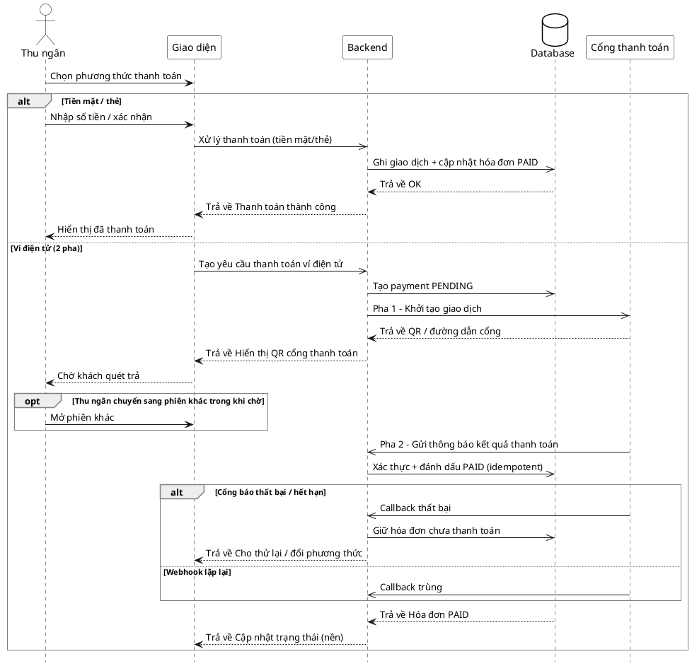

# Đặc tả Use-Case — Nhóm THU NGÂN (CASHIER)

> **Mô tả nhóm:** Use-case mô tả nghiệp vụ thu ngân xử lý cuối phiên: xem phiên chờ
> thanh toán, lập/điều chỉnh hóa đơn (snapshot), xử lý thanh toán (tiền mặt / thẻ /
> ví điện tử 2 pha) và in hóa đơn.
> **Group:** THU NGÂN (CASHIER)
> **Nguồn luồng:** `docs/sequence-diagrams-4cot.md` — *"UC-23 — Xử lý thanh toán"*

---

## UC-C23 — Xử lý thanh toán

### 1) Use-case đặc tả tổng quan

*Hình: ĐẶC TẢ USE-CASE THU NGÂN — XỬ LÝ THANH TOÁN*
Tác nhân **Thu ngân** giao tiếp với use-case «Xử lý thanh toán»; use-case «include» «Ghi giao dịch & cập nhật hóa đơn». Nhánh ví điện tử «include» «Khởi tạo giao dịch cổng» (pha 1) và «Xác thực webhook» (pha 2) với tác nhân phụ **Cổng thanh toán**. Webhook phải **idempotent** — không cộng tiền hai lần. Tiếp nối sau «Lập hóa đơn» (UC-C21) / «Điều chỉnh hóa đơn» (UC-C22).

### 2) Bảng use-case chi tiết

| Mục | Nội dung |
|---|---|
| **Tên Use-Case** | Xử lý thanh toán |
| **Tác nhân** | Thu ngân (Cashier) — phụ: Hệ thống, Cổng thanh toán (ví điện tử) |
| **Mô tả** | Thu ngân chọn phương thức thanh toán cho hóa đơn. **Tiền mặt/thẻ**: ghi giao dịch đồng bộ, cập nhật hóa đơn `PAID`. **Ví điện tử (2 pha)**: tạo payment `PENDING`, gọi cổng khởi tạo (pha 1) lấy QR/đường dẫn cho khách quét; cổng gọi lại webhook (pha 2) để xác thực và đánh dấu `PAID`. Webhook idempotent, chống callback trùng và callback thất bại/hết hạn. |
| **Điều kiện** | Thu ngân đã đăng nhập (JWT, quyền `billing:process`). Hóa đơn của phiên đã được lập và **chưa** `PAID`. Với ví điện tử: phương thức có gateway cấu hình. |

**Luồng sự kiện chính A (Tiền mặt / thẻ — đồng bộ)**

| STT | Thực hiện bởi | Mô tả hành động | Kết quả hệ thống |
|---|---|---|---|
| 1 | Thu ngân | Chọn phương thức tiền mặt/thẻ, nhập số tiền / xác nhận. | Giao diện gọi `POST /restaurant/invoices/:id/pay` (`payment_method_code` loại `CASH`/`CARD`). |
| 2 | Hệ thống | Ghi giao dịch + cập nhật hóa đơn. | Đánh dấu hóa đơn `PAID`, ghi giao dịch; phát `billing.payment_paid`. |
| 3 | Thu ngân | Nhận kết quả. | Hiển thị "đã thanh toán". |

**Luồng sự kiện chính B (Ví điện tử — 2 pha bất đồng bộ)**

| STT | Thực hiện bởi | Mô tả hành động | Kết quả hệ thống |
|---|---|---|---|
| 1 | Thu ngân | Chọn ví điện tử (MoMo/ZaloPay). | Giao diện gọi `POST /restaurant/invoices/:id/pay` (`payment_method_code` loại `E_WALLET`). |
| 2 | Hệ thống | Tạo payment `PENDING`, gọi cổng khởi tạo (**pha 1**). | `PrepareAsyncPayment` → `gateway.Initiate` → nhận QR/đường dẫn; phát `billing.payment_initiated`. |
| 3 | Thu ngân | Hiển thị QR cho khách quét trả; có thể chuyển sang phiên khác trong khi chờ. | Hóa đơn giữ chưa thanh toán, chờ webhook. |
| 4 | Cổng thanh toán | Gọi lại webhook (**pha 2**) `POST /billing/payments/webhook/:provider`. | Xác thực chữ ký/nội dung, đánh dấu `PAID` **idempotent**; phát `billing.payment_paid`; giao diện cập nhật ở nền. |

**Luồng sự kiện thay thế**

| STT | Thực hiện bởi | Mô tả hành động | Kết quả hệ thống |
|---|---|---|---|
| B2a | Hệ thống | Phương thức `E_WALLET` nhưng chưa cấu hình gateway. | Từ chối khởi tạo; báo lỗi phương thức chưa khả dụng. |
| B4a | Cổng thanh toán | Callback báo **thất bại / hết hạn**. | Giữ hóa đơn chưa thanh toán; cho thu ngân thử lại / đổi phương thức. |
| B4b | Cổng thanh toán | Callback **lặp lại** (trùng). | Idempotent — bỏ qua, **không cộng tiền hai lần**; trạng thái giữ nguyên `PAID`. |
| — | Thu ngân | (Dev) Mô phỏng hoàn tất thanh toán ví. | `POST /billing/payments/mock/complete` (`payment_number`, `result`) — chỉ môi trường dev/mock. |

**Hậu điều kiện**

| | |
|---|---|
| **Thành công** | Hóa đơn `PAID`, giao dịch được ghi; ví điện tử: payment `PENDING → PAID` qua webhook đã xác thực. Số tiền không bị cộng trùng. Sự kiện `billing.payment_paid` phát realtime. |
| **Thất bại** | Ví thất bại/hết hạn → hóa đơn giữ chưa thanh toán, cho thử lại/đổi phương thức. Callback trùng bị bỏ qua idempotent. |

### 3) Sơ đồ tuần tự (Sequence)

