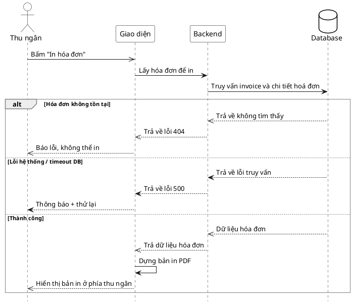

# Đặc tả Use-Case — Nhóm THU NGÂN (CASHIER)

> **Mô tả nhóm:** Use-case mô tả nghiệp vụ thu ngân xử lý cuối phiên: xem phiên chờ
> thanh toán, lập/điều chỉnh hóa đơn (snapshot), xử lý thanh toán (tiền mặt / thẻ /
> ví điện tử 2 pha) và in hóa đơn.
> **Group:** THU NGÂN (CASHIER)
> **Nguồn luồng:** `docs/sequence-diagrams-4cot.md` — _"UC-24 — In hóa đơn"_

---

## UC-C24 — In hóa đơn

### 1) Use-case đặc tả tổng quan

> Sơ đồ: [`uc-thu-ngan-24-in-hoa-don.drawio`](./uc-thu-ngan-24-in-hoa-don.drawio) — mở bằng draw.io / diagrams.net.

_Hình: ĐẶC TẢ USE-CASE THU NGÂN — IN HÓA ĐƠN_
Tác nhân **Thu ngân** giao tiếp với use-case «In hóa đơn»; use-case «include» «Lấy hóa đơn snapshot». Bản in dựng từ dữ liệu `invoice` + `invoice_items` đã snapshot. Tiếp nối sau «Xử lý thanh toán» (UC-C23) hoặc bất cứ lúc nào cần bản in.

### 2) Bảng use-case chi tiết

| Mục              | Nội dung                                                                                                                                             |
| ---------------- | ---------------------------------------------------------------------------------------------------------------------------------------------------- |
| **Tên Use-Case** | In hóa đơn                                                                                                                                           |
| **Tác nhân**     | Thu ngân (Cashier) — phụ: Hệ thống                                                                                                                   |
| **Mô tả**        | Thu ngân bấm "In hóa đơn"; giao diện lấy hóa đơn snapshot của phiên và dựng bản in PDF (client-side), hiển thị xem trước rồi gửi máy in / tải xuống. |
| **Điều kiện**    | Thu ngân đã đăng nhập (JWT, quyền `billing:process`). Hóa đơn của phiên đã được lập.                                                                 |

**Luồng sự kiện chính (Thành công)**

| STT | Thực hiện bởi | Mô tả hành động                                                  | Kết quả hệ thống                                                       |
| --- | ------------- | ---------------------------------------------------------------- | ---------------------------------------------------------------------- |
| 1   | Thu ngân      | Bấm "In hóa đơn".                                                | Giao diện lấy hóa đơn (`GET /restaurant/invoices?dining_session_id=`). |
| 2   | Hệ thống      | Truy vấn `invoice` + `invoice_items`.                            | Trả dữ liệu hóa đơn (snapshot tên/giá + tổng).                         |
| 3   | Giao diện     | Dựng bản in PDF từ dữ liệu (client-side, `@react-pdf/renderer`). | Hiển thị bản in xem trước.                                             |
| 4   | Thu ngân      | Gửi máy in / tải xuống.                                          | In hóa đơn.                                                            |

**Luồng sự kiện thay thế**

| STT | Thực hiện bởi | Mô tả hành động        | Kết quả hệ thống                                                  |
| --- | ------------- | ---------------------- | ----------------------------------------------------------------- |
| 1a  | Hệ thống      | Phiên chưa có hóa đơn. | Cần lập hóa đơn trước (UC-C21); giao diện điều hướng lập hóa đơn. |

> **Ghi chú hiện trạng triển khai:** Không có endpoint "bản in" ở backend. Bản in PDF được **dựng phía client** bằng `@react-pdf/renderer` (`src/features/cashier/components/invoice-pdf.tsx`) từ dữ liệu hóa đơn snapshot lấy qua `GET /restaurant/invoices`.

**Hậu điều kiện**

|                |                                                                                                     |
| -------------- | --------------------------------------------------------------------------------------------------- |
| **Thành công** | Bản in hóa đơn (snapshot) được dựng và gửi máy in / tải xuống. Chỉ đọc — không đổi dữ liệu hóa đơn. |
| **Thất bại**   | Phiên chưa có hóa đơn → yêu cầu lập hóa đơn trước.                                                  |

### 3) Sơ đồ tuần tự (Sequence)

@startuml
hide footbox
skinparam participant {
BackgroundColor White
BorderColor Black
}
skinparam actor {
BackgroundColor White
BorderColor Black
}
skinparam database {
BackgroundColor White
BorderColor Black
}
skinparam sequenceGroupBorderThickness 1
skinparam sequenceGroupBorderColor Gray
actor "Thu ngân" as A
participant "Giao diện" as UI
participant "Backend" as BE
database "Database" as DB

A ->> UI : Bấm "In hóa đơn"
UI -> BE : Lấy hóa đơn để in
BE -> DB : Truy vấn invoice và chi tiết hoá đơn

alt Hóa đơn không tồn tại
DB -->> BE : Trả về không tìm thấy
BE -->> UI : Trả về lỗi 404
UI -->> A : Báo lỗi, không thể in
else Lỗi hệ thống / timeout DB
DB --> BE : Trả về lỗi truy vấn
BE --> UI : Trả về lỗi 500
UI --> A : Thông báo + thử lại
else Thành công
DB -->> BE : Dữ liệu hóa đơn
BE -->> UI : Trả dữ liệu hóa đơn
UI -> UI : Dựng bản in PDF
UI -->> A : Hiển thị bản in ở phía thu ngân

end
@enduml
