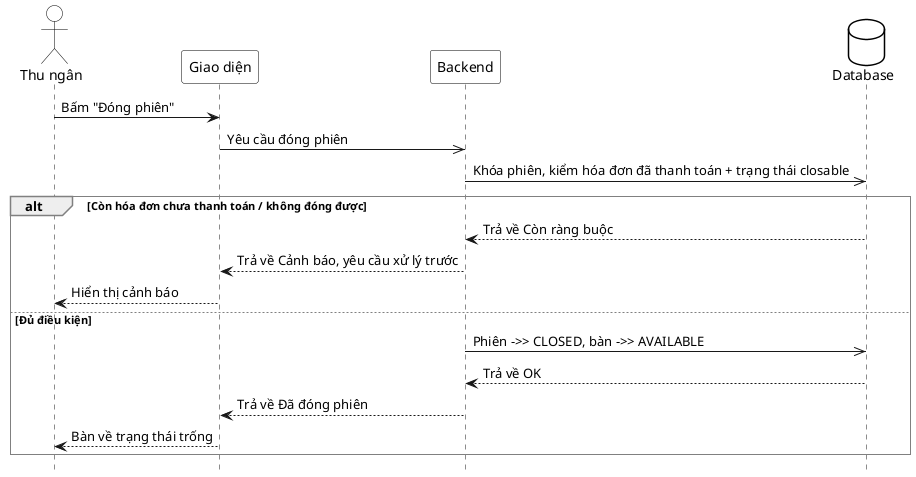

# Đặc tả Use-Case — Nhóm THU NGÂN (CASHIER)

> **Mô tả nhóm:** Use-case mô tả nghiệp vụ thu ngân xử lý cuối phiên: xem phiên chờ
> thanh toán, lập/điều chỉnh hóa đơn (snapshot), xử lý thanh toán (tiền mặt / thẻ /
> ví điện tử 2 pha), in hóa đơn và đóng phiên.
> **Group:** THU NGÂN (CASHIER)
> **Nguồn luồng:** `docs/sequence-diagrams-4cot.md` — _"UC-25 — Đóng phiên"_

---

## UC-C25 — Đóng phiên

### 1) Use-case đặc tả tổng quan

> Sơ đồ: [`uc-thu-ngan-25-dong-phien.drawio`](./uc-thu-ngan-25-dong-phien.drawio) — mở bằng draw.io / diagrams.net.

_Hình: ĐẶC TẢ USE-CASE THU NGÂN — ĐÓNG PHIÊN_
Tác nhân **Thu ngân** giao tiếp với use-case «Đóng phiên»; use-case «include» «Kiểm ràng buộc đóng phiên» (hóa đơn đã thanh toán). Đủ điều kiện → phiên `CLOSED`, bàn `AVAILABLE`. Là bước cuối vòng đời phiên: `ACTIVE → AWAITING_PAYMENT → CLOSED`. Tiếp nối sau «Xử lý thanh toán» (UC-C23).

### 2) Bảng use-case chi tiết

| Mục              | Nội dung                                                                                                                                                                                                                                                                                          |
| ---------------- | ------------------------------------------------------------------------------------------------------------------------------------------------------------------------------------------------------------------------------------------------------------------------------------------------- |
| **Tên Use-Case** | Đóng phiên                                                                                                                                                                                                                                                                                        |
| **Tác nhân**     | Thu ngân (Cashier) — phụ: Hệ thống                                                                                                                                                                                                                                                                |
| **Mô tả**        | Thu ngân bấm "Đóng phiên". Hệ thống khóa phiên, kiểm ràng buộc: phiên đang `ACTIVE`/`AWAITING_PAYMENT` và **không còn hóa đơn chưa thanh toán** (loại `VOID`/`PAID`). Đủ điều kiện → chuyển phiên `CLOSED`, trả bàn về `AVAILABLE`, phát realtime. Còn ràng buộc → cảnh báo, yêu cầu xử lý trước. |
| **Điều kiện**    | Thu ngân đã đăng nhập (JWT, quyền thu ngân). Phiên tồn tại.                                                                                                                                                                                                                                       |

**Luồng sự kiện chính (Thành công — đủ điều kiện)**

| STT | Thực hiện bởi | Mô tả hành động                                                                          | Kết quả hệ thống                                            |
| --- | ------------- | ---------------------------------------------------------------------------------------- | ----------------------------------------------------------- |
| 1   | Thu ngân      | Bấm "Đóng phiên".                                                                        | Giao diện gọi `POST /restaurant/sessions/:sessionId/close`. |
| 2   | Hệ thống      | Khóa phiên (`FOR UPDATE`), kiểm trạng thái closable + không còn hóa đơn chưa thanh toán. | Đủ điều kiện.                                               |
| 3   | Hệ thống      | Chuyển phiên `CLOSED`, bàn `AVAILABLE`.                                                  | trả trạng thái.                                             |
| 4   | Thu ngân      | Nhận kết quả.                                                                            | Bàn về trạng thái trống.                                    |

**Luồng sự kiện thay thế**

| STT | Thực hiện bởi | Mô tả hành động                                                         | Kết quả hệ thống                                                                          |
| --- | ------------- | ----------------------------------------------------------------------- | ----------------------------------------------------------------------------------------- |
| 2a  | Hệ thống      | Còn hóa đơn chưa thanh toán (khác `VOID`/`PAID`).                       | Từ chối `409 "session has unpaid invoice"`; giao diện cảnh báo, yêu cầu thanh toán trước. |
| 2b  | Hệ thống      | Phiên không ở trạng thái đóng được (không `ACTIVE`/`AWAITING_PAYMENT`). | Từ chối `409 "dining session is not closable"`.                                           |
| 2c  | Hệ thống      | Phiên đã `CLOSED` (bấm lại).                                            | Idempotent — trả trạng thái `CLOSED`, không phát sự kiện lần hai.                         |

**Hậu điều kiện**

|                |                                                                                                          |
| -------------- | -------------------------------------------------------------------------------------------------------- |
| **Thành công** | Phiên `CLOSED`, bàn `AVAILABLE`; sự kiện `dining.session_closed` phát realtime (bàn trên lưới về trống). |
| **Thất bại**   | Còn hóa đơn chưa thanh toán / trạng thái không đóng được → phiên giữ nguyên, hiển thị cảnh báo.          |

### 3) Sơ đồ tuần tự (Sequence)

@startuml
hide footbox
skinparam participant {
BackgroundColor White
BorderColor Black
}
skinparam actor {
BackgroundColor White
BorderColor Black
}
skinparam database {
BackgroundColor White
BorderColor Black
}
skinparam sequenceGroupBorderThickness 1
skinparam sequenceGroupBorderColor Gray
actor "Thu ngân" as A
participant "Giao diện" as UI
participant "Backend" as BE
database "Database" as DB

A -> UI : Bấm "Đóng phiên"
UI ->> BE : Yêu cầu đóng phiên
BE ->> DB : Khóa phiên và kiểm tra điều kiện closable (hóa đơn đã thanh toán + không còn món chưa phục vụ)

alt Chưa thoải điều kiện
DB --> BE : Trả về còn ràng buộc điều kiện để đóng
BE --> UI : Cảnh báo, yêu cầu xử lý trước
UI --> A : Hiển thị cảnh báo và lí do cụ thể
else Lỗi hệ thống / timeout DB
DB --> BE : Trả về lỗi truy vấn
BE --> UI : Trả về lỗi 500
UI --> A : Thông báo lỗi cho thu ngân
else Đủ điều kiện
BE ->> DB : Cập nhật phiên của bàn
DB --> BE : Trả về đóng phiên thành công
BE --> UI : Trả về đã đóng phiên
UI --> A : Bàn về trạng thái trống
end
@enduml
