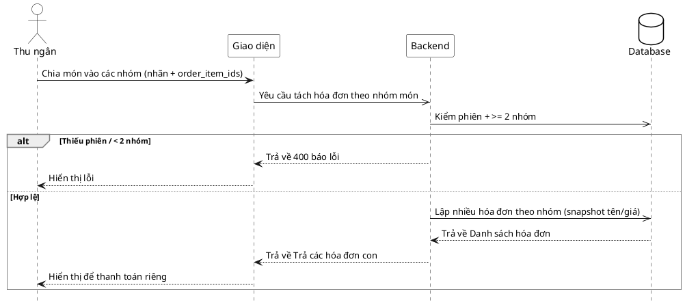

# Đặc tả Use-Case — Nhóm THU NGÂN (CASHIER)

> **Group:** THU NGÂN (CASHIER)
> **Nguồn:** Bổ sung từ hệ thống đã triển khai (không có trong danh sách UC-01…31 gốc).
> Route: `POST /api/v1/restaurant/invoices/split` (quyền `billing:process`).

---

## UC-C34 — Tách hóa đơn

### 1) Use-case đặc tả tổng quan

*Hình: ĐẶC TẢ USE-CASE THU NGÂN — TÁCH HÓA ĐƠN*
Tác nhân **Thu ngân** giao tiếp với use-case «Tách hóa đơn»; use-case «include» «Gán món vào nhóm». Khi khách chung phiên muốn trả riêng, thu ngân chia các món của phiên thành nhiều hóa đơn theo nhóm. Mỗi hóa đơn con vẫn giữ snapshot tên/giá và được thanh toán độc lập (UC-C23/UC-C35).

### 2) Bảng use-case chi tiết

| Mục | Nội dung |
|---|---|
| **Tên Use-Case** | Tách hóa đơn |
| **Tác nhân** | Thu ngân (Cashier) — phụ: Hệ thống |
| **Mô tả** | Thu ngân chia món của một phiên thành ≥ 2 nhóm (mỗi nhóm có nhãn + danh sách `order_item_ids`). Hệ thống lập nhiều hóa đơn theo nhóm, mỗi hóa đơn snapshot tên/giá và tính tổng riêng, phát realtime. |
| **Điều kiện** | Thu ngân đã đăng nhập (JWT, quyền `billing:process`). Phiên có món để tách; các món chưa nằm trên hóa đơn đã thanh toán. |

**Luồng sự kiện chính (Thành công)**

| STT | Thực hiện bởi | Mô tả hành động | Kết quả hệ thống |
|---|---|---|---|
| 1 | Thu ngân | Chia món vào các nhóm (mỗi nhóm 1 nhãn). | Giao diện dựng `{ dining_session_id, groups[] }` (≥ 2 nhóm). |
| 2 | Thu ngân | Gửi tách (`POST /restaurant/invoices/split`). | Hệ thống kiểm phiên + ≥ 2 nhóm. |
| 3 | Hệ thống | Hợp lệ. | Lập nhiều hóa đơn theo nhóm (snapshot tên/giá, tổng riêng); phát `billing.invoice_split`; trả danh sách hóa đơn. |
| 4 | Thu ngân | Nhận kết quả. | Hiển thị các hóa đơn con để thanh toán riêng. |

**Luồng sự kiện thay thế**

| STT | Thực hiện bởi | Mô tả hành động | Kết quả hệ thống |
|---|---|---|---|
| 2a | Hệ thống | Thiếu `dining_session_id`. | Trả `400 "dining_session_id is required"`. |
| 2b | Hệ thống | Ít hơn 2 nhóm. | Trả `400 "split requires at least 2 groups"`. |

**Hậu điều kiện**

| | |
|---|---|
| **Thành công** | Phiên có nhiều hóa đơn con (snapshot), mỗi cái thanh toán độc lập; sự kiện `billing.invoice_split` phát realtime. |
| **Thất bại** | Không tách: thiếu phiên hoặc < 2 nhóm. |

### 3) Sơ đồ tuần tự (Sequence)

