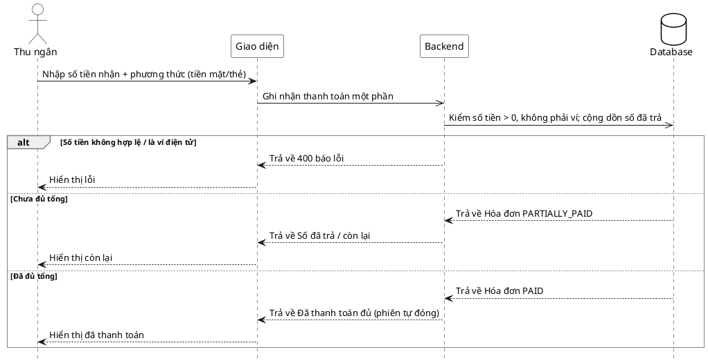

# Đặc tả Use-Case — Nhóm THU NGÂN (CASHIER)

> **Group:** THU NGÂN (CASHIER)
> **Nguồn:** Bổ sung từ hệ thống đã triển khai (không có trong danh sách UC-01…31 gốc).
> Route: `POST /api/v1/restaurant/invoices/:id/pay-partial` (quyền `billing:process`).

---

## UC-C35 — Thanh toán một phần

### 1) Use-case đặc tả tổng quan

*Hình: ĐẶC TẢ USE-CASE THU NGÂN — THANH TOÁN MỘT PHẦN*
Tác nhân **Thu ngân** giao tiếp với use-case «Thanh toán một phần»; use-case «include» «Cộng dồn số đã trả». Cho phép trả hóa đơn thành nhiều lần (tiền mặt/thẻ). Khi tổng đã trả đủ, hóa đơn `PAID` và phiên tự đóng. **Không** hỗ trợ ví điện tử cho thanh toán một phần (dùng thanh toán đủ — UC-C23).

### 2) Bảng use-case chi tiết

| Mục | Nội dung |
|---|---|
| **Tên Use-Case** | Thanh toán một phần |
| **Tác nhân** | Thu ngân (Cashier) — phụ: Hệ thống |
| **Mô tả** | Thu ngân ghi nhận một khoản trả (dương) cho hóa đơn với phương thức tiền mặt/thẻ. Hệ thống cộng dồn số đã trả; nếu chưa đủ → hóa đơn `PARTIALLY_PAID`; nếu đủ → `PAID` và phiên gắn hóa đơn tự đóng. |
| **Điều kiện** | Thu ngân đã đăng nhập (JWT, quyền `billing:process`). Hóa đơn tồn tại, chưa `PAID`. Phương thức không phải ví điện tử. |

**Luồng sự kiện chính (Thành công)**

| STT | Thực hiện bởi | Mô tả hành động | Kết quả hệ thống |
|---|---|---|---|
| 1 | Thu ngân | Nhập số tiền nhận + phương thức (tiền mặt/thẻ). | Giao diện gọi `POST /restaurant/invoices/:id/pay-partial` (`{ payment_method_code, received_amount_vnd, reference_code }`). |
| 2 | Hệ thống | Kiểm số tiền > 0, phương thức không phải ví. Cộng dồn số đã trả. | Cập nhật `running_paid_vnd`. |
| 3a | Hệ thống | Chưa đủ tổng. | Hóa đơn `PARTIALLY_PAID`; phát `billing.payment_partial`. |
| 3b | Hệ thống | Đã đủ tổng. | Hóa đơn `PAID`; phát `billing.payment_completed`; nếu gắn phiên → phát `dining.session_closed` (tự đóng phiên). |
| 4 | Thu ngân | Nhận kết quả. | Hiển thị số đã trả / còn lại hoặc "đã thanh toán đủ". |

**Luồng sự kiện thay thế**

| STT | Thực hiện bởi | Mô tả hành động | Kết quả hệ thống |
|---|---|---|---|
| 2a | Hệ thống | `received_amount_vnd` ≤ 0. | Trả `400 "received_amount_vnd must be positive"`. |
| 2b | Hệ thống | Phương thức là ví điện tử. | Trả `400 "partial payment with e-wallet is not supported, use full payment"`. |

**Hậu điều kiện**

| | |
|---|---|
| **Thành công** | Số đã trả được cộng dồn; hóa đơn `PARTIALLY_PAID` hoặc `PAID`; khi `PAID` phiên tự đóng (`dining.session_closed`). |
| **Thất bại** | Số tiền không hợp lệ hoặc dùng ví điện tử → báo lỗi; số đã trả không đổi. |

### 3) Sơ đồ tuần tự (Sequence)

