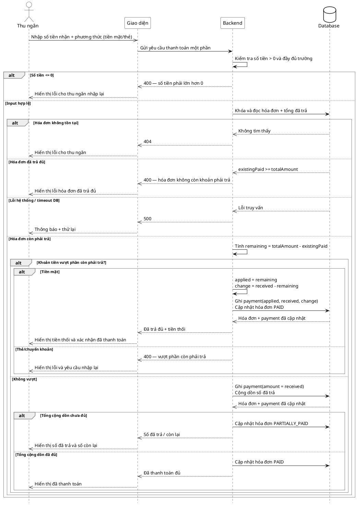

# Đặc tả Use-Case — Nhóm THU NGÂN (CASHIER)

> **Group:** THU NGÂN (CASHIER)
> **Nguồn:** Bổ sung từ hệ thống đã triển khai (không có trong danh sách UC-01…31 gốc).
> Route: `POST /api/v1/restaurant/invoices/:id/pay-partial` (quyền `billing:process`).

---

## UC-C35 — Thanh toán một phần

### 1) Use-case đặc tả tổng quan

> Sơ đồ: [`uc-thu-ngan-35-thanh-toan-mot-phan.drawio`](./uc-thu-ngan-35-thanh-toan-mot-phan.drawio) — mở bằng draw.io / diagrams.net.

_Hình: ĐẶC TẢ USE-CASE THU NGÂN — THANH TOÁN MỘT PHẦN_
Tác nhân **Thu ngân** giao tiếp với use-case «Thanh toán một phần»; use-case «include» «Cộng dồn số đã trả». Cho phép trả hóa đơn thành nhiều lần (tiền mặt/thẻ). Khi tổng đã trả đủ, hóa đơn `PAID` và phiên tự đóng. Nếu khách đưa tiền mặt vượt phần còn phải trả, hệ thống chỉ ghi nhận phần còn lại và tính tiền thối; thẻ/chuyển khoản vượt mức bị từ chối. **Không** hỗ trợ ví điện tử cho thanh toán một phần (dùng thanh toán đủ — UC-C23).

### 2) Bảng use-case chi tiết

| Mục              | Nội dung                                                                                                                                                                                             |
| ---------------- | ---------------------------------------------------------------------------------------------------------------------------------------------------------------------------------------------------- |
| **Tên Use-Case** | Thanh toán một phần                                                                                                                                                                                  |
| **Tác nhân**     | Thu ngân (Cashier) — phụ: Hệ thống                                                                                                                                                                   |
| **Mô tả**        | Thu ngân ghi nhận một khoản trả (dương) cho hóa đơn bằng tiền mặt/thẻ. Hệ thống cộng dồn phần thực trả; nếu chưa đủ → `PARTIALLY_PAID`; nếu đủ → `PAID` và tự đóng phiên. Tiền mặt đưa dư được thối lại, còn giao dịch ngân hàng đưa dư bị từ chối. |
| **Điều kiện**    | Thu ngân đã đăng nhập (JWT, quyền `billing:process`). Hóa đơn tồn tại, còn số tiền phải trả. Phương thức không phải ví điện tử.                                                                                                                            |

**Luồng sự kiện chính (Thành công)**

| STT | Thực hiện bởi | Mô tả hành động                                                                                  | Kết quả hệ thống                                                                                                                               |
| --- | ------------- | ------------------------------------------------------------------------------------------------ | ---------------------------------------------------------------------------------------------------------------------------------------------- |
| 1   | Thu ngân      | Nhập số tiền khách đưa + phương thức (tiền mặt/thẻ).                                           | Giao diện gọi `POST /restaurant/invoices/:id/pay-partial` (`{ payment_method_code, received_amount_vnd, reference_code }`).                    |
| 2   | Hệ thống      | Kiểm số tiền > 0, hóa đơn còn phải trả và phương thức không phải ví. Tính phần còn phải trả. | Xác định `applied_amount_vnd = min(received_amount_vnd, remaining_amount_vnd)` đối với tiền mặt; thẻ chỉ hợp lệ khi không vượt phần còn lại. |
| 3a  | Hệ thống      | Khoản áp dụng chưa đủ tổng hóa đơn.                                                           | Ghi `payments.amount_vnd = applied_amount_vnd`; hóa đơn `PARTIALLY_PAID`; phát `billing.payment_partial`.                                    |
| 3b  | Hệ thống      | Khoản áp dụng vừa đủ tổng hóa đơn.                                                            | Hóa đơn `PAID`; phát `billing.payment_completed`; nếu gắn phiên → phát `dining.session_closed` (tự đóng phiên).                              |
| 3c  | Hệ thống      | Khách đưa tiền mặt vượt phần còn phải trả.                                                    | Chỉ ghi phần còn lại vào `payments.amount_vnd`, ghi phần dư vào `change_amount_vnd`; hóa đơn `PAID` và tự đóng phiên.                         |
| 4   | Thu ngân      | Nhận kết quả.                                                                                  | Hiển thị số đã trả / còn lại; nếu tiền mặt đưa dư thì hiển thị số tiền phải thối.                                                               |

**Luồng sự kiện thay thế**

| STT | Thực hiện bởi | Mô tả hành động                                          | Kết quả hệ thống                                                                 |
| --- | ------------- | -------------------------------------------------------- | -------------------------------------------------------------------------------- |
| 2a  | Hệ thống      | `received_amount_vnd` ≤ 0.                               | Trả `400 "received_amount_vnd must be positive"`.                                |
| 2b  | Hệ thống      | Phương thức là ví điện tử.                               | Trả `400 "partial payment with e-wallet is not supported, use full payment"`.    |
| 2c  | Hệ thống      | Thẻ/chuyển khoản vượt phần còn phải trả.                 | Trả `400 "total payment exceeds invoice amount"`; thu ngân nhập lại đúng số tiền. |
| 2d  | Hệ thống      | Hóa đơn đã được trả đủ (`existingPaid >= totalAmount`). | Trả `400 "total payment exceeds invoice amount"`; không tạo thêm payment.         |

**Hậu điều kiện**

|                |                                                                                                                    |
| -------------- | ------------------------------------------------------------------------------------------------------------------ |
| **Thành công** | Phần tiền áp dụng được cộng dồn; hóa đơn `PARTIALLY_PAID` hoặc `PAID`. Tiền mặt đưa dư sinh `change_amount_vnd`; khi `PAID`, phiên tự đóng (`dining.session_closed`). |
| **Thất bại**   | Số tiền không hợp lệ, hóa đơn đã trả đủ, dùng ví điện tử hoặc giao dịch ngân hàng vượt mức → báo lỗi; số đã trả không đổi.                                         |

### 3) Sơ đồ tuần tự (Sequence)

